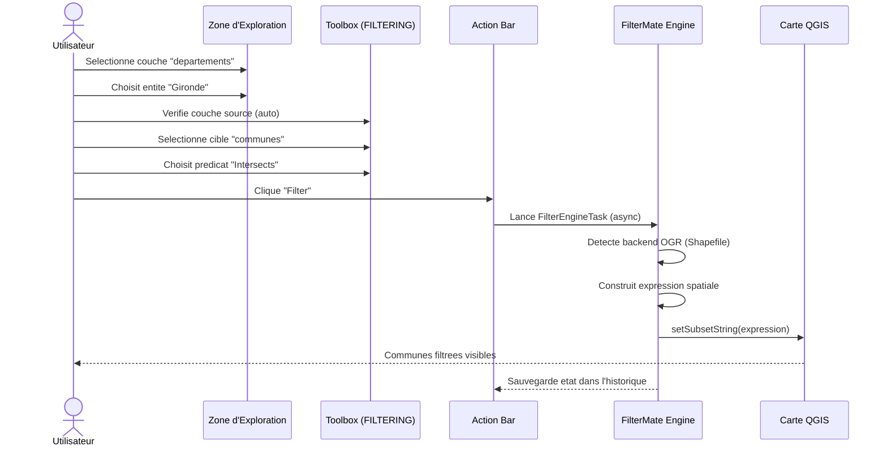
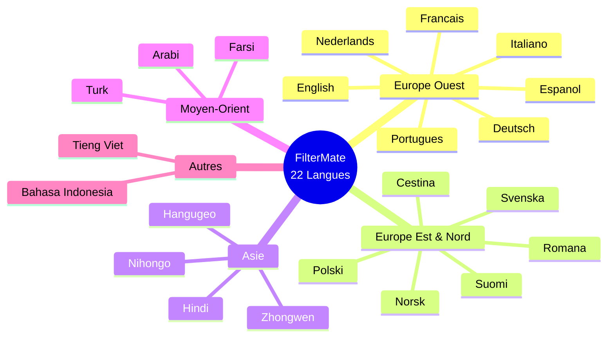
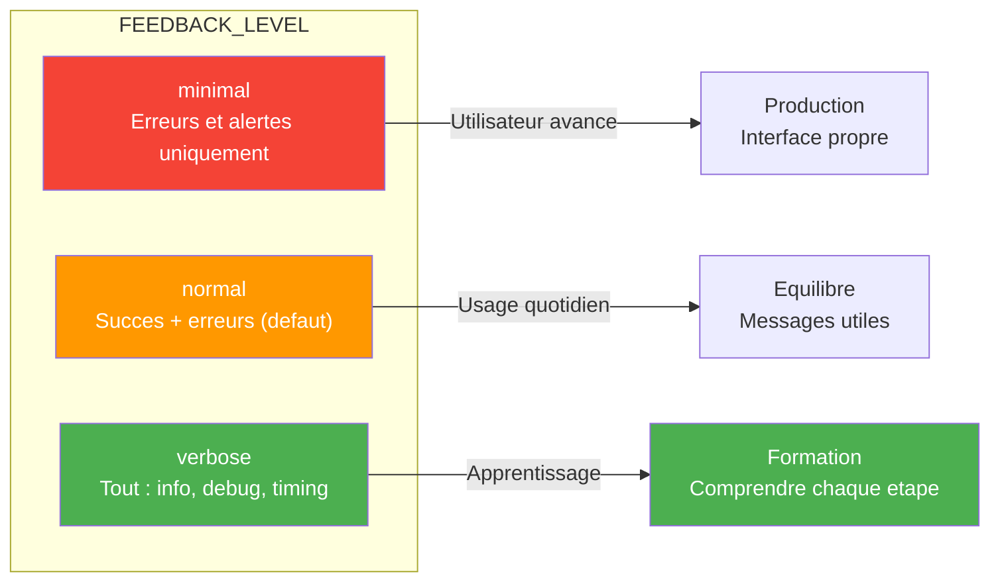
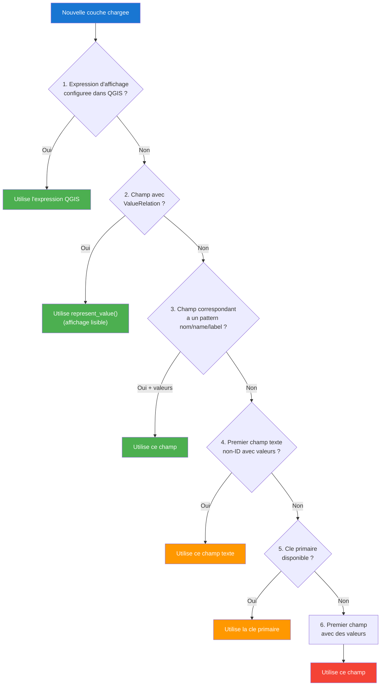

# FilterMate — Script Video 01 : Installation & Premier Pas
**Version 4.6.1 | QGIS Plugin | Mars 2026**

> **Duree estimee :** 5-7 minutes (sans dependances externes)
> **Niveau :** Debutant
> **Public cible :** Utilisateurs QGIS, geomaticiens, urbanistes, etudiants SIG
> **Ton :** Pedagogique, chaleureux, accessible — on accompagne un debutant pas a pas
> **Langue :** Francais (sous-titres EN disponibles)
> **Prerequis :** QGIS 3.x ou 4.x installe
> **Donnees de demo :** Shapefile departements France (~100 entites), Shapefile communes (~35 000 entites)

---

## Plan de la video

| Sequence | Titre | Duree |
|----------|-------|-------|
| 0 | Hook — "Filtrer 1 million d'entites en 2 secondes" | 0:15 |
| 1 | Installation via le Plugin Manager | 0:30 |
| 2 | Premier lancement — le dock widget apparait | 0:30 |
| 3 | Architecture de l'interface : les 3 zones | 1:15 |
| 4 | Les 6 boutons de la barre laterale (Exploring Zone) | 0:30 |
| 5 | Les 6 boutons de l'Action Bar | 0:30 |
| 6 | Premier filtrage : Shapefile local | 1:30 |
| 7 | Theme sombre automatique | 0:20 |
| 8 | Changement de langue (22 langues) | 0:20 |
| 9 | Mode verbose — votre outil d'apprentissage | 0:20 |
| 10 | QGIS Log Messages Panel — onglet FilterMate | 0:20 |
| 11 | Auto-detection du champ d'affichage | 0:20 |
| 12 | Configuration sauvegardee automatiquement | 0:15 |
| 13 | Ou trouver l'aide — Conclusion | 0:15 |

---

## SEQUENCE 0 — HOOK (0:00 - 0:15)

### Visuel suggere
> Ecran QGIS avec une carte chargee de donnees (10+ couches), texte anime qui apparait : "1 000 000 d'entites" puis "2 secondes" avec un chronometre. Transition rapide vers le logo FilterMate.

### Narration
> *"Un million de batiments dans votre base de donnees. Vous cherchez uniquement ceux qui touchent une route precise. Temps de reponse ? Deux secondes. Bienvenue dans FilterMate."*

> *"Dans cette premiere video, on va installer le plugin ensemble, decouvrir son interface, et realiser votre tout premier filtrage — en moins de 7 minutes."*

---

## SEQUENCE 1 — INSTALLATION VIA LE PLUGIN MANAGER (0:15 - 0:45)

### Visuel suggere
> Capture ecran QGIS : menu Extensions > Gerer les extensions > onglet "Toutes" > barre de recherche avec "FilterMate" > bouton "Installer". Annotations fleches sur chaque etape.

### Narration
> *"L'installation se fait en 3 clics depuis QGIS. Allez dans le menu 'Extensions', puis 'Gerer les extensions'. Dans l'onglet 'Toutes', tapez 'FilterMate' dans la barre de recherche."*

> *"Le plugin apparait. Cliquez sur 'Installer'. C'est tout. FilterMate est gratuit, open source, et disponible sur le depot officiel QGIS — Windows, Linux et macOS."*

---

### Diagramme — Flux d'installation

<table style="border-collapse: collapse; width: 100%; font-family: sans-serif;">
  <tr>
    <td colspan="3" style="text-align: center; padding: 12px; background: #455A64; color: #fff; border-radius: 8px 8px 0 0;">
      QGIS Desktop &#8594; Extensions &#8594; Gerer les extensions &#8594; Rechercher 'FilterMate' &#8594; Installer
    </td>
  </tr>
  <tr>
    <td colspan="3" style="text-align: center; padding: 8px; background: #ECEFF1;">&#8595;</td>
  </tr>
  <tr>
    <td colspan="3" style="text-align: center; padding: 12px; background: #1976D2; color: #fff; font-weight: bold;">
      &nbsp; FilterMate Dock Widget
    </td>
  </tr>
  <tr>
    <td style="text-align: center; padding: 12px; background: #7B1FA2; color: #fff; width: 33%;">
            
      <strong>Exploring Zone</strong> <small>Parcourir les entites + Barre laterale 6 boutons</small>
    </td>
    <td style="text-align: center; padding: 12px; width: 34%;">
      <table style="width: 100%; border-collapse: collapse;">
        <tr>
          <td style="text-align: center; padding: 8px; background: #388E3C; color: #fff; border: 1px solid #2E7D32;">
             <strong>FILTERING</strong> <small>Source + Cible + Predicat</small>
          </td>
        </tr>
        <tr>
          <td style="text-align: center; padding: 8px; background: #F57C00; color: #fff; border: 1px solid #E65100;">
             <strong>EXPORTING</strong> <small>GeoPackage & KML</small>
          </td>
        </tr>
      </table>
    </td>
    <td style="text-align: center; padding: 12px; background: #1565C0; color: #fff; width: 33%; border-radius: 0 0 8px 0;">
            
      <strong>Action Bar</strong> <small>6 boutons dont About (toujours actif)</small>
    </td>
  </tr>
</table>

---

## SEQUENCE 2 — PREMIER LANCEMENT (0:45 - 1:15)

### Visuel suggere
> Capture QGIS : cliquer sur l'icone FilterMate dans la barre d'outils (ou menu Extensions > FilterMate). Le dock widget s'ouvre et s'ancre a droite de l'ecran. Montrer le panneau vide — aucune couche chargee.

### Narration
> *"Pour lancer FilterMate, cliquez sur son icone dans la barre d'outils, ou allez dans le menu 'Extensions' puis 'FilterMate'. Un panneau lateral s'ouvre — c'est le Dock Widget."*

> *"Pour l'instant, il est vide. C'est normal — FilterMate detecte automatiquement les couches de votre projet. Des qu'on va charger des donnees, l'interface va se remplir."*

> *"Chargeons nos donnees de demonstration : un Shapefile des departements de France — environ 100 entites — et un Shapefile des communes — 35 000 entites."*

---

## SEQUENCE 3 — ARCHITECTURE DE L'INTERFACE (1:15 - 2:30)

### Visuel suggere
> Capture annotee de l'interface FilterMate avec 3 zones clairement delimitees par des rectangles de couleur :
> - Zone A (violet) : Exploring Zone en haut
> - Zone B (vert) : Toolbox en bas (onglets FILTERING et EXPORTING)
> - Zone C (bleu) : Action Bar (6 boutons)
> - Header bar avec les pastilles Favoris (orange) et Backend (bleu)
> Animation : chaque zone s'eclaire a son tour pendant la narration.

### Narration
> *"Prenons un moment pour comprendre l'interface. Elle est divisee en 3 zones principales, separees par un splitter vertical que vous pouvez ajuster selon vos besoins."*

> *"En haut, la Zone d'Exploration. C'est ici que vous parcourez et selectionnez les entites de vos couches. Vous pouvez naviguer entite par entite, faire des selections multiples, ou ecrire des expressions personnalisees."*

> *"En bas, la Toolbox. Elle contient deux onglets : FILTERING, pour configurer vos filtres spatiaux — couche source, couche cible, predicat geometrique — et EXPORTING, pour exporter vos donnees filtrees au format GeoPackage ou KML."*

> *"Et enfin, l'Action Bar. Ce sont les 6 boutons d'action — on va les detailler dans un instant. C'est le coeur de l'interaction : tout le reste de l'interface sert a configurer ce que ces boutons vont executer."*

> *"Remarquez aussi le header en haut du panneau : la pastille orange indique vos favoris enregistres, et la pastille bleue affiche le backend actif — le moteur de traitement que FilterMate a selectionne automatiquement pour votre source de donnees."*

---

### Visuel — Les 3 zones de l'interface

> **[CAPTURE VIDEO QGIS]** Enregistrement ecran de l'interface FilterMate dans QGIS, avec mise en surbrillance successive des 3 zones.
> Chaque zone s'eclaire a son tour pendant la narration (effet highlight/overlay anime).

<table style="border-collapse: collapse; width: 100%; font-family: sans-serif;">
  <tr>
    <td colspan="6" style="background: #37474F; color: #fff; text-align: center; padding: 10px; font-weight: bold; border-radius: 8px 8px 0 0;">
      En-tete — Pastille Favoris (orange) | Pastille Backend (bleu)
    </td>
  </tr>
  <tr>
    <td colspan="6" style="background: #7B1FA2; color: #fff; text-align: center; padding: 8px; font-weight: bold;">
      ZONE A — Exploring Zone
    </td>
  </tr>
  <tr style="background: #9C27B0;">
    <td style="text-align: center; padding: 10px; color: #fff;">
       <small>Identify</small>
    </td>
    <td style="text-align: center; padding: 10px; color: #fff;">
       <small>Zoom</small>
    </td>
    <td style="text-align: center; padding: 10px; color: #fff;">
       <small>Select</small>
    </td>
    <td style="text-align: center; padding: 10px; color: #fff;">
       <small>Track</small>
    </td>
    <td style="text-align: center; padding: 10px; color: #fff;">
       <small>Link</small>
    </td>
    <td style="text-align: center; padding: 10px; color: #fff;">
       <small>Reset</small>
    </td>
  </tr>
  <tr>
    <td colspan="6" style="background: #E1BEE7; text-align: center; padding: 8px;">
      Selecteurs : Single / Multiple / Custom
    </td>
  </tr>
  <tr>
    <td colspan="3" style="background: #388E3C; color: #fff; text-align: center; padding: 8px; font-weight: bold;">
      ZONE B — Toolbox
    </td>
    <td colspan="3" style="background: #388E3C; color: #fff; text-align: center; padding: 8px; font-weight: bold;">
      &nbsp;
    </td>
  </tr>
  <tr>
    <td colspan="3" style="background: #4CAF50; color: #fff; text-align: center; padding: 10px;">
      Onglet FILTERING <small>Source + Cible + Predicat + Buffer</small>
    </td>
    <td colspan="3" style="background: #F57C00; color: #fff; text-align: center; padding: 10px;">
      Onglet EXPORTING <small>Couches + Format + Options</small>
    </td>
  </tr>
  <tr>
    <td colspan="6" style="background: #1565C0; color: #fff; text-align: center; padding: 8px; font-weight: bold;">
      ZONE C — Action Bar
    </td>
  </tr>
  <tr style="background: #1976D2;">
    <td style="text-align: center; padding: 10px; color: #fff;">
       <small>Filter</small>
    </td>
    <td style="text-align: center; padding: 10px; color: #fff;">
       <small>Undo</small>
    </td>
    <td style="text-align: center; padding: 10px; color: #fff;">
       <small>Redo</small>
    </td>
    <td style="text-align: center; padding: 10px; color: #fff;">
       <small>Unfilter</small>
    </td>
    <td style="text-align: center; padding: 10px; color: #fff;">
       <small>Export</small>
    </td>
    <td style="text-align: center; padding: 10px; color: #fff; border-radius: 0 0 8px 0;">
       <small>About</small>
    </td>
  </tr>
</table>

---

## SEQUENCE 4 — LES 6 BOUTONS DE LA BARRE LATERALE (2:30 - 3:00)

### Visuel suggere
> Zoom sur la barre laterale de la Zone d'Exploration. Chaque bouton est survole avec une annotation qui apparait a cote.

### Narration
> *"La Zone d'Exploration possede 6 boutons dans sa barre laterale. Ce sont vos outils de navigation :"*

> *"**Identify** — ouvre la fenetre d'identification QGIS pour l'entite selectionnee. Pratique pour inspecter rapidement les attributs."*

> *"**Zoom** — centre et zoome la carte sur l'entite en cours."*

> *"**Select** — un bouton a bascule. Active, il surligne l'entite sur la carte. Desactive, il retire la selection."*

> *"**Track** — active le suivi automatique. A chaque changement d'entite dans le selecteur, la carte se recentre et la suivante est mise en surbrillance."*

> *"**Link** — synchronise tous les groupes de selection entre eux : simple, multiple et personnalise."*

> *"**Reset** — reinitialise toutes les proprietes d'exploration de la couche active. Un retour a zero propre."*

---

### Diagramme — Barre laterale Exploring

<table style="border-collapse: collapse; width: 100%; font-family: sans-serif;">
  <tr>
    <td colspan="3" style="background: #7B1FA2; color: #fff; text-align: center; padding: 8px; font-weight: bold; border-radius: 8px 8px 0 0;">
      Barre laterale — 6 boutons
    </td>
  </tr>
  <tr style="background: #9C27B0;">
    <td style="text-align: center; padding: 12px; color: #fff; width: 20%;">
       <strong>Identify</strong> <small>Inspecter les attributs</small>
    </td>
    <td style="text-align: center; padding: 8px; color: #fff; width: 15%;"><em>1 clic</em></td>
    <td style="text-align: center; padding: 12px; background: #CE93D8; color: #333; border-radius: 6px;">
      Fenetre Identify Results
    </td>
  </tr>
  <tr style="background: #9C27B0;">
    <td style="text-align: center; padding: 12px; color: #fff;">
       <strong>Zoom</strong> <small>Centrer sur l'entite</small>
    </td>
    <td style="text-align: center; padding: 8px; color: #fff;"><em>1 clic</em></td>
    <td style="text-align: center; padding: 12px; background: #CE93D8; color: #333; border-radius: 6px;">
      Carte centree + zoom
    </td>
  </tr>
  <tr style="background: #9C27B0;">
    <td style="text-align: center; padding: 12px; color: #fff;">
       <strong>Select</strong> <small>Surligner (bascule)</small>
    </td>
    <td style="text-align: center; padding: 8px; color: #fff;"><em>ON/OFF</em></td>
    <td style="text-align: center; padding: 12px; background: #CE93D8; color: #333; border-radius: 6px;">
      Entite surlignee
    </td>
  </tr>
  <tr style="background: #9C27B0;">
    <td style="text-align: center; padding: 12px; color: #fff;">
       <strong>Track</strong> <small>Suivi automatique (bascule)</small>
    </td>
    <td style="text-align: center; padding: 8px; color: #fff;"><em>ON/OFF</em></td>
    <td style="text-align: center; padding: 12px; background: #CE93D8; color: #333; border-radius: 6px;">
      Navigation auto
    </td>
  </tr>
  <tr style="background: #9C27B0;">
    <td style="text-align: center; padding: 12px; color: #fff;">
       <strong>Link</strong> <small>Synchroniser selecteurs (bascule)</small>
    </td>
    <td style="text-align: center; padding: 8px; color: #fff;"><em>ON/OFF</em></td>
    <td style="text-align: center; padding: 12px; background: #CE93D8; color: #333; border-radius: 6px;">
      Selecteurs synchronises
    </td>
  </tr>
  <tr style="background: #9C27B0;">
    <td style="text-align: center; padding: 12px; color: #fff; border-radius: 0 0 0 8px;">
       <strong>Reset</strong> <small>Reinitialiser l'exploration</small>
    </td>
    <td style="text-align: center; padding: 8px; color: #fff;"><em>1 clic</em></td>
    <td style="text-align: center; padding: 12px; background: #CE93D8; color: #333; border-radius: 6px 6px 8px 6px;">
      Retour a zero
    </td>
  </tr>
</table>

---

## SEQUENCE 5 — LES 6 BOUTONS DE L'ACTION BAR (3:00 - 3:30)

### Visuel suggere
> Zoom sur l'Action Bar. Chaque bouton s'eclaire avec un tooltip. Mettre en evidence que About est toujours actif (jamais grise), tandis que les 5 autres changent d'etat selon le contexte.

### Narration
> *"L'Action Bar est le coeur de FilterMate. Six boutons, chacun avec un role precis :"*

> *"**Filter** — applique le filtre que vous avez configure. C'est LE bouton principal. Il modifie la visibilite des entites directement sur la carte."*

> *"**Undo** — annule le dernier filtre. FilterMate garde en memoire jusqu'a 100 etats precedents."*

> *"**Redo** — retablit un filtre annule. Comme le Ctrl+Z / Ctrl+Y que vous connaissez deja."*

> *"**Unfilter** — retire TOUS les filtres actifs de TOUTES les couches du projet. Un retour a la case depart."*

> *"**Export** — exporte vos donnees filtrees au format GeoPackage, avec le projet QGIS embarque."*

> *"Et **About** — le seul bouton qui est toujours actif, quel que soit l'etat du plugin. Il affiche les informations sur la version, les liens utiles et la configuration."*

> *"Un detail important : quand l'onglet EXPORTING est actif dans la Toolbox, les boutons Filter, Undo, Redo et Unfilter se desactivent — et inversement avec Export quand l'onglet FILTERING est actif. Chaque contexte a ses boutons."*

---

### Diagramme — Activation des boutons selon l'onglet

<table style="border-collapse: collapse; width: 100%; font-family: sans-serif;">
  <tr>
    <td colspan="6" style="background: #388E3C; color: #fff; text-align: center; padding: 8px; font-weight: bold; border-radius: 8px 8px 0 0;">
      Onglet FILTERING actif
    </td>
  </tr>
  <tr style="background: #4CAF50;">
    <td style="text-align: center; padding: 10px; color: #fff;">
       <small>Filter</small> ✅
    </td>
    <td style="text-align: center; padding: 10px; color: #fff;">
       <small>Undo</small> ✅
    </td>
    <td style="text-align: center; padding: 10px; color: #fff;">
       <small>Redo</small> ✅
    </td>
    <td style="text-align: center; padding: 10px; color: #fff;">
       <small>Unfilter</small> ✅
    </td>
    <td style="text-align: center; padding: 10px; color: #fff; opacity: 0.4;">
       <small>Export</small> ❌
    </td>
    <td style="text-align: center; padding: 10px; background: #1565C0; color: #fff;">
       <small>About</small> ✅
    </td>
  </tr>
  <tr><td colspan="6" style="padding: 6px;"></td></tr>
  <tr>
    <td colspan="6" style="background: #F57C00; color: #fff; text-align: center; padding: 8px; font-weight: bold;">
      Onglet EXPORTING actif
    </td>
  </tr>
  <tr style="background: #FF9800;">
    <td style="text-align: center; padding: 10px; color: #fff; opacity: 0.4;">
       <small>Filter</small> ❌
    </td>
    <td style="text-align: center; padding: 10px; color: #fff; opacity: 0.4;">
       <small>Undo</small> ❌
    </td>
    <td style="text-align: center; padding: 10px; color: #fff; opacity: 0.4;">
       <small>Redo</small> ❌
    </td>
    <td style="text-align: center; padding: 10px; color: #fff; opacity: 0.4;">
       <small>Unfilter</small> ❌
    </td>
    <td style="text-align: center; padding: 10px; color: #fff;">
       <small>Export</small> ✅
    </td>
    <td style="text-align: center; padding: 10px; background: #1565C0; color: #fff; border-radius: 0 0 8px 0;">
       <small>About</small> ✅
    </td>
  </tr>
</table>

---

## SEQUENCE 6 — PREMIER FILTRAGE : SHAPEFILE LOCAL (3:30 - 5:00)

### Visuel suggere
> Demo live en temps reel. Etapes visibles a l'ecran :
> 1. Les couches departements et communes sont chargees dans QGIS
> 2. Dans la Zone d'Exploration, selectionner la couche "departements"
> 3. Parcourir les entites, choisir un departement (ex: "Gironde")
> 4. Dans l'onglet FILTERING, la couche source est deja renseignee
> 5. Selectionner la couche cible : "communes"
> 6. Choisir le predicat : "Intersects"
> 7. Cliquer sur Filter
> 8. Resultat : seules les communes de la Gironde restent visibles

### Narration — partie 1 (0:30)
> *"Passons a la pratique. Nos deux couches sont chargees : les departements de France et les communes. Dans la Zone d'Exploration, je selectionne la couche 'departements'. Le selecteur se remplit avec les noms des departements. Je choisis 'Gironde'."*

### Narration — partie 2 (0:30)
> *"Maintenant, direction l'onglet FILTERING dans la Toolbox. FilterMate a automatiquement reconnu ma selection. En couche cible, je choisis 'communes'. Pour le predicat spatial, prenons 'Intersects' — ca signifie 'toutes les communes qui touchent ou chevauchent la Gironde'."*

### Narration — partie 3 (0:30)
> *"Je clique sur Filter. Et voila ! Les 35 000 communes sont filtrees instantanement. Seules celles qui intersectent la Gironde restent visibles. Le nombre d'entites filtrees s'affiche dans la barre de message."*

> *"Remarquez : FilterMate a detecte que nos couches sont des Shapefiles, et il a automatiquement selectionne le backend OGR — la pastille bleue en haut vous l'indique."*

---

### Diagramme — Workflow du premier filtrage

---

## SEQUENCE 7 — THEME SOMBRE AUTOMATIQUE (5:00 - 5:20)

### Visuel suggere
> Capture QGIS : montrer FilterMate en theme clair, puis basculer QGIS en theme sombre (Preferences > General > Interface Theme > "Night Mapping"). FilterMate bascule automatiquement — les icones, les couleurs de fond, les bordures s'adaptent.

### Narration
> *"FilterMate s'adapte automatiquement au theme de QGIS. Vous etes en mode sombre ? Le plugin le detecte et ajuste ses couleurs, ses icones et ses bordures. Pas besoin de configurer quoi que ce soit — c'est instantane."*

> *"Trois modes sont disponibles : automatique, qui suit QGIS, ou vous pouvez forcer le theme clair ou sombre dans la configuration."*

---

## SEQUENCE 8 — CHANGEMENT DE LANGUE (5:20 - 5:40)

### Visuel suggere
> Capture QGIS : ouvrir la configuration FilterMate (bouton About > onglet Config ou JSON TreeView), naviguer jusqu'au parametre de langue, montrer le menu deroulant avec les 22 langues disponibles. Changer de francais vers anglais, puis vers japonais — l'interface se met a jour instantanement.

### Narration
> *"FilterMate parle 22 langues. Francais, anglais, espagnol, allemand, chinois, japonais, arabe... La langue se change dans la configuration du plugin."*

> *"Changeons vers l'anglais... et vous voyez ? Toute l'interface se met a jour immediatement, sans relancer le plugin. C'est ideal si vous partagez vos projets avec des collegues internationaux."*

---

### Diagramme — Langues disponibles

---

## SEQUENCE 9 — MODE VERBOSE (5:40 - 6:00)

### Visuel suggere
> Capture QGIS : ouvrir la configuration (JSON TreeView), naviguer vers `APP > DOCKWIDGET > FEEDBACK_LEVEL`. Montrer les 3 choix dans le menu deroulant : "minimal", "normal", "verbose". Selectionner "verbose". Effectuer un filtrage et montrer les messages detailles qui apparaissent dans la barre de message QGIS.

### Narration
> *"Astuce pour les debutants : activez le mode 'verbose'. Dans la configuration, cherchez le parametre FEEDBACK_LEVEL et changez-le de 'normal' a 'verbose'."*

> *"En mode verbose, FilterMate vous explique tout ce qu'il fait. Chaque action declenche un message detaille : quel backend est utilise, combien d'entites sont traitees, combien de temps ca prend. C'est votre meilleur outil d'apprentissage."*

> *"Trois niveaux existent : 'minimal' pour n'afficher que les erreurs, 'normal' pour un retour equilibre, et 'verbose' pour tout voir. Je vous recommande de commencer en verbose et de reduire plus tard."*

---

### Diagramme — Niveaux de feedback

---

## SEQUENCE 10 — QGIS LOG MESSAGES PANEL (6:00 - 6:20)

### Visuel suggere
> Capture QGIS : menu Vue > Panneaux > Messages de log (ou View > Panels > Log Messages). Montrer le panneau qui s'ouvre en bas. Cliquer sur l'onglet "FilterMate". Effectuer un filtrage et montrer les logs detailles qui apparaissent : timestamp, niveau, message.

### Narration
> *"En complement du mode verbose, FilterMate ecrit ses logs dans le panneau standard de QGIS. Allez dans Vue, Panneaux, Messages de log. Vous trouverez un onglet dedie 'FilterMate'."*

> *"C'est ici que vous pouvez suivre en detail tout ce que le plugin fait en coulisses : les requetes SQL generees, les temps d'execution, les erreurs eventuelles. Tres utile pour le diagnostic si quelque chose ne fonctionne pas comme prevu."*

---

## SEQUENCE 11 — AUTO-DETECTION DU CHAMP D'AFFICHAGE (6:20 - 6:40)

### Visuel suggere
> Demo live : charger une couche avec un champ "nom" ou "name". Montrer que FilterMate l'a automatiquement detecte et l'utilise pour afficher les entites dans le selecteur. Puis charger une couche avec des champs moins evidents — montrer que FilterMate cherche intelligemment le meilleur champ.

### Narration
> *"Vous avez peut-etre remarque que le selecteur d'entites affiche directement le nom des departements, pas un identifiant numerique cryptique. C'est grace a la detection automatique du champ d'affichage."*

> *"FilterMate analyse votre couche et choisit intelligemment le meilleur champ, selon 6 niveaux de priorite : d'abord l'expression d'affichage configuree dans QGIS, puis les relations de valeurs, puis les champs qui ressemblent a des noms — 'nom', 'name', 'label'... et ainsi de suite jusqu'a trouver un champ lisible avec des valeurs non vides."*

> *"C'est automatique. Vous n'avez rien a configurer. Et si le choix ne vous convient pas, vous pouvez toujours le changer manuellement."*

---

### Diagramme — Detection du champ d'affichage (6 niveaux)

---

## SEQUENCE 12 — CONFIGURATION SAUVEGARDEE AUTOMATIQUEMENT (6:40 - 6:55)

### Visuel suggere
> Schema anime : montrer les proprietes de la couche (champ d'affichage selectionne, derniere entite parcourue, etat des toggles) qui sont ecrites dans une base SQLite locale. Puis fermer QGIS, le rouvrir, et montrer que tout est restaure a l'identique.

### Narration
> *"Dernier point important : tout ce que vous configurez dans FilterMate est sauvegarde automatiquement. Le champ d'affichage choisi, vos preferences d'exploration, l'etat de vos toggles — tout est persiste dans une base SQLite locale appelee `fm_project_layers_properties`."*

> *"Fermez QGIS, rouvrez-le demain — FilterMate retrouve vos reglages exactement la ou vous les avez laisses. Aucune configuration manuelle a refaire."*

---

### Diagramme — Persistence de la configuration

```mermaid
flowchart LR
    subgraph SESSION_1["Session 1"]
        direction TB
        U1["Configuration de l'exploration"]
        U2["Champ d'affichage choisi"]
        U3["Etat des toggles"]
        U4["Dernier filtre applique"]
    end

    subgraph SQLITE["SQLite local"]
        direction TB
        DB["fm_project_layers<br/>_properties"]
    end

    subgraph SESSION_2["Session 2"]
        direction TB
        R1["Configuration restauree"]
        R2["Champ d'affichage restaure"]
        R3["Toggles restaures"]
        R4["Historique disponible"]
    end

    SESSION_1 -->|"Sauvegarde auto"| SQLITE
    SQLITE -->|"Restauration auto"| SESSION_2

    style SQLITE fill:#1565C0,color:#fff
    style SESSION_1 fill:#7B1FA2,color:#fff
    style SESSION_2 fill:#388E3C,color:#fff
```

---

## SEQUENCE 13 — CONCLUSION & RESSOURCES (6:55 - 7:10)

### Visuel suggere
> Ecran de fin avec le logo FilterMate, les 3 liens (GitHub, QGIS Plugins, Documentation), et un appel a l'action. Musique legere en fond.

### Narration
> *"Voila, vous avez installe FilterMate, decouvert les 3 zones de l'interface, utilise les boutons de la barre laterale et de l'Action Bar, et realise votre premier filtrage spatial. Pas mal pour 7 minutes !"*

> *"Retrouvez le code source sur GitHub, le plugin sur le depot officiel QGIS, et la documentation complete sur le site dedie. Les liens sont dans la description."*

> *"Dans la prochaine video, on va approfondir le filtrage geometrique : les predicats spatiaux, les buffers, et les combine operators. A tres vite !"*

---

## Ressources visuelles

### Timestamps

| Chrono | Contenu |
|--------|---------|
| 0:00 | Hook — "1 million d'entites, 2 secondes" |
| 0:15 | Installation via Plugin Manager |
| 0:45 | Premier lancement — dock widget |
| 1:15 | Architecture de l'interface (3 zones) |
| 2:30 | Barre laterale (6 boutons Exploring) |
| 3:00 | Action Bar (6 boutons d'action) |
| 3:30 | Premier filtrage : Shapefile local |
| 5:00 | Theme sombre automatique |
| 5:20 | Changement de langue (22 langues) |
| 5:40 | Mode verbose (FEEDBACK_LEVEL) |
| 6:00 | QGIS Log Messages Panel |
| 6:20 | Auto-detection du champ d'affichage |
| 6:40 | Config sauvegardee automatiquement (SQLite) |
| 6:55 | Conclusion + Ressources |

### Captures QGIS requises

1. Plugin Manager avec "FilterMate" dans la barre de recherche
2. Icone FilterMate dans la barre d'outils QGIS
3. Dock widget vide au premier lancement
4. Dock widget avec couches chargees — vue d'ensemble annotee (3 zones)
5. Zoom sur la barre laterale (6 boutons) avec annotations
6. Zoom sur l'Action Bar (6 boutons) avec annotations
7. Couches departements + communes chargees dans QGIS
8. Zone d'Exploration avec "Gironde" selectionnee
9. Onglet FILTERING avec source/cible/predicat configures
10. Resultat du filtrage : communes de la Gironde uniquement visibles
11. Basculement theme clair vers theme sombre
12. Menu deroulant de selection de langue
13. Parametre FEEDBACK_LEVEL dans le JSON TreeView
14. Panneau Log Messages avec onglet FilterMate
15. Selecteur d'entites montrant les noms (pas les IDs)
16. Ecran de fin avec liens GitHub / QGIS Plugins / Documentation

### Donnees de demo

| Fichier | Type | Entites | Usage |
|---------|------|---------|-------|
| departements_france.shp | Polygones | ~100 | Couche source (selection) |
| communes_france.shp | Polygones | ~35 000 | Couche cible (filtrage) |

> Aucune base PostgreSQL requise pour cette video.

### Liens a afficher a l'ecran

- **GitHub** : `https://github.com/imagodata/filter_mate`
- **QGIS Plugins** : `https://plugins.qgis.org/plugins/filter_mate`
- **Documentation** : `https://imagodata.github.io/filter_mate`

### Musique suggeree

- Hook : Intro dynamique, 3-4 secondes, impact sonore
- Demo : Fond neutre, ambiance concentree
- Conclusion : Montee legere, positive

---

## Points cles a mettre en avant

1. **Accessibilite** : Installation en 3 clics, aucune competence technique requise
2. **Simplicite** : 3 zones, 6 boutons d'action, navigation intuitive
3. **Intelligence** : Detection automatique du backend, du champ d'affichage, du theme
4. **Pedagogie** : Le mode verbose transforme FilterMate en outil d'apprentissage
5. **Persistence** : Configuration sauvegardee entre sessions sans intervention manuelle
6. **Internationalisation** : 22 langues, changement instantane

---

## Liens vers les autres videos de la serie

| Video | Titre | Niveau |
|-------|-------|--------|
| **V01** | **Installation & Premier Pas** (cette video) | Debutant |
| V02 | Filtrage Geometrique : Les Bases | Debutant |
| V03 | Explorer Vos Donnees | Debutant |
| V04 | Predicats Spatiaux & Buffer | Intermediaire |
| V05 | Favoris & Historique | Intermediaire |
| V06 | Export GeoPackage & KML Pro | Intermediaire |
| V07 | Multi-Backend & Optimisation | Avance |
| V08 | PostgreSQL Power User | Avance |
| V09 | Configuration Avancee | Expert / Dev |
| V10 | Architecture & Contribution | Expert / Dev |

---

*Script cree le 14 Mars 2026 — FilterMate v4.6.1*
*Serie de tutoriels : Video 01 sur 10*
