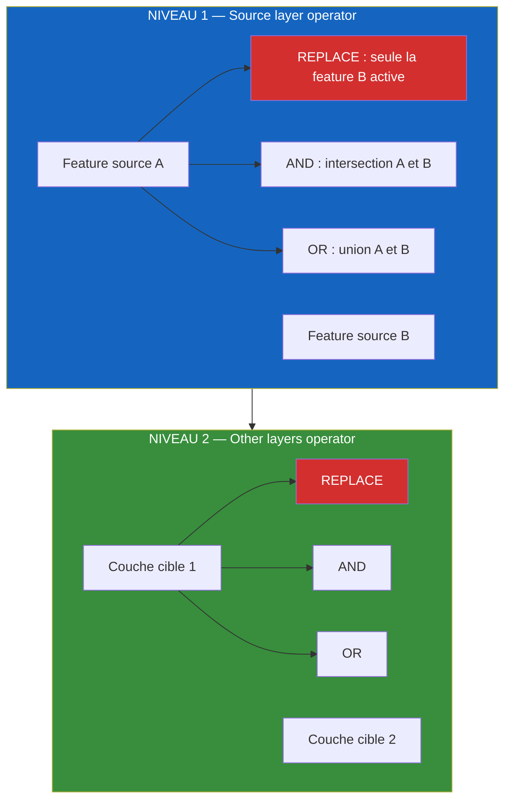
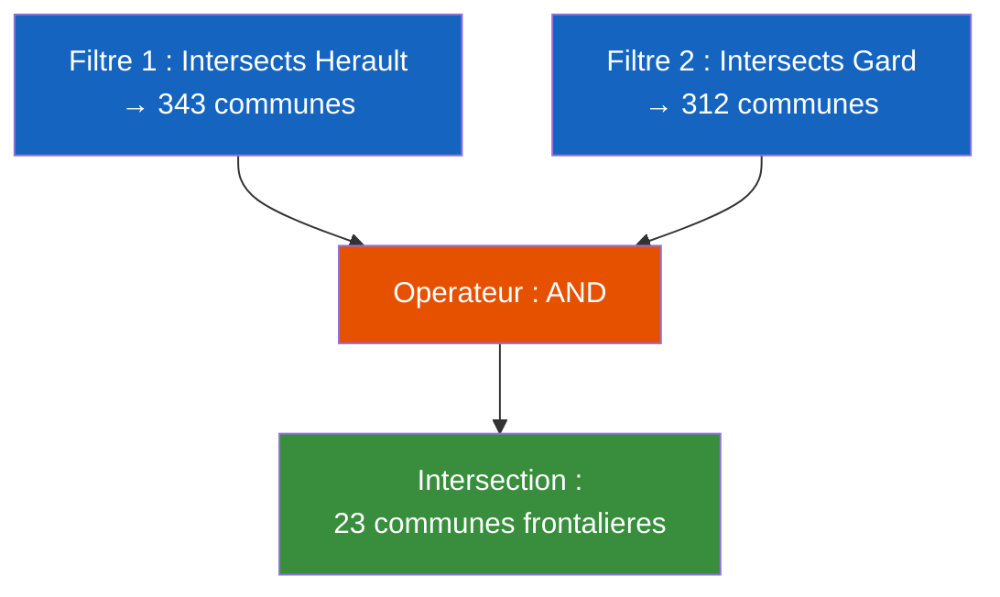

# FilterMate — Script Video 02 : Filtrage Geometrique, Les Bases
**Version** : 4.6.1 | **Date** : 14 Mars 2026
**Niveau** : Debutant | **Duree** : 8-10 min | **Prerequis** : V01 (Installation & Premier Pas)
**Langue** : Francais (sous-titres EN disponibles)

> **Objectifs pedagogiques :**
> - Comprendre la relation source / cible dans le filtrage geometrique
> - Appliquer un premier filtre spatial avec le predicat Intersects
> - Distinguer les boutons Unfilter et Reset
> - Maitriser les deux niveaux de Combine Operators
> - Savoir reagir au conflit Edit Mode
> - Pratiquer avec deux exercices guides

---

## Plan de la video

| Sequence | Titre | Duree |
|----------|-------|-------|
| 0 | Rappel : qu'est-ce que le filtrage spatial ? | 0:30 |
| 1 | Charger les donnees de demo | 0:30 |
| 2 | Selectionner la couche source | 0:30 |
| 3 | Selectionner la couche cible | 0:30 |
| 4 | Appliquer le predicat Intersects | 1:00 |
| 5 | Analyser le resultat | 0:30 |
| 6 | Bouton Unfilter — retirer un filtre | 0:30 |
| 7 | Bouton Reset — retour aux defaults | 0:30 |
| 8 | Niveau 1 : Source layer operator | 0:30 |
| 9 | Niveau 2 : Other layers operator | 0:30 |
| 10 | Conflit Edit Mode | 0:30 |
| 11 | Exercice 1 : filtrer les communes d'un departement | 1:30 |
| 12 | Exercice 2 : enchainer 2 filtres avec AND | 1:30 |

**Duree totale estimee : ~9 minutes**

---

## Timestamps

| Chrono | Contenu |
|--------|---------|
| 0:00 | Rappel : qu'est-ce que le filtrage spatial ? |
| 0:30 | Charger 2 couches : routes + batiments |
| 1:00 | Selectionner source = une route specifique |
| 1:30 | Activer "Layers to Filter" et selectionner cible = batiments |
| 2:00 | Activer "Geometric Predicates" et appliquer Intersects |
| 3:00 | Resultat : batiments filtres visibles sur la carte |
| 3:30 | Bouton Unfilter — retire le filtre (historique si disponible) |
| 4:00 | Bouton Reset — remet FilterMate aux defaults exploration |
| 4:30 | Niveau 1 : Source layer operator (REPLACE / AND / OR) |
| 5:00 | Niveau 2 : Other layers operator |
| 5:30 | Conflit Edit Mode — popup de resolution |
| 6:00 | Exercice 1 : communes d'un departement |
| 7:30 | Exercice 2 : enchainer 2 filtres AND |
| 9:00 | Conclusion et annonce V03 |

---

## Donnees de demo requises

| Couche | Type | Entites | Source |
|--------|------|---------|--------|
| Routes | Lignes | ~5 000 | Shapefile BDTopo |
| Batiments | Polygones | ~50 000 | Shapefile BDTopo |
| Departements | Polygones | ~100 | Shapefile Admin Express |
| Communes | Polygones | ~35 000 | Shapefile Admin Express |

> Toutes les couches sont en Shapefile local pour rester accessible aux debutants.
> PostgreSQL n'est pas necessaire pour cette video.

---

## SEQUENCE 0 — RAPPEL : QU'EST-CE QUE LE FILTRAGE SPATIAL ? (0:00 - 0:30)

### Visuel suggere
> Ecran titre "V02 — Filtrage Geometrique : Les Bases" puis transition vers le diagramme Mermaid anime (Source -> Predicat -> Cible) construit progressivement de gauche a droite.

### Narration

> *"Bienvenue dans ce deuxieme tutoriel FilterMate. Aujourd'hui, on rentre dans le vif du sujet : le filtrage geometrique."*

> *"Le principe est simple. Vous avez une couche source — par exemple, une route. Vous selectionnez une entite dans cette couche. Ensuite, vous choisissez un predicat spatial — est-ce que ca intersecte ? Est-ce que ca contient ? Est-ce que ca touche ? Et enfin, FilterMate teste toutes les entites de vos couches cibles contre cette geometrie source. Seules celles qui correspondent restent visibles."*

> *"C'est un filtre visuel — les donnees ne sont jamais supprimees. On masque ce qui ne correspond pas."*

### Diagramme — Concept Source / Cible

<table style="border-collapse: collapse; width: 100%; font-family: sans-serif;">
  <tr>
    <td style="text-align: center; padding: 16px; background: #1565C0; color: #fff; border-radius: 8px 0 0 8px; width: 30%;">
      <br/><strong>COUCHE SOURCE</strong><br/><small>Selection geometrique<br/>(ex: une route)</small>
    </td>
    <td style="text-align: center; padding: 8px; background: #ECEFF1; font-size: 24px;">&#10132;</td>
    <td style="text-align: center; padding: 16px; background: #E65100; color: #fff; width: 30%;">
      <br/><strong>PREDICAT SPATIAL</strong><br/><small>Intersects ? Contains ?<br/>Within ? Touches ?</small>
    </td>
    <td style="text-align: center; padding: 8px; background: #ECEFF1; font-size: 24px;">&#10132;</td>
    <td style="text-align: center; padding: 16px; background: #388E3C; color: #fff; border-radius: 0 8px 8px 0; width: 30%;">
      <br/><strong>COUCHE(S) CIBLE</strong><br/><small>Seules les entites<br/>correspondantes restent visibles</small>
    </td>
  </tr>
</table>

---

## SEQUENCE 1 — CHARGER LES DONNEES DE DEMO (0:30 - 1:00)

### Visuel suggere
> Capture QGIS : glisser-deposer les 2 Shapefiles (routes + batiments) dans le Layers Panel. La carte affiche un reseau routier et des batiments denses. Ouvrir le dock FilterMate (rappel rapide du bouton dans la toolbar).

### Narration

> *"On commence avec deux couches chargees dans QGIS : un reseau routier et des batiments — des donnees BDTopo typiques. Si vous suivez depuis la video 1, vous savez deja comment ouvrir le panneau FilterMate."*

> *"Voila notre projet : des milliers de batiments, des centaines de routes. L'objectif de la demo : isoler uniquement les batiments situes le long d'une route precise."*

### Note de montage
> Afficher brievement le nombre d'entites dans la barre de statut QGIS : "Batiments : 50 000 entites" pour ancrer l'echelle du probleme.

---

## SEQUENCE 2 — SELECTIONNER LA COUCHE SOURCE (1:00 - 1:30)

### Visuel suggere
> Demo live : dans l'Exploring Zone de FilterMate, la combobox source affiche les couches du projet. Selectionner "Routes". Puis dans la liste des valeurs, selectionner une route specifique (ex: "Avenue de la Republique"). La carte flash l'entite selectionnee.

### Narration

> *"Dans FilterMate, la couche source est celle depuis laquelle vous selectionnez une geometrie de reference. C'est la combobox en haut du panneau, dans l'Exploring Zone."*

> *"Je selectionne la couche Routes. FilterMate me liste automatiquement les valeurs du champ d'affichage — ici, les noms de route. Je choisis 'Avenue de la Republique'. Voyez comme la carte flash l'entite pour me confirmer laquelle c'est."*

> *"Regle d'or : la couche source fournit la geometrie de reference. Ce n'est pas elle qui sera filtree — c'est la cible."*

### Note de montage
> Annoter a l'ecran : fleche pointant vers la combobox source avec le label "COUCHE SOURCE". Mettre en surbrillance la route selectionnee sur la carte.

---

## SEQUENCE 3 — SELECTIONNER LA COUCHE CIBLE (1:30 - 2:00)

### Visuel suggere
> Demo live : dans l'onglet FILTERING de la Toolbox, cliquer sur le toggle "Layers to Filter" pour activer la combobox a cocher des couches cibles. Cocher "Batiments".

### Narration

> *"Maintenant, passons a l'onglet FILTERING dans la Toolbox. C'est ici qu'on definit quelles couches seront filtrees."*

> *"La combobox source est toujours visible en haut — c'est la meme que dans l'Exploring Zone. Mais pour choisir les couches cibles, il faut activer le toggle 'Layers to Filter'. Cliquez dessus : une combobox a cocher apparait avec toutes les couches du projet."*

> *"Je coche 'Batiments'. C'est cette couche qui va etre filtree — seuls les batiments qui satisfont le predicat spatial resteront visibles."*

> *"Vous pouvez cocher plusieurs couches cibles a la fois. Mais pour l'instant, restons sur une seule."*

### Note de montage
> Annoter : fleche vers le toggle "Layers to Filter" avec le label "ACTIVER POUR VOIR LES COUCHES CIBLES". Fleche vers la combobox a cocher avec "COUCHE(S) CIBLE".

---

## SEQUENCE 4 — APPLIQUER LE PREDICAT INTERSECTS (2:00 - 3:00)

### Visuel suggere
> Demo live : activer le toggle "Geometric Predicates", selectionner "Intersects" dans la combobox des predicats, puis cliquer sur le bouton Filter dans l'Action Bar. Montrer la barre de progression. Resultat : seuls les batiments le long de la route restent visibles.

### Narration

> *"Derniere etape avant de filtrer : choisir le predicat spatial. Activez le toggle 'Geometric Predicates' — une combobox apparait avec tous les predicats disponibles."*

> *"Pour notre cas, on choisit 'Intersects'. Ce predicat selectionne toutes les entites cibles dont la geometrie a un point commun avec la geometrie source. C'est le predicat le plus courant — celui que vous utiliserez dans 80% des cas."*

> *"Maintenant, cliquez sur le bouton Filter dans l'Action Bar — c'est le premier bouton, celui avec l'icone de filtre."*

> *"FilterMate detecte automatiquement que nos couches sont des Shapefiles et utilise le backend OGR. La barre de progression apparait, et... voila. En quelques secondes, sur 50 000 batiments, seuls ceux qui touchent notre route restent visibles."*

> *"A noter : le bouton Filter est desactive dans trois situations — quand l'onglet Export est actif, quand aucune feature n'est selectionnee, ou quand un filtrage est deja en cours. Si le bouton est grise, verifiez ces trois points."*

### Note de montage
> Enchainement en 3 temps avec annotations :
> 1. Fleche vers le toggle "Geometric Predicates" — "ACTIVER"
> 2. Fleche vers la combobox — "CHOISIR : Intersects"
> 3. Fleche vers le bouton Filter — "APPLIQUER"
>
> Pendant le filtrage, montrer la barre de progression. Apres, afficher un compteur anime : "50 000 -> 127 batiments".

---

## SEQUENCE 5 — ANALYSER LE RESULTAT (3:00 - 3:30)

### Visuel suggere
> Capture QGIS : comparaison avant/apres en split screen. A gauche, la carte complete avec tous les batiments. A droite, la meme vue avec uniquement les batiments filtres le long de la route. Zoomer sur le resultat.

### Narration

> *"Comparons avant et apres. A gauche, nos 50 000 batiments. A droite, les 127 qui intersectent notre route. Le filtre est applique via un subset string — c'est la methode native QGIS. Les donnees sont intactes, rien n'est supprime."*

> *"Si vous ouvrez la table attributaire de la couche Batiments, vous verrez que seules les 127 entites sont listees. Le filtre agit partout dans QGIS — carte, table, statistiques."*

### Note de montage
> Split screen anime. Afficher le subset string dans les proprietes de la couche (clic droit > Proprietes > Source) pour montrer la transparence du mecanisme.

---

## SEQUENCE 6 — BOUTON UNFILTER (3:30 - 4:00)

### Visuel suggere
> Demo live : cliquer sur le bouton Unfilter dans l'Action Bar. Les 50 000 batiments reapparaissent. Montrer l'icone du bouton en gros plan.

### Narration

> *"Pour retirer le filtre, utilisez le bouton Unfilter dans l'Action Bar — c'est le quatrieme bouton, avec l'icone d'entonnoir barre."*

> *"Unfilter retire le filtre actif de la couche. Si un historique de filtres est disponible, il l'utilise pour revenir a l'etat precedent proprement. Sinon, il supprime simplement le subset string."*

> *"C'est l'operation inverse du filtrage. Vos 50 000 batiments reapparaissent instantanement."*

> *"Attention a ne pas confondre Unfilter avec Undo. Undo revient en arriere dans l'historique des actions — etape par etape. Unfilter retire directement le filtre en cours, d'un seul coup."*

### Note de montage
> Gros plan sur les 6 boutons de l'Action Bar avec annotations : Filter, Undo, Redo, **Unfilter** (mis en evidence), Export, About.

### Diagramme — Les 6 Boutons de l'Action Bar

<table style="border-collapse: collapse; width: 100%; font-family: sans-serif;">
  <tr>
    <td colspan="6" style="background: #37474F; color: #fff; text-align: center; padding: 8px; font-weight: bold; border-radius: 8px 8px 0 0;">
      ACTION BAR — 6 boutons
    </td>
  </tr>
  <tr>
    <td style="text-align: center; padding: 12px; background: #388E3C; color: #fff; border: 1px solid #2E7D32;">
      <br/><strong>Filter</strong><br/><small>Appliquer le filtre</small>
    </td>
    <td style="text-align: center; padding: 12px; background: #455A64; color: #fff; border: 1px solid #37474F;">
      <br/><strong>Undo</strong><br/><small>Etape precedente</small>
    </td>
    <td style="text-align: center; padding: 12px; background: #455A64; color: #fff; border: 1px solid #37474F;">
      <br/><strong>Redo</strong><br/><small>Etape suivante</small>
    </td>
    <td style="text-align: center; padding: 12px; background: #D32F2F; color: #fff; border: 1px solid #B71C1C;">
      <br/><strong>Unfilter</strong><br/><small>Retirer le filtre</small>
    </td>
    <td style="text-align: center; padding: 12px; background: #455A64; color: #fff; border: 1px solid #37474F;">
      <br/><strong>Export</strong><br/><small>Exporter les donnees</small>
    </td>
    <td style="text-align: center; padding: 12px; background: #1565C0; color: #fff; border: 1px solid #0D47A1; border-radius: 0 0 8px 0;">
      <br/><strong>About</strong><br/><small>Informations plugin</small>
    </td>
  </tr>
</table>

---

## SEQUENCE 7 — BOUTON RESET (4:00 - 4:30)

### Visuel suggere
> Demo live : appliquer un filtre, modifier des parametres d'exploration (champ, mode de selection), puis cliquer sur Reset. Montrer que tout revient aux defaults FilterMate, mais que le CRS et les styles QGIS restent inchanges.

### Narration

> *"Le bouton Reset est different. Il ne se contente pas de retirer un filtre — il remet l'ensemble de l'etat d'exploration FilterMate aux valeurs par defaut."*

> *"Concretement : les filtres actifs sont retires, les parametres d'exploration reviennent aux defaults, et l'interface se reinitialise."*

> *"Mais attention — et c'est important — Reset ne touche pas a votre projet QGIS. Le systeme de coordonnees, les styles de vos couches, la mise en page : tout ca reste intact. Reset agit uniquement sur l'etat interne de FilterMate."*

> *"En resume : Unfilter retire un filtre. Reset remet FilterMate a zero."*

### Note de montage
> Tableau comparatif affiche a l'ecran :

| | Unfilter | Reset |
|---|---|---|
| Retire les filtres actifs | Oui | Oui |
| Utilise l'historique | Oui (si disponible) | Non |
| Reinitialise l'exploration | Non | Oui |
| Affecte le CRS QGIS | Non | Non |
| Affecte les styles QGIS | Non | Non |

---

## SEQUENCE 8 — NIVEAU 1 : SOURCE LAYER OPERATOR (4:30 - 5:00)

### Visuel suggere
> Demo live : activer le toggle "Combine Operator" dans l'onglet FILTERING. Deux combobox apparaissent. Focus sur la premiere : Source layer operator. Demo avec REPLACE, puis AND, puis OR en selectionnant plusieurs features source successivement.

### Narration

> *"Jusqu'ici, on a filtre avec une seule feature source. Mais que se passe-t-il si on en selectionne plusieurs ? C'est la qu'interviennent les Combine Operators — et il y en a deux niveaux."*

> *"Activez le toggle 'Combine Operator'. Deux combobox apparaissent. La premiere, c'est le Source layer operator — il controle comment FilterMate combine plusieurs features de la meme couche source."*

> *"Trois choix. REPLACE : seule la derniere feature selectionnee est active. C'est le mode par defaut — chaque nouvelle selection remplace la precedente."*

> *"AND : FilterMate fait l'intersection. Seules les entites cibles qui satisfont le predicat pour les DEUX features sources restent visibles. C'est un filtre restrictif."*

> *"OR : FilterMate fait l'union. Les entites cibles qui satisfont le predicat pour l'UNE ou l'AUTRE des features sources restent visibles. C'est un filtre inclusif."*

### Note de montage
> Montrer concretement :
> 1. Selectionner Route A -> filtrer -> 127 batiments
> 2. Selectionner Route B avec REPLACE -> 84 batiments (les 127 disparaissent)
> 3. Meme chose avec AND -> 12 batiments (intersection des deux)
> 4. Meme chose avec OR -> 199 batiments (union des deux)

---

## SEQUENCE 9 — NIVEAU 2 : OTHER LAYERS OPERATOR (5:00 - 5:30)

### Visuel suggere
> Demo live : cocher une deuxieme couche cible (ex: Parcelles). Montrer le deuxieme combobox "Other layers operator". Illustrer avec REPLACE, AND, OR en comparant les resultats entre les deux couches cibles.

### Narration

> *"Le deuxieme niveau agit entre les couches cibles. Si vous avez coche plusieurs couches a filtrer — par exemple Batiments ET Parcelles — l'Other layers operator definit comment les resultats se combinent entre elles."*

> *"REPLACE : seul le resultat de la derniere couche traitee est conserve. AND : on garde uniquement les entites presentes dans les resultats des DEUX couches. OR : on garde les resultats de l'une ou l'autre."*

> *"Pour un usage debutant, laissez ces deux operateurs sur REPLACE. C'est le mode par defaut, et c'est le plus intuitif. On verra des cas d'usage avances dans les prochains tutoriels."*

### Diagramme — Combine Operators (2 niveaux)



---

## SEQUENCE 10 — CONFLIT EDIT MODE (5:30 - 6:00)

### Visuel suggere
> Demo live : passer la couche Batiments en mode edition (icone crayon). Tenter de filtrer. FilterMate affiche un popup de resolution. Montrer les options proposees.

### Narration

> *"Un cas que vous rencontrerez tot ou tard : le conflit avec le mode edition."*

> *"QGIS ne permet pas d'appliquer un filtre subset string sur une couche en mode edition — c'est une limitation technique du moteur. Si vous essayez de filtrer alors que la couche cible est en edition, FilterMate le detecte et affiche un popup de resolution."*

> *"Ce popup vous liste les couches concernees et vous propose de quitter le mode edition pour continuer. Vous pouvez accepter — FilterMate desactive le mode edition, applique le filtre, et c'est regle. Ou vous pouvez annuler si vous avez des modifications non sauvegardees."*

> *"L'important, c'est que FilterMate ne force rien — il vous informe et vous laisse choisir."*

### Note de montage
> Gros plan sur le popup de resolution. Annoter les boutons de choix. Montrer qu'apres avoir accepte, le filtre s'applique normalement.

### Diagramme — Flux Edit Mode Conflict

<table style="border-collapse: collapse; width: 100%; font-family: sans-serif;">
  <tr>
    <td colspan="3" style="text-align: center; padding: 12px; background: #388E3C; color: #fff; border-radius: 8px 8px 0 0;">
      &nbsp; Clic sur <strong>Filter</strong>
    </td>
  </tr>
  <tr>
    <td colspan="3" style="text-align: center; padding: 10px; background: #E65100; color: #fff; font-weight: bold;">
      Couche cible en mode edition ?
    </td>
  </tr>
  <tr>
    <td style="text-align: center; padding: 12px; background: #388E3C; color: #fff; width: 33%;">
      <strong>Non</strong><br/><small>&#8595; Filtrage normal</small>
    </td>
    <td style="text-align: center; padding: 12px; background: #D32F2F; color: #fff; width: 34%;">
      <strong>Oui</strong> &#8594; Popup de resolution<br/><small>Liste les couches en edition</small>
    </td>
    <td style="text-align: center; padding: 12px; background: #78909C; color: #fff; width: 33%;">
      &nbsp;
    </td>
  </tr>
  <tr>
    <td style="text-align: center; padding: 12px; background: #66BB6A; color: #fff;">
      <br/><small>Filtre applique</small>
    </td>
    <td style="text-align: center; padding: 12px; background: #EF5350; color: #fff;">
      <strong>Accepter</strong><br/><small>Quitter le mode edition<br/>&#8595; puis filtrage normal</small>
    </td>
    <td style="text-align: center; padding: 12px; background: #BDBDBD; color: #333; border-radius: 0 0 8px 0;">
      <strong>Annuler</strong><br/><small>Revenir sans filtrer</small>
    </td>
  </tr>
</table>

---

## SEQUENCE 11 — EXERCICE 1 : FILTRER LES COMMUNES D'UN DEPARTEMENT (6:00 - 7:30)

### Visuel suggere
> Demo live guidee, etape par etape. Charger les couches Departements et Communes. Suivre le workflow complet : source = departements, feature = "Herault", cible = communes, predicat = Intersects, filtrer.

### Narration

> *"Place a la pratique. Premier exercice : isoler toutes les communes d'un departement."*

> *"Etape 1 : chargez les couches Departements et Communes dans votre projet QGIS. Si vous suivez avec les donnees de demo, elles sont deja pretes."*

> *"Etape 2 : dans l'Exploring Zone, selectionnez la couche source — Departements. Puis choisissez une valeur — prenons l'Herault."*

*[Pause — laisser le temps a l'apprenant de reproduire]*

> *"Etape 3 : dans l'onglet FILTERING, activez le toggle Layers to Filter et cochez la couche Communes."*

> *"Etape 4 : activez le toggle Geometric Predicates et choisissez Intersects."*

> *"Etape 5 : cliquez sur Filter."*

*[Pause — resultat a l'ecran]*

> *"Et voila. Sur 35 000 communes, seules les 343 communes de l'Herault restent visibles. Vous pouvez verifier dans la table attributaire — elles sont toutes la."*

> *"C'est le workflow fondamental de FilterMate. Source, cible, predicat, filtrer. Quatre etapes."*

### Note de montage
> Afficher un checklist anime au fur et a mesure :
> - [x] Couche source : Departements
> - [x] Feature : Herault
> - [x] Couche cible : Communes
> - [x] Predicat : Intersects
> - [x] Filtrer
>
> Resultat : "35 000 -> 343 communes"

### Diagramme — Workflow de l'exercice 1

<table style="border-collapse: collapse; width: 100%; font-family: sans-serif;">
  <tr>
    <td style="text-align: center; padding: 12px; background: #1565C0; color: #fff; border-radius: 8px 0 0 8px;">
      <br/><strong>1. Source</strong><br/><small>Departements</small>
    </td>
    <td style="text-align: center; padding: 4px; background: #ECEFF1;">&#10132;</td>
    <td style="text-align: center; padding: 12px; background: #1976D2; color: #fff;">
      <br/><strong>2. Feature</strong><br/><small>Herault</small>
    </td>
    <td style="text-align: center; padding: 4px; background: #ECEFF1;">&#10132;</td>
    <td style="text-align: center; padding: 12px; background: #42A5F5; color: #fff;">
      <br/><strong>3. Cible</strong><br/><small>Communes</small>
    </td>
    <td style="text-align: center; padding: 4px; background: #ECEFF1;">&#10132;</td>
    <td style="text-align: center; padding: 12px; background: #E65100; color: #fff;">
      <br/><strong>4. Predicat</strong><br/><small>Intersects</small>
    </td>
    <td style="text-align: center; padding: 4px; background: #ECEFF1;">&#10132;</td>
    <td style="text-align: center; padding: 12px; background: #388E3C; color: #fff;">
      <br/><strong>5. Filter</strong>
    </td>
    <td style="text-align: center; padding: 4px; background: #ECEFF1;">&#10132;</td>
    <td style="text-align: center; padding: 12px; background: #F57C00; color: #fff; border-radius: 0 8px 8px 0;">
      <strong>343</strong><br/><small>communes<br/>de l'Herault</small>
    </td>
  </tr>
</table>

---

## SEQUENCE 12 — EXERCICE 2 : ENCHAINER 2 FILTRES AVEC AND (7:30 - 9:00)

### Visuel suggere
> Demo live guidee. Reprendre le resultat de l'exercice 1. Changer le Source layer operator en AND. Selectionner un deuxieme departement (Gard). Filtrer a nouveau. Observer que seules les communes a la frontiere des deux departements restent visibles.

### Narration

> *"Deuxieme exercice, un cran au-dessus : enchainer deux filtres avec l'operateur AND."*

> *"On repart du resultat de l'exercice precedent — les communes de l'Herault sont filtrees."*

> *"Cette fois, activez le toggle Combine Operator. Dans le Source layer operator, choisissez AND."*

> *"Maintenant, changez la feature source. Au lieu de l'Herault, selectionnez le Gard — le departement voisin."*

*[Pause]*

> *"Cliquez sur Filter."*

*[Pause — resultat a l'ecran]*

> *"Regardez le resultat. On n'a plus 343 communes — on en a 23. Pourquoi ? Parce que l'operateur AND fait l'intersection : FilterMate garde uniquement les communes qui intersectent A LA FOIS le contour de l'Herault ET le contour du Gard. Ce sont les communes frontalieres entre les deux departements."*

> *"C'est la puissance des Combine Operators. En combinant deux filtres successifs, vous pouvez repondre a des questions spatiales complexes sans ecrire une seule ligne de SQL."*

> *"Pour revenir a l'etat initial, cliquez sur Unfilter — ou sur Reset si vous voulez aussi reinitialiser les parametres d'exploration."*

### Note de montage
> Animation en 3 temps :
> 1. Etat initial : 343 communes (Herault seul)
> 2. Ajout du Gard avec AND : 23 communes
> 3. Carte zoomee sur la zone frontaliere — les 23 communes mises en evidence
>
> Afficher un schema simplifie a l'ecran montrant les deux departements et leur zone d'intersection.

### Diagramme — Logique AND



---

## CONCLUSION (9:00 - 9:30)

### Visuel suggere
> Ecran de synthese avec les points cles, puis transition vers le teaser V03.

### Narration

> *"Recapitulons ce qu'on a vu aujourd'hui."*

> *"Le filtrage geometrique dans FilterMate repose sur trois elements : une couche source qui fournit la geometrie de reference, une ou plusieurs couches cibles qui seront filtrees, et un predicat spatial qui definit la relation a tester."*

> *"Vous savez maintenant utiliser les boutons Unfilter et Reset, configurer les Combine Operators pour enchainer des filtres, et reagir au conflit Edit Mode."*

> *"Dans la prochaine video, on explorera en detail l'onglet Exploration : navigation entite par entite, modes de selection simple, multiple et custom, et la synchronisation avec la selection QGIS."*

> *"A bientot, et bon filtrage !"*

### Note de montage
> Afficher un resume visuel :

```
CE QUE VOUS SAVEZ FAIRE :
  Source + Cible + Predicat = Filtrage geometrique
  Unfilter = retirer un filtre
  Reset = reinitialiser FilterMate
  AND / OR / REPLACE = combiner des filtres
  Edit Mode = popup de resolution

PROCHAINE VIDEO :
  V03 — Explorer Vos Donnees
```

---

## Captures QGIS requises

| # | Description | Sequence |
|---|-------------|----------|
| 1 | Carte avec routes + batiments avant filtrage | 1 |
| 2 | Exploring Zone : combobox source avec "Routes" selectionnee | 2 |
| 3 | Onglet FILTERING : toggle "Layers to Filter" active, "Batiments" cochee | 3 |
| 4 | Onglet FILTERING : toggle "Geometric Predicates" active, "Intersects" selectionne | 4 |
| 5 | Resultat apres filtrage : batiments filtres le long de la route | 5 |
| 6 | Comparaison avant/apres en split screen | 5 |
| 7 | Action Bar : 6 boutons annotes (Filter, Undo, Redo, Unfilter, Export, About) | 6 |
| 8 | Bouton Unfilter en action : batiments reapparaissent | 6 |
| 9 | Bouton Reset en action : interface revient aux defaults | 7 |
| 10 | Toggle Combine Operator : 2 combobox visibles (Source layer + Other layers) | 8-9 |
| 11 | Demo REPLACE vs AND vs OR avec compteurs de resultats | 8 |
| 12 | Couche en mode edition : icone crayon active | 10 |
| 13 | Popup Edit Mode Conflict avec options de resolution | 10 |
| 14 | Exercice 1 : departements + communes, resultat Herault | 11 |
| 15 | Exercice 2 : resultat AND Herault/Gard — 23 communes frontalieres | 12 |

---

## Points cles a mettre en avant

1. **Source / Cible / Predicat** — le trio fondamental du filtrage geometrique
2. **Non destructif** — le filtre masque, il ne supprime jamais les donnees
3. **Unfilter vs Reset** — deux actions differentes, deux cas d'usage distincts
4. **Combine Operators** — deux niveaux pour des analyses spatiales progressives
5. **Edit Mode** — FilterMate detecte et gere les conflits proprement
6. **4 etapes** — source, cible, predicat, filtrer : le workflow de base a memoriser

---

## Liens a afficher a l'ecran

- **GitHub** : `https://github.com/imagodata/filter_mate`
- **QGIS Plugins** : `https://plugins.qgis.org/plugins/filter_mate`
- **Documentation** : `https://imagodata.github.io/filter_mate`

---

## Musique suggeree

- **Intro** (0:00 - 0:30) : Beat leger, pedagogique — type "explainer video"
- **Demos** (0:30 - 5:30) : Fond neutre, rythme regulier — ne pas couvrir la voix
- **Exercices** (6:00 - 9:00) : Legere montee en energie — accompagner la pratique
- **Conclusion** (9:00 - 9:30) : Rappel du theme d'intro, resolution satisfaisante

---

*Script cree le 14 Mars 2026 — FilterMate v4.6.1*
*Serie tutoriels : Video 02/10 — Filtrage Geometrique : Les Bases*
