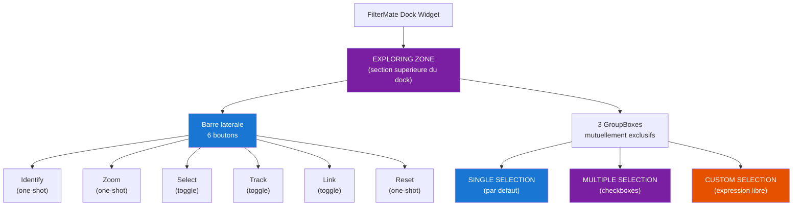
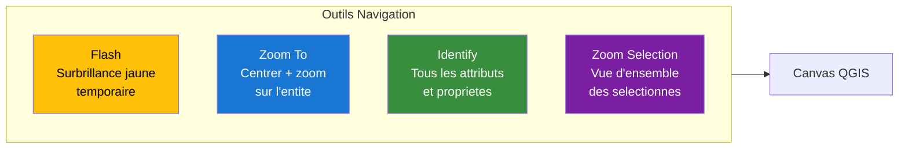
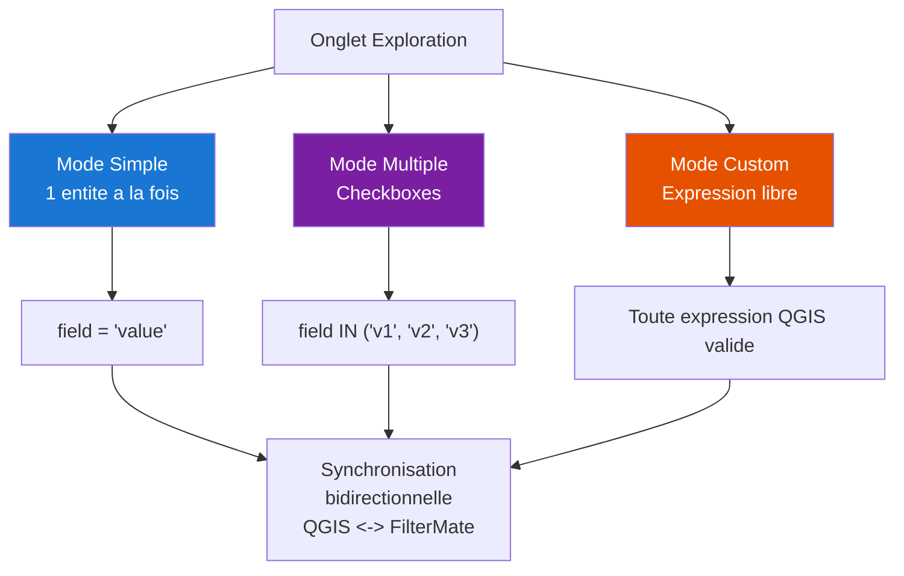

# FilterMate — Script Video V03 : Explorer Vos Donnees

**Version** : 4.6.1 | **Date** : 14 Mars 2026
**Niveau** : Debutant | **Duree estimee** : 7-8 minutes
**Prerequis** : V01 (Installation & Premier Pas)
**Langue** : Francais (sous-titres EN disponibles)

> **Public cible** : Utilisateurs QGIS souhaitant naviguer dans leurs donnees attributaires et spatiales sans ecrire de requetes.
> **Ton** : Pedagogique, progressif, engageant — on part du plus simple vers le plus puissant.

---

## Plan de la video

| Sequence | Temps   | Contenu                                       | Type           |
|----------|---------|-----------------------------------------------|----------------|
| 0        | 0:00    | Hook + A quoi sert l'onglet Exploration ?     | Voix + diagramme |
| 1        | 0:30    | Auto Current Layer toggle                     | Demo live      |
| 2        | 0:50    | Selectionner une couche a explorer            | Demo live      |
| 3        | 1:20    | Choisir un champ (nom, type, code...)         | Demo live      |
| 4        | 1:30    | Liste des valeurs uniques                     | Demo live      |
| 5        | 2:00    | Flash Feature : surbrillance temporaire       | Demo live      |
| 6        | 2:30    | Zoom to Feature : centrer la carte            | Demo live      |
| 7        | 3:00    | Identify : attributs complets                 | Demo live      |
| 8        | 3:30    | Mode selection simple                         | Demo live      |
| 9        | 4:00    | Mode selection multiple (checkboxes)          | Demo live      |
| 10       | 4:30    | Mode selection custom (expression libre)      | Demo live      |
| 11       | 5:30    | Synchronisation avec la selection QGIS        | Demo live      |
| 12       | 6:30    | Lier les widgets d'exploration (Link)         | Demo live      |
| 13       | 7:00    | Recapitulatif + transition vers V04           | Voix + schema  |

---

## SEQUENCE 0 — HOOK + INTRODUCTION (0:00 - 0:30)

### Visuel suggere
> Ecran QGIS avec une couche de 35 000 communes chargee. L'utilisateur essaie de retrouver une commune precises dans la table attributaire — scroll interminable. Puis FilterMate s'ouvre, il tape "Montpellier" dans le widget de recherche, la carte zoome instantanement. Transition vers le titre de la video.

### Narration

> *"Vous avez 35 000 communes dans votre couche, et vous cherchez celle qui s'appelle Montpellier. Vous ouvrez la table attributaire, vous scrollez... longtemps. Trop longtemps."*

> *"Avec FilterMate, il suffit de taper le nom dans la zone d'exploration, et la carte se centre instantanement sur la bonne entite. Pas de filtre SQL, pas de plugin externe — juste un panneau integre a QGIS."*

> *"Dans ce tutoriel, on va decouvrir ensemble l'onglet Exploration de FilterMate : comment naviguer entite par entite, utiliser les outils de visualisation, et maitriser les trois modes de selection. C'est parti."*

### Diagramme — Vue d'ensemble de l'Exploring Zone

---

## SEQUENCE 1 — AUTO CURRENT LAYER (0:30 - 0:50)

### Visuel suggere
> Le panneau Layers de QGIS est visible a gauche. On clique sur differentes couches dans la legende : la combo "couche source" de FilterMate suit automatiquement la selection. Le bouton toggle "Auto Current Layer" est mis en evidence avec une annotation.

### Narration

> *"Avant de plonger dans l'exploration, un petit raccourci tres pratique : le bouton 'Auto Current Layer'. Il se trouve dans la barre laterale de l'onglet Filtering — c'est le bouton avec l'icone de lien."*

> *"Quand il est active, la couche source dans FilterMate suit automatiquement la couche que vous selectionnez dans le panneau Couches de QGIS. Vous changez de couche dans la legende, FilterMate s'adapte. C'est le moyen le plus rapide de passer d'une couche a l'autre sans toucher aux combos."*

### Note technique
> Le bouton est `pushButton_checkable_filtering_auto_current_layer`. Il active l'option `LINK_LEGEND_LAYERS_AND_CURRENT_LAYER_FLAG` dans les proprietes du projet. Quand il est actif, le signal `currentLayerChanged` de QGIS declenche la mise a jour de la combo source ET de l'Exploring Zone.

---

## SEQUENCE 2 — SELECTIONNER UNE COUCHE (0:50 - 1:20)

### Visuel suggere
> On desactive "Auto Current Layer" pour montrer la methode manuelle. On ouvre la combo de selection de couche dans l'Exploring Zone. On voit la liste des couches chargees avec leurs icones de type de geometrie (point, ligne, polygone). On selectionne la couche "communes".

### Narration

> *"Si vous preferez choisir manuellement, pas de probleme. La combo en haut de la zone d'exploration liste toutes les couches vecteur chargees dans votre projet. Chaque couche est accompagnee de son icone de geometrie : point, ligne ou polygone."*

> *"Je selectionne ma couche 'communes'. FilterMate detecte automatiquement le meilleur champ d'affichage — en general le nom — et charge la liste des entites."*

### Note technique
> La detection automatique du champ d'affichage utilise `get_best_display_field()` avec 6 niveaux de priorite : display name QGIS > nom explicite (name, nom, label...) > champ texte le plus long > premier champ texte > premier champ tout court > FID.

---

## SEQUENCE 3 — CHOISIR UN CHAMP (1:20 - 1:30)

### Visuel suggere
> Gros plan sur le widget QgsFieldExpressionWidget. On clique dessus, un menu deroulant affiche tous les champs de la couche avec leur type (texte, entier, reel...). On selectionne "code_postal" a la place de "nom".

### Narration

> *"Le champ d'affichage determine ce qui apparait dans la liste de recherche. Par defaut, FilterMate choisit le champ le plus pertinent — souvent le nom. Mais vous pouvez changer a tout moment : code postal, identifiant, type d'occupation du sol... tout champ attributaire est disponible."*

> *"Ici, je passe au code postal. Immediatement, la liste des valeurs se met a jour."*

---

## SEQUENCE 4 — LISTE DES VALEURS UNIQUES (1:30 - 2:00)

### Visuel suggere
> Le widget QgsFeaturePickerWidget est au premier plan. On tape "340" dans la barre de recherche integree — la liste se filtre en temps reel et n'affiche plus que les codes postaux commencant par 340. On navigue avec les fleches de parcours (precedent/suivant). Annotation sur la limite de 10 000 entites.

### Narration

> *"Le mode selection simple utilise un widget de recherche natif QGIS — le QgsFeaturePickerWidget. Il est puissant : recherche en temps reel, autocompletion, et des fleches pour naviguer d'entite en entite sans quitter le clavier."*

> *"Je tape '340' et seuls les codes postaux correspondants apparaissent. C'est instantane, meme avec des milliers d'entites. La limite est fixee a 10 000 elements pour garantir la fluidite."*

> *"Les fleches a droite du widget permettent de parcourir les entites une par une — tres pratique pour une inspection sequentielle."*

---

## SEQUENCE 5 — FLASH FEATURE (2:00 - 2:30)

### Visuel suggere
> On selectionne une commune dans la liste. On clique sur le bouton Identify (qui fait aussi flash). Sur le canvas QGIS, l'entite selectionnee clignote en jaune vif pendant 1-2 secondes, puis disparait. Repeter avec 2-3 entites differentes pour montrer l'effet.

### Narration

> *"Premier outil de navigation : le Flash. Quand vous cliquez sur 'Identify', FilterMate fait deux choses. D'abord, il fait clignoter l'entite en surbrillance jaune sur la carte — c'est le flash. Vous voyez immediatement ou se trouve votre entite, meme dans une carte chargee."*

> *"L'effet est temporaire : apres une seconde, la surbrillance disparait. Ca ne modifie ni votre selection, ni vos filtres. C'est purement visuel — un repere instantane."*

> *"Regardez : je clique sur 'Montpellier', flash jaune. Je passe a 'Beziers', flash jaune. Simple, rapide, efficace."*

### Note technique
> Le flash utilise `iface.mapCanvas().flashGeometries()` avec une couleur jaune par defaut (`QColor(255, 255, 0)`). La duree est configurable dans les options avancees.

---

## SEQUENCE 6 — ZOOM TO FEATURE (2:30 - 3:00)

### Visuel suggere
> On selectionne "Montpellier" dans la liste. On clique sur le bouton Zoom. La carte effectue un zoom anime jusqu'a centrer Montpellier avec une marge. Puis on selectionne une petite commune rurale — la carte zoome beaucoup plus fort. Montrer le contraste d'echelle.

### Narration

> *"Deuxieme outil : Zoom To. Un clic, et la carte se centre et zoome sur l'emprise de votre entite. L'echelle s'adapte automatiquement a la taille de la geometrie."*

> *"Regardez : sur Montpellier, une ville etendue, le zoom reste large. Sur une petite commune rurale comme Saint-Guilhem-le-Desert, le zoom se resserre. FilterMate calcule le rectangle englobant et ajoute une marge pour que l'entite soit toujours bien visible dans son contexte."*

> *"C'est l'outil ideal pour verifier la localisation d'une entite ou preparer une capture d'ecran centree."*

### Note technique
> Le zoom utilise `iface.mapCanvas().setExtent()` avec un buffer de 10% autour du bounding box de l'entite. Une transformation de coordonnees (QgsCoordinateTransform) est appliquee si le CRS de la couche differe de celui du canvas.

---

## SEQUENCE 7 — IDENTIFY (3:00 - 3:30)

### Visuel suggere
> On clique sur le bouton Identify. Le panneau natif "Resultats de l'identification" de QGIS s'ouvre avec tous les attributs de l'entite selectionnee : nom, code_postal, population, superficie, etc. Montrer le detail complet.

### Narration

> *"Troisieme outil : Identify. Il ouvre le panneau natif de QGIS 'Resultats de l'identification' avec tous les attributs de votre entite. Nom, population, superficie, geometrie — tout est la."*

> *"C'est le meme panneau que celui de l'outil d'identification standard de QGIS, mais vous n'avez pas besoin de cliquer sur la carte. Vous selectionnez l'entite dans la liste FilterMate, vous cliquez Identify, et les attributs s'affichent. Pratique quand l'entite est difficile a cibler au clic sur la carte."*

### Note technique
> L'identification utilise `iface.openFeatureForm()` ou le mecanisme d'identification natif QGIS. Tous les champs attributaires sont affiches, y compris les champs virtuels et calcules.

---

## DIAGRAMME — Outils de Navigation

---

## SEQUENCE 8 — MODE SELECTION SIMPLE (3:30 - 4:00)

### Visuel suggere
> Retour sur la zone d'exploration. Le GroupBox "SINGLE SELECTION" est deplie et coche (etat par defaut). Mettre en evidence le QgsFeaturePickerWidget (barre de recherche + fleches) et le QgsFieldExpressionWidget (champ d'affichage). On selectionne une commune — elle s'affiche en surbrillance sur la carte si le bouton Select (toggle) est actif.

### Narration

> *"Parlons maintenant des trois modes de selection. Par defaut, FilterMate s'ouvre en mode 'Selection Simple'. C'est le GroupBox du haut, celui qui est deplie."*

> *"En mode simple, vous travaillez avec une seule entite a la fois. Vous la choisissez dans le widget de recherche, et FilterMate genere l'expression correspondante : par exemple, 'nom = Montpellier'. Si le bouton 'Select' est active dans la barre laterale, l'entite est aussi mise en surbrillance sur le canvas QGIS."*

> *"C'est le mode le plus intuitif — ideal pour l'inspection entite par entite."*

### Note technique
> Expression generee en mode simple : `"field_name" = 'value'`. Le widget est un `QgsFeaturePickerWidget` (`mFeaturePickerWidget_exploring_single_selection`) avec autocompletion et limite a `MAX_EXPLORING_FEATURES` (10 000 par defaut). Le champ d'affichage est controle par `mFieldExpressionWidget_exploring_single_selection`.

---

## SEQUENCE 9 — MODE SELECTION MULTIPLE (4:00 - 4:30)

### Visuel suggere
> On replie le GroupBox "SINGLE SELECTION" et on deplie "MULTIPLE SELECTION". Le widget QgsCheckableComboBoxFeaturesListPickerWidget apparait avec une liste a cocher. On coche "Montpellier", "Beziers" et "Narbonne". Les trois entites se colorent sur la carte. Annotation sur l'expression generee.

### Narration

> *"Deuxieme mode : la Selection Multiple. Depliez le GroupBox du milieu. Vous voyez maintenant un widget a cases a cocher : chaque entite de la couche a sa propre case."*

> *"Je coche Montpellier... Beziers... Narbonne. Trois entites selectionnees en un instant. FilterMate genere automatiquement l'expression correspondante : 'nom IN (Montpellier, Beziers, Narbonne)'. Et si le bouton Select est actif, les trois entites sont mises en surbrillance sur la carte."*

> *"Ce widget supporte aussi la recherche : tapez les premieres lettres pour filtrer la liste. Et il gere des milliers d'entites sans ralentir, grace au chargement asynchrone."*

### Note technique
> Expression generee en mode multiple : `"field_name" IN ('value1', 'value2', 'value3')`. Le widget `QgsCheckableComboBoxFeaturesListPickerWidget` (`checkableComboBoxFeaturesListPickerWidget_exploring_multiple_selection`) utilise un QgsTask pour le chargement asynchrone. Population non-bloquante, annulable, avec indicateur de progression.

---

## SEQUENCE 10 — MODE SELECTION CUSTOM (4:30 - 5:30)

### Visuel suggere
> On replie "MULTIPLE SELECTION" et on deplie "CUSTOM SELECTION". Le QgsFieldExpressionWidget s'affiche avec le bouton epsilon (expression builder). On clique dessus, le constructeur d'expressions QGIS s'ouvre. On ecrit une expression : `"population" > 50000 AND "departement" = '34'`. On valide. Les communes correspondantes se mettent en surbrillance sur la carte.

### Narration

> *"Troisieme mode — le plus puissant : la Selection Custom. Ici, vous ecrivez n'importe quelle expression QGIS valide. Pas de contrainte sur un seul champ : vous pouvez combiner des criteres attributaires, geometriques, ou meme utiliser des fonctions de calcul."*

> *"Je clique sur le bouton expression — c'est le petit epsilon. Le constructeur d'expressions QGIS s'ouvre, avec toutes les fonctions disponibles. J'ecris : population superieure a 50 000 ET departement egal a 34."*

> *"Je valide. FilterMate evalue l'expression et met en surbrillance les communes correspondantes. On obtient Montpellier, bien sur, et les autres grandes villes de l'Herault."*

> *"Ce mode est ideal pour les selections complexes : seuils numeriques, combinaisons multi-champs, ou meme des expressions geometriques comme area(geometry) superieur a un seuil."*

### Note technique
> Le widget utilise `QgsFieldExpressionWidget` (`mFieldExpressionWidget_exploring_custom_selection`) qui ouvre le `QgsExpressionBuilderDialog` natif QGIS. Toute expression valide dans le contexte de la couche est acceptee. L'expression est transmise telle quelle au moteur QGIS.

---

## DIAGRAMME — Modes de Selection

---

## SEQUENCE 11 — SYNCHRONISATION QGIS (5:30 - 6:30)

### Visuel suggere
> Split screen : a gauche le panneau FilterMate, a droite le canvas QGIS avec la table attributaire ouverte. On selectionne une entite dans FilterMate — elle se selectionne aussi dans la table attributaire QGIS. Puis on selectionne une entite dans la table attributaire QGIS — FilterMate se met a jour aussi. Montrer la bidirectionnalite.

### Narration

> *"L'un des points forts de FilterMate, c'est la synchronisation bidirectionnelle avec QGIS. Quand le bouton 'Select' est active dans la barre laterale, la selection dans FilterMate et la selection QGIS sont liees."*

> *"Regardez : je selectionne 'Montpellier' dans FilterMate. Dans la table attributaire QGIS, la ligne correspondante est automatiquement selectionnee. La couleur de selection par defaut de QGIS — le jaune — apparait sur la carte."*

> *"Et ca marche dans l'autre sens aussi. Si je selectionne une entite directement sur la carte avec l'outil de selection QGIS, FilterMate detecte le changement et met a jour son propre widget. C'est une synchronisation en temps reel, bidirectionnelle."*

> *"Le bouton 'Track' dans la barre laterale va encore plus loin : quand il est active, la carte zoome automatiquement sur l'entite a chaque changement de selection. C'est comme si la carte 'suivait' votre exploration."*

### Note technique
> La synchronisation repose sur les signaux `selectionChanged` de `QgsVectorLayer` et les signaux internes du `QgsFeaturePickerWidget`. Le bouton Select (`pushButton_checkable_exploring_selecting`) controle si la selection FilterMate est propagee a la selection QGIS. Le bouton Track (`pushButton_checkable_exploring_tracking`) ajoute un auto-zoom sur chaque changement.

---

## SEQUENCE 12 — LIER LES WIDGETS (Link) (6:30 - 7:00)

### Visuel suggere
> On deplie les trois GroupBoxes pour les voir cotes a cotes. On active le bouton "Link" dans la barre laterale (il passe en surbrillance). Puis on selectionne une entite en mode Simple — immediatement, le mode Multiple coche la meme entite et le mode Custom affiche l'expression equivalente. Montrer que les trois GroupBoxes restent synchronises.

### Narration

> *"Dernier outil de la barre laterale pour aujourd'hui : le bouton 'Link', representee par l'icone de chaine. Quand il est active, les trois GroupBoxes d'exploration sont lies entre eux."*

> *"Concretement : si je selectionne une entite en mode Simple, le mode Multiple coche automatiquement la meme entite, et le mode Custom genere l'expression equivalente. Les trois modes restent synchronises en permanence."*

> *"C'est tres utile pour affiner progressivement une selection. Vous commencez en mode Simple pour trouver une premiere entite, vous basculez en mode Multiple pour en ajouter d'autres, et a tout moment vous pouvez passer en mode Custom pour ajuster l'expression manuellement — sans perdre votre travail."*

### Note technique
> Le bouton Link est `pushButton_checkable_exploring_linking_widgets`. Quand il est actif, tout changement dans un GroupBox est propage aux deux autres via le controleur `ExploringController`. L'etat de liaison est persiste dans les proprietes du projet FilterMate.

---

## SEQUENCE 13 — RECAPITULATIF (7:00 - 7:30)

### Visuel suggere
> Ecran recapitulatif anime avec les 6 boutons de la barre laterale annotes, les 3 modes de selection avec leurs expressions, et une fleche vers le tutoriel V04. Fond colore avec le schema de couleurs FilterMate.

### Narration

> *"Recapitulons ce qu'on a vu ensemble."*

> *"L'onglet Exploration de FilterMate, c'est votre tableau de bord pour naviguer dans vos donnees. Six boutons dans la barre laterale : Identify pour voir les attributs, Zoom pour centrer la carte, Select pour synchroniser avec QGIS, Track pour le suivi automatique, Link pour lier les trois modes, et Reset pour tout remettre a zero."*

> *"Trois modes de selection mutuellement exclusifs : Simple pour une entite a la fois, Multiple pour cocher plusieurs entites, et Custom pour ecrire n'importe quelle expression QGIS."*

> *"Et tout ca se synchronise en temps reel avec QGIS — selection, zoom, identification."*

> *"Dans le prochain tutoriel, on verra comment combiner l'exploration avec le filtrage spatial — predicats geometriques, buffers dynamiques, et zones tampons. A bientot !"*

---

## Recapitulatif — Boutons de la barre laterale

| # | Bouton   | Type      | Fonction                                                   | Widget interne                                        |
|---|----------|-----------|------------------------------------------------------------|-------------------------------------------------------|
| 1 | Identify | One-shot  | Flash jaune + ouvre le panneau d'identification QGIS       | `pushButton_exploring_identify`                       |
| 2 | Zoom     | One-shot  | Centre et zoome la carte sur l'entite                      | `pushButton_exploring_zoom`                           |
| 3 | Select   | Toggle    | Synchronise la selection FilterMate avec la selection QGIS | `pushButton_checkable_exploring_selecting`             |
| 4 | Track    | Toggle    | Auto-zoom quand l'entite selectionnee change               | `pushButton_checkable_exploring_tracking`              |
| 5 | Link     | Toggle    | Lie les 3 GroupBoxes entre eux                             | `pushButton_checkable_exploring_linking_widgets`       |
| 6 | Reset    | One-shot  | Remet toutes les proprietes d'exploration aux valeurs par defaut | `pushButton_exploring_reset_layer_properties`   |

---

## Recapitulatif — Les 3 GroupBoxes

| GroupBox            | Widget principal                                     | Expression generee                        | Cas d'usage                              |
|---------------------|------------------------------------------------------|-------------------------------------------|------------------------------------------|
| SINGLE SELECTION    | `QgsFeaturePickerWidget` (recherche + fleches)       | `"champ" = 'valeur'`                     | Inspection entite par entite             |
| MULTIPLE SELECTION  | `QgsCheckableComboBoxFeaturesListPickerWidget`       | `"champ" IN ('v1', 'v2', 'v3')`          | Selection de lot (villes, parcelles...)  |
| CUSTOM SELECTION    | `QgsFieldExpressionWidget` (constructeur expressions)| Toute expression QGIS valide              | Criteres complexes multi-champs          |

---

## Captures QGIS requises

1. Exploring Zone avec la barre laterale annotee (6 boutons avec numeros)
2. Combo de selection de couche avec icones de geometrie
3. QgsFieldExpressionWidget avec menu deroulant des champs
4. QgsFeaturePickerWidget en action — recherche en cours avec autocompletion
5. Flash d'une entite sur la carte (capture animee GIF ou sequence de 3 images)
6. Zoom sur une entite — vue avant/apres (split screen)
7. Panneau "Resultats de l'identification" avec attributs complets
8. GroupBox SINGLE SELECTION en detail (widget + fleches + champ)
9. GroupBox MULTIPLE SELECTION avec cases cochees (3-4 entites)
10. GroupBox CUSTOM SELECTION avec le constructeur d'expressions ouvert
11. Synchronisation bidirectionnelle : selection dans FilterMate refletee dans la table attributaire QGIS
12. Bouton Link actif avec les 3 GroupBoxes synchronises

---

## Donnees de demo

| Couche              | Type       | Entites  | Champs cles                          | Source   |
|---------------------|------------|----------|--------------------------------------|----------|
| Communes France     | Polygone   | ~35 000  | nom, code_postal, population, dept   | Shapefile |
| Departements France | Polygone   | ~100     | nom, code, region                    | Shapefile |
| Routes principales  | Ligne      | ~5 000   | nom, type, longueur                  | Shapefile |

> Pas besoin de PostgreSQL pour cette video. Les donnees Shapefile ou GeoPackage suffisent.

---

## Musique et rythme

| Sequence           | Ambiance                                    |
|--------------------|---------------------------------------------|
| Hook (0:00-0:30)   | Beat dynamique, energie montante            |
| Demo (0:30-6:30)   | Fond leger, neutre, non intrusif            |
| Recap (7:00-7:30)  | Montee legere, cloturer sur une note positive |

---

## Liens a afficher a l'ecran (fin de video)

- **GitHub** : `https://github.com/imagodata/filter_mate`
- **QGIS Plugins** : `https://plugins.qgis.org/plugins/filter_mate`
- **Documentation** : `https://imagodata.github.io/filter_mate`
- **Video suivante** : V04 — Predicats Spatiaux & Buffer Dynamique

---

## Points cles a mettre en avant

1. **Zero SQL** : Exploration complete sans ecrire une seule ligne de code
2. **Trois modes progressifs** : du plus simple (1 entite) au plus puissant (expression libre)
3. **Synchronisation QGIS** : bidirectionnelle, temps reel, selection + zoom
4. **Performance** : 10 000 entites en autocompletion, chargement asynchrone
5. **Integration native** : Flash, Zoom et Identify utilisent les APIs QGIS standard

---

*Script cree le 14 Mars 2026 — FilterMate v4.6.1*
*Serie : VIDEO 03 sur 10 — Niveau Debutant*
