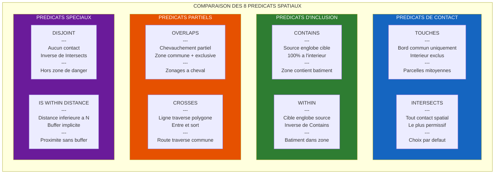

# FilterMate — VIDEO 04 : Predicats Spatiaux & Buffer Dynamique

**Version** : 4.6.1 | **Date** : 14 Mars 2026
**Niveau** : Intermediaire | **Duree** : 10-12 min | **Prerequis** : V02
**Langue** : Francais (sous-titres EN disponibles)
**Ton** : Pedagogique, progressif, illustre

---

## Plan de la video

| Sequence | Titre | Duree | Type |
|----------|-------|-------|------|
| 0 | Rappel : qu'est-ce qu'un predicat spatial ? | 0:45 | Diagramme anime |
| 1 | Touches — quand l'utiliser ? | 0:45 | Demo + schema |
| 2 | Intersects — le plus polyvalent | 0:45 | Demo + schema |
| 3 | Contains — source contient cible | 0:45 | Demo + schema |
| 4 | Within — cible a l'interieur de source | 0:45 | Demo + schema |
| 5 | Overlaps — chevauchement partiel | 0:30 | Demo + schema |
| 6 | Crosses — ligne coupe un polygone | 0:30 | Demo + schema |
| 7 | Disjoint — aucun contact spatial | 0:30 | Demo + schema |
| 8 | Is Within Distance — buffer implicite | 0:30 | Demo + schema |
| 9 | Seuils auto-centroide | 0:30 | Demo live |
| 10 | Buffer explicite (50m, 200m, 1km) | 1:15 | Demo live |
| 11 | Buffer dynamique avec expression QGIS | 1:00 | Demo live |
| 12 | Buffer negatif (filtrage inverse) | 0:30 | Demo live |
| 13 | Buffer Segments : performance | 0:30 | Demo live |
| 14 | Cas d'usage : zones tampon reglementaires | 1:30 | Demo live |
| 15 | Comparaison visuelle des 8 predicats | 1:30 | Recapitulatif |

---

## Donnees de demonstration

| Dataset | Type | Source | Usage |
|---------|------|--------|-------|
| Routes BDTopo | Lignes, Shapefile/PG | BDTopo IGN | Source pour Crosses, Touches |
| Batiments BDTopo | Polygones, PostGIS | BDTopo IGN | Cible principale |
| Zones inondables | Polygones | Georisques | Source pour Contains, Within, Buffer |
| Riviere | Lignes | BD Carthage | Source pour Crosses, Is Within Distance |

---

## SEQUENCE 0 — RAPPEL : QU'EST-CE QU'UN PREDICAT SPATIAL ? (0:00 - 0:45)

### Visuel suggere
> Fond sombre. Deux geometries (un carre bleu, un cercle orange) apparaissent sur un canvas neutre. Elles bougent l'une vers l'autre. A chaque position, un texte s'affiche : "Disjoint", "Touches", "Intersects", "Contains". Animation fluide, style motion design.

### Narration
> *"Avant de plonger dans FilterMate, prenons 30 secondes pour comprendre ce qu'est un predicat spatial. C'est un test geometrique : on prend deux geometries, et on pose une question simple. Est-ce qu'elles se touchent ? Est-ce que l'une contient l'autre ? Est-ce qu'elles se chevauchent ?"*

> *"La reponse est toujours oui ou non — vrai ou faux. Et c'est exactement ce que FilterMate utilise pour filtrer vos couches : il garde uniquement les entites pour lesquelles la reponse est 'oui'."*

### Diagramme 1 — Les 8 Predicats Spatiaux Illustres

```mermaid
graph TD
    subgraph TOUCHES["TOUCHES"]
        direction LR
        T_A["Polygone A"] ---|"bord commun"| T_B["Polygone B"]
    end
    subgraph INTERSECTS["INTERSECTS"]
        direction LR
        I_A["Polygone A"] ---|"tout contact spatial"| I_B["Polygone B"]
    end
    subgraph CONTAINS["CONTAINS"]
        direction TB
        C_A["Polygone A (englobant)"]
        C_B["Polygone B (a l'interieur)"]
    end
    subgraph WITHIN["WITHIN"]
        direction TB
        W_A["Polygone A (a l'interieur)"]
        W_B["Polygone B (englobant)"]
    end
    subgraph OVERLAPS["OVERLAPS"]
        direction LR
        O_A["Polygone A"] ---|"zone commune partielle"| O_B["Polygone B"]
    end
    subgraph CROSSES["CROSSES"]
        direction LR
        CR_A["Ligne A"] ---|"coupe le polygone B"| CR_B["Polygone B"]
    end
    subgraph DISJOINT["DISJOINT"]
        direction LR
        DJ_A["Geom A"] -.-|"aucun contact spatial"| DJ_B["Geom B"]
    end
    subgraph DWITHIN["IS WITHIN DISTANCE"]
        direction LR
        D_A["Polygone A"] -.-|"distance < N m"| D_B["Polygone B"]
    end
```



> *"FilterMate propose ces 8 predicats, accessibles directement depuis l'interface de filtrage. Voyons-les un par un."*

---

## SEQUENCE 1 — TOUCHES (0:45 - 1:30)

### Visuel suggere
> QGIS ouvert. Couche source : departements (polygones). Couche cible : communes. L'utilisateur active le toggle "Geometric Predicates" dans la barre laterale de l'onglet FILTERING. La combobox a coches apparait. Il coche uniquement "Touch".

> Schema en incrustation : deux carres qui se touchent par un bord, le bord commun est surligne en rouge.

### Narration
> *"Premier predicat : Touches. Deux geometries se 'touchent' quand elles partagent un bord ou un point de contact, mais sans se chevaucher. En urbanisme, c'est la relation entre deux parcelles mitoyennes : elles ont une limite commune, mais aucune surface en commun."*

> *"Dans FilterMate, je vais dans l'onglet Filtrage, j'active le toggle 'Geometric Predicates' dans la barre laterale — voyez, la combobox a coches apparait. Je selectionne uniquement 'Touch'."*

### Demo
> 1. Onglet FILTERING → barre laterale → activer "Geometric Predicates"
> 2. Combobox a coches → decocher tout → cocher uniquement "Touch"
> 3. Source : `departements` (polygone Ile-de-France)
> 4. Cible : `communes`
> 5. Clic "Filtrer" → seules les communes limitrophes du departement source sont conservees
> 6. Zoom sur le resultat : les communes touchent le bord du departement

> *"Resultat : FilterMate ne conserve que les communes qui touchent le contour du departement selectionne. Celles qui sont completement a l'interieur ou completement a l'exterieur sont filtrees."*

---

## SEQUENCE 2 — INTERSECTS (1:30 - 2:15)

### Visuel suggere
> Meme projet. On change le predicat dans la combobox : on decoche "Touch", on coche "Intersect". Schema en incrustation : deux formes qui se chevauchent partiellement, la zone d'intersection est coloree.

### Narration
> *"Intersects est le predicat le plus polyvalent — et c'est celui que FilterMate selectionne par defaut. Deux geometries s'intersectent si elles ont un contact spatial quelconque : un bord en commun, une surface en commun, ou meme un simple point de contact. En fait, Intersects retourne vrai pour tout ce qui n'est pas Disjoint."*

> *"C'est le predicat 'fourre-tout' : en cas de doute, commencez par lui."*

### Demo
> 1. Combobox predicats → decocher "Touch" → cocher "Intersect"
> 2. Source : meme departement Ile-de-France
> 3. Cible : `communes`
> 4. Clic "Filtrer" → toutes les communes qui touchent OU chevauchent OU sont contenues dans le departement
> 5. Comparer le nombre d'entites avec le resultat de Touches : plus d'entites (inclut les mitoyennes ET les interieures)

> *"Vous voyez la difference : avec Intersects, on obtient plus de resultats qu'avec Touches. C'est logique — Intersects est plus permissif. Il inclut les communes limitrophes ET celles qui sont a l'interieur du departement."*

---

## SEQUENCE 3 — CONTAINS (2:15 - 3:00)

### Visuel suggere
> Schema en incrustation : un grand carre bleu contenant un petit cercle orange entierement a l'interieur. Le grand carre est etiquete "Source (englobant)", le petit cercle "Cible (a l'interieur)".

### Narration
> *"Contains teste si la geometrie source contient entierement la geometrie cible. Pas de debordement, pas de contact avec le bord exterieur — la cible doit etre completement a l'interieur."*

> *"Cas d'usage typique : quels batiments sont entierement situes dans une zone inondable ? Quels points de vente sont contenus dans ma zone de chalandise ?"*

### Demo
> 1. Combobox predicats → "Contain"
> 2. Source : `zones_inondables` (polygone d'une zone inondable)
> 3. Cible : `batiments_bdtopo`
> 4. Clic "Filtrer" → seuls les batiments dont l'emprise est 100% a l'interieur de la zone inondable
> 5. Zoom : montrer qu'un batiment qui depasse meme d'un metre n'est PAS retenu

> *"Attention, Contains est strict : si un batiment deborde ne serait-ce que d'un centimetre hors de la zone, il n'est pas retenu. Pour un filtrage plus souple, combinez Intersects avec un buffer, ou utilisez Overlaps."*

---

## SEQUENCE 4 — WITHIN (3:00 - 3:45)

### Visuel suggere
> Schema en incrustation : inversion du schema Contains. Le petit cercle est la "Source", le grand carre est la "Cible". Fleche : "la source est-elle a l'interieur de la cible ?"

### Narration
> *"Within est l'inverse de Contains. Au lieu de demander 'la source contient-elle la cible ?', on demande 'la cible est-elle a l'interieur de la source ?' — ou plus exactement, la source est-elle a l'interieur de la cible."*

> *"En pratique, c'est une question de perspective. Contains et Within repondent a la meme relation spatiale, mais dans le sens oppose. Choisissez celui qui correspond a votre logique metier."*

### Demo
> 1. Combobox predicats → "Are within"
> 2. Source : `batiments_bdtopo` (un batiment selectionne)
> 3. Cible : `zones_inondables`
> 4. Clic "Filtrer" → les zones inondables qui contiennent entierement le batiment source
> 5. Comparer avec le resultat Contains precedent : meme relation, sens inverse

> *"Ici, FilterMate conserve les zones inondables qui englobent completement le batiment source. C'est la meme relation que Contains, mais vue depuis l'autre cote."*

---

## SEQUENCE 5 — OVERLAPS (3:45 - 4:15)

### Visuel suggere
> Schema : deux carres qui se chevauchent partiellement. La zone d'intersection est hachuree. Chaque carre a aussi une partie non partagee. Texte : "Zone commune + zones exclusives = Overlaps".

### Narration
> *"Overlaps detecte les chevauchements partiels : les deux geometries partagent une zone commune, mais chacune a aussi une partie qui ne se superpose pas. C'est le chevauchement classique entre deux zonages, par exemple une zone commerciale qui depasse sur deux communes."*

### Demo
> 1. Combobox predicats → "Overlap"
> 2. Source : `zones_inondables` (un zonage qui chevauche plusieurs communes)
> 3. Cible : `communes`
> 4. Clic "Filtrer" → communes partiellement recouvertes par la zone inondable

> *"Overlaps est parfait pour identifier les entites 'a cheval' sur votre zone source. Ni completement dedans, ni completement dehors — elles chevauchent."*

---

## SEQUENCE 6 — CROSSES (4:15 - 4:45)

### Visuel suggere
> Schema : une ligne (en rouge) qui traverse un polygone (en bleu). La ligne entre d'un cote et sort de l'autre. Point d'entree et point de sortie marques.

### Narration
> *"Crosses est le predicat de la traversee. Il s'applique typiquement quand une ligne coupe un polygone — la ligne entre d'un cote et ressort de l'autre. C'est la relation entre une route et une commune : la route traverse la commune."*

### Demo
> 1. Combobox predicats → "Cross"
> 2. Source : `communes` (un polygone communal)
> 3. Cible : `routes_bdtopo` (couche de lignes)
> 4. Clic "Filtrer" → toutes les routes qui traversent la commune selectionnee
> 5. Zoom : montrer les lignes qui entrent et sortent du polygone

> *"Crosses est indispensable pour les analyses de reseaux : quelles routes traversent ma zone d'etude ? Quels cours d'eau coupent ma parcelle ?"*

---

## SEQUENCE 7 — DISJOINT (4:45 - 5:15)

### Visuel suggere
> Schema : deux geometries completement separees, avec un espace vide entre elles. Texte : "Aucun contact spatial". Pointilles entre les deux pour montrer l'absence de relation.

### Narration
> *"Disjoint est l'inverse exact de Intersects. Il retourne vrai quand deux geometries n'ont aucun contact spatial — ni bord commun, ni surface commune, ni point de tangence. Rien."*

> *"Cas d'usage : quels batiments sont situes en dehors de toute zone inondable ? Quelles parcelles n'ont aucun contact avec le reseau routier ?"*

### Demo
> 1. Combobox predicats → "Disjoint"
> 2. Source : `zones_inondables`
> 3. Cible : `batiments_bdtopo`
> 4. Clic "Filtrer" → seuls les batiments qui n'ont aucun contact avec la zone inondable
> 5. Resultat : le complement exact du resultat Intersects

> *"C'est le predicat du 'filtrage par exclusion'. Tres utile pour identifier ce qui se trouve hors d'une zone donnee."*

---

## SEQUENCE 8 — IS WITHIN DISTANCE (5:15 - 5:45)

### Visuel suggere
> Schema : deux polygones separes par un espace. Un halo (cercle pointille) apparait autour du premier polygone, representant la distance. Le second polygone est a l'interieur du halo. Texte : "Distance < N metres".

### Narration
> *"Is Within Distance — ou 'Are within' dans l'interface FilterMate — est un predicat special. Il verifie si deux geometries sont distantes de moins de N metres. C'est comme un Intersects, mais avec un buffer implicite : 'est-ce que la cible se trouve dans un rayon de X metres autour de la source ?'"*

> *"Dans la combobox de FilterMate, vous le trouverez sous le nom 'Are within'. C'est le pont entre les predicats purs et le systeme de buffer que nous allons voir juste apres."*

### Demo
> 1. Combobox predicats → "Are within"
> 2. Source : `batiments_bdtopo` (un batiment)
> 3. Cible : `routes_bdtopo`
> 4. Clic "Filtrer" → routes situees dans un rayon autour du batiment
> 5. Comparer visuellement avec un Intersects simple : Are within capture des entites plus eloignees

> *"C'est le predicat ideal quand vous cherchez 'ce qui se trouve a proximite' sans avoir besoin de creer un buffer explicite."*

---

## SEQUENCE 9 — SEUILS AUTO-CENTROIDE (5:45 - 6:15)

### Visuel suggere
> Ecran QGIS. A cote de la combobox source, une case a cocher "Centroid" est visible. A cote de la combobox des couches cibles, une autre case "Centroid". L'une se coche automatiquement quand la couche depasse un certain nombre d'entites. Infobulle affichee.

### Narration
> *"Avant de passer au buffer, parlons optimisation. FilterMate dispose d'un systeme de centroide automatique. L'idee : quand une couche contient beaucoup d'entites, tester les predicats sur des polygones complets devient couteux. FilterMate peut alors utiliser le centroide — le point central — de chaque geometrie a la place."*

> *"Deux seuils sont configures par defaut :"*

> *"Pour les couches distantes — typiquement PostgreSQL ou WFS — le centroide s'active automatiquement au-dela de 5 000 entites."*

> *"Pour les couches locales — Shapefile, GeoPackage — le seuil est plus haut : 50 000 entites."*

### Demo
> 1. Charger une couche PostGIS avec 8 000 batiments
> 2. La selectionner comme cible → la case "Centroid" se coche automatiquement
> 3. Observer l'infobulle : "Layer has X features. Using centroids will significantly reduce processing time."
> 4. Decocher manuellement → le filtrage fonctionne toujours, mais plus lentement
> 5. Recocher → retour a la performance optimale

> *"Vous pouvez toujours forcer le centroide ON ou OFF manuellement. Mais dans la majorite des cas, laissez FilterMate decider — il sait quand c'est necessaire."*

---

## SEQUENCE 10 — BUFFER EXPLICITE : 50m, 200m, 1km (6:15 - 7:30)

### Visuel suggere
> L'utilisateur active le toggle "Buffer Value" dans la barre laterale. Un `QgsDoubleSpinBox` apparait avec un petit bouton jaune a cote (le `QgsPropertyOverrideButton`). Il saisit 50, puis 200, puis 1000, et filtre a chaque fois. Le nombre d'entites augmente progressivement.

### Narration
> *"Passons au buffer — l'une des fonctionnalites les plus puissantes de FilterMate. Le buffer etend ou retrecit la geometrie source avant d'appliquer le predicat spatial."*

> *"Pour l'activer, il faut d'abord que le toggle 'Geometric Predicates' soit active — c'est une dependance : sans predicat, pas de buffer. Ensuite, activez le toggle 'Buffer Value' dans la barre laterale. Un champ numerique apparait, avec une petite icone jaune a sa droite."*

### Demo — 50 metres
> 1. Onglet FILTERING → barre laterale → toggle "Geometric Predicates" ON
> 2. Barre laterale → toggle "Buffer Value" ON → le `QgsDoubleSpinBox` apparait
> 3. Predicat : "Intersect"
> 4. Source : une route BDTopo
> 5. Cible : `batiments_bdtopo`
> 6. Buffer : `50` (metres)
> 7. Clic "Filtrer" → les batiments dans un rayon de 50m autour de la route

> *"Avec un buffer de 50 metres, FilterMate cree une zone tampon de 50 metres autour de la route source, puis applique le predicat Intersects. Resultat : tous les batiments situes a moins de 50 metres de la route."*

### Demo — 200 metres
> 8. Changer la valeur du buffer : `200`
> 9. Clic "Filtrer" → plus de batiments
> 10. Comparer le nombre d'entites : augmentation significative

> *"On passe a 200 metres. Le rayon de recherche s'elargit, et logiquement, on obtient plus de resultats."*

### Demo — 1 kilometre
> 11. Changer la valeur du buffer : `1000`
> 12. Clic "Filtrer" → encore plus de batiments
> 13. Vue carte : la zone tampon est nettement visible autour de la route

> *"Et a 1 kilometre, la zone tampon couvre un perimetre considerable. Notez que FilterMate gere les unites en metres — si votre couche est dans un CRS geographique, la reprojection est geree automatiquement."*

---

## SEQUENCE 11 — BUFFER DYNAMIQUE AVEC EXPRESSION QGIS (7:30 - 8:30)

### Visuel suggere
> Gros plan sur le petit bouton jaune (`QgsPropertyOverrideButton`) a droite du spinbox buffer. L'utilisateur clique dessus → un menu apparait avec "Edit expression...". L'editeur d'expressions QGIS s'ouvre. Il saisit une expression qui utilise un attribut de la couche.

### Narration
> *"Le buffer statique, c'est bien. Mais FilterMate va plus loin avec le buffer dynamique. Voyez cette petite icone jaune a droite du champ buffer ? C'est le QgsPropertyOverrideButton — le meme widget que QGIS utilise pour ses rendu conditionnel et ses etiquettes dynamiques."*

> *"Cliquez dessus, selectionnez 'Editer l'expression', et vous pouvez ecrire n'importe quelle expression QGIS. Le buffer sera alors calcule dynamiquement, entite par entite."*

### Demo
> 1. Clic sur le bouton jaune → menu → "Edit expression..."
> 2. Editeur d'expression QGIS s'ouvre
> 3. Saisir l'expression : `"largeur" * 10`
> 4. Valider → le bouton jaune devient orange (indicateur d'expression active)
> 5. Source : `routes_bdtopo` (chaque route a un attribut "largeur")
> 6. Cible : `batiments_bdtopo`
> 7. Clic "Filtrer" → chaque route utilise un buffer proportionnel a sa largeur

> *"Ici, j'utilise l'attribut 'largeur' de chaque route, multiplie par 10. Une route de 5 metres de large aura un buffer de 50 metres. Une autoroute de 20 metres aura un buffer de 200 metres. Le filtrage s'adapte a chaque entite de la couche source."*

### Exemple d'expressions utiles
> Afficher a l'ecran :
> - `"largeur" * 10` — buffer proportionnel a un attribut
> - `if("type" = 'autoroute', 300, 50)` — buffer conditionnel par type
> - `$area / 1000` — buffer proportionnel a la surface
> - `100 + ("population" / 100)` — formule composite

> *"Les possibilites sont infinies. Tout ce que l'editeur d'expressions QGIS sait faire, le buffer dynamique de FilterMate sait l'exploiter."*

---

## SEQUENCE 12 — BUFFER NEGATIF (8:30 - 9:00)

### Visuel suggere
> Le spinbox buffer avec une valeur negative (-50). Le spinbox change de style : fond jaune avec bordure orange (mode erosion). L'infobulle affiche "Negative buffer (erosion): shrinks polygons inward". Animation : un polygone qui retrecit vers l'interieur.

### Narration
> *"Et si au lieu d'elargir, on retrecissait ? C'est le buffer negatif — aussi appele erosion. Saisissez une valeur negative dans le champ buffer, par exemple -50."*

> *"Regardez : le spinbox change de style — fond jaune, bordure orange — pour vous signaler visuellement que vous etes en mode erosion. L'infobulle confirme : 'Negative buffer (erosion): shrinks polygons inward'."*

### Demo
> 1. Buffer : `-50` (metres negatif)
> 2. Observer le changement de style du spinbox (fond `#FFF3CD`, bordure `#FFC107`)
> 3. Source : `zones_inondables` (grand polygone)
> 4. Predicat : "Intersect"
> 5. Cible : `batiments_bdtopo`
> 6. Clic "Filtrer" → les batiments sont filtres selon la zone inondable retrecis de 50m
> 7. Comparer avec un buffer de 0 : moins de resultats (la zone source est plus petite)

> *"Le buffer negatif est parfait pour les analyses de marge de securite. Au lieu de dire 'quels batiments sont dans la zone inondable ?', vous demandez 'quels batiments sont dans le coeur de la zone inondable, a plus de 50 metres du bord ?' C'est une nuance importante dans les etudes reglementaires."*

---

## SEQUENCE 13 — BUFFER SEGMENTS : PERFORMANCE (9:00 - 9:30)

### Visuel suggere
> L'utilisateur active le toggle "Buffer Type". Deux widgets apparaissent : une combobox pour le type de buffer (Source / Target / Both) et un spinbox pour le nombre de segments. Schema anime : un cercle avec 32 segments (lisse) vs un cercle avec 4 segments (anguleux). Texte : "Moins de segments = geometrie plus simple = filtrage plus rapide".

### Narration
> *"Quand FilterMate calcule un buffer, il cree un polygone autour de la geometrie source. Ce polygone est compose de segments — plus il y a de segments, plus le cercle est lisse, mais plus le calcul est lourd."*

> *"Activez le toggle 'Buffer Type' dans la barre laterale. Vous obtenez deux controles : le type de buffer — Source, Target ou Both — et le nombre de segments."*

### Demo
> 1. Barre laterale → toggle "Buffer Type" ON
> 2. Combobox : selectionner "Source"
> 3. Spinbox segments : 32 (defaut) → Filtrer → noter le temps
> 4. Spinbox segments : 8 → Filtrer → comparer le temps (plus rapide)
> 5. Spinbox segments : 4 → Filtrer → encore plus rapide, mais geometrie plus anguleuse
> 6. Vue carte : comparer visuellement les 3 resultats

> *"Avec 32 segments, le buffer est un quasi-cercle parfait. Avec 4 segments, c'est un losange. En pratique, pour du filtrage, la difference geometrique est negligeable — mais le gain de performance peut etre significatif sur des couches de plusieurs dizaines de milliers d'entites."*

---

## SEQUENCE 14 — CAS D'USAGE : ZONES TAMPON REGLEMENTAIRES (9:30 - 11:00)

### Visuel suggere
> Scenario complet, du debut a la fin. Contexte : un bureau d'etudes doit identifier les batiments situes dans differentes zones tampon autour d'une riviere, pour une etude d'impact environnemental.

### Narration — Mise en contexte (0:15)
> *"Mettons tout ca ensemble avec un cas d'usage reel. Imaginez : vous etes charge d'une etude d'impact environnemental. Vous devez identifier les batiments situes dans 3 zones tampon reglementaires autour d'une riviere : 50 metres, 200 metres et 500 metres."*

### Demo — Zone 50m (0:20)
> 1. Source : `riviere` (couche de lignes, BD Carthage)
> 2. Cible : `batiments_bdtopo`
> 3. Predicat : "Intersect"
> 4. Buffer : `50`
> 5. Clic "Filtrer" → batiments a moins de 50m de la riviere
> 6. Resultat : N entites → noter le nombre

> *"Premier filtre : 50 metres. Ce sont les batiments en zone de danger immediat. FilterMate me donne le resultat en une fraction de seconde."*

### Demo — Zone 200m (0:20)
> 7. Buffer : `200`
> 8. Clic "Filtrer" → plus de batiments
> 9. Comparer avec le precedent

> *"Deuxieme zone : 200 metres. Le nombre de batiments concernes augmente sensiblement."*

### Demo — Zone 500m avec buffer dynamique (0:25)
> 10. Clic sur le bouton jaune → "Edit expression..."
> 11. Expression : `if("type_riviere" = 'fleuve', 500, 200)`
> 12. Clic "Filtrer" → buffer adapte au type de cours d'eau

> *"Et pour la troisieme zone, j'utilise un buffer dynamique. Si le cours d'eau est un fleuve, le buffer passe a 500 metres. Pour un ruisseau, il reste a 200 metres. Une seule operation de filtrage, et le buffer s'adapte automatiquement."*

### Demo — Exclusion avec Disjoint (0:15)
> 13. Predicat : "Disjoint"
> 14. Buffer : `50`
> 15. Clic "Filtrer" → batiments HORS de la zone de 50m

> *"Et si on a besoin de l'inverse — les batiments hors danger — on passe en Disjoint. Meme buffer, meme source, resultat inverse."*

### Demo — Sauvegarde en favori (0:15)
> 16. Clic sur l'etoile dans la barre laterale → sauvegarder le filtre courant
> 17. Nom : "Zones tampon riviere - 50m/200m/500m"

> *"Et pour retrouver ce filtre plus tard, je le sauvegarde en favori. Un clic, un nom, et c'est conserve pour les prochaines sessions."*

---

## SEQUENCE 15 — COMPARAISON VISUELLE DES 8 PREDICATS (11:00 - 12:00)

### Visuel suggere
> Ecran divise ou tableau anime. Les 8 predicats sont presentes cote a cote avec le meme jeu de donnees source/cible. Pour chacun, le nombre d'entites retournees est affiche. Animation finale : les 8 resultats se superposent pour montrer leur complementarite.

### Narration
> *"Pour conclure, voici une vue comparative des 8 predicats sur le meme jeu de donnees. Meme source, meme cible, seul le predicat change."*

### Diagramme 2 — Pipeline Buffer

<table style="border-collapse: collapse; width: 100%; font-family: sans-serif;">
  <tr>
    <td style="text-align: center; padding: 14px; background: #455A64; color: #fff; border-radius: 8px 8px 0 0;" colspan="4">
      &nbsp; Geometrie source
    </td>
  </tr>
  <tr>
    <td colspan="4" style="text-align: center; padding: 8px; background: #1976D2; color: #fff; font-weight: bold;">
      &nbsp; Buffer
    </td>
  </tr>
  <tr>
    <td style="text-align: center; padding: 12px; background: #1976D2; color: #fff; width: 25%; border: 1px solid #1565C0;">
      <br/><strong>Statique</strong><br/><small>50m / 200m / 1km</small>
    </td>
    <td style="text-align: center; padding: 12px; background: #E65100; color: #fff; width: 25%; border: 1px solid #BF360C;">
      <br/><strong>Dynamique</strong><br/><small>Expression QGIS</small>
    </td>
    <td style="text-align: center; padding: 12px; background: #D32F2F; color: #fff; width: 25%; border: 1px solid #B71C1C;">
      <br/><strong>Negatif</strong><br/><small>Retrecir le polygone</small>
    </td>
    <td style="text-align: center; padding: 12px; background: #6A1B9A; color: #fff; width: 25%; border: 1px solid #4A148C;">
      <br/><strong>Segments</strong><br/><small>Moins = plus rapide</small>
    </td>
  </tr>
  <tr>
    <td colspan="4" style="text-align: center; padding: 10px; background: #78909C; color: #fff;">
      &#8595; Geometrie bufferisee
    </td>
  </tr>
  <tr>
    <td colspan="4" style="text-align: center; padding: 14px; background: #388E3C; color: #fff; border-radius: 0 0 8px 8px;">
      &nbsp; Application du predicat spatial
    </td>
  </tr>
</table>

### Diagramme 3 — Tableau Comparatif des 8 Predicats



> *"Retenez ceci : Intersects est votre predicat par defaut — il couvre la majorite des cas. Contains et Within traitent les inclusions strictes. Touches, Overlaps et Crosses gerent les relations partielles. Disjoint est l'exclusion. Et Is Within Distance ajoute la notion de proximite."*

> *"Combinez n'importe lequel de ces predicats avec un buffer — statique, dynamique ou negatif — et vous obtenez un outil de filtrage spatial extremement precis, directement dans QGIS, sans ecrire une seule ligne de code."*

---

## RECAPITULATIF — POINTS CLES

| Concept | A retenir |
|---------|-----------|
| 8 predicats | Touches, Intersects, Contains, Within, Overlaps, Crosses, Disjoint, Is Within Distance |
| Predicat par defaut | Intersects (le plus polyvalent) |
| Centroide auto | Distant > 5 000 entites, Local > 50 000 entites |
| Buffer statique | Valeur fixe en metres dans le QgsDoubleSpinBox |
| Buffer dynamique | Expression QGIS via le bouton jaune (PropertyOverrideButton) |
| Buffer negatif | Valeur negative = erosion (spinbox jaune/orange) |
| Buffer Segments | Moins de segments = geometrie plus simple = plus rapide |
| Dependance UI | Buffer Value et Buffer Type sont desactives tant que Geometric Predicates n'est pas coche |

---

## AIDE-MEMOIRE INTERFACE

### Activation des controles (chaine de dependance)

```
1. Onglet FILTERING → barre laterale → toggle "Geometric Predicates" ON
   └── Combobox a coches : Intersect, Contain, Disjoint, Equal, Touch, Overlap, Are within, Cross

2. Barre laterale → toggle "Buffer Value" ON (necesssite Geometric Predicates)
   ├── QgsDoubleSpinBox : valeur du buffer en metres (positif ou negatif)
   └── QgsPropertyOverrideButton (icone jaune) : expression QGIS dynamique

3. Barre laterale → toggle "Buffer Type" ON (necessite Geometric Predicates)
   ├── Combobox : Source / Target / Both
   └── QgsSpinBox : nombre de segments du buffer

4. Cases "Centroid" :
   ├── A cote de la combobox source (toujours visible)
   └── A cote de la combobox cibles (visible quand "Layers to Filter" ON)
```

### Noms des widgets (reference technique)

| Widget | Nom interne |
|--------|-------------|
| Toggle predicats | `pushButton_checkable_filtering_geometric_predicates` |
| Toggle buffer value | `pushButton_checkable_filtering_buffer_value` |
| Toggle buffer type | `pushButton_checkable_filtering_buffer_type` |
| Spinbox buffer | `mQgsDoubleSpinBox_filtering_buffer_value` |
| Bouton expression | `mPropertyOverrideButton_filtering_buffer_value_property` |
| Combobox buffer type | `comboBox_filtering_buffer_type` |
| Spinbox segments | `mQgsSpinBox_filtering_buffer_segments` |

---

## CAPTURES D'ECRAN REQUISES

| # | Contenu | Sequence |
|---|---------|----------|
| 1 | Combobox predicats ouverte avec les 8 options cochables | Seq. 0 |
| 2 | Schema Touches : deux polygones avec bord commun surligne | Seq. 1 |
| 3 | Resultat Contains : batiments strictement dans une zone | Seq. 3 |
| 4 | Toggle Buffer Value ON avec QgsDoubleSpinBox et bouton jaune | Seq. 10 |
| 5 | Editeur d'expression QGIS ouvert depuis le PropertyOverrideButton | Seq. 11 |
| 6 | Spinbox en mode erosion (fond jaune, bordure orange, valeur negative) | Seq. 12 |
| 7 | Tableau comparatif final des 8 predicats (plein ecran) | Seq. 15 |

---

## TRANSITIONS SUGGEREES

| De → Vers | Type | Duree |
|-----------|------|-------|
| Seq. 0 → 1 | Fondu enchaine depuis le diagramme vers QGIS | 0.5s |
| Seq. 1 → 2 → ... → 8 | Cut direct (meme interface, seul le predicat change) | 0.3s |
| Seq. 8 → 9 | Zoom sur la case Centroid | 0.5s |
| Seq. 9 → 10 | Pan vers la barre laterale, toggle Buffer Value | 0.5s |
| Seq. 13 → 14 | Transition "cas pratique" avec titre anime | 1.0s |
| Seq. 14 → 15 | Fondu vers le tableau comparatif | 0.5s |

---

## LIENS A AFFICHER

- **GitHub** : `https://github.com/imagodata/filter_mate`
- **QGIS Plugins** : `https://plugins.qgis.org/plugins/filter_mate`
- **Documentation** : `https://imagodata.github.io/filter_mate`
- **Video precedente (V02)** : Filtrage Geometrique — Les Bases
- **Video suivante (V05)** : Favoris & Historique

---

## MUSIQUE SUGGEREE

| Moment | Ambiance |
|--------|----------|
| Seq. 0 (intro diagramme) | Beat leger, curiosite, montee progressive |
| Seq. 1-8 (tour des predicats) | Fond neutre, rythme regulier, pas de distraction |
| Seq. 9-13 (buffer) | Montee d'intensite progressive, tech |
| Seq. 14 (cas d'usage) | Ambiance "mission", engagement |
| Seq. 15 (recap) | Resolution, satisfaction, outro propre |

---

*Script cree le 14 Mars 2026 — FilterMate v4.6.1*
*Video 04 de la serie de tutoriels (10 videos, ~75 min de contenu total)*
