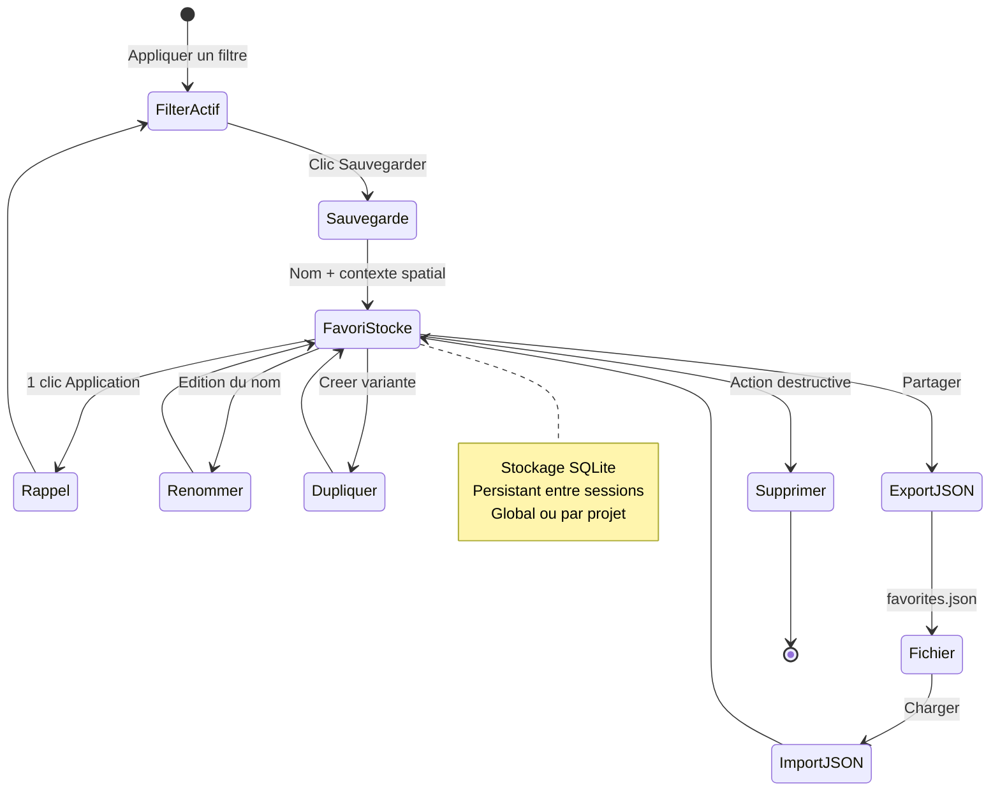
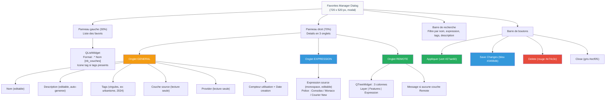
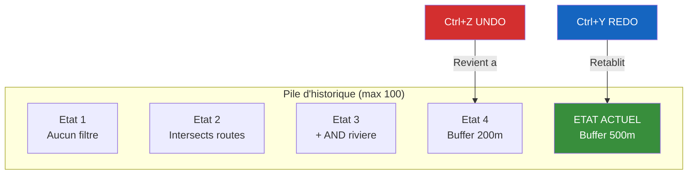

# FilterMate — Script Video V05 : Favoris & Historique

**Version** : 4.6.1 | **Date** : 14 Mars 2026
**Niveau** : Intermediaire | **Duree** : 6-8 min | **Prerequis** : V02 (Filtrage Geometrique : Les Bases)
**Langue** : Francais (sous-titres EN disponibles)

---

## Plan de la video

| Temps | Contenu | Type |
|-------|---------|------|
| 0:00 | Pourquoi sauvegarder ses filtres ? | Voix + diagramme |
| 0:30 | Sauvegarder le filtre actuel en favori | Demo live |
| 1:00 | Badge favori — indicateur visuel | Capture annotee |
| 1:30 | Rappeler un favori — 1 clic declenche automatiquement le filtre | Demo live |
| 2:00 | Renommer, dupliquer, supprimer | Demo live |
| 2:30 | Favoris globaux vs projet | Demo live |
| 3:00 | Favorites Manager Dialog — onglet General | Demo live |
| 3:30 | Favorites Manager Dialog — onglet Expression | Demo live |
| 4:00 | Favorites Manager Dialog — onglet Remote | Demo live |
| 4:30 | Export JSON — partager avec l'equipe | Demo live |
| 5:00 | Import JSON — dialog Merge / Replace All / Cancel | Demo live |
| 5:30 | History Widget : compteur, tooltips, Clear History | Demo live |
| 6:00 | Unfilter et historique | Demo live |
| 6:15 | Undo multi-couches (global state) | Demo live |
| 6:30 | Persistance historique : per-session vs disque | Demo live |

---

## Objectifs pedagogiques

A la fin de cette video, l'utilisateur saura :

1. Sauvegarder un filtre actif en favori (nom + contexte spatial complet)
2. Rappeler un favori en 1 clic (application automatique, sans double clic)
3. Gerer ses favoris : renommer, dupliquer, supprimer, editer les tags
4. Utiliser le Favorites Manager Dialog et ses 3 onglets (General, Expression, Remote)
5. Exporter et importer des favoris au format JSON pour le travail en equipe
6. Naviguer dans l'historique des filtres avec Undo/Redo (Ctrl+Z / Ctrl+Y)
7. Configurer la persistance de l'historique dans APP.OPTIONS.HISTORY

---

## Donnees de demo

- Shapefile communes (polygones, ~35 000 entites)
- Shapefile departements (polygones, ~100 entites)
- Shapefile routes (lignes, ~5 000 entites)
- Shapefile batiments (polygones, ~50 000 entites)
- Fichier `filtermate_favorites.json` (prepare a l'avance avec 5 favoris pour l'import)

---

## SEQUENCE 0 — POURQUOI SAUVEGARDER SES FILTRES ? (0:00 - 0:30)

### Visuel suggere
> Ecran splitte : a gauche, un utilisateur qui refait manuellement le meme filtre tous les jours (3 etapes : selectionner source, choisir predicat, cliquer filtrer). A droite, l'utilisateur qui clique une seule fois sur un favori. Transition fluide vers le diagramme du cycle de vie.

### Narration

> *"Imaginez : chaque lundi matin, vous filtrez les batiments situes a moins de 200 metres d'une riviere, puis ceux qui intersectent une zone inondable. Les memes filtres. Les memes couches. Les memes parametres."*

> *"Et si vous pouviez sauvegarder ces filtres une fois pour toutes, et les rappeler en un seul clic ? C'est exactement ce que fait le systeme de favoris de FilterMate."*

> *"Et pour les moments ou vous tataonnez, l'historique avec Undo/Redo vous permet de revenir en arriere a tout moment — jusqu'a 100 etats conserves."*

### Diagramme — Cycle de Vie d'un Favori

---

## SEQUENCE 1 — SAUVEGARDER LE FILTRE ACTUEL EN FAVORI (0:30 - 1:00)

### Visuel suggere
> Demo live : appliquer un filtre "Intersects" entre les routes et les batiments avec un buffer de 50m. Puis cliquer sur le badge favori (pilule doree dans la barre d'en-tete). Le menu contextuel apparait. Cliquer sur "Add Current Filter to Favorites".

### Narration

> *"Commencons par appliquer un filtre. Je selectionne mes routes comme source, mes batiments comme cible, predicat 'Intersects', buffer 50 metres. J'applique."*

> *"Maintenant je veux sauvegarder ce filtre. Je clique sur la petite pilule doree dans la barre d'en-tete — c'est le badge favoris. Un menu apparait. Je choisis 'Ajouter le filtre actuel aux favoris'."*

> *"Une boite de dialogue s'ouvre. FilterMate genere automatiquement un nom et une description. Le nombre de couches concernees est affiche — ici 2 couches : la source et une couche cible filtree. Je peux modifier le nom, par exemple 'Batiments proches des routes (50m)'. Je valide."*

> *"Voila. Mon filtre est sauvegarde, avec tout son contexte : l'expression, les couches cibles, le nombre d'entites filtrées. Tout est la."*

### Points cles a capturer
1. Le bouton "Add Current Filter to Favorites" est grise si aucun filtre n'est actif
2. La boite de dialogue affiche le nombre de couches (`Name (2 layers):`)
3. La description est auto-generee (date, couche source, apercu de l'expression, couches distantes)
4. Les couches "remote" (cibles filtrees) sont automatiquement detectees

---

## SEQUENCE 2 — BADGE FAVORI — INDICATEUR VISUEL (1:00 - 1:30)

### Visuel suggere
> Capture annotee : zoom sur la barre d'en-tete. Le badge favori est une pilule arrondie de couleur or (#f5b041 au survol, #f39c12 au repos). Il affiche le nombre de favoris sauvegardes. Annotation visuelle avec fleches et legende.

### Narration

> *"Regardons de plus pres le badge favoris. C'est cette petite pilule doree dans la barre d'en-tete du plugin. Quand aucun favori n'existe, elle affiche une simple etoile grise sur fond pale."*

> *"Des qu'un favori est sauvegarde, la pilule devient doree et affiche le compteur — par exemple '3' pour trois favoris. La couleur passe du gris au dore, c'est un indicateur visuel immediat."*

> *"Un clic sur cette pilule ouvre le menu d'acces rapide. Au survol, le tooltip indique le nombre de favoris disponibles."*

### Details techniques UI
- **Sans favoris** : etoile grise (`#95a5a6`) sur fond `#ecf0f1`, texte "No favorites saved"
- **Avec favoris** : etoile blanche sur fond dore (`#f39c12`), texte "`N` Favorites saved"
- **Au survol** : fond plus fonce (`#d68910` avec favoris, `#d5dbdb` sans)
- Padding `2px 8px`, border-radius `10px` (forme pilule)
- Curseur pointeur (main) au survol

---

## SEQUENCE 3 — RAPPELER UN FAVORI — 1 CLIC (1:30 - 2:00)

### Visuel suggere
> Demo live : cliquer sur le badge favori. Le menu contextuel affiche la liste des favoris recents (jusqu'a 10 par defaut, configurable dans `APP.OPTIONS.FAVORITES.recent_favorites_limit`). Cliquer sur un favori. Le filtre s'applique immediatement. La carte se met a jour en temps reel.

### Narration

> *"Le rappel d'un favori, c'est UN SEUL CLIC. Pas de double clic, pas de validation supplementaire. Je clique sur le badge, je vois la liste de mes favoris, je clique sur celui que je veux — et le filtre est immediatement applique."*

> *"FilterMate montre vos favoris les plus recents en premier, jusqu'a 10 par defaut. Chaque favori affiche son nom, le nombre de couches entre crochets si c'est un favori multi-couches, et le compteur d'utilisations entre parentheses."*

> *"Par exemple, je vois '* Batiments proches routes (50m) [2] (3x)' — ca veut dire : favori avec 2 couches, utilise 3 fois. Un tooltip au survol montre l'apercu de l'expression."*

> *"S'il y a plus de 10 favoris, un lien 'X more favorites' apparait en bas du menu et ouvre le gestionnaire complet."*

### Points cles a capturer
1. Format d'affichage : `  * Nom [nb_couches] (nb_utilisations x)`
2. Tooltip au survol avec preview de l'expression (80 caracteres max)
3. Lien "... N more favorites" si plus de 10 favoris
4. Application instantanee sans confirmation

---

## SEQUENCE 4 — RENOMMER, DUPLIQUER, SUPPRIMER (2:00 - 2:30)

### Visuel suggere
> Demo live dans le Favorites Manager Dialog : selectionner un favori dans la liste de gauche, modifier le nom dans l'onglet General, cliquer "Save Changes". Puis montrer la duplication (sauvegarder un favori existant apres modification du nom). Enfin, supprimer un favori avec confirmation.

### Narration

> *"Pour gerer vos favoris en detail, ouvrez le Favorites Manager. Vous y accedez via le menu du badge — cliquez 'Manage Favorites'."*

> *"Renommer : selectionnez un favori dans la liste a gauche, modifiez le nom dans le champ 'Name' a droite, et cliquez 'Save Changes'. Simple."*

> *"Dupliquer : la methode la plus simple est de rappeler un favori, modifier legerement le filtre — par exemple changer le buffer de 50m a 200m — puis le sauvegarder a nouveau sous un nouveau nom. Vous avez maintenant deux variantes."*

> *"Supprimer : cliquez le bouton rouge 'Delete'. FilterMate vous demande une confirmation — c'est une action destructive. Apres suppression, le favori suivant dans la liste est automatiquement selectionne."*

### Points cles a capturer
1. Bouton "Save Changes" (bleu `#3498db`)
2. Bouton "Delete" (rouge `#e74c3c`) avec confirmation obligatoire
3. Auto-selection du favori suivant apres suppression
4. Mise a jour du compteur dans l'en-tete du dialog

---

## SEQUENCE 5 — FAVORIS GLOBAUX VS PROJET (2:30 - 3:00)

### Visuel suggere
> Demo live : montrer que les favoris sont sauvegardes dans le projet QGIS (save_to_project). Expliquer la difference entre favoris lies au projet et favoris portables (export JSON).

### Narration

> *"Les favoris dans FilterMate sont sauvegardes dans votre projet QGIS. Quand vous enregistrez votre projet .qgz, les favoris sont embarques dedans. Ouvrez le projet sur un autre poste — les favoris sont la."*

> *"Mais attention : si vous creez un nouveau projet, vos favoris ne suivent pas automatiquement. C'est la qu'intervient l'export JSON, que nous verrons dans quelques instants."*

> *"Cette approche est volontaire : chaque projet a ses propres filtres metier, ses propres couches. Des favoris lies a des couches PostGIS d'un projet ne fonctionneraient pas dans un projet Shapefile."*

> *"La bonne pratique : exportez vos favoris en JSON quand vous avez des filtres reutilisables, et importez-les dans vos autres projets."*

---

## SEQUENCE 6 — FAVORITES MANAGER DIALOG — ONGLET GENERAL (3:00 - 3:30)

### Visuel suggere
> Demo live : ouvrir le Favorites Manager Dialog. Parcourir l'onglet General. Montrer les champs : nom, description, tags, couche source, provider, compteur d'utilisations, date de creation.

### Narration

> *"Le Favorites Manager est le coeur de la gestion des favoris. C'est un dialogue modal avec une liste a gauche et un panneau de details a droite, divise en 3 onglets."*

> *"L'onglet General contient toutes les metadonnees du favori. Le nom, bien sur, editable a tout moment. La description, auto-generee a la creation mais que vous pouvez enrichir manuellement."*

> *"Ensuite, les tags. Separez-les par des virgules : 'urbanisme, population, 2024'. Les tags servent a organiser et surtout a chercher. La barre de recherche en haut du dialogue filtre par nom, expression, tags et description."*

> *"En bas, les infos en lecture seule : la couche source d'origine, le provider (PostgreSQL, SpatiaLite, OGR...), le nombre d'utilisations, et la date de creation."*

### Diagramme — Structure du Favorites Manager Dialog (3 onglets)

### Points cles a capturer
1. Splitter horizontal 30/70 (liste / details)
2. Les items selectionnes dans la liste ont un fond dore (`#f5b041`)
3. Au survol sans selection : fond creme leger (`#fef5e7`)
4. Champ de recherche avec icone loupe et bouton clear integre

---

## SEQUENCE 7 — FAVORITES MANAGER DIALOG — ONGLET EXPRESSION (3:30 - 4:00)

### Visuel suggere
> Demo live : cliquer sur l'onglet "Expression". Montrer le texte complet de l'expression du filtre, en police monospace. Modifier l'expression directement et sauvegarder.

### Narration

> *"L'onglet Expression affiche le texte complet de l'expression de filtrage de la couche source. Il est affiche en police monospace — Consolas, Monaco ou Courier New — pour une lecture confortable du code."*

> *"Vous pouvez modifier l'expression directement ici. Par exemple, changer une distance, ajouter une condition. Puis cliquer 'Save Changes' pour mettre a jour le favori."*

> *"C'est un raccourci puissant : au lieu de recreer un filtre complet, vous editez directement l'expression sauvegardee."*

### Points cles a capturer
1. Police monospace `font-family: Consolas, Monaco, Courier New`
2. QTextEdit en pleine hauteur pour les expressions longues
3. Le titre "Source Layer Expression:" en gras au-dessus du champ

---

## SEQUENCE 8 — FAVORITES MANAGER DIALOG — ONGLET REMOTE (4:00 - 4:30)

### Visuel suggere
> Demo live : cliquer sur l'onglet "Remote". Montrer le QTreeWidget avec les 3 colonnes : Layer, Features, Expression. Si le favori n'a pas de couches Remote, le message italique "No remote layers in this favorite" s'affiche.

### Narration

> *"L'onglet Remote montre les couches cibles qui etaient filtrees au moment de la sauvegarde. C'est un tableau a 3 colonnes : le nom de la couche, le nombre d'entites filtrées, et l'expression appliquee."*

> *"Quand un favori concerne plusieurs couches — c'est le cas quand vous appliquez un filtre avec l'operateur 'Other layers' sur plusieurs cibles — toutes les couches et leurs expressions respectives sont sauvegardees."*

> *"L'intitule de l'onglet change dynamiquement : 'Remote (3)' si 3 couches cibles, ou simplement 'Remote' si aucune."*

> *"Si le favori ne concerne qu'une seule couche source sans cibles, le message 'No remote layers in this favorite' s'affiche en italique."*

### Points cles a capturer
1. Colonnes avec auto-resize (Layer, Features en ResizeToContents ; Expression en stretch)
2. Alternating row colors activees
3. Tooltip sur la colonne Expression pour les expressions longues (tronquees a 80 caracteres dans le tableau)
4. Le compteur dans l'onglet : "Remote (N)"

---

## SEQUENCE 9 — EXPORT JSON (4:30 - 5:00)

### Visuel suggere
> Demo live : dans le menu du badge favori, cliquer "Export Favorites". La boite de dialogue de sauvegarde s'ouvre avec le nom par defaut `filtermate_favorites.json`. Sauvegarder. Ouvrir le fichier JSON dans un editeur de texte pour montrer la structure.

### Narration

> *"Le partage de favoris, c'est l'export JSON. Dans le menu du badge favori, cliquez 'Export Favorites'. FilterMate propose un nom par defaut : 'filtermate_favorites.json'."*

> *"Tous vos favoris sont exportes dans un seul fichier JSON lisible. Chaque favori contient son nom, sa description, ses tags, l'expression, le provider, et les couches remote. Tout est la."*

> *"Ce fichier, vous pouvez le partager par email, le mettre sur un serveur partage, l'integrer a un depot Git. Votre collegue recevra exactement les memes filtres, prets a l'emploi."*

### Points cles a capturer
1. Nom de fichier par defaut : `filtermate_favorites.json`
2. Filtre de fichier : "JSON Files (*.json)"
3. Le fichier contient un tableau JSON avec tous les favoris

---

## SEQUENCE 10 — IMPORT JSON (5:00 - 5:30)

### Visuel suggere
> Demo live : dans le menu du badge favori, cliquer "Import Favorites". Selectionner un fichier JSON prepare a l'avance. La boite de dialogue d'import s'affiche avec 3 options : Yes (Merge), No (Replace All), Cancel.

### Narration

> *"L'import est tout aussi simple. Cliquez 'Import Favorites' dans le menu du badge. Selectionnez votre fichier JSON."*

> *"Et la, FilterMate vous pose une question importante : Merge with existing favorites? Trois choix s'offrent a vous."*

> *"Yes — c'est le mode MERGE. Les favoris importes sont ajoutes a vos favoris existants. Rien n'est supprime. C'est le choix le plus sur."*

> *"No — c'est le mode REPLACE ALL. Tous vos favoris existants sont supprimes, et seuls les favoris du fichier sont charges. Attention, c'est irreversible."*

> *"Cancel — vous annulez l'operation. Aucune modification."*

> *"Apres l'import, le badge se met a jour automatiquement avec le nouveau compteur."*

### Points cles a capturer
1. QMessageBox avec 3 boutons : Yes / No / Cancel
2. Yes = Merge (ajouter aux existants)
3. No = Replace All (tout remplacer)
4. Cancel = annuler
5. Le badge se met a jour apres import reussi

---

## SEQUENCE 11 — HISTORY WIDGET (5:30 - 6:00)

### Visuel suggere
> Demo live : appliquer 5 filtres successifs sur des couches differentes. Montrer le History Widget avec le compteur "3/5", les tooltips, les boutons Undo/Redo. Puis clic droit pour montrer le menu contextuel avec Clear History.

### Narration

> *"Passons a l'historique. Chaque fois que vous appliquez un filtre, FilterMate enregistre l'etat dans une pile d'historique. Le History Widget, situe dans la barre d'outils, vous donne un apercu en temps reel."*

> *"Deux boutons : Undo et Redo. A cote, un compteur comme '3/7' — ca signifie que vous etes au 3e etat sur 7 enregistres. Si vous etes au dernier etat, '7/7', le bouton Redo est grise."*

> *"Survolez le bouton Undo : le tooltip affiche une description comme 'Undo: Filter on communes (Ctrl+Z)'. Idem pour Redo. Vous savez exactement ou vous allez avant de cliquer."*

> *"Clic droit sur le widget : un menu contextuel apparait avec trois options. Undo, Redo, et Clear History — le petit icone poubelle. Clear History vide tout l'historique de la couche courante."*

> *"Il y a aussi un 'Browse History' pour explorer l'historique complet — mais on en reparlera dans une prochaine video."*

### Diagramme — Pile Undo/Redo

### Details techniques du History Widget
- Boutons 28x28 px avec icones Unicode (fleche Undo / fleche Redo)
- Fond gris clair `#f0f0f0`, bordure `#ccc`, border-radius 4px
- Etat desactive : fond `#f8f8f8`, texte `#ccc`
- Label compteur en gris clair, police 10px
- Menu contextuel : 4 actions (Undo, Redo, separateur, Clear History, separateur, Browse History)

---

## SEQUENCE 12 — UNFILTER ET HISTORIQUE (6:00 - 6:15)

### Visuel suggere
> Demo live : avoir un filtre actif avec historique. Cliquer sur Unfilter. Montrer que FilterMate utilise l'historique pour revenir a l'etat precedent. Puis montrer le cas sans historique : Unfilter supprime directement le filtre.

### Narration

> *"Le bouton Unfilter est plus intelligent que vous ne le pensez. Quand un historique est disponible, Unfilter ne se contente pas de supprimer le filtre — il revient a l'etat precedent dans l'historique. C'est un Undo intelligent."*

> *"Si aucun historique n'est disponible — par exemple au premier filtre de la session — Unfilter supprime simplement le filtre directement."*

> *"La difference est subtile mais importante : avec l'historique, Unfilter preserve la chaine d'etats. Sans historique, c'est une suppression brute."*

---

## SEQUENCE 13 — UNDO MULTI-COUCHES (6:15 - 6:30)

### Visuel suggere
> Demo live : appliquer un filtre multi-couches (1 source, 3 cibles). Le filtre affecte 4 couches en meme temps. Faire un Undo : les 4 couches reviennent a leur etat precedent simultanement.

### Narration

> *"Quand vous appliquez un filtre spatial qui touche plusieurs couches — une source et trois cibles — l'historique sauvegarde un etat global. Toutes les couches filtrees sont enregistrees ensemble."*

> *"Quand vous faites Undo, ce n'est pas une seule couche qui revient en arriere — c'est l'ensemble. Les 4 couches sont restaurees simultanement a leur etat precedent. C'est le 'global state' : un seul Ctrl+Z pour tout defaire."*

---

## SEQUENCE 14 — PERSISTANCE HISTORIQUE (6:30 - 7:00)

### Visuel suggere
> Demo live : ouvrir la configuration FilterMate (JSON TreeView). Naviguer vers `APP > OPTIONS > HISTORY`. Montrer les 2 parametres : `max_history_size` (defaut 100) et `persist_history` (defaut true). Changer `persist_history` de true a false pour montrer le mode session.

### Narration

> *"Par defaut, FilterMate persiste l'historique dans votre fichier projet. Le parametre 'persist_history' est a 'true'. Quand vous sauvegardez et rouvrez votre projet, votre historique de filtres est toujours la."*

> *"Si vous preferez un historique leger, par session uniquement, passez 'persist_history' a 'false'. L'historique sera vide a chaque nouvelle ouverture du projet."*

> *"Le parametre 'max_history_size' controle le nombre maximum d'etats par couche. La valeur par defaut est 100. Quand la pile est pleine, le plus ancien etat est supprime automatiquement — c'est une file FIFO."*

> *"Vous trouverez ces parametres dans la configuration FilterMate, section APP, OPTIONS, HISTORY."*

### Points cles a capturer
1. Chemin de config : `APP > OPTIONS > HISTORY`
2. `max_history_size` : defaut 100, min non specifie, configurable
3. `persist_history` : defaut `true`, choix `true`/`false`
4. FIFO quand la pile est pleine

---

## RECAPITULATIF — RACCOURCIS ET INTERACTIONS

### Tableau recapitulatif

| Action | Geste | Raccourci clavier |
|--------|-------|-------------------|
| Sauvegarder en favori | Clic badge > "Add Current Filter" | — |
| Rappeler un favori | Clic badge > clic favori | — |
| Ouvrir Favorites Manager | Clic badge > "Manage Favorites" | — |
| Export favoris | Clic badge > "Export Favorites" | — |
| Import favoris | Clic badge > "Import Favorites" | — |
| Undo | Bouton ou raccourci | Ctrl+Z |
| Redo | Bouton ou raccourci | Ctrl+Y |
| Clear History | Clic droit History Widget | — |

---

## Captures QGIS requises

1. Badge favori sans favoris (etoile grise) vs avec favoris (pilule doree avec compteur)
2. Menu contextuel du badge avec liste des favoris recents
3. Boite de dialogue "Add to Favorites" avec nom auto-genere et description
4. Favorites Manager Dialog — vue d'ensemble avec splitter
5. Favorites Manager — onglet General (tous les champs remplis)
6. Favorites Manager — onglet Expression (expression monospace)
7. Favorites Manager — onglet Remote (tableau 3 colonnes avec donnees)
8. Favorites Manager — onglet Remote vide (message italique)
9. Boite de dialogue export (filtre JSON)
10. Boite de dialogue import (3 boutons Yes/No/Cancel)
11. History Widget avec compteur "3/7" et tooltips
12. Menu contextuel du History Widget (Undo, Redo, Clear History, Browse History)
13. Configuration HISTORY dans le JSON TreeView

---

## CONCLUSION — OUTRO (7:00 - 7:30)

### Visuel suggere
> Ecran recapitulatif avec les 3 blocs visuels : Favoris (pilule doree), Import/Export (icone JSON), Historique (fleches Undo/Redo). Liens vers les ressources.

### Narration

> *"En resume : les favoris vous permettent de sauvegarder, organiser et partager vos filtres. L'historique vous donne la liberte d'experimenter sans risque — 100 etats, Undo/Redo, persistance configurable."*

> *"Dans la prochaine video, nous verrons l'export GeoPackage et KML en detail — comment exporter vos donnees filtrees avec leur projet QGIS embarque."*

> *"Si cette video vous a ete utile, laissez une etoile sur le depot GitHub. Et si vous avez des questions, ouvrez une issue — on vous repondra."*

### Liens a afficher
- **GitHub** : `https://github.com/imagodata/filter_mate`
- **QGIS Plugins** : `https://plugins.qgis.org/plugins/filter_mate`
- **Documentation** : `https://imagodata.github.io/filter_mate`

---

## Musique suggeree

- Intro (0:00 - 0:30) : Fond leger, ton pedagogique
- Demo (0:30 - 6:30) : Ambiance neutre, pas de distraction
- Outro (7:00 - 7:30) : Montee legere, ton conclusif

---

*Script cree le 14 Mars 2026 — FilterMate v4.6.1 — Video 05 sur 10*
