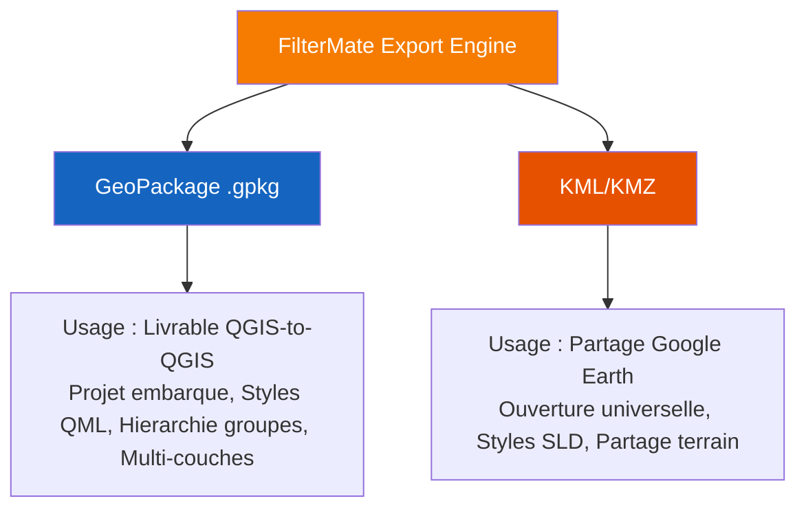
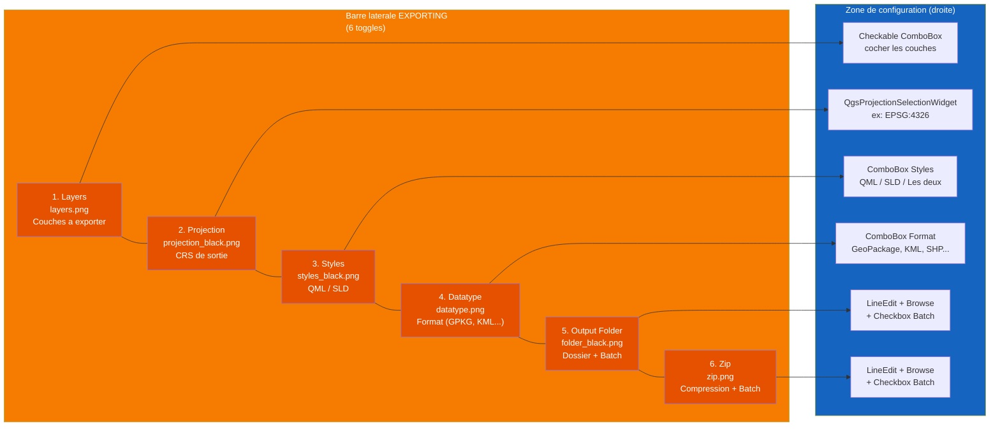
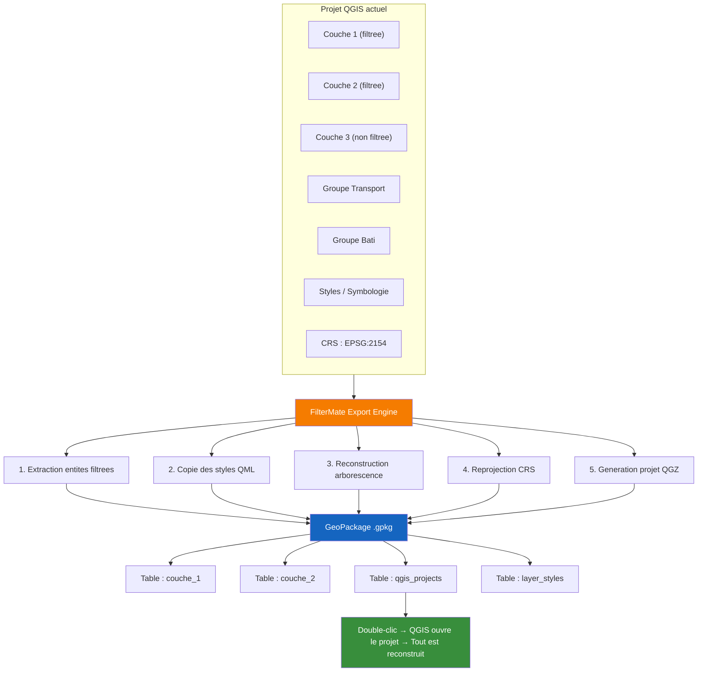
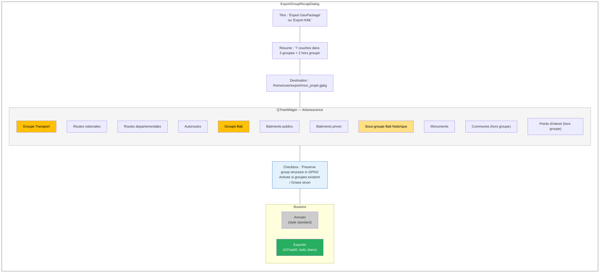
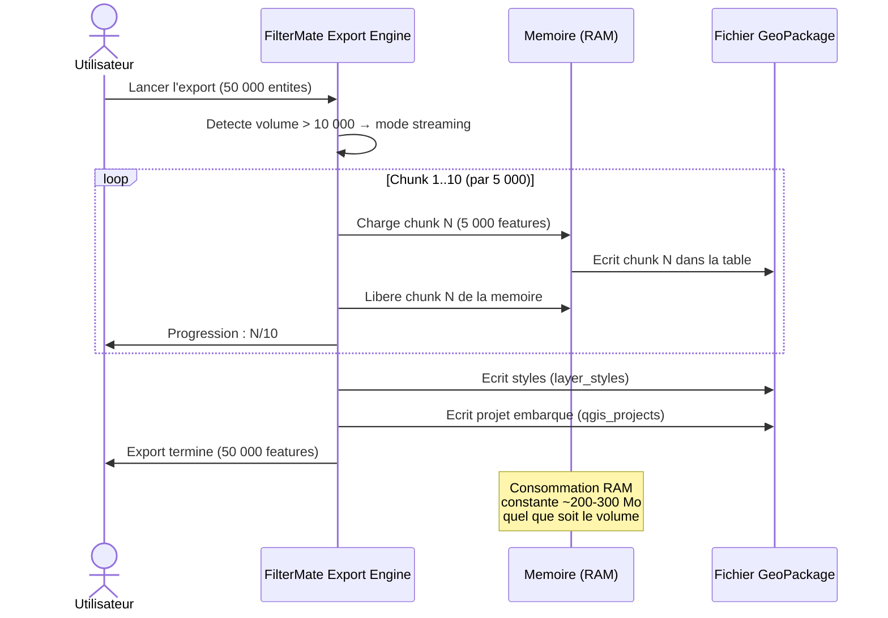

# FilterMate — VIDEO 06 : Export GeoPackage & KML Pro

**Version** : 4.6.1 | **Date** : 14 Mars 2026
**Niveau** : Intermediaire | **Duree** : 8-10 min | **Prerequis** : V02 (Filtrage Geometrique : Les Bases)
**Langue** : Francais (sous-titres EN disponibles)

> **Objectifs pedagogiques :**
> - Comprendre le dialogue ExportGroupRecapDialog (confirmation avant export)
> - Choisir entre GPKG et KML selon le cas d'usage
> - Comprendre QML (fidelite QGIS) vs SLD (portabilite OGC) pour les styles
> - Preserver la hierarchie de groupes dans le GPKG (Preserve group structure)
> - Utiliser le batch mode (un fichier par couche)
> - Export streaming pour volumes > 10 000 entites
> - Cas d'usage : livrable client QGIS-to-QGIS vs partage Google Earth

---

## Plan de la video

| Temps | Contenu | Type |
|-------|---------|------|
| 0:00 | Pourquoi exporter ? Deux cas : livrable QGIS-to-QGIS vs partage Google Earth | Diagramme |
| 0:30 | Onglet Export — vue d'ensemble des 6 toggles | Demo live |
| 1:00 | ExportGroupRecapDialog : arborescence QTreeWidget, resume N couches / M groupes, chemin de sortie | Demo live |
| 1:45 | Checkbox "Preserve group structure in GPKG" + bouton Export vert #27ae60 | Demo live |
| 2:15 | GPKG : format recommande pour livrable QGIS-to-QGIS complet | Demo live |
| 3:00 | KML : format recommande pour partage Google Earth / utilisateurs non-QGIS | Demo live |
| 3:30 | QML vs SLD : QML = fidelite QGIS totale ; SLD = standard OGC portable — les deux activables simultanement | Demo live |
| 4:15 | Preserve group structure : la vraie valeur ajoutee — hierarchie reconstruite a l'ouverture | Demo live |
| 5:00 | Batch mode : un fichier par couche (vs tout dans un GPKG) | Demo live |
| 5:45 | Streaming 10k+ : FilterMate fragmente et reassemble pour eviter les timeout memoire | Demo live |
| 6:30 | Ouvrir le GPKG resultant — projet embarque, styles et groupes intacts | Demo live |
| 7:30 | Recapitulatif : GPKG pour equipe QGIS, KML pour livraison terrain / client non-SIG | Schema |
| — | Piege : Export = features visibles (filtrees). Faire Unfilter avant si on veut tout exporter. | Info |

---

## SEQUENCE 0 — HOOK & CONTEXTE (0:00 - 0:30)

### Visuel suggere
> Ecran splitte en deux : a gauche, un projet QGIS avec 8 couches, symbologie complexe, groupes imbriques. A droite, un seul fichier `.gpkg` de 12 Mo. Transition : double-clic sur le GPKG, QGIS reconstruit tout automatiquement — groupes, styles, projection.

### Narration

> *"Vous avez passe des heures a organiser votre projet QGIS. Des groupes bien structures, de la symbologie aux petits oignons, des filtres precis. Et maintenant, il faut livrer tout ca a un collegue ou a un client. Comment faire sans perdre votre travail ?"*

> *"FilterMate peut emballer tout votre projet — couches, styles, hierarchie de groupes — dans un seul fichier GeoPackage. Et si votre destinataire utilise Google Earth plutot que QGIS, le format KML est la en alternative. C'est ce qu'on va voir dans cette video."*

### Diagramme 1 — GPKG vs KML : arbre de decision

---

## SEQUENCE 1 — ONGLET EXPORT : VUE D'ENSEMBLE (0:30 - 1:00)

### Visuel suggere
> Zoom sur l'onglet EXPORTING du Toolbox Zone. Annotation numerotee de chaque toggle de la barre laterale gauche (1 a 6). Surbrillance progressive de chaque zone au fur et a mesure de la narration.

### Narration

> *"On passe dans l'onglet EXPORTING du Toolbox. C'est le deuxieme onglet, juste a cote du filtrage. La structure est la meme que pour le filtrage : une barre laterale de 6 boutons a gauche, et la zone de configuration a droite."*

> *"Chaque bouton-toggle active ou desactive une section. Si un toggle est eteint, la section correspondante est grisee — pas cachee, grisee. Vous pouvez donc toujours voir ce qui existe, meme si ce n'est pas actif."*

> *"De haut en bas : Layers, pour selectionner les couches a exporter. Projection, pour choisir le CRS de sortie. Styles, pour embarquer la symbologie. Datatype, pour le format de sortie. Output Folder, pour le dossier de destination. Et Zip, pour compresser le resultat."*

### Diagramme 2 — Structure de l'onglet EXPORTING (barre laterale)

> *"Astuce : vous n'etes pas oblige d'activer tous les toggles. Le minimum pour exporter, c'est Layers — pour choisir quoi exporter — et Output Folder ou Zip — pour dire ou le mettre. Tout le reste est optionnel."*

---

## SEQUENCE 2 — EXPORTGROUPRECAPDIALOG : CONFIRMATION AVANT EXPORT (1:00 - 1:45)

### Visuel suggere
> Clic sur le bouton Export de l'Action Bar. Le dialogue ExportGroupRecapDialog s'ouvre. Annotation de chaque element : titre, arborescence QTreeWidget (icones dossier pour les groupes, icones fichier pour les couches), resume "N couches dans M groupes + K hors groupe", chemin de destination, checkbox, boutons Annuler / Exporter.

### Narration

> *"Quand vous cliquez sur le bouton Export dans la barre d'action, FilterMate ne lance pas l'export directement. D'abord, il affiche une boite de dialogue de confirmation — le ExportGroupRecapDialog."*

> *"C'est un resume visuel de ce qui va etre exporte. En haut, le titre vous indique le format — 'Export GeoPackage' ou 'Export KML'. En dessous, une ligne de resume : par exemple, '7 couches dans 3 groupes + 2 hors groupe'."*

> *"Au centre, l'arborescence. C'est un QTreeWidget qui reproduit la hierarchie de vos groupes QGIS. Les dossiers representent les groupes, les fichiers representent les couches. Tout est deploye par defaut pour que vous puissiez verifier d'un coup d'oeil."*

> *"En bas, le chemin de destination. Et la fameuse checkbox 'Preserve group structure in GPKG'. On y revient juste apres."*

> *"Deux boutons : Annuler a gauche, Exporter a droite. Notez le bouton Exporter : il est vert — exactement la teinte #27ae60 — avec le texte en gras et un padding genereux. C'est volontaire. C'est l'action principale, elle doit sauter aux yeux."*

---

## SEQUENCE 3 — CHECKBOX PRESERVE GROUP STRUCTURE (1:45 - 2:15)

### Visuel suggere
> Zoom sur la checkbox "Preserve group structure in GPKG". Montrer les deux etats : activee (quand des groupes existent) et grisee (quand toutes les couches sont a la racine). Tooltip visible : "Embeds a QGIS project in the GeoPackage that restores the group tree structure on opening".

### Narration

> *"Cette checkbox est le coeur de l'export intelligent de FilterMate. Quand elle est cochee, FilterMate ne se contente pas d'ecrire les donnees dans le GeoPackage. Il embarque aussi un projet QGIS complet — un QGZ — directement dans une table speciale du fichier."*

> *"A l'ouverture du GPKG, QGIS lit cette table, et reconstruit automatiquement votre arborescence : groupes, sous-groupes, ordre des couches, symbologie, tout."*

> *"Attention : cette checkbox est intelligente. Si vos couches n'appartiennent a aucun groupe — si tout est a la racine — la checkbox se grise automatiquement. Le tooltip change aussi pour vous l'indiquer : 'No group detected — all layers are at the root level'. Pas de groupe, pas besoin de preservation."*

> *"Pour le format KML, le texte change : 'Group layers in a single KML file with folders'. La logique est la meme, mais adaptee au format."*

---

## SEQUENCE 4 — GEOPACKAGE : LE FORMAT POUR LES EQUIPES QGIS (2:15 - 3:00)

### Visuel suggere
> Schema anime montrant le contenu interne d'un fichier GeoPackage : tables de donnees vecteur, table `layer_styles`, table `qgis_projects`. Parallele visuel avec un projet QGIS classique.

### Narration

> *"Le GeoPackage, c'est un conteneur SQLite. Mais vu par FilterMate, c'est bien plus qu'une base de donnees. C'est un livrable complet."*

> *"Quand vous exportez en GPKG, voici ce qui est ecrit dans le fichier. D'abord, les tables de donnees — une par couche. Vos entites, vos attributs, vos geometries, tout est la. Si un filtre est actif, seules les entites visibles sont exportees. C'est un point important — on y revient en fin de video."*

> *"Ensuite, la table `layer_styles`. Elle contient la symbologie QML de chaque couche. Quand QGIS ouvre le GPKG, il applique automatiquement ces styles. Vos categories, vos graduations, vos etiquettes — tout est restaure."*

> *"Enfin, la table `qgis_projects`. C'est ici que FilterMate stocke le projet embarque. Ce mini-QGZ contient l'arborescence des groupes, l'ordre des couches, et les references vers les tables du GPKG. Un double-clic sur le fichier, et QGIS reconstruit votre projet a l'identique."*

> *"C'est le format ideal pour le livrable QGIS-to-QGIS. Tout dans un seul fichier, zero dependance externe."*

### Diagramme 3 — Pipeline d'export GeoPackage

---

## SEQUENCE 5 — KML : LE FORMAT POUR GOOGLE EARTH (3:00 - 3:30)

### Visuel suggere
> Meme projet que precedemment, mais exporte en KML. Ouverture dans Google Earth (ou Google Earth Pro). Les couches apparaissent avec une symbologie simplifiee, organisees en dossiers `<Folder>`.

### Narration

> *"Maintenant, imaginons un autre scenario. Votre client n'a pas QGIS. Il utilise Google Earth, ou il veut simplement visualiser les donnees sur un fond satellite sans rien installer de complexe."*

> *"C'est la que le KML entre en jeu. KML — Keyhole Markup Language — c'est le format natif de Google Earth. Quand vous exportez en KML, FilterMate ecrit vos geometries et attributs dans un fichier XML structure avec des balises `<Folder>` pour reproduire les groupes."*

> *"Le KML est plus limite que le GPKG : pas de projet embarque, pas de styles QML, moins de metadonnees. Mais il a un avantage decisif : l'ouverture universelle. Google Earth, Google Maps, ArcGIS Online, et des dizaines d'autres outils lisent le KML sans configuration."*

> *"Regle simple : equipe SIG → GPKG. Client terrain ou non-SIG → KML."*

---

## SEQUENCE 6 — QML VS SLD : CHOISIR SES STYLES (3:30 - 4:15)

### Visuel suggere
> Ecran splitte en trois : a gauche, le rendu QGIS original. Au centre, le rendu avec style QML reimporte (identique). A droite, le rendu avec style SLD (differences mineures visibles : certaines etiquettes, certains renderers specifiques QGIS manquants).

### Narration

> *"L'onglet Styles vous propose deux formats de symbologie. C'est un choix qui a un vrai impact sur la fidelite de votre export."*

> *"Premier format : QML. C'est le format natif de QGIS. Il capture absolument tout : les categories, les graduations, les rule-based, les etiquettes, les effets de dessin, les echelles de visibilite. Si votre destinataire ouvre le fichier dans QGIS, il retrouve exactement le meme rendu que vous. Fidelite totale, zero perte."*

> *"Deuxieme format : SLD — Styled Layer Descriptor. C'est un standard OGC, c'est-a-dire un format inter-logiciel. GeoServer, MapServer, ArcGIS, QGIS — tous lisent le SLD. Mais la conversion n'est pas parfaite. Certains renderers specifiques QGIS n'ont pas d'equivalent SLD, donc il y a une perte possible."*

> *"Et voila la bonne nouvelle : vous n'avez pas a choisir. Activez les deux en meme temps. FilterMate exporte les deux formats cote a cote. Le destinataire QGIS utilisera le QML, le destinataire GeoServer utilisera le SLD."*

### Tableau comparatif (a afficher a l'ecran)

| Critere | QML | SLD |
|---------|-----|-----|
| Fidelite QGIS | Totale (100%) | Partielle (~80%) |
| Portabilite | QGIS uniquement | OGC standard (multi-logiciel) |
| Categories / Graduations | Oui | Oui |
| Rule-based renderers | Oui | Partiel |
| Effets de dessin (draw effects) | Oui | Non |
| Etiquettes avancees | Oui | Partiel |
| Exportables simultanement | Oui | Oui |

---

## SEQUENCE 7 — PRESERVE GROUP STRUCTURE : LA VALEUR AJOUTEE (4:15 - 5:00)

### Visuel suggere
> Demo en deux temps. Premier temps : export GPKG sans preservation → ouverture dans QGIS → couches en vrac a la racine. Deuxieme temps : export GPKG avec preservation → ouverture dans QGIS → groupes et sous-groupes reconstruits, ordre des couches identique.

### Narration

> *"Pour bien comprendre la valeur de la checkbox 'Preserve group structure', voyons la difference."*

> *"Sans la preservation : j'exporte mes 7 couches en GPKG. J'ouvre le fichier dans QGIS. Les donnees sont la, les styles aussi, mais les couches sont empilees a la racine. Plus de groupes, plus de hierarchie. Pour un projet avec 3 couches, ca va. Pour un projet avec 20 couches organisees en 5 groupes et sous-groupes, c'est la catastrophe."*

> *"Avec la preservation : meme export, meme ouverture. Cette fois, QGIS lit la table `qgis_projects` du GPKG, detecte le projet embarque, et reconstruit toute l'arborescence. Groupe 'Transport' avec ses 3 couches. Groupe 'Bati' avec ses 4 couches. Sous-groupe 'Bati historique' a l'interieur. Exactement comme dans votre projet original."*

> *"C'est ca, la vraie valeur ajoutee de FilterMate sur l'export. Ce n'est pas juste un export de donnees — c'est un export de projet."*

---

## SEQUENCE 8 — BATCH MODE : UN FICHIER PAR COUCHE (5:00 - 5:45)

### Visuel suggere
> Interface FilterMate avec la checkbox "Batch" cochee a cote de Output Folder. Puis l'explorateur de fichiers montrant le dossier de sortie avec un fichier par couche : `routes.gpkg`, `batiments.gpkg`, `communes.gpkg`, etc.

### Narration

> *"Par defaut, FilterMate ecrit toutes les couches selectionnees dans un seul fichier GPKG. C'est le mode combine. Mais parfois, on a besoin de fichiers separes — un par couche."*

> *"C'est le batch mode. Cochez la case 'Batch' a cote du toggle Output Folder, et FilterMate va generer un fichier distinct pour chaque couche. Les noms sont derives du nom de la couche, automatiquement nettoyes pour etre compatibles avec le systeme de fichiers."*

> *"Le batch mode existe aussi pour le Zip : un ZIP par couche, au lieu d'une seule archive."*

> *"Quand utiliser le batch ? Quand chaque couche a un destinataire different. Quand vous integrez les exports dans un pipeline automatise qui attend un fichier par couche. Ou quand vous voulez partager uniquement certaines couches, sans donner acces aux autres."*

### Tableau — Batch vs Combine

| Mode | Output Folder | Zip |
|------|--------------|-----|
| **Combine** (defaut) | 1 fichier GPKG contenant toutes les couches | 1 archive ZIP |
| **Batch** | 1 fichier GPKG par couche | 1 archive ZIP par couche |

---

## SEQUENCE 9 — STREAMING EXPORT : 10 000+ ENTITES (5:45 - 6:30)

### Visuel suggere
> Export d'une couche PostGIS de 50 000 batiments. La barre de progression avance par paliers. Annotation "Chunk 1/10 : 5 000 features", "Chunk 2/10 : 5 000 features", etc. L'utilisation memoire reste stable (graphique RAM en surimpression, optionnel).

### Narration

> *"Pour les petites couches — quelques centaines, quelques milliers d'entites — l'export est instantane. Mais que se passe-t-il quand vous avez 50 000 batiments, ou 200 000 points d'interet ?"*

> *"FilterMate detecte automatiquement les volumes. A partir de 10 000 entites, il bascule en mode streaming. Au lieu de charger toutes les entites en memoire d'un coup, il les traite par paquets de 5 000."*

> *"Chunk 1 : les 5 000 premieres entites sont lues, ecrites dans le GPKG, puis liberees de la memoire. Chunk 2 : les 5 000 suivantes. Et ainsi de suite. Le resultat est exactement le meme qu'un export standard — la fragmentation est totalement transparente."*

> *"Pourquoi c'est important ? Parce que sur un poste avec 8 Go de RAM, un export brut de 200 000 entites avec geometries complexes peut consommer 2 a 3 Go de memoire d'un coup. Le streaming maintient la consommation constante, autour de 200-300 Mo, quel que soit le volume."*

> *"Vous n'avez rien a configurer. C'est automatique."*

---

## SEQUENCE 10 — OUVRIR LE GPKG RESULTANT (6:30 - 7:30)

### Visuel suggere
> Demo en 3 etapes. Etape 1 : naviguer vers le fichier GPKG dans l'explorateur de fichiers. Etape 2 : double-clic. Etape 3 : QGIS ouvre un nouveau projet avec toutes les couches, tous les groupes, tous les styles. Comparaison cote a cote avec le projet original (split screen).

### Narration

> *"Voila le moment de verite. J'ai exporte mon projet avec 7 couches dans 3 groupes, styles QML, CRS EPSG:2154. Le fichier fait 12 Mo."*

> *"Double-clic sur le fichier. QGIS detecte le projet embarque dans la table `qgis_projects`. Il ouvre un nouveau projet, charge les couches depuis les tables du GPKG, applique les styles depuis `layer_styles`, et reconstruit l'arborescence de groupes."*

> *"Mettons cote a cote : a gauche, mon projet original. A droite, le projet restaure depuis le GPKG. Les groupes sont la. Les sous-groupes aussi. L'ordre des couches est respecte. La symbologie est identique — memes categories, memes couleurs, memes etiquettes. Le CRS est correct."*

> *"C'est exactement ce qu'on veut d'un livrable. Un seul fichier, zero dependance, fidelite totale."*

> *"Pour le KML, l'experience est differente mais tout aussi satisfaisante. Ouvrez le fichier dans Google Earth : vos couches apparaissent comme des dossiers, les geometries sont projetees sur le globe, et les styles SLD sont appliques. Moins de fidelite que le QML, mais une ouverture universelle."*

---

## SEQUENCE 11 — RECAPITULATIF & PIEGE A EVITER (7:30 - 8:30)

### Visuel suggere
> Schema recapitulatif avec les deux colonnes GPKG et KML. Puis encadre d'alerte rouge pour le piege du filtrage actif.

### Narration

> *"Recapitulons. Deux formats, deux cas d'usage."*

> *"GeoPackage : c'est le format recommande quand vous livrez a une equipe qui utilise QGIS. Projet embarque, styles QML avec fidelite totale, hierarchie de groupes preservee, multi-couches dans un seul fichier. C'est le livrable complet."*

> *"KML : c'est le format recommande quand vous partagez avec des utilisateurs non-SIG — un client terrain, un decideur qui n'a que Google Earth, un partenaire qui utilise ArcGIS Online. Ouverture universelle, styles SLD, partage immediat."*

> *"Et maintenant, le piege que tout le monde fait au moins une fois."*

> *"L'export de FilterMate exporte les entites actuellement visibles. Si vous avez un filtre actif — par exemple, vous avez filtre les batiments a moins de 200 metres d'une route — l'export ne contiendra que ces batiments filtres. Pas les 50 000 batiments de la couche complete."*

> *"Ce n'est pas un bug, c'est le comportement voulu. C'est tres utile pour livrer un sous-ensemble precis. Mais si vous voulez exporter la totalite de vos donnees, pensez a cliquer sur Unfilter avant de lancer l'export."*

> *"Dans la prochaine video, on plonge dans les coulisses : le multi-backend et l'optimisation automatique. A bientot !"*

### Tableau recapitulatif (a afficher a l'ecran)

| Critere | GeoPackage (.gpkg) | KML (.kml) |
|---------|--------------------|------------|
| Destinataire ideal | Equipe QGIS | Client terrain / non-SIG |
| Projet embarque | Oui (table `qgis_projects`) | Non |
| Styles QML (fidelite totale) | Oui | Non |
| Styles SLD (portabilite OGC) | Oui | Oui |
| Hierarchie de groupes | Oui (Preserve group structure) | Oui (dossiers `<Folder>`) |
| Multi-couches dans 1 fichier | Oui | Oui |
| Ouverture universelle | QGIS uniquement | Google Earth, ArcGIS, etc. |
| Streaming (>10k entites) | Oui (chunks de 5 000) | Oui (chunks de 5 000) |
| Batch mode | Oui (1 fichier par couche) | Oui (1 fichier par couche) |
| Reprojection CRS | Oui | Oui |
| Compression ZIP | Oui | Oui |

---

## DIAGRAMMES SUPPLEMENTAIRES

### Diagramme 4 — Arborescence du ExportGroupRecapDialog

### Diagramme 5 — Streaming export : fragmentation et reassemblage

---

## CAPTURES QGIS REQUISES

1. Onglet EXPORTING avec les 6 toggles visibles et annotes
2. Toggle Layers actif : checkable combobox avec couches cochees
3. Toggle Styles actif : combobox avec options QML / SLD / Les deux
4. Toggle Output Folder actif : chemin + checkbox Batch
5. ExportGroupRecapDialog — arborescence QTreeWidget avec groupes et couches (icones dossier/fichier)
6. ExportGroupRecapDialog — resume, checkbox "Preserve group structure", bouton vert Exporter
7. ExportGroupRecapDialog en mode KML — texte adapte ("Group layers in a single KML file with folders")
8. Checkbox "Preserve group structure" grisee (pas de groupes) avec tooltip visible
9. Barre de progression pendant un export streaming (>10 000 entites)
10. Explorateur de fichiers montrant le resultat batch : un fichier par couche
11. GPKG ouvert dans QGIS — hierarchie de groupes reconstruite (comparaison split screen)
12. KML ouvert dans Google Earth — couches en dossiers, styles SLD appliques
13. Comparaison QML (rendu QGIS fidele) vs SLD (rendu OGC standard) en split screen
14. Encadre d'alerte : "Filtre actif → export partiel. Utilisez Unfilter pour tout exporter."

---

## DONNEES DE DEMO

- Couche PostGIS ou GeoPackage **batiments** (polygones, ~50 000 entites) — pour demo streaming
- Couche **routes** (lignes, ~5 000 entites)
- Couche **communes** (polygones, ~100 entites)
- Couche **points d'interet** (points, ~2 000 entites)
- Couche **monuments** (polygones, ~200 entites) — pour demo sous-groupe
- Organiser en **3 groupes** dans le projet : "Transport" (routes), "Bati" (batiments, monuments en sous-groupe "Bati historique"), "Administration" (communes)
- 2 couches hors groupe : points d'interet + une couche auxiliaire
- Un filtre actif sur la couche batiments (pour illustrer le piege)

---

## LIENS A AFFICHER A L'ECRAN

- **GitHub** : `https://github.com/imagodata/filter_mate`
- **QGIS Plugins** : `https://plugins.qgis.org/plugins/filter_mate`
- **Documentation** : `https://imagodata.github.io/filter_mate`

---

## MUSIQUE SUGGEREE

- Intro (0:00 - 0:30) : Beat dynamique, transition nette
- Demo (0:30 - 7:30) : Ambiance neutre, fond leger, non intrusif
- Recapitulatif (7:30 - 8:30) : Montee legere, conclusion energique

---

## TRANSITIONS SUGGEREES

| De | Vers | Transition |
|----|------|------------|
| Hook (split screen GPKG) | Onglet Export | Fondu enchaine |
| Chaque toggle sidebar | Zone de configuration | Surbrillance progressive |
| ExportGroupRecapDialog | GPKG explications | Coupe franche |
| GPKG vs KML | Tableau comparatif | Slide horizontal |
| Streaming (chunks) | GPKG ouvert | Time-lapse (acceleration) |
| Recapitulatif | Outro | Fondu au noir |

---

## POINTS CLES A METTRE EN AVANT

1. **Livrable complet** : GPKG embarque projet, styles, groupes — tout dans un seul fichier
2. **Ouverture universelle** : KML pour Google Earth et les non-SIG
3. **Double style** : QML + SLD exportables simultanement
4. **Hierarchie preservee** : la checkbox "Preserve group structure" fait la difference
5. **Robustesse** : streaming automatique au-dela de 10 000 entites
6. **Piege a eviter** : export = entites visibles (filtrees). Penser a Unfilter pour tout exporter

---

*Script cree le 14 Mars 2026 — FilterMate v4.6.1*
*Video 06 de la serie de 10 tutoriels — Niveau Intermediaire*
