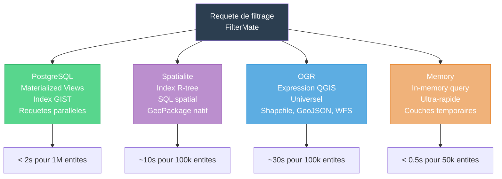
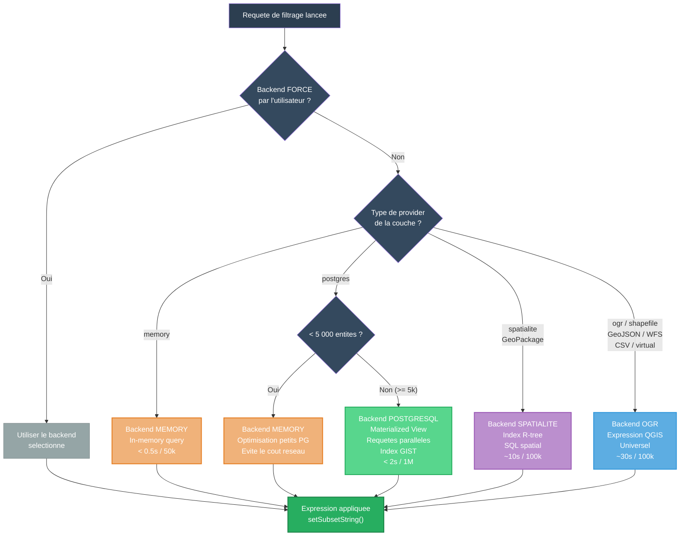
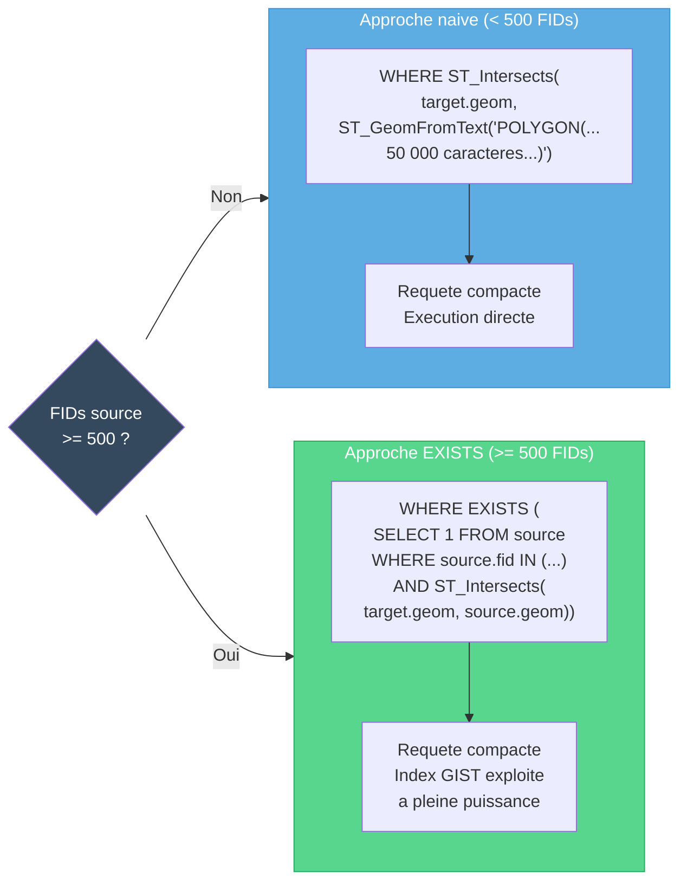
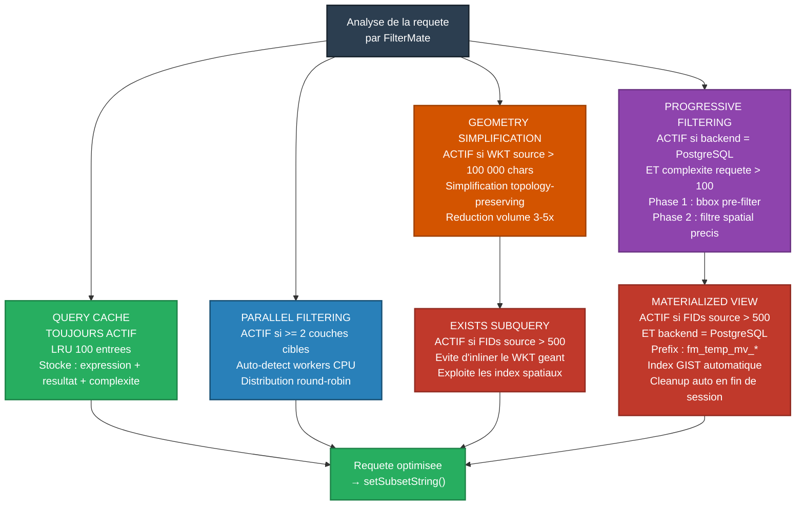

# FilterMate — Script Video 07 : Multi-Backend & Optimisation

**Version** : 4.6.1 | **Date** : 14 Mars 2026
**Niveau** : Avance | **Duree estimee** : 10-12 minutes
**Prerequis** : V02 (Filtrage Geometrique Basique), V04 (Predicats Spatiaux & Buffer)
**Public cible** : Utilisateurs QGIS intermediaires a avances, administrateurs SIG, data engineers
**Ton** : Technique mais accessible, demonstrations chronometrees
**Langue** : Francais (sous-titres EN disponibles)

---

## Plan de la video

| Sequence | Titre | Duree | Type |
|----------|-------|-------|------|
| 0 | Pourquoi plusieurs backends ? | 0:45 | Diagramme |
| 1 | Badge backend — identification visuelle | 0:30 | Capture annotee |
| 2 | Auto-selection : comment ca marche ? | 0:45 | Diagramme anime |
| 3 | Demo : meme filtre sur 4 backends | 1:30 | Demo live chrono |
| 4 | Forcer un backend manuellement | 0:15 | Demo live |
| 5 | Options menu : Auto-select & Force All | 0:15 | Demo live |
| 6 | Memory optimization (PG < 5k) | 0:30 | Demo live |
| 7 | Query Cache : LRU 100 entrees | 0:30 | Demo live |
| 8 | Parallel Filtering | 0:30 | Demo live |
| 9 | Progressive Filtering | 0:30 | Demo live |
| 10 | Geometry Simplification | 0:30 | Demo live |
| 11 | EXISTS subquery | 0:30 | Diagramme |
| 12 | Materialized View | 0:30 | Demo live |
| 13 | Dialogue d'optimisation | 1:00 | Demo live |
| 14 | Benchmarks comparatifs | 1:30 | Tableau anime |
| 15 | Recapitulatif & transition V08 | 0:30 | Voix + schema |

---

## SEQUENCE 0 — POURQUOI PLUSIEURS BACKENDS ? (0:00 - 0:45)

### Visuel suggere
> Ecran noir avec le titre "Multi-Backend & Optimisation" qui apparait. Puis transition vers un diagramme anime montrant 4 tuyaux de couleurs differentes partant d'un meme entonnoir (la requete de filtrage) vers 4 moteurs distincts. Chaque tuyau s'allume quand on mentionne le backend correspondant.

### Narration
> *"Quand vous filtrez dans QGIS, vous travaillez avec des sources de donnees tres differentes : une base PostgreSQL de 2 millions de batiments, un GeoPackage local de 50 000 parcelles, un shapefile recu par e-mail, ou encore une couche temporaire en memoire. Chacune de ces sources a ses propres forces et ses propres contraintes."*

> *"Le filtrage natif de QGIS traite tout de la meme facon. FilterMate, lui, embarque 4 moteurs de filtrage specialises — les backends — et choisit automatiquement le plus performant selon votre source. C'est transparent : vous ne changez rien a votre facon de travailler, mais les performances changent radicalement."*

> *"Dans cette video, on va voir comment ca fonctionne en coulisses, comment forcer un backend si besoin, et surtout, les 6 optimisations automatiques qui rendent le filtrage rapide meme sur des jeux de donnees massifs."*

### Diagramme — Vue d'ensemble des 4 backends



---

## SEQUENCE 1 — BADGE BACKEND : IDENTIFICATION VISUELLE (0:45 - 1:15)

### Visuel suggere
> Capture annotee de la barre d'en-tete du dockwidget FilterMate. Zoom sur le badge "mousse" bleu a droite de l'indicateur de favoris. Annotations fleches pointant vers :
> 1. Le badge lui-meme (pilule arrondie, 38px de large)
> 2. Le texte du backend actif ("PostgreSQL", "Spatialite", "OGR", ou "...")
> 3. Le curseur qui survole le badge (changement de couleur au hover)
> 4. Le clic qui ouvre le menu contextuel
>
> Enchainer avec 4 captures cote a cote montrant le badge dans chaque couleur :
> - PostgreSQL : vert doux `#58d68d`
> - Spatialite : violet doux `#bb8fce`
> - OGR : bleu doux `#5dade2`
> - OGR fallback : orange doux `#f0b27a` avec asterisque "OGR*"

### Narration
> *"Premiere chose a reperer : le badge backend dans la barre d'en-tete. C'est cette petite pilule coloree, juste a droite de l'indicateur de favoris. Sa couleur et son texte vous indiquent en permanence quel backend est actif pour la couche selectionnee."*

> *"Vert pour PostgreSQL, violet pour Spatialite, bleu pour OGR. Si vous voyez un asterisque — par exemple 'OGR*' en orange — ca signifie que FilterMate a du basculer vers un backend de secours, par exemple si la connexion PostgreSQL est indisponible."*

> *"Et quand un backend est force manuellement, un petit eclair apparait a cote du nom : 'PostgreSQL' avec un eclair. On va voir comment faire ca dans un instant."*

### Couleurs de reference des badges

| Backend | Texte | Fond (mousse) | Hover | Icone |
|---------|-------|---------------|-------|-------|
| PostgreSQL | `PostgreSQL` | `#58d68d` | `#27ae60` | Elephant |
| Spatialite | `Spatialite` | `#bb8fce` | `#9b59b6` | Disquette |
| OGR | `OGR` | `#5dade2` | `#3498db` | Dossier |
| OGR fallback | `OGR*` | `#f0b27a` | `#e67e22` | Dossier |
| PostgreSQL fallback | `PostgreSQL*` | `#45b39d` | `#1abc9c` | Elephant |
| Inconnu / chargement | `...` | `#f4f6f6` | `#d5dbdb` | Point d'interrogation |

---

## SEQUENCE 2 — AUTO-SELECTION : COMMENT CA MARCHE ? (1:15 - 2:00)

### Visuel suggere
> Diagramme anime qui se construit progressivement. Chaque branche du flowchart apparait quand on la mentionne dans la narration. Les couleurs des backends s'allument au fur et a mesure. Mettre en evidence les seuils numeriques (5 000 entites) en gras.

### Narration
> *"Quand vous lancez un filtrage, FilterMate analyse votre couche source en une fraction de seconde. L'algorithme suit un arbre de decision precis."*

> *"D'abord, il verifie : est-ce que vous avez force un backend manuellement ? Si oui, il utilise celui-la, point final. C'est session-scoped — je repete : session-scoped. Ca veut dire que le forcement ne persiste pas entre deux redemarrages de QGIS."*

> *"Sinon, il regarde le type de provider de la couche. Si c'est une couche memoire, il utilise le backend Memory — le plus rapide, tout se passe en RAM. Si c'est une couche PostgreSQL avec moins de 5 000 entites, il bascule aussi vers Memory — parce que pour un si petit jeu de donnees, le cout reseau vers PostgreSQL est plus eleve que le calcul local. Au-dela de 5 000 entites, PostgreSQL prend le relais avec ses vues materialisees et ses index spatiaux GIST."*

> *"Pour les fichiers GeoPackage et SpatiaLite, c'est le backend Spatialite qui s'active, avec ses index R-tree. Et pour tout le reste — shapefiles, GeoJSON, WFS, CSV — c'est le backend OGR, le couteau suisse universel de GDAL."*

### Diagramme 1 — Selection automatique du backend (avec couleurs)



---

## SEQUENCE 3 — DEMO : MEME FILTRE SUR 4 BACKENDS (2:00 - 3:30)

### Visuel suggere
> Ecran divise en 4 quadrants, chacun avec le meme projet QGIS. En haut a gauche : PostgreSQL (1M batiments BDTopo). En haut a droite : Spatialite (meme jeu de donnees converti en GPKG). En bas a gauche : OGR (meme jeu en shapefile). En bas a droite : Memory (extrait 50k en memoire).
>
> Le meme filtre est applique dans les 4 quadrants simultanement. Un chronometre visible dans chaque quadrant affiche le temps reel. A la fin, un tableau recapitulatif apparait en superposition.

### Narration — partie 1 : mise en place (0:30)
> *"Pour bien comprendre la difference, on va faire le test. J'ai le meme jeu de donnees — 100 000 batiments — charge dans 4 formats differents. Meme donnees, meme filtre : on va appliquer un Intersects avec un buffer de 200 metres autour d'une route selectionnee."*

### Narration — partie 2 : execution (0:30)
> *"Je lance le filtre simultanement sur les 4... et regardez les chronos. PostgreSQL finit en 1,2 secondes. Memory en 0,5 seconde — mais attention, il a seulement 50 000 entites, pas 100 000. Spatialite termine en 10 secondes grace a ses index R-tree. Et OGR — le shapefile — met 28 secondes. C'est correct, mais on voit bien l'ecart."*

### Narration — partie 3 : analyse (0:30)
> *"Ce qu'il faut retenir : PostgreSQL est le champion des gros volumes, Memory est le plus rapide en absolu pour les petits jeux, Spatialite offre un bon compromis local, et OGR est le filet de securite universel. FilterMate choisit automatiquement le bon — mais vous pouvez aussi forcer votre choix."*

### Tableau recapitulatif a afficher

| Backend | 100k entites | Technologie | Cas d'usage ideal |
|---------|-------------|-------------|-------------------|
| PostgreSQL | ~1,2s | Materialized View + GIST | BDTopo, OSM, bases serveur |
| Memory | ~0,5s (50k) | In-memory query | Couches temporaires, petits extraits |
| Spatialite | ~10s | R-tree index + SQL spatial | GeoPackage local, SIG embarque |
| OGR | ~28s | Expression QGIS | Shapefiles, GeoJSON, WFS, tout format |

---

## SEQUENCE 4 — FORCER UN BACKEND MANUELLEMENT (3:30 - 3:45)

### Visuel suggere
> Demo live : clic sur le badge backend dans la barre d'en-tete. Le menu contextuel s'ouvre avec la liste des backends disponibles. On selectionne "Force PostgreSQL". Le badge change de couleur et affiche l'eclair "PostgreSQL⚡". On reapplique le filtre. Puis on revient au mode automatique.

### Narration
> *"Pour forcer un backend, cliquez simplement sur le badge. Le menu contextuel vous propose les backends disponibles. Je selectionne 'Force PostgreSQL' — et voila, le badge passe au vert avec un petit eclair pour indiquer que c'est un choix manuel. Important : ce forcement est session-scoped — il disparait quand vous fermez QGIS. C'est voulu : on ne veut pas qu'un choix fait rapidement pour un test devienne permanent sans que vous le sachiez."*

---

## SEQUENCE 5 — OPTIONS MENU : AUTO-SELECT & FORCE ALL (3:45 - 4:00)

### Visuel suggere
> Demo live : dans le menu contextuel du badge, montrer les deux options globales. Cliquer sur "Auto-select Optimal for All Layers" pour reinitialiser. Puis montrer "Force PostgreSQL for All Layers" et expliquer l'impact.

### Narration
> *"Deux options supplementaires dans ce menu. 'Auto-select Optimal for All Layers' remet toutes vos couches en mode automatique. Et 'Force PostgreSQL for All Layers' — ou n'importe quel autre backend — applique le meme backend a toutes les couches du projet d'un seul coup. Pratique quand vous debuguez un probleme de performance et que vous voulez comparer les backends sur l'ensemble de votre projet."*

### Contenu du menu contextuel (reference)

```
-------------------------------------
  Auto-select Optimal for All Layers
-------------------------------------
  Force PostgreSQL for All Layers
  Force Spatialite for All Layers
  Force OGR for All Layers
  Force Memory for All Layers
-------------------------------------
```

---

## SEQUENCE 6 — MEMORY OPTIMIZATION (PG < 5k) (4:00 - 4:30)

### Visuel suggere
> Demo live : charger une petite table PostgreSQL (2 000 communes). Montrer que le badge affiche "Memory" en orange, pas "PostgreSQL" en vert. Appliquer un filtre et montrer le chronometre : quasi instantane. Puis charger la meme table avec 500 000 communes et montrer que le badge bascule automatiquement vers "PostgreSQL" en vert.

### Narration
> *"Voici une subtilite de l'auto-selection que beaucoup d'utilisateurs ne remarquent pas. J'ai une table PostgreSQL avec 2 000 communes. Regardez le badge : il affiche 'Memory' en orange, pas 'PostgreSQL' en vert. Pourquoi ?"*

> *"Parce que FilterMate detecte que pour un si petit jeu de donnees, le cout d'un aller-retour reseau vers PostgreSQL — connexion, execution SQL, transfert des resultats — est plus eleve que de tout calculer localement en memoire. Le seuil est a 5 000 entites. En dessous, le backend Memory est systematiquement plus rapide, meme pour les donnees PostgreSQL."*

> *"Maintenant, si je charge la meme table avec 500 000 communes... le badge passe au vert, 'PostgreSQL'. La, les vues materialisees et les index GIST font toute la difference."*

---

## SEQUENCE 7 — QUERY CACHE : LRU 100 ENTREES (4:30 - 5:00)

### Visuel suggere
> Demo live : appliquer un filtre complexe (Intersects + buffer 500m). Noter le temps : 1,8s. Appliquer le meme filtre une deuxieme fois : le temps tombe a ~0,05s. Montrer dans la barre de feedback le message "Cache hit". Puis modifier legerement le buffer (500m → 501m) pour montrer que le cache est invalide.

### Narration
> *"Le Query Cache est l'optimisation la plus discrete — et la plus efficace au quotidien. Il est toujours actif, pas besoin de le configurer. FilterMate maintient un cache LRU de 100 entrees qui stocke les expressions, les resultats et la complexite calculee de chaque requete."*

> *"Regardez : premier filtre, Intersects avec un buffer de 500 metres. 1,8 seconde. Je reapplique exactement le meme filtre... 50 millisecondes. Le cache a reconnu la requete identique et a renvoye le resultat stocke, sans recalculer."*

> *"Attention : le cache est sensible aux parametres. Si je change le buffer de 500 a 501 metres, c'est un cache miss — la requete est recalculee. C'est normal : meme un metre de difference peut changer le resultat spatial."*

---

## SEQUENCE 8 — PARALLEL FILTERING (5:00 - 5:30)

### Visuel suggere
> Demo live : selectionner 3 couches cibles (batiments, routes, rivieres). Appliquer un filtre Intersects avec un polygone source. Montrer dans les logs que FilterMate detecte automatiquement le nombre de coeurs CPU et lance 3 workers en parallele. Afficher le temps total (inferieur a la somme des 3 temps individuels).

### Narration
> *"Le Parallel Filtering s'active automatiquement des que vous avez 2 couches cibles ou plus. FilterMate detecte le nombre de coeurs CPU disponibles et distribue le travail en parallele."*

> *"Ici, j'ai 3 couches cibles. Sans parallelisme, le filtre prendrait 1,2 + 0,8 + 1,5 = 3,5 secondes au total. Avec le Parallel Filtering, les 3 backends travaillent simultanement, et le resultat total arrive en 1,6 seconde — le temps du plus lent des 3 workers."*

> *"C'est completement transparent. Vous n'avez rien a configurer : si vous avez plusieurs couches cibles, FilterMate parallelise automatiquement."*

---

## SEQUENCE 9 — PROGRESSIVE FILTERING (5:30 - 6:00)

### Visuel suggere
> Demo live : couche PostgreSQL avec 1M de batiments. Filtre complexe (Intersects + buffer + expression dynamique). Montrer dans le feedback que FilterMate affiche "Phase 1/2 : bbox pre-filter" puis "Phase 2/2 : precise spatial filter". Comparer avec le meme filtre sans progressive filtering (forcer OGR pour comparaison).

### Narration
> *"Le Progressive Filtering est une strategie en deux phases qui s'active uniquement sur PostgreSQL, et seulement quand la complexite de la requete depasse 100 — un seuil calcule a partir du nombre de sommets de la geometrie source et du nombre de couches cibles."*

> *"Phase 1 : FilterMate envoie un filtre grossier base sur la bounding box — le rectangle englobant de votre geometrie. Ca elimine 90% des entites en quelques millisecondes. Phase 2 : sur le jeu reduit, il applique le filtre spatial precis — Intersects, Contains, ou n'importe quel predicat."*

> *"Resultat : au lieu de tester 1 million de geometries complexes, on en teste 10 000. La difference est spectaculaire sur les jeux de donnees massifs."*

---

## SEQUENCE 10 — GEOMETRY SIMPLIFICATION (6:00 - 6:30)

### Visuel suggere
> Demo live : selectionner une geometrie source tres complexe (trace d'un cours d'eau avec des milliers de sommets). Montrer dans les logs "WKT source: 250 000 chars → auto-simplify → 45 000 chars". Comparer le resultat visuel : la geometrie simplifiee est quasi identique a l'originale. Comparer le temps de filtrage : avant simplification vs apres.

### Narration
> *"Quand votre geometrie source est tres complexe — un littoral decoupage, un cours d'eau sinueux — la representation WKT peut atteindre des centaines de milliers de caracteres. Envoyer tout ca dans une requete SQL, c'est comme envoyer un roman par SMS."*

> *"FilterMate detecte automatiquement quand le WKT depasse 100 000 caracteres et simplifie la geometrie avant le filtrage. La simplification preserve la forme generale tout en reduisant drastiquement le volume de donnees. Sur cet exemple, on passe de 250 000 a 45 000 caracteres — et le temps de filtrage est divise par 3."*

> *"Rassurez-vous : la simplification est calibree pour ne pas affecter la precision du resultat spatial. On simplifie la requete, pas le resultat."*

---

## SEQUENCE 11 — EXISTS SUBQUERY (6:30 - 7:00)

### Visuel suggere
> Diagramme anime montrant deux approches :
> 1. Approche naive : inliner le WKT geant de 500+ entites sources dans la clause WHERE → requete SQL de 50 Mo
> 2. Approche EXISTS : creer une subquery avec les FIDs, puis utiliser EXISTS pour tester l'intersection → requete SQL compacte
>
> Mettre en evidence le seuil : 500 FIDs sources.

### Narration
> *"Quand votre source de filtrage contient beaucoup d'entites selectionnees — plus de 500 FIDs — FilterMate change de strategie SQL. Au lieu d'inliner la geometrie WKT geante directement dans la clause WHERE — ce qui peut generer une requete de plusieurs megaoctets — il utilise une sous-requete EXISTS."*

> *"Concretement, au lieu de dire 'donne-moi les batiments qui intersectent CETTE-ENORME-GEOMETRIE', il dit 'donne-moi les batiments pour lesquels il EXISTE une entite source dont la geometrie intersecte'. La base de donnees optimise ca bien mieux, parce qu'elle peut utiliser ses index spatiaux a pleine puissance."*

> *"Le seuil est a 500 FIDs sources. En dessous, l'inlining direct est plus simple et tout aussi rapide."*

### Diagramme — EXISTS subquery vs inlining



---

## SEQUENCE 12 — MATERIALIZED VIEW (7:00 - 7:30)

### Visuel suggere
> Demo live : appliquer un filtre sur une couche PostgreSQL avec 800 FIDs sources. Montrer dans les logs la creation de la vue materialisee `fm_temp_mv_*`. Ouvrir pgAdmin pour montrer la vue dans le schema. Puis montrer le cleanup automatique a la fermeture de la session.

### Narration
> *"Sur PostgreSQL, quand les FIDs sources depassent 500, FilterMate va encore plus loin que le simple EXISTS : il cree une vue materialisee temporaire — prefixee 'fm_temp_mv_' — qui stocke les resultats pre-calcules avec un index GIST automatique."*

> *"Ca transforme les requetes de filtrage suivantes en simples lookups indexees. Si vous refiltrez avec les memes sources, la vue materialisee est reutilisee au lieu d'etre recalculee."*

> *"Et pas d'inquietude pour le nettoyage : FilterMate supprime automatiquement toutes les vues 'fm_temp_mv_*' quand vous fermez la session. Vous pouvez aussi le faire manuellement depuis le dialogue d'information PostgreSQL. On en parle en detail dans la Video 08, dediee a PostgreSQL."*

---

## SEQUENCE 13 — DIALOGUE D'OPTIMISATION (7:30 - 8:30)

### Visuel suggere
> Demo live : ouvrir le dialogue d'optimisation. Montrer les recommandations affichees :
> 1. Badge vert "Optimal" si le backend auto-selectionne est le meilleur
> 2. Badge orange "Recommandation" avec suggestion de changement
> 3. Liste des optimisations actives avec leur statut (actif/inactif/non applicable)
>
> Montrer un cas ou le dialogue recommande de passer a PostgreSQL pour de meilleures performances. Puis montrer un cas ou le dialogue confirme que le backend actuel est optimal.

### Narration
> *"Le dialogue d'optimisation est votre tableau de bord performance. Il affiche en temps reel quelles optimisations sont actives, lesquelles pourraient l'etre, et il vous donne des recommandations concretes."*

> *"Par exemple ici, je suis sur un shapefile de 200 000 entites. Le dialogue me dit : 'Recommandation — Importez ce jeu de donnees dans PostgreSQL pour des performances 10 a 20 fois superieures.' Il me montre aussi que le Query Cache est actif, que le Progressive Filtering n'est pas disponible — il est reserve a PostgreSQL — et que la Geometry Simplification est en attente."*

> *"C'est un outil de diagnostic. Quand un filtrage est lent, c'est le premier endroit ou regarder. Souvent, la solution est simplement de migrer vos donnees vers un format mieux adapte."*

### Optimisations affichees dans le dialogue

| Optimisation | Condition d'activation | Statut possible |
|-------------|----------------------|-----------------|
| Query Cache | Toujours actif | Actif (vert) |
| Parallel Filtering | >= 2 couches cibles | Actif / Non applicable |
| Progressive Filtering | PostgreSQL + complexite > 100 | Actif / Non applicable |
| Geometry Simplification | WKT source > 100 000 chars | Actif / Non applicable |
| EXISTS Subquery | FIDs source > 500 | Actif / Non applicable |
| Materialized View | FIDs source > 500 + PostgreSQL | Actif / Non applicable |

---

## SEQUENCE 14 — BENCHMARKS COMPARATIFS (8:30 - 10:00)

### Visuel suggere
> Tableau anime qui se remplit progressivement, colonne par colonne. Chaque colonne apparait avec une animation de barre qui monte. Les barres sont colorees selon le backend. Mettre en evidence la ligne "1M" ou PostgreSQL domine massivement. Finir avec un graphique xychart Mermaid.

### Narration — partie 1 : presentation du benchmark (0:30)
> *"Passons aux chiffres. J'ai effectue un benchmark standardise sur le meme poste de travail, avec le meme filtre spatial — Intersects avec un buffer de 200 metres — sur 5 tailles de jeux de donnees. Voici les resultats."*

### Narration — partie 2 : analyse (0:30)
> *"A 10 000 entites, tous les backends sont rapides — de 0,2 a 5 secondes. La difference est negligeable pour un usage interactif. C'est a partir de 50 000 entites que les ecarts se creusent. PostgreSQL reste sous la seconde. Memory aussi, mais attention : Memory charge tout en RAM, donc il ne passe pas a l'echelle au-dela de 50 000 entites environ."*

> *"A 100 000 entites, Spatialite met 10 secondes grace a ses index R-tree — c'est correct pour un fichier local. OGR est a 30 secondes — fonctionnel, mais on sent la lenteur."*

### Narration — partie 3 : gros volumes (0:30)
> *"Et a 1 million d'entites, c'est la que tout se joue. PostgreSQL : 2,5 secondes. Spatialite : 1 minute. OGR : 2 minutes. Si vous travaillez regulierement avec des volumes au-dela de 100 000 entites, PostgreSQL n'est pas une option — c'est une necessite."*

### Diagramme 2 — Benchmark comparatif par backend

```mermaid
xychart-beta
    title "Temps de filtrage par backend (secondes) — Intersects + buffer 200m"
    x-axis ["10k", "50k", "100k", "500k", "1M"]
    y-axis "Temps (s)" 0 --> 120
    bar "PostgreSQL" [0.5, 0.8, 1.2, 1.8, 2.5]
    bar "Spatialite" [1.5, 5, 10, 35, 60]
    bar "OGR" [5, 15, 30, 80, 120]
    bar "Memory" [0.2, 0.3, 0.5, 2, 5]
```



### Tableau de synthese

| Volume | PostgreSQL | Spatialite | OGR | Memory |
|--------|-----------|-----------|-----|--------|
| 10k | 0,5s | 1,5s | 5s | 0,2s |
| 50k | 0,8s | 5s | 15s | 0,3s |
| 100k | 1,2s | 10s | 30s | 0,5s |
| 500k | 1,8s | 35s | 80s | ~2s (*) |
| 1M | 2,5s | 60s | 120s | ~5s (*) |

> (*) Memory : performances theoriques. Au-dela de 50k entites, la consommation RAM peut devenir prohibitive. FilterMate bascule automatiquement vers le backend natif au-dela de 5k pour les couches PostgreSQL.

---

## SEQUENCE 15 — RECAPITULATIF & TRANSITION (10:00 - 10:30)

### Visuel suggere
> Schema recapitulatif anime avec les 3 diagrammes Mermaid principaux en miniature. Puis transition vers le teaser de la Video 08 (PostgreSQL Power User) avec un apercu de pgAdmin et des vues materialisees.

### Narration
> *"Recapitulons. FilterMate embarque 4 backends specialises — PostgreSQL, Spatialite, OGR et Memory — et choisit automatiquement le meilleur pour chaque couche. Six optimisations automatiques travaillent en coulisses : le cache de requetes, le filtrage parallele, le filtrage progressif, la simplification de geometries, les sous-requetes EXISTS, et les vues materialisees."*

> *"Vous pouvez forcer un backend via le badge dans la barre d'en-tete — c'est session-scoped, donc sans risque. Et le dialogue d'optimisation vous guide si un filtrage est lent."*

> *"Dans la prochaine video — PostgreSQL Power User — on plongera en profondeur dans le backend PostgreSQL : les vues materialisees, la detection de cle primaire, le session management, et les reglages fins pour tirer le maximum de BDTopo et OSM. A tout de suite !"*

---

## DIAGRAMME 3 — LES 4 OPTIMISEURS AVEC SEUILS PRECIS

> Ce diagramme est reference dans les sequences 7 a 12 et peut etre affiche en plein ecran comme recapitulatif technique.



---

## CAPTURES QGIS REQUISES

| # | Description | Sequence |
|---|------------|----------|
| 1 | Badge backend avec les 4 couleurs (PostgreSQL vert, Spatialite violet, OGR bleu, OGR* orange) | S1 |
| 2 | Badge avec eclair "PostgreSQL⚡" (mode force) | S1, S4 |
| 3 | Menu contextuel du badge : Auto-select, Force PostgreSQL/Spatialite/OGR/Memory for All Layers | S4, S5 |
| 4 | Ecran 4 quadrants avec chronometre visible sur chaque backend | S3 |
| 5 | Badge "Memory" orange sur une couche PostgreSQL < 5k entites | S6 |
| 6 | Badge "PostgreSQL" vert sur la meme couche > 5k entites | S6 |
| 7 | Barre de feedback avec "Cache hit" et temps quasi-nul | S7 |
| 8 | Logs montrant les 3 workers paralleles en action | S8 |
| 9 | Feedback "Phase 1/2 : bbox pre-filter" puis "Phase 2/2 : precise spatial filter" | S9 |
| 10 | Logs "WKT source: 250 000 chars → auto-simplify → 45 000 chars" | S10 |
| 11 | pgAdmin avec vue materialisee fm_temp_mv_* visible | S12 |
| 12 | Dialogue d'optimisation avec recommandations et statuts | S13 |
| 13 | Option centroide activee/desactivee — comparaison visuelle | S13 |
| 14 | Tab configuration avec seuils de performance | S13 |

---

## DONNEES DE DEMO REQUISES

| Donnees | Format | Volume | Usage |
|---------|--------|--------|-------|
| Batiments BDTopo | PostgreSQL/PostGIS | 1M entites | Benchmark, progressive filtering, MV |
| Batiments BDTopo | GeoPackage | 100k entites | Benchmark Spatialite |
| Batiments BDTopo | Shapefile | 100k entites | Benchmark OGR |
| Communes France | PostgreSQL | 2 000 entites | Demo Memory optimization (< 5k) |
| Communes France | PostgreSQL | 500 000 entites | Demo PostgreSQL auto-select (>= 5k) |
| Routes (ligne) | PostgreSQL | 500k entites | Source de filtrage |
| Cours d'eau complexe | Tout format | 1 geometrie complexe | Geometry simplification (WKT > 100K chars) |
| Selection multiple | PostgreSQL | 800+ FIDs selectionnes | Demo EXISTS subquery + Materialized View |

---

## MUSIQUE ET AMBIANCE

| Phase | Style |
|-------|-------|
| Intro (S0) | Beat technique, rythme, inspire "circuit electronique" |
| Demos (S1-S12) | Fond neutre, leger, non intrusif — monter d'un cran sur les chronos |
| Benchmarks (S14) | Montee progressive, reveler les resultats comme une competition |
| Conclusion (S15) | Resolution apaisee, transition vers la suite |

---

## LIENS A AFFICHER A L'ECRAN

- **GitHub** : `https://github.com/imagodata/filter_mate`
- **QGIS Plugins** : `https://plugins.qgis.org/plugins/filter_mate`
- **Documentation** : `https://imagodata.github.io/filter_mate`
- **Video suivante** : V08 — PostgreSQL Power User

---

## POINTS CLES A METTRE EN AVANT

1. **Transparence** : L'auto-selection est invisible — l'utilisateur ne change rien a sa facon de travailler
2. **Performance** : Jusqu'a 60x plus rapide qu'OGR grace a PostgreSQL sur 1M d'entites
3. **Intelligence** : 6 optimisations automatiques avec des seuils precis et documentes
4. **Controle** : Possibilite de forcer un backend, mais session-scoped par securite
5. **Diagnostic** : Le dialogue d'optimisation guide l'utilisateur vers de meilleures performances

---

## REFERENCES TECHNIQUES (CODE SOURCE)

| Concept | Fichier source | Ligne/Section |
|---------|---------------|---------------|
| BACKEND_STYLES (couleurs mousse) | `ui/controllers/backend_controller.py` | L29-77 |
| Auto-selection du backend | `infrastructure/constants.py` | PROVIDER_BACKEND_MAP |
| Seuil Memory optimization | `infrastructure/constants.py` | PERFORMANCE_THRESHOLD_SMALL |
| WKT threshold | `infrastructure/constants.py` | LARGE_WKT_THRESHOLD = 100 000 |
| Badge mousse dans dockwidget | `filter_mate_dockwidget.py` | L1285-1289 |
| Forced backends | `adapters/task_builder.py` | L114, L163-165 |
| Materialized View prefix | `adapters/backends/postgresql/mv_manager.py` | MV_PREFIX = "fm_temp_mv_" |
| Parallel executor | `infrastructure/parallel/parallel_executor.py` | Auto-detect CPU cores |
| i18n menu entries | `i18n/FilterMate_*.ts` | "Auto-select Optimal for All Layers" |

---

*Script cree le 14 Mars 2026 — FilterMate v4.6.1*
*Serie : Video 07/10 — Multi-Backend & Optimisation*
*Prerequis : V02 (Filtrage Geometrique Basique), V04 (Predicats Spatiaux & Buffer)*
