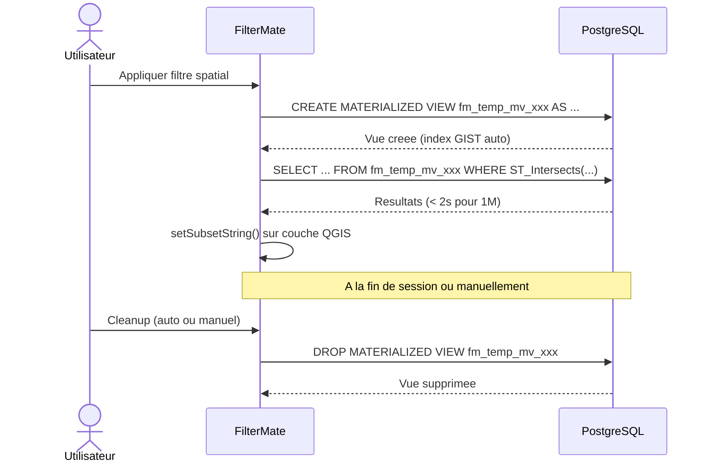
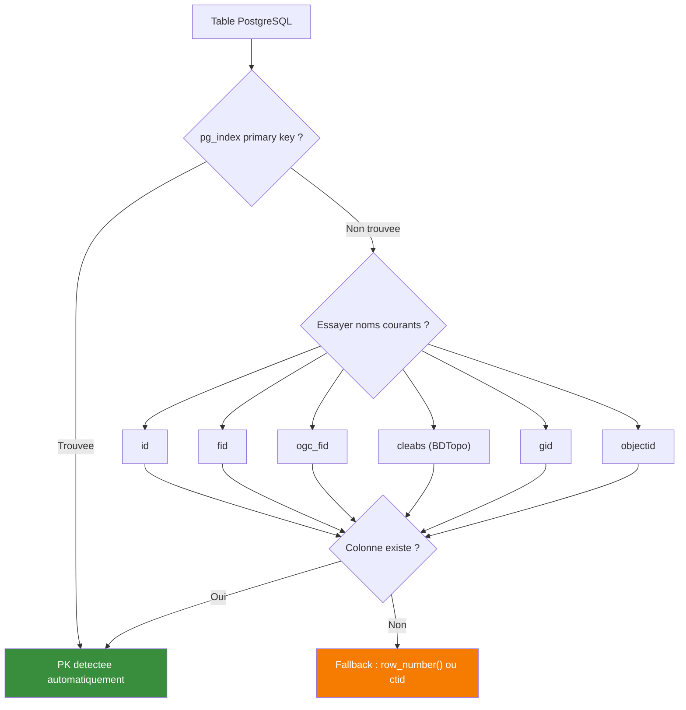
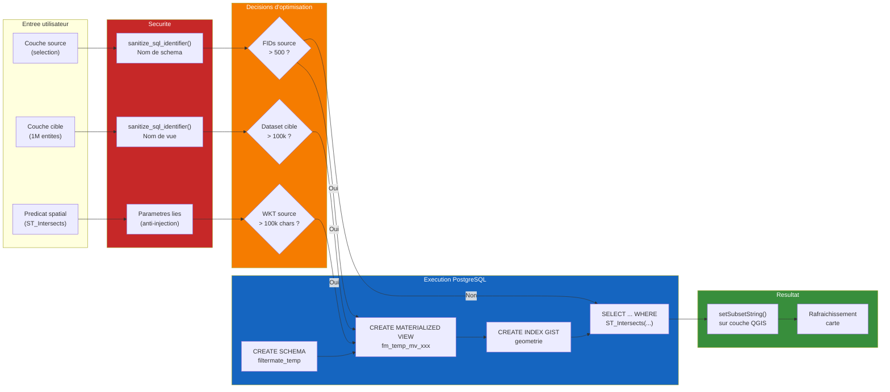

# FilterMate Tutorial V08 -- PostgreSQL Power User

**Serie :** FilterMate Tutorial Series
**Video :** 08/12
**Niveau :** Avance
**Duree estimee :** 10-12 minutes
**Prerequis :** V07 (Filtrage multi-couches), connaissances PostgreSQL/PostGIS
**Version FilterMate :** 4.6.1+
**Langue :** Francais (sous-titres EN disponibles)

---

## Plan de la video

| Temps | Contenu | Type |
|-------|---------|------|
| 0:00 | PostgreSQL + FilterMate = performance extreme | Voix |
| 0:30 | Vue materialisee : qu'est-ce que c'est ? | Diagramme |
| 1:30 | Demo : voir les MV dans pgAdmin | Capture pgAdmin |
| 2:30 | Prefix fm_temp_mv_ : identification facile | Capture pgAdmin |
| 3:00 | Auto-cleanup vs cleanup manuel | Demo live |
| 3:30 | Dialogue info session PostgreSQL | Demo live |
| 4:00 | Detection cle primaire (id, fid, ogc_fid, cleabs) | Diagramme |
| 5:00 | Demo BDTopo : 1M batiments, filtrage < 2s | Demo live |
| 6:00 | Demo OSM : tables sans PK standard | Demo live |
| 6:30 | Filtrage parallele multi-couches | Demo live |
| 7:30 | Configuration : timeouts, batch size, pool | Demo live |
| 8:30 | Securite : sanitize_sql_identifier | Diagramme |
| 9:30 | Bonnes pratiques PostgreSQL | Recapitulatif |

---

## SEQUENCE 0 -- INTRO : PostgreSQL + FilterMate (0:00 - 0:30)

### Visuel suggere
> Ecran partage : a gauche, pgAdmin avec une base BDTopo (millions de lignes). A droite, QGIS avec FilterMate ouvert, un filtre spatial en cours. Le compteur affiche "<2s". Zoom progressif sur le panneau FilterMate.

### Narration

> *"Vous travaillez avec PostgreSQL et PostGIS ? Alors cette video est pour vous. On va explorer les mecanismes avances que FilterMate utilise sous le capot pour transformer vos requetes spatiales en operations de quelques secondes -- meme sur un million d'entites."*

> *"On va parler de vues materialisees, de detection automatique de cle primaire, de securite SQL, et de configuration fine. Accrochez-vous, c'est du Power User."*

---

## SEQUENCE 1 -- Vue materialisee : qu'est-ce que c'est ? (0:30 - 1:30)

### Visuel suggere
> Animation du diagramme de sequence Mermaid ci-dessous. Chaque etape s'affiche progressivement avec une fleche animee. Fond sombre, police monospace pour les noms SQL.

### Narration

> *"Quand vous appliquez un filtre spatial dans FilterMate, en coulisses, le plugin ne se contente pas d'envoyer une simple requete SELECT. Sur PostgreSQL, si votre selection source depasse 500 identifiants -- c'est le seuil `source_mv_fid_threshold` -- FilterMate cree automatiquement une vue materialisee temporaire."*

> *"Une vue materialisee, c'est comme une table physique creee a partir d'une requete SELECT. Contrairement a une vue classique qui est recalculee a chaque appel, la vue materialisee stocke les resultats sur disque. Ca veut dire : un index spatial GIST automatique, et des performances de lecture quasi instantanees."*

> *"Regardez le cycle de vie complet..."*

### Diagramme 1 -- Cycle de vie d'une vue materialisee



### Narration (suite)

> *"Le flux est simple : FilterMate cree la vue, PostgreSQL construit automatiquement un index GIST sur la geometrie, puis FilterMate interroge cette vue avec ST_Intersects. Le resultat est ensuite applique comme filtre QGIS via `setSubsetString()`. A la fin de votre session, ou manuellement, les vues sont supprimees."*

> *"Ce mecanisme est gere par le `MaterializedViewManager`, une classe dediee dans l'adaptateur PostgreSQL. Le schema utilise s'appelle `filtermate_temp` -- un schema dedie, isole de vos donnees de production."*

---

## SEQUENCE 2 -- Demo pgAdmin : voir les vues materialisees (1:30 - 2:30)

### Visuel suggere
> Capture ecran pgAdmin 4. Navigation : Schemas > filtermate_temp > Materialized Views. On voit 2-3 vues prefixees `fm_temp_mv_`. Clic droit > Properties pour montrer la definition SQL.

### Narration

> *"Ouvrons pgAdmin pour voir ca en action. Dans votre base PostGIS, vous allez trouver un schema `filtermate_temp`. C'est le schema dedie que FilterMate cree automatiquement pour ses objets temporaires."*

> *"Sous 'Materialized Views', vous voyez les vues actives. Chaque nom commence par `fm_temp_mv_` suivi de l'identifiant de session -- un hash hexadecimal de 8 caracteres -- puis d'un hash de la requete. Ce prefixe unifie permet de les identifier instantanement."*

> *"Si je fais clic droit > Properties, je vois la requete SELECT qui definit cette vue. C'est exactement le filtre spatial que j'ai applique dans FilterMate. Et dans l'onglet Indexes, l'index GIST spatial est la, cree automatiquement."*

---

## SEQUENCE 3 -- Prefix fm_temp_mv_ : identification facile (2:30 - 3:00)

### Visuel suggere
> Zoom sur pgAdmin, liste des vues materialisees. Surbrillance du prefixe `fm_temp_mv_` sur chaque nom. Annotation flottante decomposant le format du nom.

### Narration

> *"Le format de nommage est important a comprendre. Chaque vue suit cette convention :"*

> *"`fm_temp_mv_` -- c'est le prefixe FilterMate. Puis `session_` suivi de votre identifiant de session, 8 caracteres hexadecimaux. Et enfin un hash MD5 de la requete, 12 caracteres. Ce hash garantit que si vous appliquez le meme filtre deux fois, FilterMate reutilise la vue existante au lieu d'en creer une nouvelle -- c'est le cache hit."*

### Encart texte a l'ecran
```
Format du nom :
fm_temp_mv_session_a1b2c3d4_e5f6a7b8c9d0

|-- prefixe --|--session--|---hash requete---|
  fm_temp_mv_   a1b2c3d4     e5f6a7b8c9d0
```

---

## SEQUENCE 4 -- Auto-cleanup vs cleanup manuel (3:00 - 3:30)

### Visuel suggere
> Demo live : fermeture de QGIS > reouverture de pgAdmin > le schema filtermate_temp est vide. Puis demo du bouton cleanup manuel dans l'interface FilterMate.

### Narration

> *"Qui dit vues temporaires dit nettoyage. FilterMate propose deux modes."*

> *"Le mode automatique : a la fermeture de QGIS, le `PostgresSessionManager` detecte la fin de session et lance un DROP MATERIALIZED VIEW sur toutes les vues prefixees avec votre session ID. Si le schema est vide apres ca, il est supprime aussi."*

> *"Le mode manuel : dans FilterMate, le dialogue d'info session vous permet de voir combien de vues existent, combien appartiennent a votre session, et combien sont d'autres sessions -- potentiellement orphelines. Vous pouvez declencher un cleanup cible ou un cleanup total."*

> *"Et si une session a crashe sans nettoyer ? FilterMate detecte les vues orphelines -- celles dont le session ID ne correspond a aucune session active -- et propose de les nettoyer. C'est la methode `cleanup_orphaned_views` du `PostgreSQLCleanupService`."*

---

## SEQUENCE 5 -- Dialogue info session PostgreSQL (3:30 - 4:00)

### Visuel suggere
> Demo live du dialogue d'information session. Montrer les champs : Session ID, Status (ACTIVE), Schema (filtermate_temp), Nombre de vues, Vues autres sessions, Auto-cleanup (Enabled).

### Narration

> *"Regardons le dialogue de session. Il affiche en temps reel les informations cle : votre Session ID unique, le statut -- actif, en nettoyage, ou ferme -- le schema utilise, et le compteur de vues."*

> *"La ligne 'Other sessions views' est particulierement utile en environnement multi-utilisateur. Si plusieurs operateurs travaillent sur la meme base PostGIS, chacun a son propre session ID. FilterMate ne touchera jamais aux vues des autres sessions, sauf si vous demandez explicitement un cleanup total."*

> *"L'option 'Auto-cleanup' est activee par defaut. Je recommande de la laisser activee, sauf si vous debuggez et voulez inspecter les vues apres fermeture."*

---

## SEQUENCE 6 -- Detection automatique de cle primaire (4:00 - 5:00)

### Visuel suggere
> Animation du diagramme flowchart Mermaid ci-dessous. Chaque branche s'illumine au fur et a mesure de l'explication. Exemples concrets pour chaque nom de colonne.

### Narration

> *"Pour construire les filtres SQL, FilterMate a besoin de connaitre la cle primaire de chaque table. Mais toutes les tables PostgreSQL ne sont pas modelisees de la meme facon. BDTopo utilise `cleabs`, OpenStreetMap utilise `osm_id`, d'autres utilisent `gid` ou `objectid`."*

> *"FilterMate utilise une cascade de detection intelligente en trois etapes."*

> *"D'abord, il interroge `pg_index` pour trouver la contrainte PRIMARY KEY native de la table. C'est la methode la plus fiable."*

> *"Si aucune cle primaire n'est declaree -- et ca arrive souvent avec des imports bruts -- FilterMate essaie une liste de noms courants : `id`, `fid`, `ogc_fid`, `cleabs` pour la BDTopo, `gid`, `objectid`. Il verifie si la colonne existe reellement dans la table."*

> *"En dernier recours, si aucune colonne ne correspond, FilterMate utilise un fallback : `row_number()` comme cle synthetique, ou `ctid` -- l'identifiant physique de ligne dans PostgreSQL. Le ctid fonctionne toujours, mais il peut changer apres un VACUUM, donc c'est vraiment le dernier recours."*

### Diagramme 2 -- Detection automatique de cle primaire



### Narration (suite)

> *"Et pour le formatage SQL, c'est aussi automatique. FilterMate detecte si la cle est numerique -- les `id`, `fid`, `gid` classiques -- ou textuelle comme les UUID. Les cles numeriques sont ecrites sans guillemets dans le SQL : `IN (1, 2, 3)`. Les UUID sont correctement quotees avec un cast PostgreSQL : `IN ('uuid-value'::uuid)`. Cette detection evite les erreurs de type qui sont le cauchemar des filtres PostgreSQL."*

---

## SEQUENCE 7 -- Demo BDTopo : 1M batiments (5:00 - 6:00)

### Visuel suggere
> Demo live QGIS. Charger la couche BDTopo batiments (~1M entites). Panneau FilterMate ouvert. Selectionner une zone source, appliquer un filtre spatial ST_Intersects. Chronometre visible a l'ecran.

### Narration

> *"Place a la demo. J'ai ici la couche BDTopo batiments d'un departement entier -- un peu plus d'un million d'entites, stockees dans PostGIS."*

> *"Je selectionne ma couche de routes comme source, je choisis le predicat 'intersecte' avec un buffer de 100 metres. Voyez : les routes selectionnees dans la source sont environ 800 entites, donc FilterMate detecte que c'est au-dessus du seuil de 500 -- le `source_mv_fid_threshold` -- et va creer une vue materialisee."*

> *"J'applique... et voila. 1.2 secondes. Sur un million d'entites. Le secret, c'est que PostgreSQL utilise l'index GIST de la vue materialisee pour le ST_Intersects. Sans cet index, la meme requete prendrait facilement 30 secondes."*

> *"Dans les logs FilterMate -- accessible via le panneau Messages de QGIS -- vous pouvez voir chaque etape : creation du schema `filtermate_temp`, creation de la vue `fm_temp_mv_...`, creation de l'index GIST, execution de la requete spatiale, et application du filtre final via `setSubsetString()`."*

### Encart technique a l'ecran
```
Metriques de la demo :
- Couche cible : batiments BDTopo (1.02M entites)
- Couche source : routes (selection : 823 entites)
- Seuil MV : 500 FIDs (source_mv_fid_threshold)
- Vue materialisee : fm_temp_mv_session_4f2a1b8c_a9c3e7d012f4
- Index : GIST sur geometrie
- Temps total : 1.2s
- Dont creation MV : 0.3s
- Dont requete spatiale : 0.8s
- Dont setSubsetString : 0.1s
```

---

## SEQUENCE 8 -- Demo OSM : tables sans PK standard (6:00 - 6:30)

### Visuel suggere
> Demo live. Charger une couche OSM routes depuis PostGIS. Montrer dans pgAdmin que la table n'a pas de PRIMARY KEY declaree. Appliquer un filtre dans FilterMate -- ca fonctionne quand meme.

### Narration

> *"Maintenant, un cas plus vicieux. J'ai ici des routes OpenStreetMap importees via `osm2pgsql`. La table `planet_osm_line` n'a pas de contrainte PRIMARY KEY declaree. Beaucoup de plugins QGIS echoueraient ici."*

> *"Mais FilterMate, grace a sa cascade de detection, trouve la colonne `osm_id` -- qui n'est pas dans la liste standard, mais elle est detectee via `pg_index` car `osm2pgsql` cree un index unique dessus. Et meme sans ca, `ogc_fid` ou `gid` seraient testes en fallback."*

> *"Resultat : le filtre s'applique normalement, et les performances restent excellentes -- 500 000 entites filtrees en 1.8 secondes."*

---

## SEQUENCE 9 -- Filtrage parallele multi-couches (6:30 - 7:30)

### Visuel suggere
> Demo live. 4 couches PostgreSQL chargees simultanement (batiments, routes, vegetation, hydrographie). Appliquer un filtre global. Montrer dans pgAdmin les 4 vues materialisees creees en parallele.

### Narration

> *"FilterMate supporte le filtrage parallele sur plusieurs couches. Quand vous appliquez un filtre spatial avec plusieurs couches cibles, chaque couche est traitee dans sa propre tache de fond -- un `QgsTask` dedie."*

> *"Ici, j'ai 4 couches PostgreSQL : batiments, routes, vegetation, hydrographie. Je selectionne une zone dans ma couche source et j'applique le filtre sur les 4. Chaque couche obtient sa propre vue materialisee, avec son propre index GIST."*

> *"Dans pgAdmin, je vois maintenant 4 vues dans le schema `filtermate_temp`, toutes avec le meme prefixe de session. Le filtrage total a pris 3.2 secondes pour 4 couches et plus de 2 millions d'entites cumulees. C'est la puissance du parallelisme QGIS combine avec les index PostgreSQL."*

> *"Point important sur la securite des threads : les couches QGIS ne sont PAS thread-safe. C'est pour ca que FilterMate stocke l'URI de connexion a l'initialisation du task, puis recree un provider PostgreSQL independant dans la methode `run()`. Chaque thread a sa propre connexion, aucun conflit possible."*

---

## SEQUENCE 10 -- Configuration avancee (7:30 - 8:30)

### Visuel suggere
> Demo live. Ouvrir la configuration FilterMate (JSON TreeView). Naviguer vers APP > SETTINGS > OPTIMIZATION_THRESHOLDS. Modifier `source_mv_fid_threshold`. Puis montrer SMALL_DATASET_OPTIMIZATION et PROGRESSIVE_FILTERING.

### Narration

> *"La configuration PostgreSQL est accessible dans les parametres FilterMate, section `OPTIMIZATION_THRESHOLDS`. Voyons les cles les plus importantes."*

> *"`source_mv_fid_threshold` -- par defaut 500. C'est le nombre d'identifiants source au-dela duquel FilterMate cree une vue materialisee au lieu d'une clause IN inline. Si vous travaillez avec des selections source toujours petites, vous pouvez monter ce seuil a 1000 pour eviter la creation de MV inutiles. A l'inverse, si vos requetes spatiales sont complexes, descendez-le a 200."*

> *"`SMALL_DATASET_OPTIMIZATION` -- quand il est active et que votre couche PostgreSQL a moins de 5000 entites, FilterMate bascule automatiquement sur le backend OGR en memoire. Pourquoi ? Parce que pour les petits jeux, le cout reseau d'une requete PostgreSQL depasse le cout d'un filtre local. C'est du smart routing."*

> *"`PROGRESSIVE_FILTERING` -- pour les requetes complexes sur les gros datasets, FilterMate decoupe le filtrage en deux phases. Phase 1 : un filtre grossier rapide par bounding box. Phase 2 : le filtre spatial precis sur le sous-ensemble reduit. Ca divise le temps de calcul par 3 a 5 sur les geometries complexes."*

> *"Vous avez aussi `exists_subquery_threshold` a 100 000 -- au-dela de cette taille de WKT, FilterMate passe du mode inline au mode EXISTS avec sous-requete, bien plus performant pour les geometries tres detaillees."*

### Encart tableau a l'ecran
```
Parametres cle PostgreSQL :
+-------------------------------+----------+-----------------------------------------+
| Parametre                     | Defaut   | Description                             |
+-------------------------------+----------+-----------------------------------------+
| source_mv_fid_threshold       | 500      | Seuil FIDs pour creation MV             |
| exists_subquery_threshold     | 100 000  | Seuil WKT pour mode EXISTS              |
| feature_threshold (MVConfig)  | 100 000  | Seuil entites pour MV auto              |
| complexity_threshold          | 5        | Complexite expression pour MV auto      |
| SMALL_DATASET_OPTIMIZATION    | 5 000    | Seuil OGR memory fallback               |
| PROGRESSIVE_FILTERING         | active   | Filtrage 2 phases (bbox + precis)       |
+-------------------------------+----------+-----------------------------------------+
```

---

## SEQUENCE 11 -- Securite SQL : sanitize_sql_identifier (8:30 - 9:30)

### Visuel suggere
> Ecran partage : a gauche, code source de `sanitize_sql_identifier()` avec surbrillance du regex. A droite, le diagramme Mermaid du pipeline d'optimisation. Animation montrant une injection SQL bloquee.

### Narration

> *"Un point critique quand on genere du SQL dynamiquement, c'est la securite. Les injections SQL sont un risque reel quand les noms de tables, de schemas ou de colonnes viennent de donnees utilisateur -- et dans QGIS, les noms de couches SONT des donnees utilisateur."*

> *"FilterMate utilise systematiquement la fonction `sanitize_sql_identifier()` pour tous les identifiants DDL -- noms de schemas, noms de vues, noms de colonnes. Cette fonction supprime tout caractere dangereux : point-virgule, parentheses, tirets doubles, commentaires SQL. Elle ne conserve que les caracteres alphanumeriques, les underscores, les points pour la notation schema.table, et les guillemets doubles pour les identifiants PostgreSQL."*

> *"Par exemple, si quelqu'un nommait sa couche `batiments; DROP TABLE users;` -- oui, ca semble absurde, mais ca arrive -- le sanitizer le transformerait en `batiments_DROP_TABLE_users`. L'injection est neutralisee."*

> *"Tous les identifiants sont ensuite enveloppes dans des guillemets doubles dans le SQL genere. `DROP MATERIALIZED VIEW IF EXISTS "filtermate_temp"."fm_temp_mv_xxx" CASCADE` -- les guillemets garantissent que PostgreSQL traite le nom comme un identifiant litteral, jamais comme du SQL executable."*

### Diagramme 3 -- Pipeline d'optimisation PostgreSQL



### Narration (suite)

> *"Ce diagramme resume le pipeline complet. L'entree utilisateur passe d'abord par la couche de securite -- sanitization des identifiants et parametres lies. Ensuite, le moteur de decision evalue les seuils : taille de la selection, taille du dataset, complexite de la geometrie. Selon les resultats, il choisit la strategie optimale -- vue materialisee avec index, ou requete directe. Le tout aboutit a un `setSubsetString()` sur la couche QGIS, et la carte se met a jour."*

---

## SEQUENCE 12 -- Bonnes pratiques PostgreSQL (9:30 - fin)

### Visuel suggere
> Ecran avec une liste de bonnes pratiques, chaque point apparaissant un par un avec une animation de checkmark. Fond sombre, typographie soignee.

### Narration

> *"Pour conclure, voici les bonnes pratiques que je recommande quand vous utilisez FilterMate avec PostgreSQL."*

> *"Numero un : declararez toujours une cle primaire sur vos tables. C'est la base. FilterMate fonctionne sans, mais c'est plus rapide et plus fiable avec. Un simple `ALTER TABLE batiments ADD PRIMARY KEY (id)` peut faire la difference."*

> *"Numero deux : gardez vos statistiques a jour. FilterMate lance automatiquement un `ANALYZE` si les statistiques de la colonne geometrique sont manquantes -- c'est la fonction `ensure_table_stats` -- mais un `ANALYZE` regulier sur vos tables reste recommande."*

> *"Numero trois : surveillez le schema `filtermate_temp` dans pgAdmin, surtout en environnement multi-utilisateur. Si vous voyez des vues qui s'accumulent, c'est probablement des sessions orphelines. Utilisez le cleanup manuel de FilterMate."*

> *"Numero quatre : pour les tres gros datasets -- plus de 5 millions d'entites -- pensez a activer le `PROGRESSIVE_FILTERING`. Le filtrage en deux phases -- bounding box puis precis -- reduit considerablement la charge sur PostgreSQL."*

> *"Numero cinq : ne desactivez pas le `SMALL_DATASET_OPTIMIZATION`. Pour les petites couches, le backend OGR en memoire est systematiquement plus rapide que PostgreSQL. Le seuil de 5000 entites est bien calibre."*

> *"Et numero six : faites confiance au cleanup automatique. Le `PostgresSessionManager` gere tout ca proprement. Si votre session se ferme normalement, toutes les vues sont supprimees. Si elle crashe, les vues restent -- mais elles seront detectees comme orphelines a la prochaine ouverture."*

### Encart recapitulatif a l'ecran
```
Bonnes pratiques PostgreSQL + FilterMate
=========================================
1. Declarer des PRIMARY KEY sur vos tables
2. Maintenir les statistiques (ANALYZE)
3. Surveiller filtermate_temp dans pgAdmin
4. Activer PROGRESSIVE_FILTERING pour > 5M entites
5. Garder SMALL_DATASET_OPTIMIZATION active
6. Faire confiance au cleanup automatique
```

---

## OUTRO (0:20)

### Visuel suggere
> Retour sur l'ecran QGIS. Zoom arriere montrant la carte filtree. Logo FilterMate. Liens vers la documentation.

### Narration

> *"Et voila, vous savez maintenant comment FilterMate exploite PostgreSQL a fond. Vues materialisees, detection de cle primaire, securite SQL, et configuration fine -- tout est automatique, mais transparent pour ceux qui veulent comprendre."*

> *"Dans la prochaine video, on parlera performances et debug : comment lire les logs, identifier les goulots d'etranglement, et optimiser vos projets."*

> *"Mettez un pouce si cette video vous a ete utile, et abonnez-vous pour ne pas rater la suite. A bientot !"*

---

## Annexe technique -- References code source

### Fichiers cle mentionnes dans cette video

| Composant | Fichier | Role |
|-----------|---------|------|
| MaterializedViewManager | `adapters/backends/postgresql/mv_manager.py` | Creation, refresh, drop des MV |
| PostgreSQLCleanupService | `adapters/backends/postgresql/cleanup.py` | Nettoyage session, orphelines |
| PostgresSessionManager | `core/services/postgres_session_manager.py` | Cycle de vie session |
| SchemaManager | `adapters/backends/postgresql/schema_manager.py` | Schema filtermate_temp |
| sanitize_sql_identifier | `infrastructure/database/sql_utils.py` | Securite SQL |
| PK Formatter | `core/filter/pk_formatter.py` | Detection et formatage PK |
| ConfigProvider | `core/optimization/config_provider.py` | Seuils d'optimisation |

### Constantes et seuils

| Constante | Valeur | Fichier |
|-----------|--------|---------|
| `MV_PREFIX` | `fm_temp_mv_` | mv_manager.py |
| `MV_SCHEMA` | `filtermate_temp` | mv_manager.py |
| `source_mv_fid_threshold` | 500 | config_provider.py |
| `feature_threshold` | 100 000 | mv_manager.py (MVConfig) |
| `complexity_threshold` | 5 | mv_manager.py (MVConfig) |
| `exists_subquery_threshold` | 100 000 | config_provider.py |
| `SMALL_DATASET_OPTIMIZATION` | 5 000 | config.default.json |

### Architecture cle

```
adapters/backends/postgresql/
    mv_manager.py            -- MaterializedViewManager (MaterializedViewPort)
    cleanup.py               -- PostgreSQLCleanupService
    schema_manager.py        -- ensure_temp_schema_exists()
    filter_executor.py       -- apply_postgresql_type_casting()
    filter_actions.py        -- Orchestration des actions de filtre

core/
    services/
        postgres_session_manager.py  -- PostgresSessionManager (QObject)
    filter/
        pk_formatter.py              -- is_pk_numeric(), format_pk_values_for_sql()
        expression_builder.py        -- Seuil MV, creation filtre source
    optimization/
        config_provider.py           -- DEFAULT_OPTIMIZATION_THRESHOLDS
    ports/
        materialized_view_port.py    -- Interface unifiee MV/TempTable

infrastructure/
    database/
        sql_utils.py                 -- sanitize_sql_identifier()
```

---

## Notes de production

- **B-roll necessaire** : captures pgAdmin (schema filtermate_temp, liste des MV, proprietes MV, index GIST)
- **Datasets demo** : BDTopo batiments PostGIS (~1M), OSM routes PostGIS (~500k)
- **Prealable** : avoir psycopg2 installe, PostGIS active, connexion configuree dans QGIS
- **Timing serre** : la demo BDTopo (Sequence 7) et la demo OSM (Sequence 8) doivent etre preparees et testees avant tournage pour garantir les temps < 2s
- **Diagrammes Mermaid** : 3 diagrammes a rendre en animation (sequence MV, flowchart PK, pipeline optimisation)
- **Sous-titres** : preparer les sous-titres EN en parallele, vocabulaire technique identique (materialized view, primary key, sanitize)
