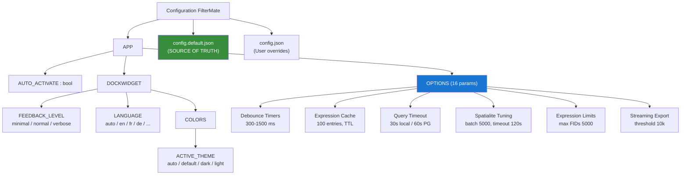
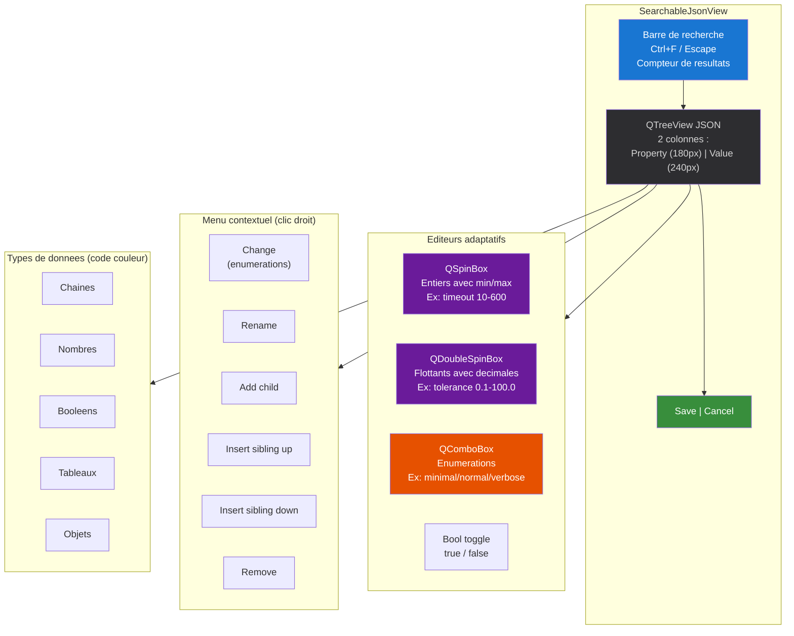
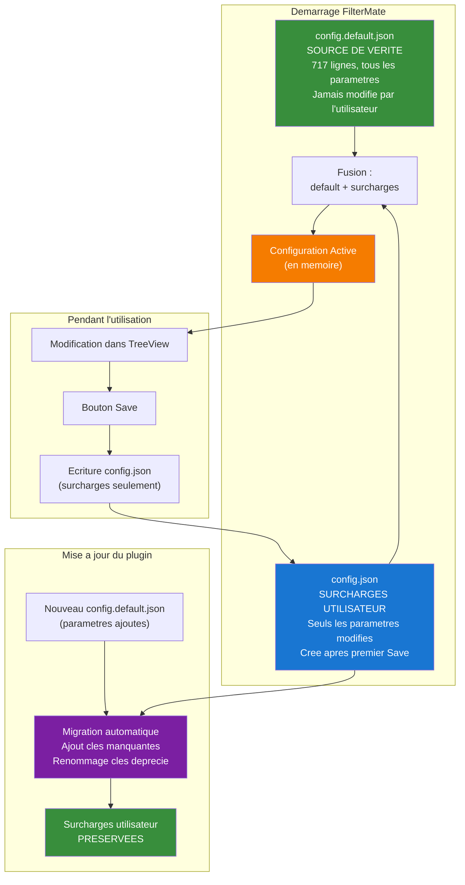

# FilterMate — Script Video V09 : Configuration Avancee
**Version** : 4.6.1 | **Date** : 14 Mars 2026
**Niveau** : Expert | **Duree** : 8-10 min | **Prerequis** : V01

> **Public cible** : Utilisateurs avances, administrateurs SIG, power users
> **Ton** : Technique mais pedagogique — on demystifie chaque parametre
> **Langue** : Francais (sous-titres EN disponibles)
> **Fichier de sortie** : `filtermate-tutorial-v09-configuration.mp4`

---

## Plan de la video

| Temps | Contenu | Type |
|-------|---------|------|
| 0:00 | Ouvrir les parametres FilterMate | Demo live |
| 0:30 | Structure de la configuration | Diagramme |
| 1:00 | Feedback level : minimal / normal / verbose | Demo live |
| 1:30 | Theme : auto / default / dark / light | Demo live |
| 2:00 | Position du dock et de la barre d'actions | Demo live |
| 2:30 | Profil UI : compact / normal / HiDPI | Demo live |
| 3:00 | Debounce timers (expression, filtre, canvas) | Demo live |
| 3:30 | Cache d'expressions (taille, TTL) | Demo live |
| 4:00 | Seuils d'optimisation | Demo live |
| 4:30 | Spatialite tuning (batch size, timeout) | Demo live |
| 5:00 | Expression builder limits | Demo live |
| 5:30 | Export defaults (GPKG, streaming) | Demo live |
| 6:00 | JSON TreeView pour reglages fins | Demo live |
| 7:00 | config.default.json vs config.json | Diagramme |
| 7:30 | Reset configuration | Demo live |
| 8:00 | Migration automatique de config au demarrage | Demo live |

---

## SEQUENCE 0 — OUVERTURE : ACCEDER AUX PARAMETRES (0:00 - 0:30)

### Visuel suggere
> Ecran QGIS avec FilterMate ouvert. Le curseur clique sur le troisieme onglet du QToolBox (index 2, apres FILTERING et EXPORTING) pour reveler le panneau de configuration. Zoom sur l'interface : barre de recherche en haut, arbre JSON en dessous, boutons Save/Cancel en bas.

### Narration
> *"Bienvenue dans cette video consacree a la configuration avancee de FilterMate. Si vous avez suivi la video d'installation, vous connaissez deja l'interface — mais aujourd'hui, on va plonger dans les coulisses. Chaque parametre du plugin est personnalisable, et c'est ici que ca se passe."*

> *"Pour acceder a la configuration, cliquez sur le troisieme onglet de la Toolbox — juste apres Filtering et Exporting. Vous voyez apparaitre un editeur JSON complet, avec une barre de recherche en haut et un arbre de configuration en dessous. C'est ce qu'on appelle le SearchableJsonView."*

### Capture QGIS requise
1. Clic sur l'onglet Configuration (index 2 du QToolBox)
2. Vue d'ensemble du panneau : barre de recherche + arbre JSON + boutons

---

## SEQUENCE 1 — STRUCTURE DE LA CONFIGURATION (0:30 - 1:00)

### Visuel suggere
> Afficher le diagramme Mermaid ci-dessous en plein ecran. Animer progressivement : d'abord le noeud racine, puis APP, puis DOCKWIDGET et OPTIONS, enfin les sous-branches. Mettre en surbrillance config.default.json en vert et config.json en bleu.

### Narration
> *"Avant de modifier quoi que ce soit, comprenons la structure. La configuration de FilterMate s'organise en arbre. A la racine, on trouve APP, qui contient deux grandes branches."*

> *"Premiere branche : DOCKWIDGET. C'est tout ce qui concerne l'apparence — le niveau de feedback, la langue, le theme de couleurs, la position du dock, le profil d'affichage. Deuxieme branche : OPTIONS. C'est le moteur — les timers de debounce, le cache d'expressions, les seuils d'optimisation, le tuning Spatialite, les limites de l'expression builder, et les parametres d'export."*

> *"Deux fichiers coexistent : config.default.json, c'est la reference — la source de verite avec les valeurs par defaut. Et config.json, c'est votre fichier personnel — il ne contient que vos surcharges. Si vous supprimez config.json, FilterMate redemarre avec les valeurs par defaut. Simple et propre."*

### Diagramme — Arborescence Configuration



---

## SEQUENCE 2 — FEEDBACK LEVEL (1:00 - 1:30)

### Visuel suggere
> Dans l'arbre JSON, naviguer vers `APP > DOCKWIDGET > FEEDBACK_LEVEL`. Montrer le clic droit > "Change" avec les 3 choix. Basculer entre minimal, normal et verbose en montrant la barre de messages QGIS a chaque fois. Effectuer un filtrage apres chaque changement pour voir la difference.

### Narration
> *"Premier parametre essentiel : le niveau de feedback. Il controle la quantite de messages que FilterMate affiche dans la barre de notification QGIS."*

> *"En mode minimal, vous ne verrez que les erreurs et les avertissements. Ideal en production quand vous maitrisez le plugin. En mode normal — c'est la valeur par defaut — vous recevez en plus les messages de succes : 'Filtre applique', 'Export termine'. Enfin, le mode verbose affiche tout : informations de debug, details du backend, progression des taches. C'est un outil d'apprentissage formidable, et je vous recommande de l'activer quand vous decouvrez FilterMate."*

> *"Pour changer, faites un clic droit sur la valeur et choisissez 'Change'. Le changement est immediat — pas besoin de redemarrer le plugin."*

### Detail technique
- Cle : `APP.DOCKWIDGET.FEEDBACK_LEVEL`
- Valeurs : `minimal`, `normal`, `verbose`
- Categories affectees par verbose : `info`, `success`, `filter_count`, `filter_success`, `undo_redo`, `backend_info`, `backend_startup`, `config_changes`, `layer_loaded`, `layer_reset`, `progress_info`, `history_status`, `init_info`
- Application : **Live** (pas de reload necessaire)

### Captures QGIS requises
1. Clic droit > Change sur FEEDBACK_LEVEL avec les 3 choix
2. Barre de messages en mode minimal (filtrage = aucun message)
3. Barre de messages en mode verbose (filtrage = 4-5 messages detailles)

---

## SEQUENCE 3 — THEME DE COULEURS (1:30 - 2:00)

### Visuel suggere
> Naviguer vers `APP > DOCKWIDGET > COLORS > ACTIVE_THEME`. Basculer entre les 4 themes en montrant le changement visuel instantane du dockwidget. Montrer aussi THEME_SOURCE (`config`, `qgis`, `system`). Capture avant/apres pour chaque theme.

### Narration
> *"Le theme de couleurs est un classique, mais FilterMate va plus loin que la plupart des plugins. Quatre options : auto detecte le theme de QGIS automatiquement — si vous passez en mode sombre dans QGIS, FilterMate suit. Default est le theme standard avec fond clair. Dark est un theme sombre complet, optimise pour les longues sessions. Et light, c'est un fond blanc pur."*

> *"Un detail important : la source du theme. Par defaut, c'est config — le theme est celui que vous avez choisi ici. Mais vous pouvez passer en qgis pour heriter automatiquement du theme de QGIS, ou en system pour utiliser le theme de votre systeme d'exploitation."*

> *"Chaque theme definit ses propres couleurs : fond, police, accentuation primaire, hover, pressed. Tout est personnalisable dans la branche THEMES si vous voulez creer votre propre combinaison."*

### Detail technique
- Cle : `APP.DOCKWIDGET.COLORS.ACTIVE_THEME`
- Valeurs : `auto`, `default`, `dark`, `light`
- Source : `APP.DOCKWIDGET.COLORS.THEME_SOURCE` (`config`, `qgis`, `system`)
- Themes personnalisables : `APP.DOCKWIDGET.COLORS.THEMES.{default|dark|light}`
  - Chaque theme : `BACKGROUND` (4 couleurs), `FONT` (3 couleurs), `ACCENT` (5 couleurs : PRIMARY, HOVER, PRESSED, LIGHT_BG, DARK)
- Application : **Live** (pas de reload necessaire)

### Captures QGIS requises
1. Theme `default` — fond clair, accent bleu #1976D2
2. Theme `dark` — fond #1E1E1E, accent #007ACC
3. Theme `light` — fond blanc, accent #2196F3
4. Theme `auto` — suivant le theme QGIS actif

---

## SEQUENCE 4 — POSITION DU DOCK ET DE LA BARRE D'ACTIONS (2:00 - 2:30)

### Visuel suggere
> Montrer le changement de DOCK_POSITION : le panneau FilterMate se deplace de droite a gauche, puis en bas, puis en haut. Meme chose pour ACTION_BAR_POSITION : les boutons d'action se deplacent. Montrer qu'un redemarrage est necessaire : le message "Reload required" apparait.

### Narration
> *"La position du dock — c'est-a-dire le panneau FilterMate lui-meme — est configurable : gauche, droite, haut ou bas. Par defaut, il est a droite. La plupart des utilisateurs le gardent a droite ou a gauche, selon leur habitude."*

> *"Independamment, la barre d'actions — les 6 boutons Filter, Undo, Redo, Unfilter, Reset, Export — peut etre placee en haut, en bas, a gauche ou a droite du panneau. En position laterale, les boutons passent en mode vertical, et vous pouvez meme choisir l'alignement vertical — en haut ou en bas — avec ACTION_BAR_VERTICAL_ALIGNMENT."*

> *"Attention : ces changements de position necessitent un redemarrage du plugin. Utilisez le bouton Reload Plugin — il sauvegarde votre config avant de recharger."*

### Detail technique
- Cle dock : `APP.DOCKWIDGET.DOCK_POSITION` — `left`, `right`, `top`, `bottom` (defaut : `right`)
- Cle barre : `APP.DOCKWIDGET.ACTION_BAR_POSITION` — `top`, `bottom`, `left`, `right` (defaut : `bottom`)
- Cle alignement : `APP.DOCKWIDGET.ACTION_BAR_VERTICAL_ALIGNMENT` — `top`, `bottom` (defaut : `top`)
- Application : **Reload necessaire**

### Captures QGIS requises
1. Dock en position droite (defaut)
2. Dock en position gauche
3. Barre d'actions en position `right` (mode vertical)
4. Message "Reload required" apres changement

---

## SEQUENCE 5 — PROFIL UI : COMPACT / NORMAL / HIDPI (2:30 - 3:00)

### Visuel suggere
> Montrer UI_PROFILE avec ses 4 choix. Afficher le diagramme des seuils de detection automatique. Si possible, montrer une capture en mode compact (petites polices, icones reduites) vs HiDPI (grandes icones, polices adaptees).

### Narration
> *"Le profil d'affichage s'adapte a votre ecran. En mode auto — c'est le defaut — FilterMate detecte automatiquement la meilleure configuration. Si votre ecran fait moins de 1920 pixels de large ou moins de 1080 de haut, il passe en mode compact avec des elements plus petits. Si votre ratio de pixels depasse 1.5 ou si votre ecran depasse 3840 pixels de large — typiquement un ecran 4K ou Retina — il passe en mode HiDPI avec des icones et des polices adaptees."*

> *"Vous pouvez forcer un profil manuellement. C'est utile si vous avez un ecran 4K mais que vous preferez l'affichage compact, ou inversement. Ce changement necessite aussi un redemarrage."*

### Detail technique
- Cle : `APP.DOCKWIDGET.UI_PROFILE`
- Valeurs : `auto`, `compact`, `normal`, `hidpi`
- Seuils auto :
  - `compact` si largeur < 1920 **ou** hauteur < 1080
  - `hidpi` si device pixel ratio > 1.5 **ou** largeur physique > 3840
  - `normal` sinon
- Tailles d'icones : `ACTION` = 25px, `OTHERS` = 20px (personnalisables dans `PushButton.ICONS_SIZES`)
- Application : **Reload necessaire**

### Captures QGIS requises
1. Profil `compact` — elements reduits
2. Profil `normal` — taille standard
3. Profil `hidpi` — elements agrandis pour haute resolution

---

## SEQUENCE 6 — DEBOUNCE TIMERS (3:00 - 3:30)

### Visuel suggere
> Naviguer vers `APP > OPTIONS > UI_RESPONSIVENESS`. Montrer les 4 timers avec leurs spinboxes (min/max). Demonstrer l'effet : taper dans le champ de recherche de la liste d'entites avec un debounce a 50 ms (reactif mais CPU-intensif) puis a 1000 ms (economique mais lent). Trouver le bon compromis.

### Narration
> *"Les debounce timers sont des parametres tres techniques mais qui font une vraie difference au quotidien. Un debounce, c'est le delai entre le moment ou vous arretez de taper et le moment ou FilterMate execute la requete. Trop court, votre CPU travaille a chaque frappe. Trop long, l'interface parait lente."*

> *"Quatre timers sont configurables. Le debounce d'expression — 450 millisecondes par defaut — controle le delai avant d'evaluer un changement d'expression. Le debounce de filtre texte — 300 ms — s'applique quand vous cherchez dans une liste d'entites. Et deux timers de rafraichissement du canvas : 500 ms pour les filtres simples, 1500 ms pour les operations complexes."*

> *"Sur une machine puissante, vous pouvez reduire ces valeurs pour plus de reactivite. Sur une machine plus modeste ou avec des donnees volumineuses, augmentez-les pour eviter la surcharge."*

### Detail technique
- Cle racine : `APP.OPTIONS.UI_RESPONSIVENESS`
- `expression_debounce_ms` : 450 (min: 100, max: 2000) — delai avant evaluation d'expression
- `filter_debounce_ms` : 300 (min: 50, max: 1000) — delai avant application du filtre texte
- `canvas_refresh_delay_simple_ms` : 500 (min: 100, max: 5000) — rafraichissement apres filtre simple
- `canvas_refresh_delay_complex_ms` : 1500 (min: 500, max: 10000) — rafraichissement apres filtre complexe
- Application : **Live** (pris en compte au prochain evenement)

### Captures QGIS requises
1. Spinbox `expression_debounce_ms` avec min/max visibles
2. Comparaison saisie rapide avec debounce 50ms vs 1000ms

---

## SEQUENCE 7 — CACHE D'EXPRESSIONS (3:30 - 4:00)

### Visuel suggere
> Naviguer vers `APP > OPTIONS > QUERY_CACHE`. Montrer les parametres : enabled, max_size, ttl_seconds, cache_result_counts, cache_complexity_scores. Activer le mode verbose, effectuer un filtrage deux fois de suite, et montrer dans les messages que le deuxieme est instantane grace au cache ("cache hit").

### Narration
> *"Le cache d'expressions evite de reconstruire des requetes identiques. Quand vous appliquez un filtre, FilterMate stocke l'expression generee dans un cache LRU — Least Recently Used. Si vous reappliquez le meme filtre — meme source, meme cible, meme predicat — l'expression est recuperee du cache instantanement."*

> *"Le cache contient 100 entrees par defaut. Le TTL — Time To Live — est a zero, ce qui signifie pas d'expiration : les entrees restent en cache jusqu'a ce qu'elles soient evincees par de nouvelles. Vous pouvez aussi cacher les comptages de resultats et les scores de complexite pour eviter des calculs redondants."*

> *"Conseil : en mode verbose, vous verrez dans les messages si le cache a ete utilise — 'cache hit' — ou si l'expression a ete recalculee — 'cache miss'. C'est un excellent moyen de verifier que vos optimisations fonctionnent."*

### Detail technique
- Cle racine : `APP.OPTIONS.QUERY_CACHE`
- `enabled` : true (activer/desactiver le cache)
- `max_size` : 100 (nombre max d'entrees en cache, algorithme LRU)
- `ttl_seconds` : 0 (pas d'expiration, 0 = infini)
- `cache_result_counts` : true (cache les COUNT pour eviter des requetes couteuses)
- `cache_complexity_scores` : true (cache les scores de complexite pour eviter la re-analyse)
- Application : **Live**

### Captures QGIS requises
1. Parametres QUERY_CACHE dans l'arbre JSON
2. Messages verbose montrant "cache hit" vs "cache miss"

---

## SEQUENCE 8 — SEUILS D'OPTIMISATION (4:00 - 4:30)

### Visuel suggere
> Naviguer vers `APP > OPTIONS > OPTIMIZATION_THRESHOLDS`. Montrer les 8 seuils avec leurs spinboxes. Expliquer chaque seuil avec un exemple concret : "Si votre couche a 60 000 entites, ca depasse le seuil de 50 000, donc un avertissement de performance s'affiche."

### Narration
> *"Les seuils d'optimisation sont le coeur du systeme d'auto-optimisation de FilterMate. Huit parametres controlent quand les differentes strategies se declenchent."*

> *"Le premier seuil — large dataset warning a 50 000 — affiche un avertissement quand vous travaillez avec beaucoup d'entites. Le seuil d'expression asynchrone — 10 000 — determine quand l'evaluation passe en thread de fond pour ne pas bloquer l'interface. Le seuil de mise a jour des extents — 50 000 — controle si les emprises sont recalculees automatiquement apres un filtrage."*

> *"Le seuil centroide — 5 000 — active l'optimisation par centroide pour les couches distantes avec beaucoup d'entites. Le seuil EXISTS subquery — 100 000 caracteres WKT — bascule vers un mode sous-requete plus efficace. Et le seuil de vue materialisee — 500 FIDs source — determine quand PostgreSQL cree une vue temporaire au lieu d'inliner tous les identifiants."*

> *"Ajustez ces seuils en fonction de votre materiel. Avec un serveur PostgreSQL puissant et un reseau rapide, vous pouvez les augmenter. Sur un laptop avec des donnees locales, les valeurs par defaut sont generalement optimales."*

### Detail technique
- Cle racine : `APP.OPTIONS.OPTIMIZATION_THRESHOLDS`
- `large_dataset_warning` : 50 000 (min: 0, max: 1 000 000) — seuil d'avertissement
- `async_expression_threshold` : 10 000 (min: 1 000, max: 500 000) — execution en background thread
- `update_extents_threshold` : 50 000 (min: 1 000, max: 500 000) — recalcul auto des emprises
- `centroid_optimization_threshold` : 5 000 (min: 1 000, max: 100 000) — centroide auto pour distant
- `exists_subquery_threshold` : 100 000 (min: 10 000, max: 1 000 000) — bascule WKT inline > EXISTS
- `source_mv_fid_threshold` : 500 (min: 50, max: 5 000) — vue materialisee PG
- `parallel_processing_threshold` : 100 000 (min: 10 000, max: 1 000 000) — traitement parallele
- `progress_update_batch_size` : 100 (min: 10, max: 1 000) — frequence mise a jour progression
- Application : **Live**

### Captures QGIS requises
1. Arbre OPTIMIZATION_THRESHOLDS avec 8 spinboxes
2. Avertissement "large dataset" sur une couche de 60 000 entites

---

## SEQUENCE 9 — SPATIALITE TUNING (4:30 - 5:00)

### Visuel suggere
> Naviguer vers `APP > OPTIONS > SPATIALITE`. Montrer les 3 parametres. Demonstrer l'effet du batch_size : filtrage d'un GeoPackage de 100 000 entites avec batch=1000 (plus de mises a jour de progression, plus lent) vs batch=10 000 (moins de mises a jour, plus rapide). Montrer le timeout en action sur une requete complexe.

### Narration
> *"Si vous travaillez avec des GeoPackage ou des bases Spatialite, trois parametres meritent votre attention."*

> *"Le batch size — 5 000 par defaut — determine combien d'entites sont traitees par lot. Un lot plus gros est plus rapide mais consomme plus de memoire. Le progress interval — 1 000 — controle a quelle frequence la barre de progression est mise a jour. Et le query timeout — 120 secondes — annule automatiquement une requete qui prend trop longtemps."*

> *"Si vous travaillez avec des GeoPackage de plus de 100 000 entites, augmenter le batch size a 10 000 ou 20 000 peut diviser le temps de traitement par deux. En revanche, si votre machine a peu de RAM, restez a 5 000 ou descendez a 2 000."*

### Detail technique
- Cle racine : `APP.OPTIONS.SPATIALITE`
- `batch_size` : 5 000 (min: 500, max: 50 000) — entites par lot
- `progress_interval` : 1 000 (min: 100, max: 10 000) — frequence rapport de progression
- `query_timeout_seconds` : 120 (min: 10, max: 600) — timeout en secondes
- Application : **Live** (pris en compte au prochain filtrage)

### Captures QGIS requises
1. Parametres SPATIALITE dans l'arbre JSON
2. Barre de progression avec batch_size=1000 (nombreuses mises a jour)
3. Barre de progression avec batch_size=10000 (mise a jour moins frequente)

---

## SEQUENCE 10 — EXPRESSION BUILDER LIMITS (5:00 - 5:30)

### Visuel suggere
> Naviguer vers `APP > OPTIONS > EXPRESSION_BUILDER`. Montrer les 4 limites. Expliquer avec un schema : quand on a 8 000 FIDs, la clause IN est decoupee en 2 morceaux de 4 000 (car max_fids_per_in_clause = 5 000). Montrer aussi le seuil de bascule vers la strategie sous-requete (max_inline_features = 1 000).

### Narration
> *"L'expression builder est le composant qui construit les requetes SQL a partir de vos selections. Il a des limites volontaires pour eviter de generer des requetes trop longues ou trop lourdes."*

> *"max fids per in clause — 5 000 par defaut — limite le nombre d'identifiants dans une seule clause SQL IN. Au-dela, FilterMate decoupe en plusieurs clauses. absolute fid limit — 50 000 — est la limite dure : au-dela, les identifiants sont tronques avec un avertissement dans les logs."*

> *"max inline features — 1 000 — est le seuil ou FilterMate bascule d'une clause IN inline vers une strategie sous-requete, beaucoup plus efficace pour de gros volumes. Et max expression length — 10 000 caracteres — declenche aussi la bascule vers une strategie optimisee quand l'expression devient trop longue."*

### Detail technique
- Cle racine : `APP.OPTIONS.EXPRESSION_BUILDER`
- `max_fids_per_in_clause` : 5 000 (min: 500, max: 50 000) — FIDs par clause IN
- `absolute_fid_limit` : 50 000 (min: 5 000, max: 500 000) — limite absolue (troncature + warning)
- `max_inline_features` : 1 000 (min: 100, max: 10 000) — seuil bascule inline > subquery
- `max_expression_length` : 10 000 (min: 1 000, max: 100 000) — longueur max expression
- Application : **Live**

### Captures QGIS requises
1. Parametres EXPRESSION_BUILDER dans l'arbre JSON
2. Log montrant un decoupage de clause IN (8 000 FIDs en 2 lots)

---

## SEQUENCE 11 — EXPORT DEFAULTS (5:30 - 6:00)

### Visuel suggere
> Montrer les parametres d'export : GPKG_PRESERVE_GROUPS, KML_PRESERVE_GROUPS, STREAMING_EXPORT. Montrer aussi QUERY_TIMEOUTS (PG 60s, local 30s). Demonstrer l'activation de preserve groups : relancer un export GPKG et voir la hierarchie de groupes dans le fichier resultant.

### Narration
> *"Trois parametres d'export meritent qu'on s'y attarde. GPKG Preserve Groups — desactive par defaut — embarque la structure de groupes de votre projet QGIS dans le GeoPackage. A l'ouverture, toute l'arborescence est reconstruite. KML Preserve Groups fait la meme chose pour les exports KML."*

> *"Le streaming export est crucial pour les gros volumes. Au-dela de 10 000 entites — c'est le seuil — FilterMate decoupe automatiquement l'export en lots de 5 000 pour eviter les problemes de memoire. Ces parametres sont ajustables."*

> *"Et enfin, les timeouts de requete : 60 secondes pour PostgreSQL, 30 secondes pour les backends locaux. Si vous travaillez avec des requetes spatiales complexes sur de gros jeux de donnees, vous pouvez augmenter le timeout PostgreSQL jusqu'a 300 secondes."*

### Detail technique
- Export GPKG : `APP.OPTIONS.GPKG_PRESERVE_GROUPS` — `false` par defaut
- Export KML : `APP.OPTIONS.KML_PRESERVE_GROUPS` — `false` par defaut
- Streaming : `APP.OPTIONS.STREAMING_EXPORT`
  - `enabled` : true
  - `feature_threshold` : 10 000 (seuil d'activation)
  - `chunk_size` : 5 000 (taille des lots)
- Timeouts : `APP.OPTIONS.QUERY_TIMEOUTS`
  - `postgresql_timeout_seconds` : 60.0 (min: 5.0, max: 300.0)
  - `local_timeout_seconds` : 30.0 (min: 5.0, max: 120.0)
- Application : **Live**

### Captures QGIS requises
1. GPKG_PRESERVE_GROUPS active + export avec hierarchie
2. STREAMING_EXPORT parametres dans l'arbre

---

## SEQUENCE 12 — JSON TREEVIEW POUR REGLAGES FINS (6:00 - 7:00)

### Visuel suggere
> Plan large sur le SearchableJsonView. Demonstrer : (1) recherche avec Ctrl+F — taper "timeout" — les noeuds correspondants s'expansent et se surlignent automatiquement. (2) Edition d'une valeur en double-clic : la spinbox apparait avec validation min/max. (3) Clic droit pour le menu contextuel : Change, Rename, Add child, Insert sibling, Remove. (4) Code couleur des types de donnees. (5) Boutons Save/Cancel en bas.

### Narration
> *"Le JSON TreeView est votre outil de configuration avancee. Prenons le temps de bien le comprendre."*

> *"D'abord, la recherche. Appuyez sur Ctrl+F ou cliquez dans la barre de recherche, tapez un mot-cle — par exemple 'timeout'. FilterMate filtre l'arbre en temps reel, deplie les branches correspondantes, et affiche le nombre de resultats en haut a droite. Echap pour effacer."*

> *"Pour modifier une valeur, double-cliquez dessus. Selon le type de donnee, l'editeur s'adapte : un spinbox avec min/max pour les nombres — regardez, le timeout Spatialite est borne entre 10 et 600 secondes. Un double spinbox pour les flottants avec detection automatique des decimales. Un combobox pour les enumerations — comme le feedback level avec ses 3 choix."*

> *"Le clic droit ouvre un menu contextuel. Change permet de basculer rapidement entre les valeurs predefinies — particulierement utile pour les themes ou les niveaux de feedback. Rename change le nom d'une cle. Add child ajoute un sous-element. Insert sibling up et down inserent un element frere. Et Remove supprime un element."*

> *"Les types de donnees sont codes par couleur dans l'arbre — chaines de caracteres, nombres, booleens, tableaux, objets — ce qui aide a visualiser la structure d'un coup d'oeil."*

> *"Quand vous modifiez quelque chose, les boutons Save et Cancel s'activent en bas. Save sauvegarde vos modifications dans config.json. Cancel annule tous les changements non sauvegardes."*

### Diagramme — JSON TreeView UI



### Captures QGIS requises
1. Recherche "timeout" avec 3 resultats trouves, branches depliees
2. Double-clic sur un nombre : spinbox avec min/max visibles
3. Double-clic sur un flottant : double spinbox avec decimales
4. Clic droit sur FEEDBACK_LEVEL : menu Change avec 3 choix
5. Clic droit sur un objet : menu avec Add child, Insert sibling, Remove
6. Boutons Save/Cancel actifs apres modification
7. Code couleur des types de donnees dans l'arbre

---

## SEQUENCE 13 — CONFIG.DEFAULT.JSON VS CONFIG.JSON (7:00 - 7:30)

### Visuel suggere
> Afficher le diagramme ci-dessous. Puis ouvrir un explorateur de fichiers montrant les deux fichiers cote a cote. config.default.json (717 lignes, complet) vs config.json (beaucoup plus petit, ne contenant que les surcharges utilisateur). Animer le processus de fusion au demarrage.

### Narration
> *"Il est important de comprendre comment FilterMate gere la configuration. Deux fichiers coexistent."*

> *"config.default.json est la source de verite. C'est le fichier de reference installe avec le plugin — 717 lignes, tous les parametres avec leurs valeurs par defaut, descriptions, choix possibles, min/max. Vous ne devez jamais modifier ce fichier directement."*

> *"config.json est votre fichier personnel. Il ne contient que les parametres que vous avez modifies — vos surcharges. Au demarrage, FilterMate fusionne les deux : il prend config.default.json comme base et applique vos modifications de config.json par-dessus."*

> *"L'avantage de cette approche : quand le plugin est mis a jour et que de nouveaux parametres sont ajoutes dans config.default.json, vous les obtenez automatiquement avec leurs valeurs par defaut, sans perdre vos reglages personnels."*

### Diagramme — Cycle de vie de la configuration



### Captures QGIS requises
1. Explorateur fichiers : config.default.json et config.json cote a cote
2. config.json ouvert dans un editeur — seules les surcharges

---

## SEQUENCE 14 — RESET CONFIGURATION (7:30 - 8:00)

### Visuel suggere
> Montrer deux methodes de reset. (1) Supprimer config.json dans l'explorateur de fichiers, puis redemarrer QGIS — FilterMate repart avec les valeurs par defaut. (2) Dans le TreeView, clic droit > Reset (si disponible), ou utiliser le bouton FRESH_RELOAD_FLAG. Montrer aussi le bouton Reload Plugin.

### Narration
> *"Deux manieres de reinitialiser la configuration. La methode simple : supprimez config.json et redemarrez QGIS. FilterMate recree le fichier avec les valeurs par defaut de config.default.json. Tous vos reglages sont remis a zero."*

> *"La methode douce : dans les OPTIONS, activez FRESH_RELOAD_FLAG — passez-le a true. Au prochain demarrage, le plugin effectue un rechargement complet et remet ce flag a false automatiquement. C'est utile si vous avez un probleme de configuration sans vouloir tout reinitialiser."*

> *"Et pour recharger le plugin sans redemarrer QGIS, utilisez le bouton Reload Plugin. Il sauvegarde votre configuration, decharge le plugin, puis le recharge. C'est la methode recommandee apres un changement de position du dock ou de profil UI."*

### Detail technique
- Reset complet : supprimer `config.json`, redemarrer QGIS
- Rechargement propre : `APP.OPTIONS.FRESH_RELOAD_FLAG` = true (auto-reset a false apres)
- Bouton Reload Plugin : sauvegarde + decharge + recharge (sans redemarrer QGIS)

### Captures QGIS requises
1. Suppression de config.json dans l'explorateur
2. FRESH_RELOAD_FLAG passe a true dans le TreeView
3. Bouton Reload Plugin en action

---

## SEQUENCE 15 — MIGRATION AUTOMATIQUE AU DEMARRAGE (8:00 - 8:30)

### Visuel suggere
> Montrer un scenario de mise a jour : avant (config.json v1.0 sans UI_RESPONSIVENESS) > apres (config.json avec les nouvelles cles ajoutees automatiquement). Afficher le diagramme du processus de migration. Si possible, montrer les logs de migration en mode verbose.

### Narration
> *"La migration automatique est le filet de securite de FilterMate. A chaque demarrage, le plugin compare votre config.json avec config.default.json. S'il detecte des cles manquantes — typiquement apres une mise a jour du plugin — il les ajoute automatiquement avec leurs valeurs par defaut."*

> *"Ce processus est entierement non-destructif. Vos reglages personnels ne sont jamais ecrases. Si une cle a ete renommee entre deux versions — par exemple THEME devenu COLORS.ACTIVE_THEME — la migration transfere la valeur vers la nouvelle cle et supprime l'ancienne."*

> *"La version de configuration est tracee dans _CONFIG_VERSION — actuellement en version 2.0. En mode verbose, vous verrez dans les logs les operations de migration au demarrage : 'Added missing key UI_RESPONSIVENESS.expression_debounce_ms with default 450'."*

> *"C'est cette mecanique qui vous permet de mettre a jour FilterMate en toute confiance — vous ne perdez jamais vos reglages."*

### Detail technique
- Classe : `ConfigMigration` dans `infrastructure/config/config_migration.py`
- Version actuelle : `_CONFIG_VERSION` = `"2.0"`
- Operations de migration :
  - Ajout des cles manquantes avec valeurs par defaut
  - Renommage des cles deprecies (ex: `THEME` > `COLORS.ACTIVE_THEME`)
  - Suppression des cles obsoletes
  - Non-destructif : les valeurs utilisateur ne sont jamais ecrasees
- Declenchement : automatique a chaque demarrage du plugin

### Captures QGIS requises
1. Logs de migration en mode verbose
2. Avant/apres : config.json avec nouvelles cles ajoutees

---

## SEQUENCE 16 — RECAPITULATIF : LIVE VS RELOAD (8:30 - 9:00)

### Visuel suggere
> Afficher le diagramme comparatif ci-dessous en plein ecran. Animer les deux colonnes avec des coches vertes (live) et des icones de reload (necessitant redemarrage).

### Narration
> *"Pour conclure, retenez cette distinction fondamentale. Certains parametres s'appliquent en live, instantanement, sans toucher au plugin : la langue, le feedback level, le theme de couleurs, tous les seuils d'optimisation, le cache, les timers de debounce, les parametres d'export."*

> *"D'autres necessite un rechargement du plugin : la position du dock, la position de la barre d'actions, le profil UI. Quand vous modifiez un de ces parametres, utilisez le bouton Reload Plugin pour appliquer les changements."*

> *"Et rappelez-vous : FilterMate sauvegarde tout dans config.json. Si vous vous perdez, supprimez ce fichier et repartez de zero. Et la migration automatique s'occupe du reste lors des mises a jour."*

### Diagramme — Live vs Reload

```mermaid
graph LR
    subgraph LIVE["Changements LIVE (immediats)"]
        direction TB
        L1["LANGUAGE<br/>Langue de l'interface"]
        L2["FEEDBACK_LEVEL<br/>minimal / normal / verbose"]
        L3["ACTIVE_THEME<br/>auto / default / dark / light"]
        L4["OPTIMIZATION_THRESHOLDS<br/>8 seuils de performance"]
        L5["QUERY_CACHE<br/>Taille, TTL, options"]
        L6["UI_RESPONSIVENESS<br/>4 debounce timers"]
        L7["SPATIALITE<br/>batch size, timeout"]
        L8["EXPRESSION_BUILDER<br/>4 limites"]
        L9["QUERY_TIMEOUTS<br/>PG 60s, local 30s"]
        L10["STREAMING_EXPORT<br/>seuil, chunk size"]
        L11["GPKG_PRESERVE_GROUPS<br/>KML_PRESERVE_GROUPS"]
        L12["FAVORITES<br/>recent limit"]
    end

    subgraph RELOAD["Necessite RELOAD"]
        direction TB
        R1["DOCK_POSITION<br/>left / right / top / bottom"]
        R2["ACTION_BAR_POSITION<br/>top / bottom / left / right"]
        R3["ACTION_BAR_VERTICAL_ALIGNMENT<br/>top / bottom"]
        R4["UI_PROFILE<br/>auto / compact / normal / hidpi"]
    end

    LIVE --- NOTE1["Pas de redemarrage<br/>Effet immediat<br/>ou au prochain evenement"]
    RELOAD --- NOTE2["Utiliser le bouton<br/>Reload Plugin"]

    style LIVE fill:#388E3C,color:#fff
    style RELOAD fill:#D32F2F,color:#fff
    style NOTE1 fill:#C8E6C9,color:#1B5E20
    style NOTE2 fill:#FFCDD2,color:#B71C1C
```



---

## SEQUENCE 17 — CONCLUSION & CALL TO ACTION (9:00 - 9:30)

### Visuel suggere
> Retour sur le TreeView avec une configuration personnalisee. Logo FilterMate. Liens GitHub/QGIS Plugin Store.

### Narration
> *"La configuration avancee de FilterMate, c'est 16 parametres dans OPTIONS, un systeme de themes complet, et un editeur JSON integre avec recherche et validation. Tout est fait pour que vous puissiez adapter le plugin a votre usage — que vous soyez sur un laptop avec des shapefiles locaux ou sur un poste de travail connecte a un cluster PostgreSQL."*

> *"Si vous avez des questions ou des suggestions, rejoignez-nous sur Discord ou ouvrez une issue sur GitHub. Et si cette video vous a ete utile, n'oubliez pas de laisser une etoile sur le depot. A bientot pour la prochaine video : Architecture et Contribution."*

### Liens a afficher a l'ecran
- **GitHub** : `https://github.com/imagodata/filter_mate`
- **QGIS Plugins** : `https://plugins.qgis.org/plugins/filter_mate`
- **Documentation** : `https://imagodata.github.io/filter_mate`
- **Discord** : `https://discord.gg/9DNbuVYQ`

---

## ANNEXES

### A. Parametres supplementaires non couverts dans la video

Les parametres suivants sont egalement configurables dans OPTIONS mais relevent de videos dediees :

| Parametre | Video dediee | Description |
|-----------|-------------|-------------|
| `SMALL_DATASET_OPTIMIZATION` | V07 | PG < 5k entites > backend Memory |
| `AUTO_OPTIMIZATION` | V07 | Centroide auto, simplification, strategie |
| `PROGRESSIVE_FILTERING` | V07 | Filtrage deux phases, lazy cursor |
| `PARALLEL_FILTERING` | V07 | Execution parallele multi-couches |
| `GEOMETRY_SIMPLIFICATION` | V07 | Simplification WKT, topologie |
| `PERFORMANCE` | V07 | Avertissements, tips backend |
| `HISTORY` | V05 | Undo/Redo, persistance |
| `EXPLORATION` | V03 | Buffer point, feature picker limit |
| `DISCORD_INVITE` | — | Lien Discord |
| `GITHUB_PAGE` | — | URL documentation |
| `GITHUB_REPOSITORY` | — | URL depot source |
| `QGIS_PLUGIN_REPOSITORY` | — | URL depot QGIS |
| `APP_SQLITE_PATH` | — | Chemin base SQLite |

### B. Raccourcis clavier de l'editeur

| Raccourci | Action |
|-----------|--------|
| `Ctrl+F` | Focus sur la barre de recherche |
| `Escape` | Effacer la recherche |
| `Enter` | Naviguer vers le premier / prochain resultat |
| `Double-clic` | Editer une valeur |
| `Clic droit` | Menu contextuel (Change, Rename, Add, Insert, Remove) |

### C. Arborescence complete des fichiers de configuration

```
filter_mate/
  config/
    config.default.json    # Source de verite (717 lignes)
    config.json            # Surcharges utilisateur (cree apres Save)
    config.py              # _get_option_value() / _set_option_value()
    config_schema.json     # DEPRECIE (non utilise dans le flux principal)
    config_metadata.py     # Metadonnees de version
    theme_helpers.py       # Helpers pour les themes de couleurs
  infrastructure/
    config/
      config_migration.py  # Migration automatique entre versions
```

### D. Toutes les valeurs par defaut de APP.OPTIONS

| Parametre | Valeur par defaut | Min | Max |
|-----------|:-----------------:|:---:|:---:|
| `UI_RESPONSIVENESS.expression_debounce_ms` | 450 | 100 | 2000 |
| `UI_RESPONSIVENESS.filter_debounce_ms` | 300 | 50 | 1000 |
| `UI_RESPONSIVENESS.canvas_refresh_delay_simple_ms` | 500 | 100 | 5000 |
| `UI_RESPONSIVENESS.canvas_refresh_delay_complex_ms` | 1500 | 500 | 10000 |
| `QUERY_CACHE.max_size` | 100 | — | — |
| `QUERY_CACHE.ttl_seconds` | 0 | — | — |
| `OPTIMIZATION_THRESHOLDS.large_dataset_warning` | 50000 | 0 | 1000000 |
| `OPTIMIZATION_THRESHOLDS.async_expression_threshold` | 10000 | 1000 | 500000 |
| `OPTIMIZATION_THRESHOLDS.update_extents_threshold` | 50000 | 1000 | 500000 |
| `OPTIMIZATION_THRESHOLDS.centroid_optimization_threshold` | 5000 | 1000 | 100000 |
| `OPTIMIZATION_THRESHOLDS.exists_subquery_threshold` | 100000 | 10000 | 1000000 |
| `OPTIMIZATION_THRESHOLDS.source_mv_fid_threshold` | 500 | 50 | 5000 |
| `OPTIMIZATION_THRESHOLDS.parallel_processing_threshold` | 100000 | 10000 | 1000000 |
| `OPTIMIZATION_THRESHOLDS.progress_update_batch_size` | 100 | 10 | 1000 |
| `SPATIALITE.batch_size` | 5000 | 500 | 50000 |
| `SPATIALITE.progress_interval` | 1000 | 100 | 10000 |
| `SPATIALITE.query_timeout_seconds` | 120 | 10 | 600 |
| `EXPRESSION_BUILDER.max_fids_per_in_clause` | 5000 | 500 | 50000 |
| `EXPRESSION_BUILDER.absolute_fid_limit` | 50000 | 5000 | 500000 |
| `EXPRESSION_BUILDER.max_inline_features` | 1000 | 100 | 10000 |
| `EXPRESSION_BUILDER.max_expression_length` | 10000 | 1000 | 100000 |
| `QUERY_TIMEOUTS.postgresql_timeout_seconds` | 60.0 | 5.0 | 300.0 |
| `QUERY_TIMEOUTS.local_timeout_seconds` | 30.0 | 5.0 | 120.0 |
| `STREAMING_EXPORT.feature_threshold` | 10000 | — | — |
| `STREAMING_EXPORT.chunk_size` | 5000 | — | — |
| `FAVORITES.recent_favorites_limit` | 10 | 3 | 50 |
| `EXPLORATION.point_buffer_distance_m` | 50 | 1 | 10000 |
| `EXPLORATION.feature_picker_limit` | 1000 | 100 | 50000 |

---

## Timestamps finaux

| Chrono | Contenu |
|--------|---------|
| 0:00 | Ouvrir les parametres FilterMate |
| 0:30 | Structure de la configuration |
| 1:00 | Feedback level : minimal / normal / verbose |
| 1:30 | Theme : auto / default / dark / light |
| 2:00 | Position du dock et de la barre d'actions |
| 2:30 | Profil UI : compact / normal / HiDPI |
| 3:00 | Debounce timers |
| 3:30 | Cache d'expressions |
| 4:00 | Seuils d'optimisation |
| 4:30 | Spatialite tuning |
| 5:00 | Expression builder limits |
| 5:30 | Export defaults et timeouts |
| 6:00 | JSON TreeView pour reglages fins |
| 7:00 | config.default.json vs config.json |
| 7:30 | Reset configuration |
| 8:00 | Migration automatique |
| 8:30 | Recapitulatif : Live vs Reload |
| 9:00 | Conclusion + Call to Action |

---

## Captures QGIS requises (total : 28)

| # | Description | Sequence |
|---|-------------|----------|
| 1 | Onglet Configuration dans QToolBox | S0 |
| 2 | Vue d'ensemble SearchableJsonView | S0 |
| 3 | Clic droit > Change sur FEEDBACK_LEVEL | S2 |
| 4 | Barre de messages en mode minimal | S2 |
| 5 | Barre de messages en mode verbose | S2 |
| 6 | Theme default — fond clair | S3 |
| 7 | Theme dark — fond sombre | S3 |
| 8 | Theme light — fond blanc | S3 |
| 9 | Theme auto — suivant QGIS | S3 |
| 10 | Dock position droite (defaut) | S4 |
| 11 | Dock position gauche | S4 |
| 12 | Action bar verticale | S4 |
| 13 | Message "Reload required" | S4 |
| 14 | Profil compact | S5 |
| 15 | Profil normal | S5 |
| 16 | Profil hidpi | S5 |
| 17 | Spinbox debounce avec min/max | S6 |
| 18 | Comparaison debounce 50ms vs 1000ms | S6 |
| 19 | QUERY_CACHE dans l'arbre | S7 |
| 20 | Messages cache hit vs miss | S7 |
| 21 | OPTIMIZATION_THRESHOLDS — 8 spinboxes | S8 |
| 22 | Avertissement large dataset | S8 |
| 23 | SPATIALITE dans l'arbre | S9 |
| 24 | Recherche "timeout" — resultats deplies | S12 |
| 25 | Edition spinbox avec min/max | S12 |
| 26 | Menu contextuel clic droit | S12 |
| 27 | Boutons Save/Cancel actifs | S12 |
| 28 | Logs de migration verbose | S15 |

---

## Diagrammes Mermaid (total : 4)

| # | Type | Contenu |
|---|------|---------|
| 1 | graph TD | Arborescence Configuration (arbre complet APP) |
| 2 | graph TD | JSON TreeView UI (layout + editeurs + menu) |
| 3 | flowchart TD | Cycle de vie configuration (default + user + migration) |
| 4 | graph LR | Live vs Reload (comparaison) |

---

## Musique suggeree

- Intro : Beat technique, electronica legere (sans copyright)
- Demo : Ambiance neutre, fond minimal — l'attention doit etre sur l'interface
- TreeView : Montee legere quand on explore l'arbre
- Outro : Meme beat qu'intro, resolution

---

*Script cree le 14 Mars 2026 — FilterMate v4.6.1*
*Video 09/10 de la serie de tutoriels FilterMate*
