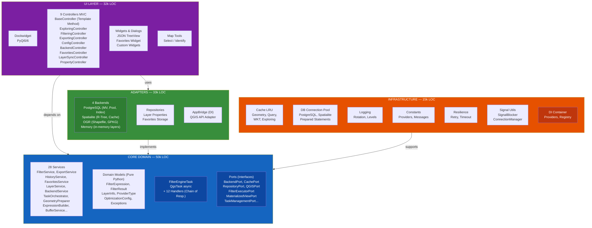
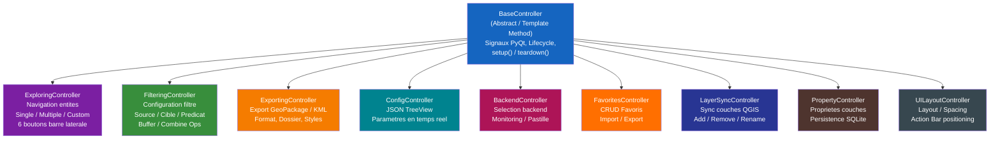
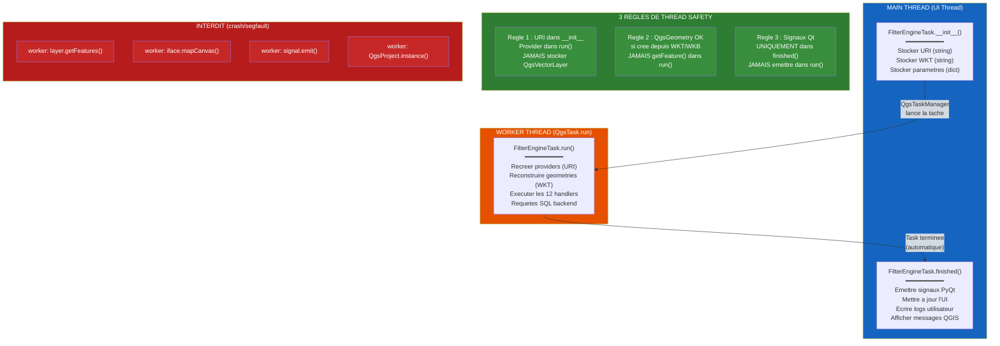
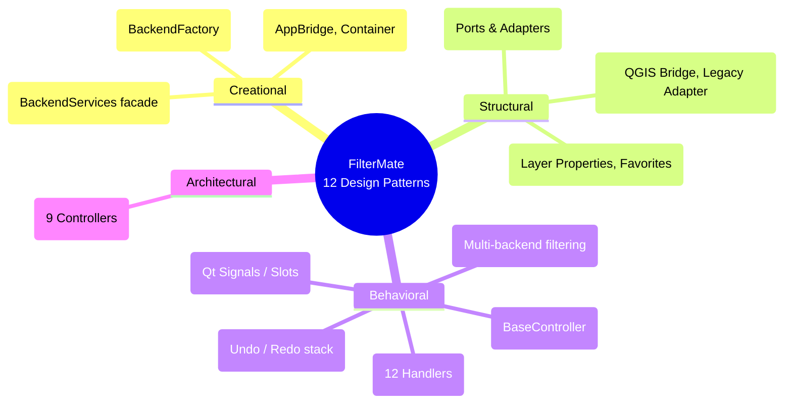

# FilterMate — Script Video 10 : Architecture & Contribution
**Version 4.6.1 | QGIS Plugin | Mars 2026**

> **Duree estimee :** 10-12 minutes
> **Niveau :** Expert / Developpeur
> **Public cible :** Developpeurs Python, contributeurs open source, architectes logiciel, etudiants informatique
> **Ton :** Technique mais accessible — on demystifie l'architecture sans jargon inutile
> **Langue :** Francais (sous-titres EN disponibles)
> **Prerequis :** Connaissance de Python, notions de design patterns, avoir vu les videos 1-9

---

## Plan de la video

| Sequence | Titre | Duree |
|----------|-------|-------|
| 0 | Hook — "130 000 lignes, 4 couches, 12 design patterns" | 0:30 |
| 1 | Pourquoi l'architecture hexagonale ? | 1:00 |
| 2 | Vue d'ensemble : les 4 couches | 1:00 |
| 3 | Core Domain : modeles purs Python | 1:00 |
| 4 | Ports & Adapters : les interfaces | 1:00 |
| 5 | Backend Factory : ajouter un backend | 1:00 |
| 6 | Les 9 Controllers MVC | 0:45 |
| 7 | FilterEngineTask : les 12 Handlers | 1:00 |
| 8 | Systeme de signaux Qt | 0:45 |
| 9 | Thread safety dans QGIS | 1:00 |
| 10 | Suite de tests : 600 tests | 0:30 |
| 11 | CI/CD GitHub Actions | 0:30 |
| 12 | Comment contribuer : fork, branch, PR | 0:30 |
| 13 | Bonnes pratiques & Recapitulatif | 0:30 |

---

## SEQUENCE 0 — HOOK (0:00 - 0:30)

### Visuel suggere
> Ecran noir. Les chiffres apparaissent un par un en grands caracteres blancs, avec un effet de frappe clavier :
> "130 000 lignes de code" — "4 couches architecturales" — "12 design patterns" — "4 backends" — "600 tests".
> Transition vers un diagramme hexagonal en rotation 3D qui se stabilise face camera.

### Narration
> *"130 000 lignes de code. 4 couches architecturales. 12 design patterns. Et pourtant, ajouter un nouveau backend de filtrage prend moins de 100 lignes."*

> *"Dans cette video, on va ouvrir le capot de FilterMate. On va voir comment une architecture hexagonale permet a un plugin QGIS de supporter PostgreSQL, Spatialite, OGR et Memory — sans que le coeur du systeme ait besoin de savoir lequel est utilise."*

> *"Que vous vouliez contribuer au projet, comprendre les patterns utilises, ou simplement satisfaire votre curiosite d'architecte logiciel — cette video est pour vous."*

---

## SEQUENCE 1 — POURQUOI L'ARCHITECTURE HEXAGONALE ? (0:30 - 1:30)

### Visuel suggere
> Comparaison visuelle en split-screen :
> - A gauche : architecture "spaghetti" classique (fleches dans tous les sens, couplage fort)
> - A droite : hexagone propre avec ports et adapters (fleches unidirectionnelles, couplage faible)
> Animation : la version spaghetti se transforme progressivement en hexagone.

### Narration
> *"Avant de plonger dans le code, une question fondamentale : pourquoi avoir choisi l'architecture hexagonale, aussi appelee Ports & Adapters, pour un plugin QGIS ?"*

> *"La reponse tient en trois mots : independance, testabilite, extensibilite."*

> *"Independance : le coeur metier de FilterMate — la logique de filtrage, les modeles de donnees, les regles de validation — ne depend ni de Qt, ni de QGIS, ni de PostgreSQL. Ce sont des classes Python pures."*

> *"Testabilite : parce que le coeur est independant, on peut le tester unitairement sans lancer QGIS. C'est comme ca qu'on atteint 600 tests."*

> *"Extensibilite : ajouter un nouveau backend — disons un futur support GeoParquet — se fait en implementant une interface, sans toucher au coeur. On branche un nouvel adaptateur, et c'est tout."*

> *"Concretement, FilterMate est organise en 4 couches concentriques. Voyons ca de plus pres."*

---

## SEQUENCE 2 — VUE D'ENSEMBLE : LES 4 COUCHES (1:30 - 2:30)

### Visuel suggere
> Diagramme Mermaid anime (ci-dessous) qui se construit couche par couche, de l'exterieur vers l'interieur. Chaque couche s'eclaire avec son nom, son volume de code, et ses composants principaux. Mettre en evidence la regle de dependance : les fleches pointent toujours vers l'interieur.

### Narration
> *"Voici la vue d'ensemble de FilterMate. Quatre couches, de l'exterieur vers le coeur."*

> *"La couche la plus externe, c'est l'UI — environ 32 000 lignes. On y trouve le Dockwidget PyQt5/6, les 9 controllers MVC, les widgets et dialogues personnalises, et les outils cartographiques. C'est tout ce que l'utilisateur voit et touche."*

> *"Ensuite, le Core Domain — 50 000 lignes. C'est le coeur du systeme. Les 28 services, les modeles de domaine purs Python, le FilterEngineTask avec ses 12 handlers, et surtout les Ports — les interfaces abstraites qui definissent les contrats avec le monde exterieur."*

> *"Puis les Adapters — 33 000 lignes. Ce sont les implementations concretes des ports. Les 4 backends de filtrage — PostgreSQL, Spatialite, OGR, Memory — les repositories de donnees, et l'AppBridge qui fait le lien avec l'API QGIS."*

> *"Et enfin, l'Infrastructure — 15 000 lignes. Les services transversaux : cache LRU, pool de connexions base de donnees, logging avec rotation, constantes, resilience, gestion des signaux Qt, et le conteneur d'injection de dependances."*

> *"La regle d'or : les dependances pointent toujours vers l'interieur. L'UI depend du Core. Le Core ne depend de rien — sauf de ses propres Ports. Les Adapters et l'Infrastructure dependent du Core, jamais l'inverse."*

---

### Diagramme 1 — Architecture hexagonale (4 couches)



---

## SEQUENCE 3 — CORE DOMAIN : MODELES PURS PYTHON (2:30 - 3:30)

### Visuel suggere
> Editeur de code (VS Code theme sombre) montrant les fichiers du dossier `core/domain/`. Ouvrir successivement `filter_expression.py`, `layer_info.py`, `filter_result.py`. Mettre en evidence les imports — aucun `from qgis` ni `from PyQt5`. Annoter : "Aucune dependance QGIS = testable a 100%".

### Narration
> *"Regardons le coeur du systeme : le dossier `core/domain/`. C'est ici que vivent les modeles metier de FilterMate."*

> *"Ouvrons `filter_expression.py`. Vous remarquez immediatement quelque chose : pas un seul import QGIS. Pas un seul import Qt. Ce sont des classes Python pures — des dataclasses, des enums, des namedtuples."*

```python
# core/domain/filter_expression.py (extrait)
from dataclasses import dataclass
from enum import Enum

class ProviderType(Enum):
    """Types de backends supportes."""
    POSTGRESQL = "postgresql"
    SPATIALITE = "spatialite"
    OGR = "ogr"
    MEMORY = "memory"
```

> *"L'enum `ProviderType` definit les 4 backends. C'est tout. Pas de logique d'acces base de donnees, pas de connexion — juste la definition du concept."*

> *"`LayerInfo` est une dataclass qui encapsule les metadonnees d'une couche — nom, type de provider, nombre d'entites, CRS. Elle est creee par l'adaptateur QGIS et transmise au coeur, qui n'a jamais besoin de toucher l'objet `QgsVectorLayer` directement."*

```python
# core/domain/layer_info.py (extrait)
@dataclass(frozen=True)
class LayerInfo:
    """Informations sur une couche — pur Python, pas de QGIS."""
    name: str
    layer_id: str
    provider_type: ProviderType
    feature_count: Optional[int] = None
    crs_auth_id: Optional[str] = None
    uri: Optional[str] = None
```

> *"`FilterResult` est le conteneur de resultats. Il supporte le pattern Result Type : soit un succes avec des IDs, soit une erreur avec un message, soit un etat annule. Encore une fois, du Python pur — entierement testable sans QGIS."*

> *"Et c'est la le coeur de l'architecture hexagonale : le domaine metier est un ilot de stabilite. Les frameworks changent, les APIs evoluent, mais les concepts de filtrage spatial restent les memes."*

---

## SEQUENCE 4 — PORTS & ADAPTERS : LES INTERFACES (3:30 - 4:30)

### Visuel suggere
> Editeur de code : ouvrir `core/ports/backend_port.py`. Montrer la classe abstraite `BackendPort` avec ses methodes `execute()`, `supports_layer()`, `get_info()`, `cleanup()`. Puis split-screen : a gauche le Port (interface), a droite une implementation concrete (ex: `adapters/backends/ogr/backend.py`). Fleches animees montrant "implements".

### Narration
> *"Les Ports sont les interfaces du systeme. Ce sont des classes abstraites Python — ABC — qui definissent des contrats. Le coeur de FilterMate parle uniquement a travers ces contrats."*

> *"Le port le plus important, c'est `BackendPort`. Il definit 5 methodes que tout backend doit implementer :"*

```python
# core/ports/backend_port.py (extrait)
class BackendPort(ABC):
    """Interface abstraite pour tous les backends de filtrage."""

    @abstractmethod
    def execute(self, expression, layer_info, target_layer_infos=None):
        """Execute un filtre et retourne les IDs correspondants."""

    @abstractmethod
    def supports_layer(self, layer_info) -> bool:
        """Ce backend peut-il traiter cette couche ?"""

    @abstractmethod
    def get_info(self) -> BackendInfo:
        """Nom, version, capacites du backend."""

    @abstractmethod
    def cleanup(self) -> None:
        """Nettoyage : vues materialisees, connexions, caches."""

    @abstractmethod
    def estimate_execution_time(self, expression, layer_info) -> float:
        """Estimation du temps d'execution (ms)."""
```

> *"Il y a aussi `BackendCapability` — un Flag enum qui decrit les capacites d'un backend : filtrage spatial, vues materialisees, index spatial, execution parallele, cache, transactions..."*

> *"FilterMate possede 11 ports au total : `BackendPort`, `CachePort`, `RepositoryPort`, `QGISPort`, `FilterExecutorPort`, `FilterOptimizer`, `GeometricFilterPort`, `LayerLifecyclePort`, `MaterializedViewPort`, `TaskManagementPort`, et `BackendServices`. Chacun decouple un aspect du systeme."*

> *"L'avantage est immediat : pour les tests, on cree des mocks de ces ports. Pour une migration vers QGIS 4, on reecrit les adaptateurs — le coeur ne change pas."*

---

## SEQUENCE 5 — BACKEND FACTORY : AJOUTER UN BACKEND (4:30 - 5:30)

### Visuel suggere
> Editeur de code : ouvrir `adapters/backends/factory.py`. Montrer la classe `BackendFactory` et sa methode `_create_backend()`. Puis montrer l'arborescence du dossier `adapters/backends/` avec les 4 sous-dossiers : `postgresql/`, `spatialite/`, `ogr/`, `memory/`. Animation : un 5eme dossier `geoparquet/` apparait pour illustrer l'extensibilite.

### Narration
> *"Le pattern Factory est au coeur de la selection de backend. La classe `BackendFactory` dans `adapters/backends/factory.py` fait deux choses : elle selectionne le meilleur backend pour une couche, et elle le cree."*

> *"La selection est intelligente. Le `BackendSelector` regarde le type de provider de la couche, verifie si psycopg2 est installe pour PostgreSQL, prend en compte les preferences utilisateur, et propose une chaine de fallback : Memory d'abord, puis OGR en dernier recours."*

```python
# adapters/backends/factory.py (extrait simplifie)
class BackendFactory:
    def _create_backend(self, provider_type):
        if provider_type == ProviderType.MEMORY:
            from .memory.backend import MemoryBackend
            return MemoryBackend()
        elif provider_type == ProviderType.OGR:
            from .ogr.backend import OGRBackend
            return OGRBackend()
        elif provider_type == ProviderType.SPATIALITE:
            from .spatialite.backend import SpatialiteBackend
            return SpatialiteBackend()
        elif provider_type == ProviderType.POSTGRESQL:
            from .postgresql.backend import PostgreSQLBackend
            return PostgreSQLBackend()
```

> *"Ajouter un nouveau backend — imaginez GeoParquet — se fait en 4 etapes. Un : creer un dossier `adapters/backends/geoparquet/`. Deux : implementer `BackendPort` dans `backend.py`. Trois : ajouter le type dans l'enum `ProviderType`. Quatre : ajouter un `elif` dans la factory."*

> *"Le coeur du systeme — FilterEngineTask, les services, les controllers — n'a pas besoin de changer. C'est la puissance du pattern Ports & Adapters."*

> *"Chaque backend a sa propre richesse. PostgreSQL gere les vues materialisees, le pooling de connexions, et l'optimisation de chaines de filtres. Spatialite utilise des index R-Tree et un cache persistant. OGR construit des expressions QGIS natives. Memory travaille directement en memoire pour les petits jeux de donnees."*

---

## SEQUENCE 6 — LES 9 CONTROLLERS MVC (5:30 - 6:15)

### Visuel suggere
> Diagramme en arbre montrant `BaseController` au sommet, avec les 9 controllers concrets en dessous. Chaque controller est annote avec sa responsabilite principale. Animation : les controllers s'eclairent un par un pendant la narration.

### Narration
> *"L'interface de FilterMate est geree par 9 controllers, organises selon le pattern MVC — Model-View-Controller."*

> *"Tous heritent de `BaseController`, qui est un Template Method. Il fournit l'infrastructure commune : gestion des signaux PyQt, cycle de vie setup/teardown, acces au FilterService, et hooks d'activation de tab."*

> *"Voyons les 9 controllers et leurs responsabilites :"*

> *"`ExploringController` — gere la navigation dans les entites : selecteur simple, multiple, personnalise, et tous les boutons de la barre laterale : Identify, Zoom, Select, Track, Link, Reset."*

> *"`FilteringController` — configure le filtre : couche source, couche cible, predicat spatial, buffer, combine operators. C'est lui qui appelle FilterEngineTask."*

> *"`ExportingController` — gere l'export GeoPackage et KML avec les options de format, le choix du dossier, et les styles QML/SLD."*

> *"`ConfigController` — pilote la configuration : JSON TreeView, mise a jour en temps reel, validation des parametres."*

> *"`BackendController` — gere la selection et le monitoring du backend actif. La pastille bleue que vous voyez dans le header, c'est lui."*

> *"`FavoritesController` — CRUD complet sur les favoris : creer, lire, modifier, supprimer, importer, exporter."*

> *"`LayerSyncController` — synchronise les couches QGIS avec FilterMate : ajout, suppression, renommage, changement de visibilite."*

> *"`PropertyController` — gere les proprietes persistantes des couches : champ d'affichage, derniere selection, etat des toggles."*

> *"`UILayoutController` — s'occupe de l'agencement de l'interface : alignement des widgets, taille de l'action bar, configuration des groupboxes."*

> *"Chaque controller a une responsabilite unique et claire. C'est le principe de responsabilite unique — SRP — applique a l'UI."*

---

### Diagramme — Les 9 Controllers MVC



---

## SEQUENCE 7 — FILTERENGINETASK : LES 12 HANDLERS (6:15 - 7:15)

### Visuel suggere
> Diagramme Mermaid flowchart LR (ci-dessous) qui se construit de gauche a droite, handler par handler. Chaque handler s'eclaire avec son nom et un bref descriptif. Les fleches entre handlers montrent le flux sequentiel. Annotation : "Chain of Responsibility pattern".

### Narration
> *"Le FilterEngineTask est le moteur de FilterMate. C'est une QgsTask — donc elle s'execute en arriere-plan, de maniere asynchrone, sans bloquer l'interface de QGIS."*

> *"A l'interieur, 12 handlers s'executent en sequence selon le pattern Chain of Responsibility. Chaque handler a une responsabilite unique, recoit les resultats du precedent, et passe les siens au suivant."*

> *"Le flux demarre avec l'`InitializationHandler` : il valide les parametres, decouvre la couche source, configure le CRS pour les calculs metriques."*

> *"Puis le `SourceGeometryPreparer` : il extrait la geometrie de la selection, la transforme en WKT/WKB, et gere la reprojection CRS si necessaire."*

> *"L'`ExpressionFacadeHandler` : il construit l'expression de filtrage en faisant appel a l'ExpressionBuilder du backend selectionne. C'est la que le pattern Strategy entre en jeu — la meme interface, mais une implementation differente selon que c'est du PostgreSQL, du Spatialite, ou de l'OGR."*

> *"Le `FilteringOrchestrator` : il coordonne le filtrage sur toutes les couches cibles, en gerant le parallelisme et les combine operators AND/OR/REPLACE."*

> *"L'`AttributeFilterExecutor` : il execute les filtres attributaires — les conditions WHERE classiques."*

> *"Le `SpatialFilterExecutor` : il execute les predicats geometriques — Intersects, Contains, Within, Touches, et les 4 autres."*

> *"Le `BackendConnector` : il fait le lien avec le backend selectionne via la BackendFactory."*

> *"Le `MaterializedViewHandler` : pour PostgreSQL, il cree ou rafraichit les vues materialisees pour accelerer les filtres repetitifs."*

> *"Le `SubsetManagementHandler` : il applique l'expression de filtre via `setSubsetString()` sur les couches QGIS."*

> *"L'`ExportHandler` : il declenche l'export GeoPackage si demande."*

> *"Le `CleanupHandler` : il nettoie les ressources temporaires — tables, connexions, caches."*

> *"Et enfin, le `FinishedHandler` : il emet les signaux de completion vers le thread principal. C'est le seul handler qui peut interagir avec l'UI QGIS."*

---

### Diagramme 2 — Pipeline des 12 Handlers

```mermaid
flowchart LR
    H1["1. Initialization<br/>Handler<br/>━━━━━━━━━━<br/>Validation params<br/>Decouverte couche<br/>Config CRS"]
    H2["2. Source Geometry<br/>Preparer<br/>━━━━━━━━━━<br/>Extraction geom.<br/>WKT/WKB<br/>Reprojection CRS"]
    H3["3. Expression<br/>Facade Handler<br/>━━━━━━━━━━<br/>Construction expr.<br/>Strategy backend<br/>SQL generation"]
    H4["4. Filtering<br/>Orchestrator<br/>━━━━━━━━━━<br/>Multi-couches<br/>Combine operators<br/>AND/OR/REPLACE"]
    H5["5. Attribute Filter<br/>Executor<br/>━━━━━━━━━━<br/>Conditions WHERE<br/>Filtres attributaires"]
    H6["6. Spatial Filter<br/>Executor<br/>━━━━━━━━━━<br/>8 predicats geom.<br/>Intersects, Contains<br/>Within, Touches..."]
    H7["7. Backend<br/>Connector<br/>━━━━━━━━━━<br/>BackendFactory<br/>Liaison backend<br/>4 implementations"]
    H8["8. Materialized<br/>View Handler<br/>━━━━━━━━━━<br/>PostgreSQL MV<br/>Create/Refresh<br/>Index spatial"]
    H9["9. Subset Mgmt<br/>Handler<br/>━━━━━━━━━━<br/>setSubsetString()<br/>Application filtre<br/>sur couches QGIS"]
    H10["10. Export<br/>Handler<br/>━━━━━━━━━━<br/>GeoPackage export<br/>Projet QGIS embed.<br/>Styles QML/SLD"]
    H11["11. Cleanup<br/>Handler<br/>━━━━━━━━━━<br/>Tables temporaires<br/>Connexions DB<br/>Caches invalides"]
    H12["12. Finished<br/>Handler<br/>━━━━━━━━━━<br/>Signaux Qt<br/>Thread principal<br/>UI update"]

    H1 --> H2 --> H3 --> H4 --> H5 --> H6
    H6 --> H7 --> H8 --> H9 --> H10 --> H11 --> H12

    style H1 fill:#1565C0,color:#fff
    style H2 fill:#1565C0,color:#fff
    style H3 fill:#0D47A1,color:#fff
    style H4 fill:#0D47A1,color:#fff
    style H5 fill:#2E7D32,color:#fff
    style H6 fill:#2E7D32,color:#fff
    style H7 fill:#388E3C,color:#fff
    style H8 fill:#388E3C,color:#fff
    style H9 fill:#E65100,color:#fff
    style H10 fill:#E65100,color:#fff
    style H11 fill:#BF360C,color:#fff
    style H12 fill:#BF360C,color:#fff
```



---

## SEQUENCE 8 — SYSTEME DE SIGNAUX QT (7:15 - 8:00)

### Visuel suggere
> Diagramme de sequence anime montrant le flux de signaux entre les composants. Montrer un signal emis par un widget, capte par un controller, qui appelle un service, qui cree une task. Puis montrer le signal de retour de la task vers le thread principal. Annoter les points dangereux : "Thread boundary" en rouge.

### Narration
> *"FilterMate utilise intensivement le systeme de signaux de Qt — le pattern Observer. Mais dans un plugin QGIS, les signaux ont une particularite critique : ils traversent les frontieres de threads."*

> *"Prenons un exemple. L'utilisateur clique sur le bouton Filter. Le widget emet un signal `clicked`. Le `FilteringController` capture ce signal et construit un objet `FilterConfiguration`. Le controller appelle le `FilterService`, qui cree un `FilterEngineTask` et l'envoie au `QgsTaskManager`."*

> *"Le task manager lance la tache dans un worker thread. Les 12 handlers s'executent en arriere-plan. Quand c'est termine, le `FinishedHandler` emet des signaux PyQt — mais attention, on est dans un worker thread."*

> *"C'est la que Qt nous sauve : les signaux connectes entre threads sont automatiquement enfiles — 'queued connections'. Le signal arrive dans la boucle evenementielle du thread principal, et c'est la seulement que l'UI est mise a jour."*

> *"Pour gerer proprement le blocage de signaux — eviter les boucles infinies quand on met a jour un widget programmatiquement — FilterMate utilise `SignalBlocker`, un context manager maison :"*

```python
# infrastructure/signal_utils.py (extrait)
from infrastructure.signal_utils import SignalBlocker

# Mettre a jour un widget sans declencher ses signaux
with SignalBlocker(self.combo_box, self.spin_box):
    self.combo_box.setCurrentIndex(5)
    self.spin_box.setValue(100)
# Les signaux sont automatiquement restaures ici
```

> *"C'est plus propre, plus sur, et immune aux exceptions grace au context manager."*

---

## SEQUENCE 9 — THREAD SAFETY DANS QGIS (8:00 - 9:00)

### Visuel suggere
> Diagramme Mermaid (ci-dessous) montrant deux colonnes : "Main Thread" et "Worker Thread". Montrer les operations autorisees et interdites dans chaque thread. Trois regles en gros caracteres, annotees avec des exemples de code.

### Narration
> *"Le thread safety dans QGIS est probablement le piege numero un pour les developpeurs de plugins. Les couches QGIS — les objets `QgsVectorLayer` — ne sont PAS thread-safe. Les manipuler depuis un worker thread provoque des crashes silencieux, des corruptions de memoire, ou des segfaults."*

> *"FilterMate respecte 3 regles strictes."*

> *"Regle numero un : stocker l'URI dans le `__init__`, recreer le provider dans le `run()`. Quand le FilterEngineTask est cree sur le thread principal, on ne stocke jamais l'objet layer directement. On stocke son URI — une simple chaine de caracteres. Ensuite, dans la methode `run()` qui s'execute dans le worker thread, on recree un provider local a partir de cette URI."*

```python
# CORRECT : dans __init__ (thread principal)
self._layer_uri = layer.dataProvider().dataSourceUri()
self._layer_name = layer.name()

# CORRECT : dans run() (worker thread)
provider = QgsVectorLayer(self._layer_uri, "temp", "ogr")
```

> *"Regle numero deux : les objets `QgsGeometry` sont OK si crees a partir de WKT ou WKB. Pas d'acces a `layer.getFeature()` depuis le worker thread. On serialise la geometrie en WKT sur le thread principal, et on la reconstruit dans le worker thread."*

```python
# Thread principal : serialiser
wkt = geometry.asWkt()

# Worker thread : reconstruire (OK, pas de dependance a la couche)
geom = QgsGeometry.fromWkt(wkt)
```

> *"Regle numero trois : les signaux PyQt ne doivent etre emis que dans la methode `finished()`, jamais dans `run()`. La methode `finished()` est garantie de s'executer sur le thread principal par le QgsTaskManager. C'est la qu'on met a jour l'UI, qu'on ecrit dans les logs, qu'on affiche les messages."*

> *"Ces trois regles sont documentees dans le code avec le decorateur `@main_thread_only` pour les methodes qui ne doivent jamais etre appelees depuis un worker thread."*

---

### Diagramme 3 — Thread safety (Main vs Worker)



---

## SEQUENCE 10 — SUITE DE TESTS : 600 TESTS (9:00 - 9:30)

### Visuel suggere
> Terminal (theme sombre) avec la commande `pytest tests/ -v` en cours d'execution. Les tests deroulent avec des points verts. Compteur en bas : "600 passed". Puis montrer l'arborescence du dossier `tests/` avec les 34 fichiers. Montrer un exemple de test unitaire simple.

### Narration
> *"FilterMate possede 600 tests unitaires repartis dans 34 fichiers. Tout est teste avec pytest."*

> *"L'arborescence des tests suit exactement celle du code source. Pour chaque module, il y a un miroir dans `tests/unit/` :"*

```
tests/
  unit/
    core/
      domain/         → test_domain_models.py, test_exceptions.py
      filter/         → test_expression_builder.py
      tasks/          → test_handlers.py
    adapters/
      backends/
        memory/       → test_backend.py
        ogr/          → test_filter_executor.py
        postgresql/   → test_expression_builder.py, test_cleanup.py,
                        test_schema_manager.py
        spatialite/   → test_expression_builder.py
    infrastructure/
      database/       → test_sql_utils.py
    ui/
      controllers/    → test_exploring_controller.py,
                        test_filtering_controller.py,
                        test_layer_sync_controller.py
      managers/       → test_signal_manager.py
```

> *"Le coeur metier — domaine et handlers — est teste sans QGIS, grace a des mocks des ports. Les tests de backends utilisent des doubles de test. Les tests de controllers verifient les interactions signal-slot."*

> *"Pour lancer les tests : `python -m pytest tests/ -v`. C'est automatise dans la CI."*

---

## SEQUENCE 11 — CI/CD GITHUB ACTIONS (9:30 - 10:00)

### Visuel suggere
> Capture d'ecran GitHub : page Actions du repository, montrant le workflow "Tests" avec des runs verts. Ouvrir un run : montrer la matrice Python 3.10 + 3.12. Puis montrer le fichier `.github/workflows/test.yml` dans l'editeur.

### Narration
> *"Chaque push et chaque pull request declenche automatiquement la suite de tests via GitHub Actions."*

> *"Le workflow est simple mais efficace. Il tourne sur Ubuntu, avec une matrice de deux versions de Python — 3.10 et 3.12 — pour garantir la compatibilite."*

```yaml
# .github/workflows/test.yml
name: Tests
on:
  push:
    branches: [ main, develop ]
  pull_request:
    branches: [ main, develop ]

jobs:
  test:
    runs-on: ubuntu-latest
    strategy:
      matrix:
        python-version: ["3.10", "3.12"]
    steps:
    - uses: actions/checkout@v4
    - uses: actions/setup-python@v5
      with:
        python-version: ${{ matrix.python-version }}
    - run: pip install -r requirements-test.txt
    - run: python -m pytest tests/ -v -o "addopts="
```

> *"Pas de deploiement automatise pour l'instant — le plugin est publie manuellement sur le depot QGIS. Mais les tests sont le filet de securite qui garantit que chaque contribution ne casse rien."*

> *"Si vous ouvrez une PR et qu'un test echoue, on le verra immediatement dans la page GitHub."*

---

## SEQUENCE 12 — COMMENT CONTRIBUER (10:00 - 10:30)

### Visuel suggere
> Terminal avec les commandes Git en sequence. Chaque commande apparait avec une annotation explicative. Puis montrer l'interface GitHub : bouton Fork, creation de branche, ouverture de PR avec template.

### Narration
> *"Vous voulez contribuer a FilterMate ? Voici le workflow en 5 etapes."*

> *"Etape 1 : forkez le repository sur GitHub."*

```bash
# Depuis github.com/imagodata/filter_mate → bouton Fork
```

> *"Etape 2 : clonez votre fork et creez une branche descriptive."*

```bash
git clone https://github.com/VOTRE_COMPTE/filter_mate.git
cd filter_mate
git checkout -b feat/mon-amelioration
```

> *"Etape 3 : implementez votre modification. Suivez les conventions du projet — on y revient dans la derniere section."*

> *"Etape 4 : lancez les tests pour verifier que rien n'est casse."*

```bash
python -m pytest tests/ -v
```

> *"Etape 5 : poussez votre branche et ouvrez une Pull Request vers `main`."*

```bash
git push origin feat/mon-amelioration
# Puis sur GitHub : bouton "New Pull Request"
```

> *"Les tests CI se lancent automatiquement. Si tout est vert, votre PR sera reviewee par l'equipe. On verifie la qualite du code, la couverture de tests, et la coherence architecturale."*

> *"Les contributions les plus appreciees : corrections de bugs, nouveaux tests, amelioration de la documentation, traductions, et bien sur — de nouveaux backends !"*

---

## SEQUENCE 13 — BONNES PRATIQUES & RECAPITULATIF (10:30 - 11:30)

### Visuel suggere
> Slide recapitulatif avec les bonnes pratiques en liste, puis le mindmap des design patterns (diagramme ci-dessous). Enfin, ecran de fin avec les liens.

### Narration
> *"Pour terminer, voici les bonnes pratiques du projet FilterMate — celles que tout contributeur devrait connaitre."*

> *"Thread safety : utilisez `SignalBlocker` pour les blocages de signaux. Stockez des URI, jamais des `QgsVectorLayer`. Utilisez `pointOnSurface()` au lieu de `centroid()` pour les polygones concaves."*

> *"SQL security : utilisez toujours `sanitize_sql_identifier()` pour les identifiants DDL. Les f-strings sont bannies dans les requetes SQL — utilisez les parametres prepares."*

> *"Architecture : les nouvelles classes dans `core/domain/` ne doivent avoir AUCUNE dependance QGIS. Les classes non-QObject utilisent `QCoreApplication.translate()` pour l'i18n. Les QgsTask utilisent `self.tr()`."*

> *"Configuration : la source de verite est `config.default.json`. Utilisez `_get_option_value()` et `_set_option_value()` pour lire et ecrire les options. Le fichier `config_schema.json` est deprecie."*

> *"Tests : chaque nouveau module doit avoir ses tests unitaires. Visez la structure miroir dans `tests/unit/`. Utilisez les mocks pour les dependances externes."*

> *"Provider types : utilisez les constantes de `infrastructure/constants.py` — `PROVIDER_POSTGRES`, `PROVIDER_SPATIALITE`, `PROVIDER_OGR`. Jamais de chaines en dur."*

> *"Finalement, jetons un oeil aux 12 design patterns utilises dans FilterMate."*

---

### Diagramme 4 — Design Patterns utilises dans FilterMate



---

### Narration — cloture
> *"Et voila. FilterMate, c'est 130 000 lignes de code organisees en 4 couches, 12 design patterns, 12 handlers asynchrones, 4 backends, 11 ports, 28 services, 9 controllers, 600 tests, et un pipeline CI/CD."*

> *"Mais au final, l'architecture hexagonale, ca se resume a une idee simple : le coeur de votre logiciel ne devrait jamais dependre des details d'implementation. Les frameworks changent. Les APIs evoluent. Les bases de donnees migrent. Mais la logique metier, elle, reste."*

> *"Si cette video vous a ete utile, laissez une etoile sur le repository GitHub. Et si vous avez des questions sur l'architecture, ouvrez une issue — on sera ravis d'en discuter."*

> *"Merci d'avoir suivi cette serie de 10 tutoriels FilterMate. A bientot, et bon code !"*

---

## Ressources visuelles

### Timestamps

| Chrono | Contenu |
|--------|---------|
| 0:00 | Hook — "130 000 lignes, 4 couches, 12 patterns" |
| 0:30 | Pourquoi l'architecture hexagonale ? |
| 1:30 | Vue d'ensemble : les 4 couches (Diagramme 1) |
| 2:30 | Core Domain : modeles purs Python |
| 3:30 | Ports & Adapters : les interfaces |
| 4:30 | Backend Factory : ajouter un backend |
| 5:30 | Les 9 Controllers MVC |
| 6:15 | FilterEngineTask : les 12 Handlers (Diagramme 2) |
| 7:15 | Systeme de signaux Qt |
| 8:00 | Thread safety dans QGIS (Diagramme 3) |
| 9:00 | Suite de tests : 600 tests |
| 9:30 | CI/CD GitHub Actions |
| 10:00 | Comment contribuer : fork, branch, PR |
| 10:30 | Bonnes pratiques & design patterns (Diagramme 4) |

### Captures ecran / code requises

1. Comparaison architecture spaghetti vs hexagonale (split-screen)
2. Diagramme 4 couches anime (Mermaid rendu)
3. Editeur : `core/domain/filter_expression.py` — montrer les imports sans QGIS
4. Editeur : `core/domain/layer_info.py` — dataclass pure Python
5. Editeur : `core/ports/backend_port.py` — classe abstraite BackendPort
6. Split-screen : Port (interface) vs Implementation concrete (backend)
7. Editeur : `adapters/backends/factory.py` — methode `_create_backend()`
8. Arborescence `adapters/backends/` avec les 4 sous-dossiers
9. Diagramme 9 controllers (Mermaid rendu)
10. Diagramme pipeline 12 handlers (Mermaid rendu, flowchart LR)
11. Diagramme sequence : signal Widget → Controller → Service → Task → finished()
12. Editeur : `infrastructure/signal_utils.py` — SignalBlocker context manager
13. Diagramme thread safety (Mermaid rendu)
14. Editeur : exemple `__init__` (URI) vs `run()` (provider)
15. Terminal : `pytest tests/ -v` avec 600 tests verts
16. Arborescence `tests/unit/` avec les 34 fichiers
17. GitHub Actions : page runs avec matrice Python 3.10/3.12
18. Editeur : `.github/workflows/test.yml`
19. Terminal : commandes Git fork/clone/branch/push
20. Mindmap design patterns (Mermaid rendu)
21. Ecran de fin avec liens GitHub / QGIS Plugins / Documentation

### Fichiers source a montrer dans la video

| Fichier | Sequence | Ce qu'on montre |
|---------|----------|-----------------|
| `core/domain/filter_expression.py` | 3 | Enum ProviderType, aucun import QGIS |
| `core/domain/layer_info.py` | 3 | Dataclass LayerInfo pure Python |
| `core/domain/filter_result.py` | 3 | Result Type pattern |
| `core/ports/backend_port.py` | 4 | Interface abstraite, BackendCapability |
| `adapters/backends/factory.py` | 5 | BackendFactory, BackendSelector |
| `ui/controllers/base_controller.py` | 6 | Template Method, QObjectABCMeta |
| `core/tasks/filter_task.py` | 7 | FilterEngineTask, handler imports |
| `core/tasks/initialization_handler.py` | 7 | Handler extrait, responsabilite unique |
| `infrastructure/signal_utils.py` | 8 | SignalBlocker, ConnectionManager |
| `infrastructure/utils/thread_utils.py` | 9 | @main_thread_only decorateur |
| `.github/workflows/test.yml` | 11 | Pipeline CI/CD |

---

## Donnees et prerequis

> Aucune donnee de demonstration requise pour cette video.
> Seul le code source du repository est necessaire.
> Optionnel : un fork personnel pour la demonstration de contribution.

---

## Liens a afficher a l'ecran

- **GitHub** : `https://github.com/imagodata/filter_mate`
- **QGIS Plugins** : `https://plugins.qgis.org/plugins/filter_mate`
- **Documentation** : `https://imagodata.github.io/filter_mate`
- **Issues** : `https://github.com/imagodata/filter_mate/issues`
- **Pull Requests** : `https://github.com/imagodata/filter_mate/pulls`

---

## Musique suggeree

- Hook : Intro electronique/tech, build-up rapide, impact sur "12 design patterns"
- Sequences techniques : Fond ambient minimal, pas de lyrics
- Cloture : Montee progressive, ton positif/inspirant

---

## Points cles a mettre en avant

1. **Architecture hexagonale** : le coeur ne depend de rien — ni Qt, ni QGIS, ni PostgreSQL
2. **Testabilite** : 600 tests possibles grace au decoupage en couches
3. **Extensibilite** : ajouter un backend = implementer une interface + 1 elif
4. **Thread safety** : 3 regles strictes, decorateur @main_thread_only, SignalBlocker
5. **12 handlers** : Chain of Responsibility pour decomposer un God Object de 6000 lignes
6. **Design patterns** : 12 patterns identifies, chacun avec un role precis
7. **CI/CD** : filet de securite automatique sur chaque push/PR
8. **Contribution** : workflow Git standard, conventions claires, review systematique

---

## Liens vers les autres videos de la serie

| Video | Titre | Niveau |
|-------|-------|--------|
| V01 | Installation & Premier Pas | Debutant |
| V02 | Filtrage Geometrique : Les Bases | Debutant |
| V03 | Explorer Vos Donnees | Debutant |
| V04 | Predicats Spatiaux & Buffer | Intermediaire |
| V05 | Favoris & Historique | Intermediaire |
| V06 | Export GeoPackage & KML Pro | Intermediaire |
| V07 | Multi-Backend & Optimisation | Avance |
| V08 | PostgreSQL Power User | Avance |
| V09 | Configuration Avancee | Expert / Dev |
| **V10** | **Architecture & Contribution** (cette video) | **Expert / Dev** |

---

*Script cree le 14 Mars 2026 — FilterMate v4.6.1*
*Serie de tutoriels : Video 10 sur 10*
