# FilterMate — Audit & Plan de Production : Serie de Tutoriels Video

**Version** : 4.6.1 | **Date** : 14 Mars 2026
**Auteur** : Audit automatise (Claude Code)
**Statut** : PLAN INITIAL — A valider par PO (Jordan)

---

## 1. ANALYSE DE L'EXISTANT

### 1.1 Documentation video actuelle
Le fichier `VIDEO_SCRIPT.md` contient **1 seule video** (8-10 min) de type "overview".
Elle couvre : intro, installation, interface, demo filtrage, exploration, export, multi-backend, architecture, conclusion.

### 1.2 Lacunes identifiees

| Aspect du plugin | Couvert dans l'overview ? | Necessite un tutoriel dedie ? |
|---|:---:|:---:|
| Installation & premier lancement | Partiellement (30s) | Oui |
| Filtrage geometrique basique | Oui (2 min) | Oui — approfondi |
| Predicats spatiaux (6 types) | Mentionne | Oui — cas par cas |
| Buffer dynamique & expressions | Mentionne | Oui |
| Combine operators (AND/OR/REPLACE) | Non | Oui |
| Exploration vecteur | Partiellement | Oui |
| Selection multiple & custom | Non | Oui |
| Favoris (CRUD, import/export) | Mentionne | Oui |
| Undo/Redo (100 etats) | Mentionne | Integrer |
| Export GeoPackage avec projet | Oui (1 min) | Oui — approfondi |
| Export multi-formats (22+) | Non | Oui |
| Multi-backend & optimisation | Oui (45s) | Oui — approfondi |
| PostgreSQL avance (MV, PK, cleanup) | Non | Oui |
| Configuration & personnalisation | Non | Oui |
| Theme sombre & i18n | Mentionne | Integrer |
| Edit mode awareness | Non | Integrer |
| Architecture technique | Oui (45s) | Oui — dev audience |
| Cas d'usage metier | Non | Oui |

### 1.3 Recommandation

Produire **10 tutoriels** organises en 4 niveaux.
Duree totale estimee : **~75 minutes** de contenu.

---

## 2. PLAN DE LA SERIE — VUE D'ENSEMBLE

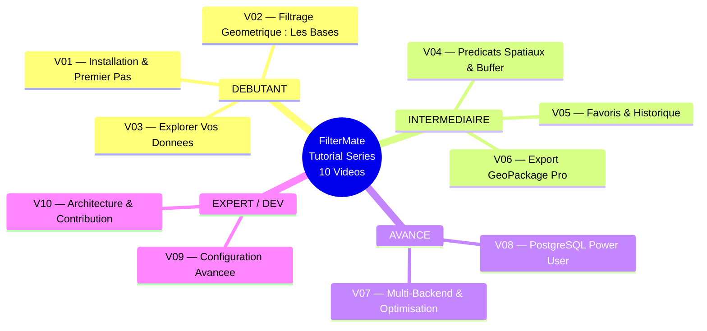

---

## 3. FICHES DETAILLEES PAR VIDEO

---

### VIDEO 01 — Installation & Premier Pas
**Niveau** : Debutant | **Duree** : 5-7 min | **Prerequis** : QGIS installe

#### Objectifs pedagogiques
- Installer FilterMate depuis le depot QGIS
- Comprendre l'interface generale (3 onglets)
- Effectuer un premier filtrage simple
- Decouvrir le theme sombre et le changement de langue

#### Plan sequence

| Temps | Contenu | Type |
|-------|---------|------|
| 0:00 | Hook : "Filtrer 1M d'entites en 2 secondes" | Voix + texte |
| 0:15 | Installation via Plugin Manager | Capture QGIS |
| 0:45 | Installation psycopg2 (optionnel) | Terminal |
| 1:15 | Premier lancement — dock widget apparait | Capture QGIS |
| 1:45 | Tour de l'interface : 3 onglets | Capture annotee |
| 3:00 | Premier filtrage : Shapefile local | Demo live |
| 4:30 | Theme sombre automatique | Capture QGIS |
| 5:00 | Changement de langue (22 langues) | Capture QGIS |
| 5:30 | Ou trouver l'aide / GitHub / docs | Ecran liens |

#### Diagramme — Interface Principale

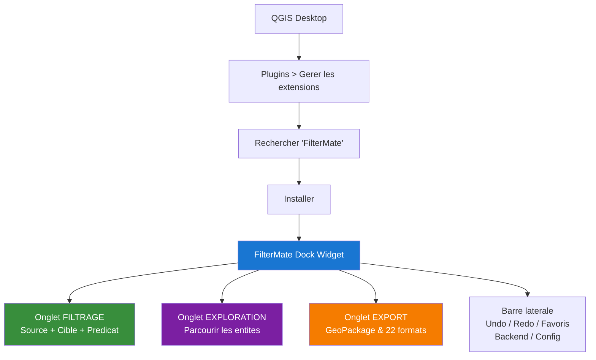

#### Captures QGIS requises
1. Plugin Manager avec FilterMate visible
2. Dock widget vide au premier lancement
3. Les 3 onglets en vue rapprochee
4. Barre laterale avec icones annotees
5. Menu de selection de langue
6. Basculement theme clair/sombre

#### Donnees de demo
- Shapefile departements France (polygones, ~100 entites)
- Shapefile communes (polygones, ~35 000 entites)
- Pas besoin de PostgreSQL pour cette video

---

### VIDEO 02 — Filtrage Geometrique : Les Bases
**Niveau** : Debutant | **Duree** : 8-10 min | **Prerequis** : V01

#### Objectifs pedagogiques
- Comprendre source vs cible
- Appliquer un filtre geometrique simple (intersects)
- Utiliser Unfilter et Reset
- Comprendre la difference entre REPLACE / AND / OR

#### Plan sequence

| Temps | Contenu | Type |
|-------|---------|------|
| 0:00 | Rappel : qu'est-ce que le filtrage spatial ? | Diagramme anime |
| 0:30 | Charger 2 couches : routes + batiments | Capture QGIS |
| 1:00 | Selectionner source = route specifique | Demo live |
| 1:30 | Selectionner cible = batiments | Demo live |
| 2:00 | Appliquer "Intersects" | Demo live |
| 3:00 | Resultat : batiments filtres | Capture QGIS |
| 3:30 | Bouton Unfilter — retour etat initial | Demo live |
| 4:00 | Bouton Reset — efface tout | Demo live |
| 4:30 | Combine operators : REPLACE vs AND vs OR | Demo live |
| 6:00 | Exercice : filtrer communes d'un departement | Demo live |
| 7:30 | Exercice : enchainer 2 filtres avec AND | Demo live |

#### Diagramme — Concept Source/Cible

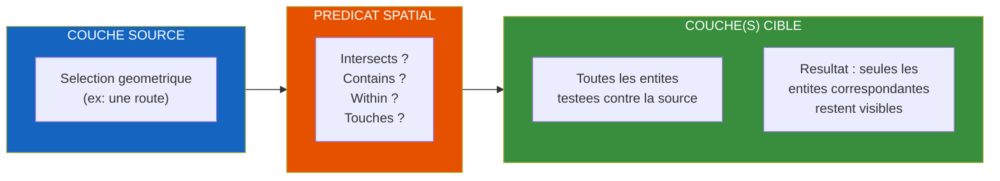

#### Diagramme — Combine Operators

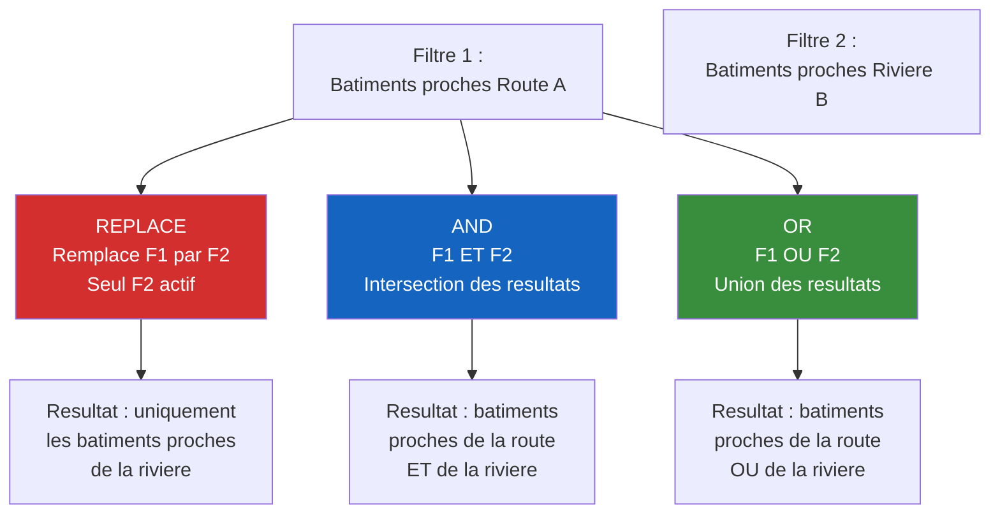

#### Captures QGIS requises
1. Carte avec routes + batiments avant filtrage
2. Selection d'une route comme source
3. Resultat apres filtrage (batiments filtres)
4. Comparaison avant/apres (split screen)
5. Interface avec combos source/cible annotes
6. Boutons Unfilter / Reset en action
7. Menu REPLACE / AND / OR

#### Donnees de demo
- Shapefile routes (lignes, ~5 000 entites)
- Shapefile batiments (polygones, ~50 000 entites)
- Shapefile departements (polygones, reference)

---

### VIDEO 03 — Explorer Vos Donnees
**Niveau** : Debutant | **Duree** : 7-8 min | **Prerequis** : V01

#### Objectifs pedagogiques
- Naviguer dans les entites d'une couche
- Utiliser Flash, Zoom, Identify
- Modes de selection : simple, multiple, custom
- Synchronisation selection QGIS <-> FilterMate

#### Plan sequence

| Temps | Contenu | Type |
|-------|---------|------|
| 0:00 | A quoi sert l'onglet Exploration ? | Voix + diagramme |
| 0:30 | Selectionner une couche a explorer | Demo live |
| 1:00 | Choisir un champ (nom, type, code...) | Demo live |
| 1:30 | Liste des valeurs uniques | Demo live |
| 2:00 | Flash Feature : surbrillance temporaire | Demo live |
| 2:30 | Zoom to Feature : centrer la carte | Demo live |
| 3:00 | Identify : attributs complets | Demo live |
| 3:30 | Mode selection simple | Demo live |
| 4:00 | Mode selection multiple (checkboxes) | Demo live |
| 4:30 | Mode selection custom (expression libre) | Demo live |
| 5:30 | Synchronisation avec la selection QGIS | Demo live |
| 6:30 | Lier les widgets d'exploration | Demo live |

#### Diagramme — Modes de Selection

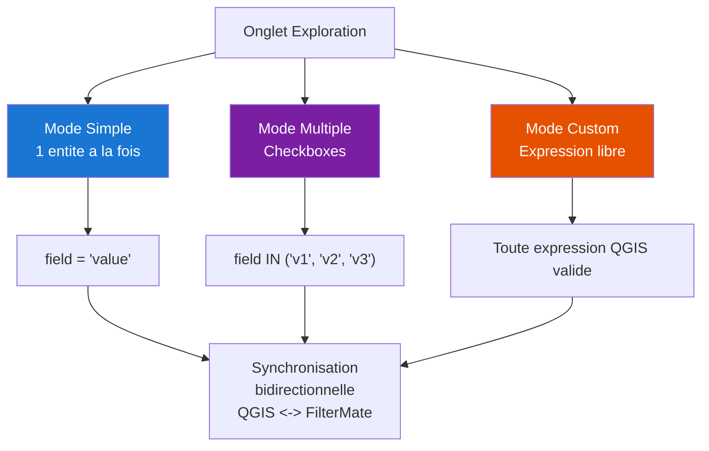

#### Diagramme — Outils de Navigation

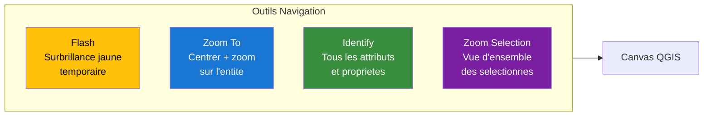

#### Captures QGIS requises
1. Onglet exploration avec liste d'entites
2. Flash d'une entite sur la carte (capture animee GIF)
3. Zoom sur une entite
4. Panel Identify avec attributs
5. Checkboxes en mode multi-selection
6. Champ d'expression en mode custom
7. Selection synchronisee entre table QGIS et FilterMate

---

### VIDEO 04 — Predicats Spatiaux & Buffer Dynamique
**Niveau** : Intermediaire | **Duree** : 10-12 min | **Prerequis** : V02

#### Objectifs pedagogiques
- Maitriser les 6 predicats spatiaux
- Comprendre quand utiliser chaque predicat
- Configurer un buffer en metres/km
- Utiliser les expressions dynamiques pour le buffer
- Buffer negatif pour filtrage inverse

#### Plan sequence

| Temps | Contenu | Type |
|-------|---------|------|
| 0:00 | Rappel : qu'est-ce qu'un predicat spatial ? | Diagramme anime |
| 0:45 | Touches — quand l'utiliser ? | Demo + schema |
| 1:30 | Intersects — le plus polyvalent | Demo + schema |
| 2:15 | Contains — source contient cible | Demo + schema |
| 3:00 | Within — cible a l'interieur de source | Demo + schema |
| 3:45 | Overlaps — chevauchement partiel | Demo + schema |
| 4:30 | Is Within Distance — buffer implicite | Demo + schema |
| 5:15 | Ajouter un buffer explicite (50m, 200m, 1km) | Demo live |
| 6:30 | Buffer dynamique avec expression QGIS | Demo live |
| 7:30 | Buffer negatif (filtrage inverse) | Demo live |
| 8:30 | Cas d'usage : zones tampon reglementaires | Demo live |
| 10:00 | Comparaison visuelle des 6 predicats | Recapitulatif |

#### Diagramme — Les 6 Predicats Illustres

```mermaid
graph TD
    subgraph TOUCHES["TOUCHES"]
        direction LR
        T_A["Polygone A"] ---|"bord commun"| T_B["Polygone B"]
    end

    subgraph INTERSECTS["INTERSECTS"]
        direction LR
        I_A["Polygone A"] ---|"tout contact<br/>spatial"| I_B["Polygone B"]
    end

    subgraph CONTAINS["CONTAINS"]
        direction TB
        C_A["Polygone A<br/>(englobant)"]
        C_B["Polygone B<br/>(a l'interieur)"]
    end

    subgraph WITHIN["WITHIN"]
        direction TB
        W_A["Polygone A<br/>(a l'interieur)"]
        W_B["Polygone B<br/>(englobant)"]
    end

    subgraph OVERLAPS["OVERLAPS"]
        direction LR
        O_A["Polygone A"] ---|"zone commune<br/>partielle"| O_B["Polygone B"]
    end

    subgraph DWITHIN["IS WITHIN DISTANCE"]
        direction LR
        D_A["Polygone A"] -.-|"distance < N m"| D_B["Polygone B"]
    end
```

#### Diagramme — Pipeline Buffer

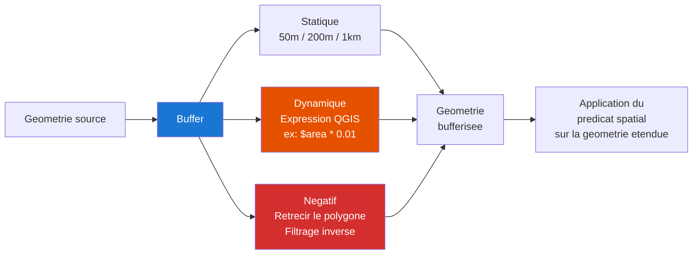

#### Captures QGIS requises
1. Illustration de chaque predicat avec 2 polygones colores
2. Resultat de chaque predicat sur le meme jeu de donnees
3. Configuration du buffer dans l'interface
4. Comparaison buffer 50m vs 200m vs 1km
5. Expression dynamique dans le champ buffer
6. Buffer negatif avec geometrie retrecie visible
7. Tableau comparatif des predicats (recapitulatif)

#### Donnees de demo
- Couche zones inondables (polygones)
- Couche batiments avec attribut "etages"
- Couche riviere (lignes)
- Couche routes (lignes)

---

### VIDEO 05 — Favoris & Historique
**Niveau** : Intermediaire | **Duree** : 6-8 min | **Prerequis** : V02

#### Objectifs pedagogiques
- Sauvegarder un filtre en favori
- Rappeler, renommer, dupliquer un favori
- Importer/exporter des favoris (JSON)
- Naviguer dans l'historique (100 etats)
- Undo/Redo avec Ctrl+Z / Ctrl+Y

#### Plan sequence

| Temps | Contenu | Type |
|-------|---------|------|
| 0:00 | Pourquoi sauvegarder ses filtres ? | Voix + diagramme |
| 0:30 | Sauvegarder le filtre actuel en favori | Demo live |
| 1:00 | Badge favori — indicateur visuel | Capture annotee |
| 1:30 | Rappeler un favori (1 clic) | Demo live |
| 2:00 | Renommer, dupliquer, supprimer | Demo live |
| 2:30 | Favoris globaux vs projet | Demo live |
| 3:00 | Gestionnaire de favoris (dialogue) | Demo live |
| 3:30 | Export JSON — partager avec l'equipe | Demo live |
| 4:00 | Import JSON | Demo live |
| 4:30 | Historique Undo/Redo — 100 etats | Demo live |
| 5:30 | Undo multi-couches (global state) | Demo live |
| 6:30 | Persistance de l'historique | Demo live |

#### Diagramme — Cycle de Vie d'un Favori

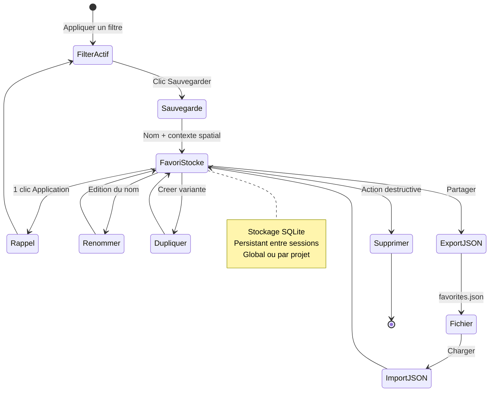

#### Diagramme — Undo/Redo Stack

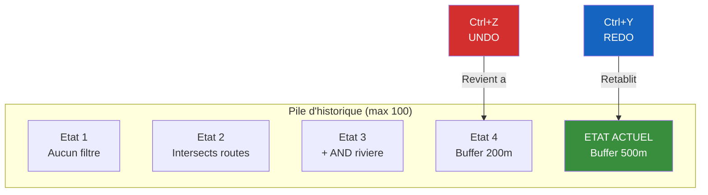

#### Captures QGIS requises
1. Bouton "Sauvegarder en favori" dans l'interface
2. Badge compteur de favoris
3. Menu de rappel rapide (top 10)
4. Dialogue gestionnaire de favoris
5. Dialogue export/import JSON
6. Boutons Undo/Redo en action
7. Indicateur de position dans l'historique

---

### VIDEO 06 — Export GeoPackage Pro
**Niveau** : Intermediaire | **Duree** : 8-10 min | **Prerequis** : V02

#### Objectifs pedagogiques
- Exporter des couches filtrees en GeoPackage
- Comprendre l'integration du projet QGIS dans le GPKG
- Preserver styles, groupes et CRS
- Export multi-formats (22+ formats)
- Export streaming pour gros volumes
- Cas d'usage : livrable client

#### Plan sequence

| Temps | Contenu | Type |
|-------|---------|------|
| 0:00 | Pourquoi exporter ? Cas d'usage metier | Diagramme |
| 0:30 | Onglet Export — vue d'ensemble | Demo live |
| 1:00 | Selection des couches a exporter | Demo live |
| 1:30 | Options : CRS, styles, groupes | Demo live |
| 2:00 | Export simple → GeoPackage | Demo live |
| 3:00 | Ouvrir le GPKG resultant | Demo live |
| 3:30 | Projet embarque — reconstruction auto | Demo live |
| 4:30 | Hierarchie de groupes preservee | Demo live |
| 5:00 | Styles et renderers intacts | Demo live |
| 5:30 | Export multi-formats : GeoJSON, KML, CSV | Demo live |
| 6:30 | Export streaming (>10k entites) | Demo live |
| 7:30 | Zip archive en sortie | Demo live |
| 8:00 | Recapitulatif : livrable complet en 1 fichier | Schema |

#### Diagramme — Pipeline d'Export GeoPackage

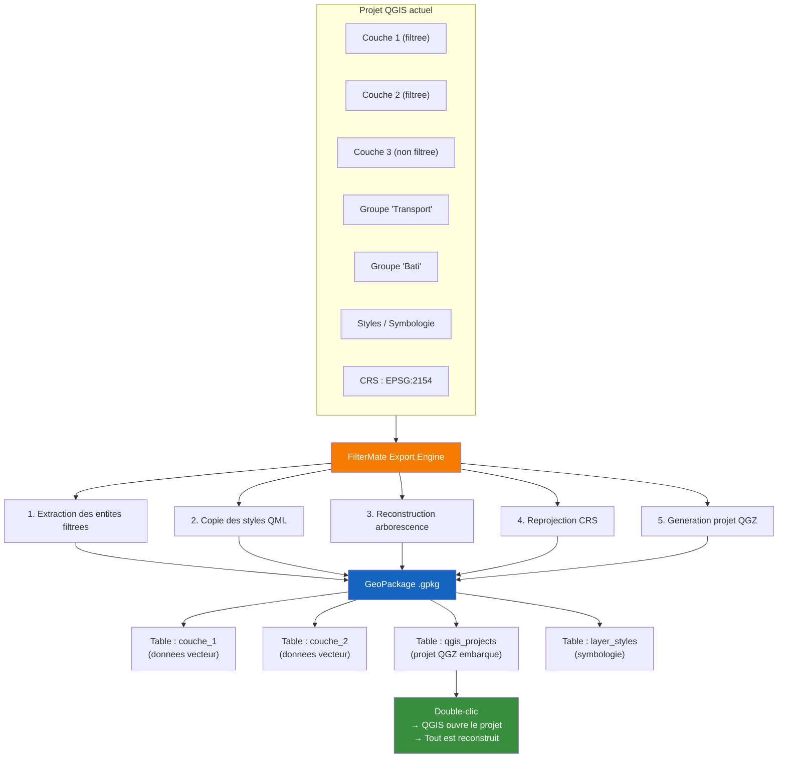

#### Diagramme — Formats Supportes

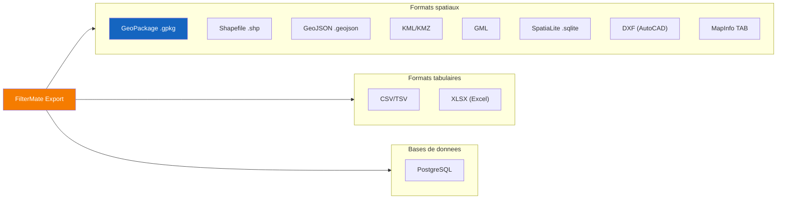

#### Captures QGIS requises
1. Onglet Export avec options selectionnees
2. Dialogue de selection de chemin de sortie
3. Progress bar pendant l'export
4. GeoPackage ouvert dans QGIS — arborescence reconstruite
5. Comparaison cote a cote : projet original vs GPKG
6. Export GeoJSON dans un editeur texte
7. Export KML ouvert dans Google Earth (si possible)

---

### VIDEO 07 — Multi-Backend & Optimisation
**Niveau** : Avance | **Duree** : 10-12 min | **Prerequis** : V02, V04

#### Objectifs pedagogiques
- Comprendre les 4 backends et leurs performances
- Voir le badge backend et le changement manuel
- Configurer les optimisations automatiques
- Comprendre la strategie centroide
- Dialogue d'optimisation
- PostgreSQL session management

#### Plan sequence

| Temps | Contenu | Type |
|-------|---------|------|
| 0:00 | Pourquoi plusieurs backends ? | Diagramme |
| 0:45 | Badge backend — identification visuelle | Capture annotee |
| 1:15 | Auto-selection : comment ca marche ? | Diagramme anime |
| 2:00 | Demo : meme filtre sur 4 backends | Demo live chrono |
| 3:30 | Forcer un backend manuellement | Demo live |
| 4:00 | Memory optimization (PG < 5k → Memory) | Demo live |
| 4:30 | Centroide auto-enable (>5k entites) | Demo live |
| 5:30 | Dialogue d'optimisation | Demo live |
| 6:30 | Seuils configurables | Demo live |
| 7:30 | Strategie Attribute-First vs BBox-Prefilter | Diagramme |
| 8:30 | Requetes progressives (progressive chunking) | Diagramme |
| 9:30 | Benchmarks : tableau comparatif | Tableau anime |

#### Diagramme — Selection Automatique du Backend

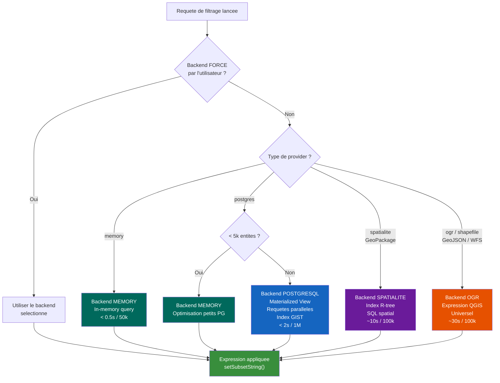

#### Diagramme — Benchmark Comparatif

```mermaid
xychart-beta
    title "Temps de filtrage par backend (secondes)"
    x-axis ["10k", "50k", "100k", "500k", "1M"]
    y-axis "Temps (s)" 0 --> 120
    bar "PostgreSQL" [0.5, 0.8, 1.2, 1.8, 2.5]
    bar "Spatialite" [1.5, 5, 10, 35, 60]
    bar "OGR" [5, 15, 30, 80, 120]
    bar "Memory" [0.2, 0.3, 0.5, 2, 5]
```

#### Diagramme — Strategies d'Optimisation

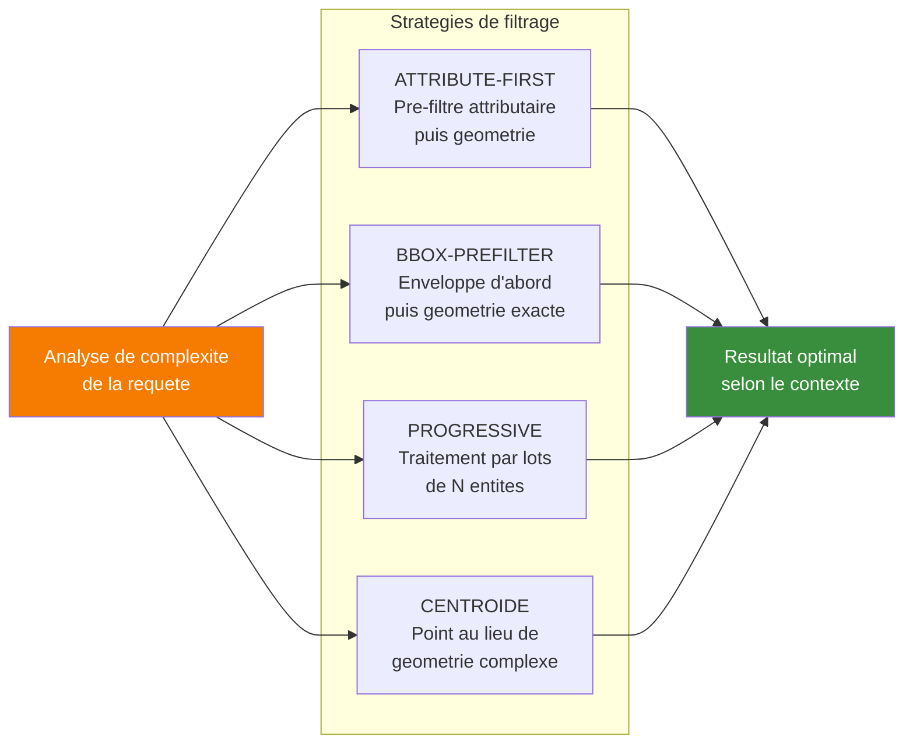

#### Captures QGIS requises
1. Badge backend avec icone (PostgreSQL, Spatialite, OGR, Memory)
2. Menu de selection de backend
3. Chronometre visible pendant filtrage sur chaque backend
4. Dialogue d'optimisation avec recommandations
5. Option centroide activee/desactivee — comparaison visuelle
6. Tab configuration avec seuils

---

### VIDEO 08 — PostgreSQL Power User
**Niveau** : Avance | **Duree** : 10-12 min | **Prerequis** : V07, PostgreSQL

#### Objectifs pedagogiques
- Comprendre les vues materialisees (fm_temp_mv_*)
- Detection automatique de la cle primaire
- Session management et cleanup
- Filtrage parallele multi-couches
- Performances sur BDTopo / OSM
- Tuning : connexion pool, timeouts

#### Plan sequence

| Temps | Contenu | Type |
|-------|---------|------|
| 0:00 | PostgreSQL + FilterMate = performance extreme | Voix |
| 0:30 | Vue materialisee : qu'est-ce que c'est ? | Diagramme |
| 1:30 | Demo : voir les MV dans pgAdmin | Capture pgAdmin |
| 2:30 | Prefix fm_temp_ : identification facile | Capture pgAdmin |
| 3:00 | Auto-cleanup vs cleanup manuel | Demo live |
| 3:30 | Dialogue info session PostgreSQL | Demo live |
| 4:00 | Detection cle primaire (id, fid, ogc_fid, cleabs) | Diagramme |
| 5:00 | Demo BDTopo : 1M batiments, filtrage < 2s | Demo live |
| 6:00 | Demo OSM : tables sans PK standard | Demo live |
| 6:30 | Filtrage parallele multi-couches | Demo live |
| 7:30 | Configuration : timeouts, batch size, pool | Demo live |
| 8:30 | Securite : sanitize_sql_identifier | Diagramme |
| 9:30 | Bonnes pratiques PostgreSQL | Recapitulatif |

#### Diagramme — Cycle de Vie Materialized View

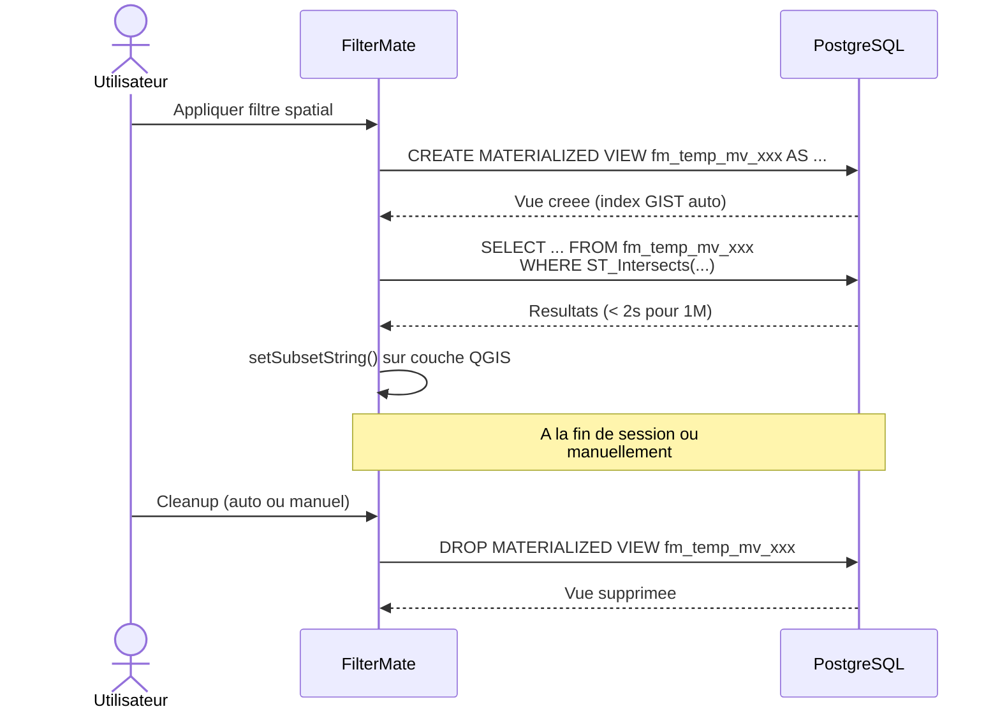

#### Diagramme — Detection Cle Primaire

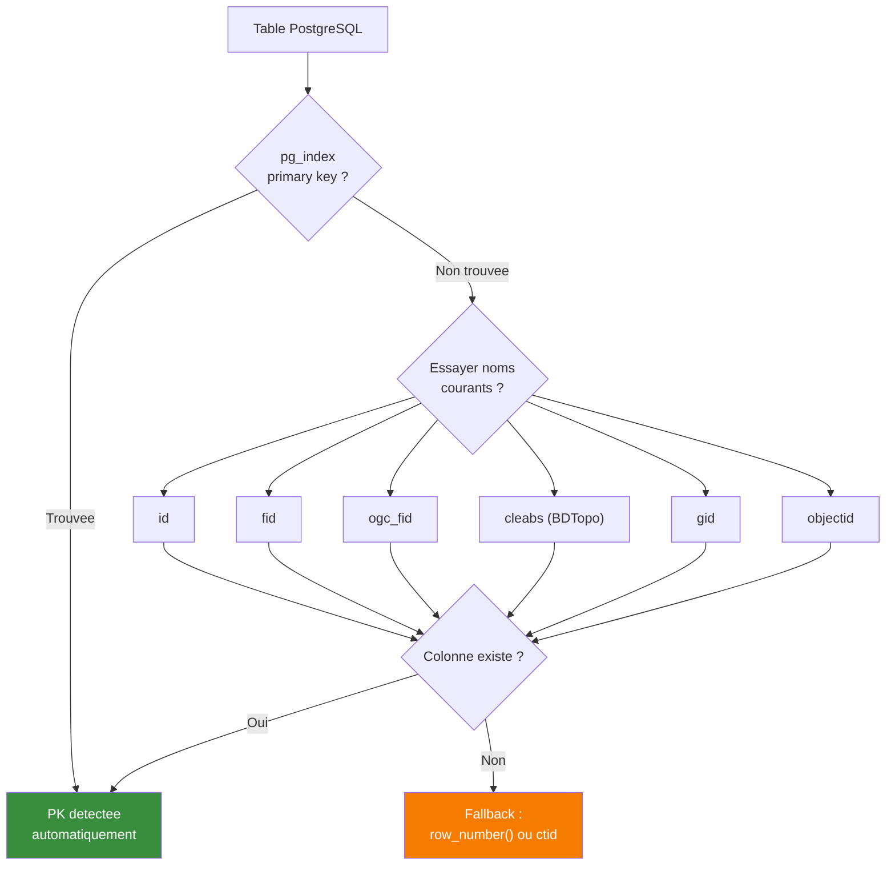

#### Captures QGIS requises
1. pgAdmin avec vues materialisees fm_temp_mv_* visibles
2. Dialogue info session PostgreSQL dans FilterMate
3. Bouton cleanup en action
4. Demo BDTopo avec chronometre
5. Tab config PostgreSQL (timeouts, pool size)
6. Logs de filtrage parallele

#### Donnees de demo
- BDTopo batiments PostGIS (~1M entites)
- OSM routes PostGIS (~500k entites)
- Schema temporaire avec vues materialisees

---

### VIDEO 09 — Configuration Avancee
**Niveau** : Expert | **Duree** : 8-10 min | **Prerequis** : V01

#### Objectifs pedagogiques
- Naviguer dans l'editeur de configuration
- Personnaliser les debounce timers
- Ajuster les seuils de performance
- Configurer le cache d'expressions
- Personnaliser le theme et les couleurs
- TreeView JSON pour reglages fins

#### Plan sequence

| Temps | Contenu | Type |
|-------|---------|------|
| 0:00 | Ouvrir les parametres FilterMate | Demo live |
| 0:30 | Structure de la configuration | Diagramme |
| 1:00 | Feedback level : minimal / normal / verbose | Demo live |
| 1:30 | Theme : auto / default / dark / light | Demo live |
| 2:00 | Position du dock et de la barre d'actions | Demo live |
| 2:30 | Profil UI : compact / normal / HiDPI | Demo live |
| 3:00 | Debounce timers (expression, filtre, canvas) | Demo live |
| 3:30 | Cache d'expressions (taille, TTL) | Demo live |
| 4:00 | Seuils d'optimisation | Demo live |
| 4:30 | Spatialite tuning (batch size, timeout) | Demo live |
| 5:00 | Expression builder limits | Demo live |
| 5:30 | Export defaults (GPKG, streaming) | Demo live |
| 6:00 | JSON TreeView pour reglages fins | Demo live |
| 7:00 | config.default.json vs config.json | Diagramme |
| 7:30 | Reset configuration | Demo live |

#### Diagramme — Arborescence Configuration

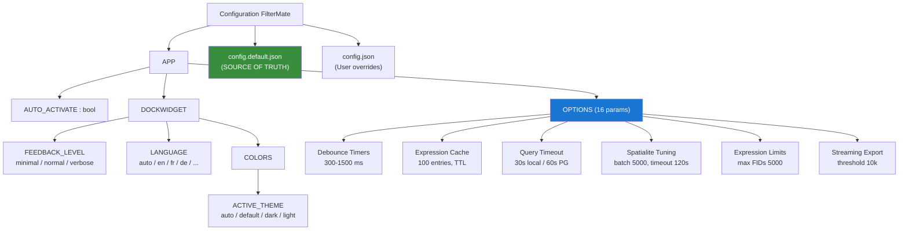

#### Captures QGIS requises
1. Dialogue de configuration — vue d'ensemble
2. Onglets de configuration (par categorie)
3. Spinbox avec validation min/max
4. Color picker pour themes
5. JSON TreeView avec config brute
6. Comparaison feedback minimal vs verbose

---

### VIDEO 10 — Architecture & Contribution
**Niveau** : Expert/Dev | **Duree** : 10-12 min | **Prerequis** : Connaissances Python

#### Objectifs pedagogiques
- Comprendre l'architecture hexagonale de FilterMate
- Naviguer dans la structure du code
- Comprendre les patterns (Factory, Strategy, Command, MVC)
- Comprendre le systeme de tests (600 tests)
- Comment contribuer au projet

#### Plan sequence

| Temps | Contenu | Type |
|-------|---------|------|
| 0:00 | Pourquoi l'architecture est importante | Voix |
| 0:30 | Vue d'ensemble hexagonale (4 couches) | Diagramme anime |
| 1:30 | Core Domain : modeles purs Python | Code + diagramme |
| 2:30 | Ports & Adapters : les interfaces | Code + diagramme |
| 3:30 | Backend Factory : ajout d'un backend | Code + diagramme |
| 4:30 | 13 Controllers MVC | Diagramme |
| 5:30 | FilterEngineTask : les 12 handlers | Diagramme |
| 6:30 | Systeme de signaux Qt | Diagramme |
| 7:30 | Thread safety dans QGIS | Code + diagramme |
| 8:00 | Suite de tests : 600 tests | Terminal |
| 8:30 | CI/CD GitHub Actions | Capture GitHub |
| 9:00 | Comment contribuer : fork, branch, PR | Terminal |
| 9:30 | Bonnes pratiques du projet | Recapitulatif |

#### Diagramme — Architecture Hexagonale Complete

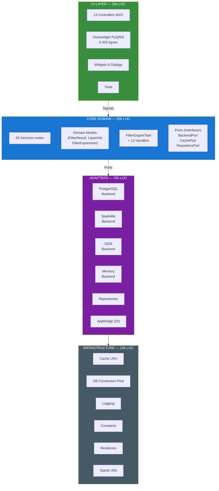

#### Diagramme — Les 12 Handlers du FilterEngineTask

```mermaid
flowchart LR
    TASK["FilterEngineTask.run()"]

    TASK --> H1["1. Initialization<br/>Handler"]
    H1 --> H2["2. Source Geometry<br/>Preparer"]
    H2 --> H3["3. Expression<br/>Facade"]
    H3 --> H4["4. Filtering<br/>Orchestrator"]
    H4 --> H5["5. Attribute Filter<br/>Executor"]
    H5 --> H6["6. Spatial Filter<br/>Executor"]
    H6 --> H7["7. Backend<br/>Connector"]
    H7 --> H8["8. Materialized View<br/>Handler"]
    H8 --> H9["9. Subset Management<br/>Handler"]
    H9 --> H10["10. Export<br/>Handler"]
    H10 --> H11["11. Cleanup<br/>Handler"]
    H11 --> H12["12. Finished<br/>Handler"]
```

#### Diagramme — Thread Safety QGIS

```mermaid
flowchart TD
    subgraph MAIN["THREAD PRINCIPAL (UI)"]
        direction TB
        M1["Emission de signaux"]
        M2["Mise a jour UI"]
        M3["Acces QgsVectorLayer"]
    end

    subgraph WORKER["WORKER THREAD (QgsTask)"]
        direction TB
        W1["FilterEngineTask.run()"]
        W2["Requetes backend"]
        W3["Traitement geometrie"]
        W4["PAS d'acces QgsVectorLayer"]
    end

    RULE1["Regle 1 : Stocker URI dans __init__<br/>Recreer provider dans run()"]
    RULE2["Regle 2 : QgsGeometry OK<br/>(cree depuis WKT/WKB)"]
    RULE3["Regle 3 : Signals uniquement<br/>dans finished() callback"]

    WORKER -.->|"INTERDIT"| M3
    WORKER -->|"finished()"| MAIN

    style MAIN fill:#388E3C,color:#fff
    style WORKER fill:#1565C0,color:#fff
    style RULE1 fill:#FFC107,color:#000
    style RULE2 fill:#FFC107,color:#000
    style RULE3 fill:#FFC107,color:#000
```

#### Diagramme — Patterns Utilises

```mermaid
mindmap
  root((Design Patterns<br/>FilterMate))
    Creational
      Factory<br/>(BackendFactory)
      DI Container<br/>(AppBridge)
    Structural
      Adapter<br/>(QGIS Bridge)
      Repository<br/>(Data Access)
      MVC<br/>(Controllers)
    Behavioral
      Strategy<br/>(Multi-backend)
      Command<br/>(Undo/Redo)
      Observer<br/>(Qt Signals)
      Template Method<br/>(BaseController)
      Chain of Responsibility<br/>(12 Handlers)
    Architectural
      Hexagonal<br/>(Ports & Adapters)
      Service Locator<br/>(AppBridge)
```

#### Captures QGIS requises / Code
1. Arborescence du projet dans un IDE
2. Core domain models (code Python)
3. Interface Port (code Python)
4. Backend Factory (code Python)
5. Tests en execution dans le terminal
6. GitHub Actions CI/CD (capture GitHub)
7. Page de contribution GitHub

---

## 4. RECAPITULATIF DE PRODUCTION

### 4.1 Inventaire des Ressources

#### Diagrammes Mermaid par video

| Video | Diagrammes | Types |
|-------|:---:|--------|
| V01 | 1 | flowchart |
| V02 | 2 | flowchart |
| V03 | 2 | flowchart, graph |
| V04 | 2 | graph, flowchart |
| V05 | 2 | stateDiagram, flowchart |
| V06 | 2 | flowchart, graph |
| V07 | 3 | flowchart, xychart, flowchart |
| V08 | 2 | sequenceDiagram, flowchart |
| V09 | 1 | graph |
| V10 | 4 | graph, flowchart, flowchart, mindmap |
| **TOTAL** | **21** | |

#### Captures QGIS requises par video

| Video | Captures | Categories |
|-------|:---:|---------|
| V01 | 6 | Installation, UI, theme |
| V02 | 7 | Filtrage, comparaison, boutons |
| V03 | 7 | Exploration, selection, sync |
| V04 | 7 | Predicats, buffer, comparaison |
| V05 | 7 | Favoris, historique, badges |
| V06 | 7 | Export, GPKG, multi-format |
| V07 | 6 | Backends, benchmark, optimisation |
| V08 | 6 | pgAdmin, MV, BDTopo, config |
| V09 | 6 | Config dialog, JSON, themes |
| V10 | 7 | Code, IDE, tests, GitHub |
| **TOTAL** | **66** | |

### 4.2 Donnees de Demo Necessaires

| Dataset | Type | Source | Videos |
|---------|------|--------|--------|
| Departements France | Polygones, Shapefile | admin-express IGN | V01, V02 |
| Communes France | Polygones, Shapefile | admin-express IGN | V01, V02 |
| Routes BDTopo | Lignes, Shapefile/PG | BDTopo IGN | V02, V04, V08 |
| Batiments BDTopo | Polygones, PostGIS | BDTopo IGN | V02, V04, V07, V08 |
| Zones inondables | Polygones | Georisques | V04 |
| Riviere | Lignes | BD Carthage | V04 |
| OSM routes | Lignes, PostGIS | OpenStreetMap | V08 |
| GeoPackage exemple | Vecteur multi-couches | Auto-genere | V06 |
| GeoJSON communes | GeoJSON | Export | V06 |

### 4.3 Logiciels & Outils de Production

| Outil | Usage |
|-------|-------|
| OBS Studio | Capture ecran QGIS |
| QGIS 3.34+ LTR | Demo live |
| pgAdmin 4 | Captures PostgreSQL |
| Mermaid Live Editor | Generation diagrammes SVG/PNG |
| DaVinci Resolve / Shotcut | Montage video |
| Canva / Figma | Thumbnails, annotations |
| Audacity | Voix off |
| GitHub Pages | Hebergement site + videos |

### 4.4 Planning de Production Suggere

```mermaid
gantt
    title Plan de production — Serie tutoriels FilterMate
    dateFormat YYYY-MM-DD
    axisFormat %b %d

    section Preparation
    Collecte donnees demo          :prep1, 2026-03-17, 5d
    Generation diagrammes Mermaid  :prep2, 2026-03-17, 3d
    Configuration QGIS + themes   :prep3, 2026-03-20, 2d

    section Captures QGIS
    V01-V03 Debutant              :cap1, 2026-03-24, 3d
    V04-V06 Intermediaire         :cap2, after cap1, 4d
    V07-V08 Avance                :cap3, after cap2, 4d
    V09-V10 Expert                :cap4, after cap3, 3d

    section Post-production
    Montage V01-V03               :post1, after cap1, 5d
    Montage V04-V06               :post2, after cap2, 5d
    Montage V07-V08               :post3, after cap3, 4d
    Montage V09-V10               :post4, after cap4, 4d

    section Publication
    V01-V03 en ligne              :milestone, after post1, 0d
    V04-V06 en ligne              :milestone, after post2, 0d
    V07-V08 en ligne              :milestone, after post3, 0d
    V09-V10 en ligne              :milestone, after post4, 0d
```

---

## 5. SPECIFICATIONS TECHNIQUES VIDEO

### 5.1 Format & Qualite

| Parametre | Valeur |
|-----------|--------|
| Resolution | 1920x1080 (Full HD) |
| FPS | 30 |
| Codec | H.264 / H.265 |
| Bitrate | 8-12 Mbps |
| Audio | AAC 128kbps, mono |
| Langue | Francais (voix off) |
| Sous-titres | EN, FR (SRT) |
| Ratio | 16:9 |
| Intro/Outro | 3-5 secondes |

### 5.2 Charte Graphique

| Element | Specification |
|---------|---------------|
| Police titres | Inter Bold |
| Police texte | Inter Regular |
| Couleur primaire | #1976D2 (bleu) |
| Couleur secondaire | #388E3C (vert) |
| Couleur accent | #F57C00 (orange) |
| Fond sombre | #0a0e1a |
| Fond clair | #ffffff |
| Logo | FilterMate SVG (resources/) |
| Watermark | Coin bas-droit, semi-transparent |

### 5.3 Nomenclature Fichiers

```
filtermate-tutorial-v01-installation.mp4
filtermate-tutorial-v02-filtrage-bases.mp4
filtermate-tutorial-v03-exploration.mp4
filtermate-tutorial-v04-predicats-buffer.mp4
filtermate-tutorial-v05-favoris-historique.mp4
filtermate-tutorial-v06-export-gpkg.mp4
filtermate-tutorial-v07-multi-backend.mp4
filtermate-tutorial-v08-postgresql-power.mp4
filtermate-tutorial-v09-configuration.mp4
filtermate-tutorial-v10-architecture.mp4
```

---

## 6. MATRICE DE COUVERTURE FONCTIONNELLE

Cette matrice garantit que **chaque fonctionnalite du plugin est couverte par au moins une video**.

| Fonctionnalite | V01 | V02 | V03 | V04 | V05 | V06 | V07 | V08 | V09 | V10 |
|---|:---:|:---:|:---:|:---:|:---:|:---:|:---:|:---:|:---:|:---:|
| Installation | X | | | | | | | | | |
| Interface 3 onglets | X | | | | | | | | | |
| Theme sombre/clair | X | | | | | | | | X | |
| 22 langues | X | | | | | | | | X | |
| Filtrage simple | X | X | | | | | | | | |
| Source / Cible | | X | | | | | | | | |
| 6 predicats | | | | X | | | | | | |
| Buffer m/km | | | | X | | | | | | |
| Buffer dynamique | | | | X | | | | | | |
| Buffer negatif | | | | X | | | | | | |
| REPLACE / AND / OR | | X | | | | | | | | |
| Unfilter / Reset | | X | | | | | | | | |
| Exploration vecteur | | | X | | | | | | | |
| Flash / Zoom / Identify | | | X | | | | | | | |
| Selection simple | | | X | | | | | | | |
| Selection multiple | | | X | | | | | | | |
| Selection custom | | | X | | | | | | | |
| Sync selection QGIS | | | X | | | | | | | |
| Lier widgets | | | X | | | | | | | |
| Favoris CRUD | | | | | X | | | | | |
| Favoris import/export | | | | | X | | | | | |
| Badge favori | | | | | X | | | | | |
| Undo/Redo 100 etats | | | | | X | | | | | |
| Historique persistant | | | | | X | | | | | |
| Export GeoPackage | | | | | | X | | | | |
| Projet embarque | | | | | | X | | | | |
| Styles preserves | | | | | | X | | | | |
| Groupes preserves | | | | | | X | | | | |
| 22 formats export | | | | | | X | | | | |
| Streaming export | | | | | | X | | | | |
| 4 backends | | | | | | | X | | | |
| Badge backend | | | | | | | X | | | |
| Auto-selection | | | | | | | X | | | |
| Forcer backend | | | | | | | X | | | |
| Optimisation auto | | | | | | | X | | | |
| Centroide auto | | | | | | | X | | | |
| Strategies filtrage | | | | | | | X | | | |
| Materialized Views | | | | | | | | X | | |
| PK auto-detection | | | | | | | | X | | |
| Session cleanup | | | | | | | | X | | |
| Filtrage parallele | | | | | | | | X | | |
| BDTopo / OSM | | | | | | | | X | | |
| Tuning PostgreSQL | | | | | | | | X | | |
| Config editor | | | | | | | | | X | |
| Debounce timers | | | | | | | | | X | |
| Cache expressions | | | | | | | | | X | |
| Seuils performance | | | | | | | | | X | |
| JSON TreeView | | | | | | | | | X | |
| Architecture hexa | | | | | | | | | | X |
| 12 handlers | | | | | | | | | | X |
| Thread safety | | | | | | | | | | X |
| 600 tests | | | | | | | | | | X |
| CI/CD GitHub | | | | | | | | | | X |
| Contribution | | | | | | | | | | X |

**Couverture : 52/52 fonctionnalites = 100%**

---

## 7. KPI & METRIQUES DE SUCCES

| KPI | Objectif |
|-----|---------|
| Nombre de videos | 10 |
| Duree totale | ~75 min |
| Diagrammes Mermaid | 21 |
| Captures QGIS | 66 |
| Fonctionnalites couvertes | 100% (52/52) |
| Langues sous-titres | 2 (FR, EN) |
| Datasets demo | 9 |
| Niveaux de difficulte | 4 (debutant, intermediaire, avance, expert) |
| Vues cibles (6 mois) | 500+ par video |
| Taux d'installation post-video | +20% |

---

*Audit genere le 14 Mars 2026 — FilterMate v4.6.1*
*A valider par Jordan (PO) avant lancement de la production*
