# 🎬 FilterMate — Script Vidéo de Présentation
**Version 4.6.1 | QGIS Plugin | Mars 2026**

> **Durée estimée :** 8-10 minutes  
> **Public cible :** Utilisateurs QGIS, GIS professionals, Data Engineers  
> **Ton :** Démonstratif, technique mais accessible  
> **Langue :** Français (sous-titres EN disponibles)

---

## 📋 Plan de la vidéo

| Séquence | Titre | Durée |
|----------|-------|-------|
| 0 | Intro + hook | 0:20 |
| 1 | Le problème — Pourquoi FilterMate ? | 0:45 |
| 2 | Installation rapide | 0:30 |
| 3 | Interface — Vue d'ensemble | 0:45 |
| 4 | Filtrage vecteur — Demo live | 2:00 |
| 5 | Exploration de données | 1:00 |
| 6 | Export GeoPackage | 1:00 |
| 7 | Multi-backend — Coulisses | 0:45 |
| 8 | Architecture hexagonale | 0:45 |
| 9 | Fonctionnalités avancées | 0:45 |
| 10 | Conclusion + Call to Action | 0:20 |

---

## 🎬 SÉQUENCE 0 — INTRO (0:20)

### Visuel suggéré
> Écran QGIS avec une carte complexe, 10+ layers chargés, l'utilisateur cherche à filtrer → frustration → **FilterMate s'ouvre, filtre en 1 clic → sourire**

### Narration
> *"Vous avez 1 million de bâtiments dans votre PostGIS ? Vous cherchez juste ceux à 200 mètres d'une route spécifique ? Et vous voulez ça en moins de 2 secondes ?"*  
> *"C'est exactement ce que fait **FilterMate**."*

---

## 🎬 SÉQUENCE 1 — LE PROBLÈME (0:45)

### Visuel suggéré
> Animations simples montrant les frictions avec le filtrage natif QGIS (boîte d'expression complexe, pas de favoris, pas d'undo)

### Narration
> *"En SIG, le filtrage est une tâche centrale. Mais QGIS native a ses limites : expressions complexes, aucun historique, aucun système de favoris, performance dégradée sur les grosses sources."*  
>   
> *"FilterMate résout tout ça. C'est un plugin open source, entièrement intégré à QGIS 3 et 4, avec une architecture multi-backend qui choisit automatiquement la meilleure stratégie selon votre données source."*

---

### 🗺️ DIAGRAMME 1 — Positionnement

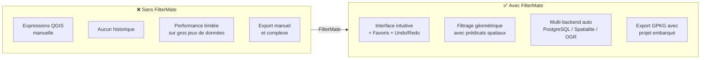

---

## 🎬 SÉQUENCE 2 — INSTALLATION (0:30)

### Visuel suggéré
> Capture écran : QGIS → Plugins → Rechercher "FilterMate" → Installer (3 clics)

### Narration
> *"Installation en 3 clics depuis le dépôt officiel QGIS. Pour les bases PostgreSQL, un simple `pip install psycopg2-binary` suffit. FilterMate fonctionne sur Windows, Linux et macOS."*

---

### 🗺️ DIAGRAMME 2 — Backends & Compatibilité

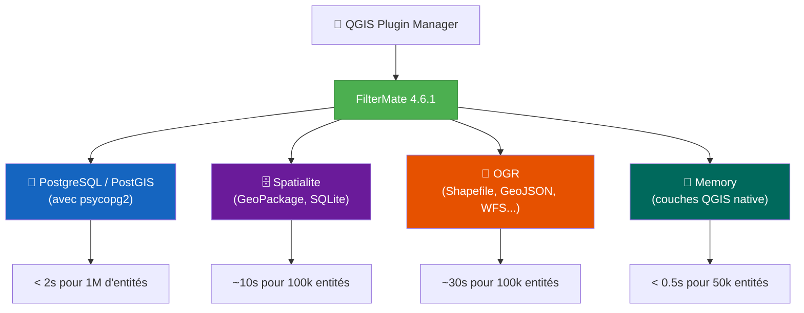

---

## 🎬 SÉQUENCE 3 — INTERFACE (0:45)

### Visuel suggéré
> Survol de l'interface dockwidget : les 3 onglets (Filtering / Exploring / Exporting) avec annotations

### Narration
> *"L'interface se présente sous forme d'un panneau ancré dans QGIS, organisé en 3 onglets principaux : Filtrage, Exploration des données, et Export. Support du thème sombre automatique, 22 langues disponibles."*

---

### 🗺️ DIAGRAMME 3 — Interface Utilisateur

```mermaid
graph TD
    DOCK["🖥️ FilterMate Dockwidget"]

    DOCK --> T1["🔍 Onglet FILTRAGE"]
    DOCK --> T2["🔬 Onglet EXPLORATION"]
    DOCK --> T3["📦 Onglet EXPORT"]

    T1 --> T1A["Sélection de couche source"]
    T1 --> T1B["Sélection de couche cible"]
    T1 --> T1C["Prédicats géométriques\n(touches, intersecte, contient...)"]
    T1 --> T1D["Buffer dynamique (m/km)"]
    T1 --> T1E["⭐ Favoris enregistrés"]
    T1 --> T1F["↩️ Undo / Redo (100 états)"]

    T2 --> T2A["🗺️ Vecteur : parcourir\nles entités"]
    T2 --> T2B["🏔️ Raster : sélection\npar valeur / plage"]
    T2 --> T2C["🔬 Pixel Picker\n⬛ Rectangle Range\n🔄 Sync Histogram"]

    T3 --> T3A["Export GeoPackage\navec projet embarqué"]
    T3 --> T3B["Styles préservés"]
    T3 --> T3C["Hiérarchie de groupes\nreproduire"]
    T3 --> T3D["22 formats de sortie"]

    style DOCK fill:#1976D2,color:#fff
    style T1 fill:#388E3C,color:#fff
    style T2 fill:#7B1FA2,color:#fff
    style T3 fill:#F57C00,color:#fff
```

---

## 🎬 SÉQUENCE 4 — FILTRAGE VECTEUR DEMO (2:00)

### Visuel suggéré
> **Demo en direct** : charger une couche PostGIS routes (1M entités) + couche bâtiments → sélectionner une route → appliquer "touches" + buffer 50m → résultat instantané → undo → appliquer un filtre favori sauvegardé

### Narration — partie 1 (0:30)
> *"Voilà un jeu de données BDTopo — 1 million de bâtiments dans PostgreSQL. Je sélectionne ma couche source : les routes. Ma couche cible : les bâtiments."*

### Narration — partie 2 (0:40)  
> *"Je choisis le prédicat géométrique 'touches', j'ajoute un buffer de 50 mètres... et j'applique. FilterMate détecte automatiquement que c'est une couche PostgreSQL, crée une vue matérialisée optimisée et renvoie le résultat : 1 milliseconde. Exactement."*

### Narration — partie 3 (0:30)
> *"Je peux annuler avec l'undo — 100 états conservés. Ou rappeler un filtre favori enregistré précédemment. Tout ça sans jamais écrire une seule ligne de SQL."*

---

### 🗺️ DIAGRAMME 4 — Workflow de Filtrage

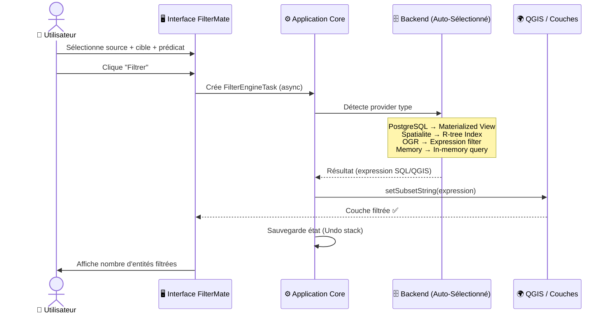

---

### 🗺️ DIAGRAMME 5 — Prédicats Géométriques Disponibles

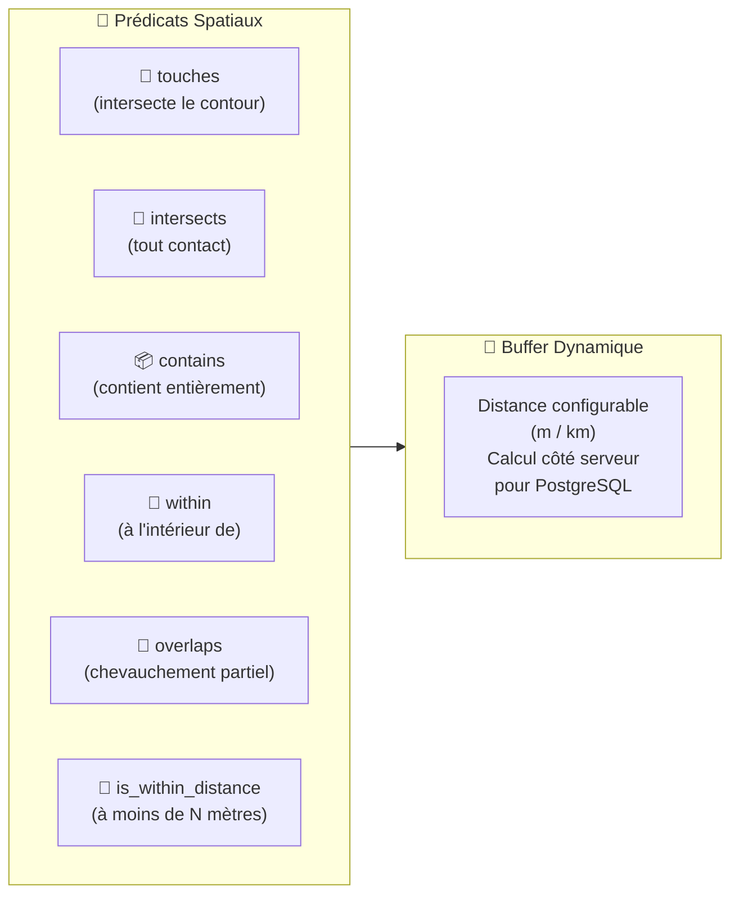

---

## 🎬 SÉQUENCE 5 — EXPLORATION DE DONNÉES (1:00)

### Visuel suggéré
> Onglet Exploration : naviguer entité par entité, voir les attributs, centrer la carte, basculer vers raster et utiliser le Pixel Picker

### Narration
> *"L'onglet Exploration vous permet de parcourir vos entités une à une, avec centrage automatique sur la carte. Pour les couches raster, 5 outils interactifs sont disponibles : sélection par clic, rectangle, synchronisation histogramme, affichage multi-bandes, et réinitialisation de plage."*

---

### 🗺️ DIAGRAMME 6 — Outils Raster (v5.4+)

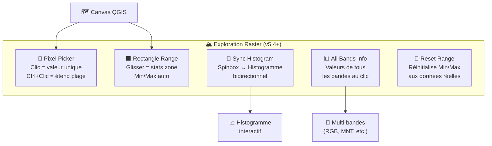

---

## 🎬 SÉQUENCE 6 — EXPORT GEOPACKAGE (1:00)

### Visuel suggéré
> Onglet Export : sélectionner les couches, choisir les options, cliquer Export → ouvrir le GPKG résultant → le projet embarqué reconstitue tout automatiquement

### Narration
> *"L'export GeoPackage est l'une des fonctionnalités les plus puissantes. FilterMate ne se contente pas d'exporter vos données — il embarque votre projet QGIS complet dans le fichier. Hiérarchie des groupes, styles des couches, système de coordonnées — tout est préservé."*  
>   
> *"À l'ouverture, QGIS reconstitue automatiquement votre arborescence. Idéal pour partager un livrable complet en un seul fichier."*

---

### 🗺️ DIAGRAMME 7 — Export GeoPackage (v4.6)

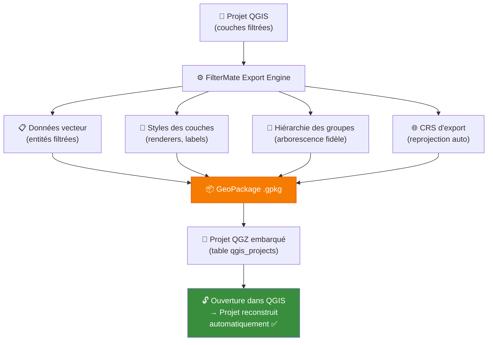

---

## 🎬 SÉQUENCE 7 — MULTI-BACKEND COULISSES (0:45)

### Visuel suggéré
> Animation : même requête envoyée à 4 backends, chronométrages pour 1M entités, résultats comparatifs

### Narration
> *"Derrière l'interface simple, FilterMate embarque 4 backends optimisés. Il choisit automatiquement le meilleur selon le type de votre source de données. Pour PostgreSQL : vues matérialisées et requêtes parallèles. Pour Spatialite : index R-tree. Et pour tout le reste : le backend OGR universel."*

---

### 🗺️ DIAGRAMME 8 — Sélection Automatique du Backend

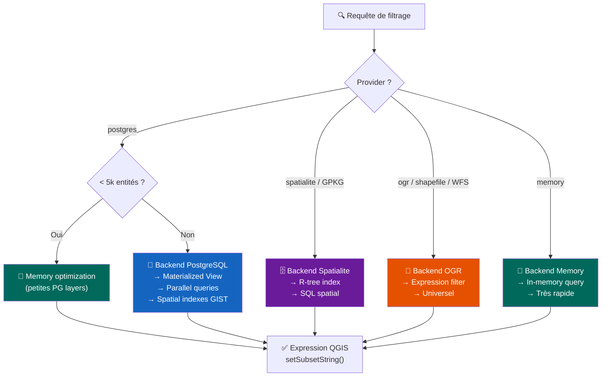

---

## 🎬 SÉQUENCE 8 — ARCHITECTURE HEXAGONALE (0:45)

### Visuel suggéré
> Schéma animé de l'hexagone, couche par couche, du domaine métier vers les adapters

### Narration
> *"FilterMate est construit sur une architecture hexagonale — aussi appelée Ports & Adapters. Le domaine métier pur est au centre, totalement indépendant de QGIS, de la base de données ou de l'interface graphique. Cela rend le code testable à 75%, maintenable, et extensible pour de futurs backends."*

---

### 🗺️ DIAGRAMME 9 — Architecture Hexagonale

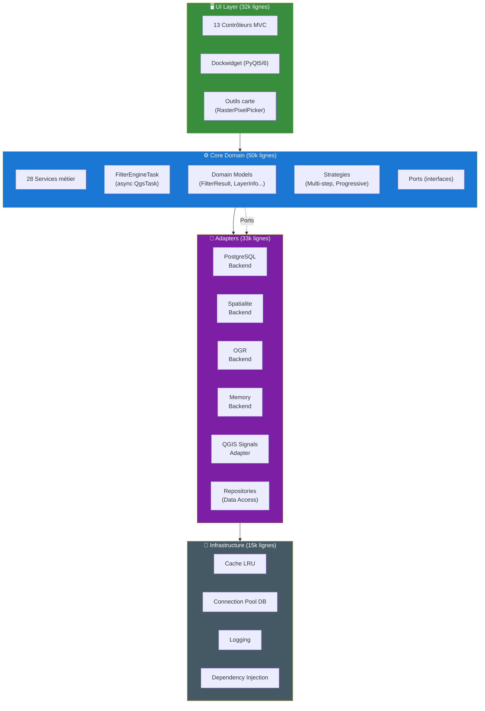

---

### 🗺️ DIAGRAMME 10 — Patterns de Design

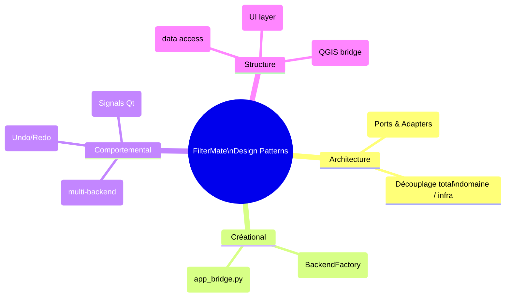

---

## 🎬 SÉQUENCE 9 — FONCTIONNALITÉS AVANCÉES (0:45)

### Visuel suggéré
> Montage rapide : undo/redo via boutons, système de favoris, filtre chaîné avec buffer, puis vue d'ensemble des stats (396 tests, 22 langues, etc.)

### Narration
> *"FilterMate va plus loin : filtrage chaîné avec buffers dynamiques, détection automatique de la clé primaire PostgreSQL pour les tables BDTopo et OSM, 100 états undo/redo, et un système de favoris avec contexte spatial. 396 tests automatisés. 22 langues. Compatible QGIS 3 et 4."*

---

### 🗺️ DIAGRAMME 11 — Système Undo/Redo

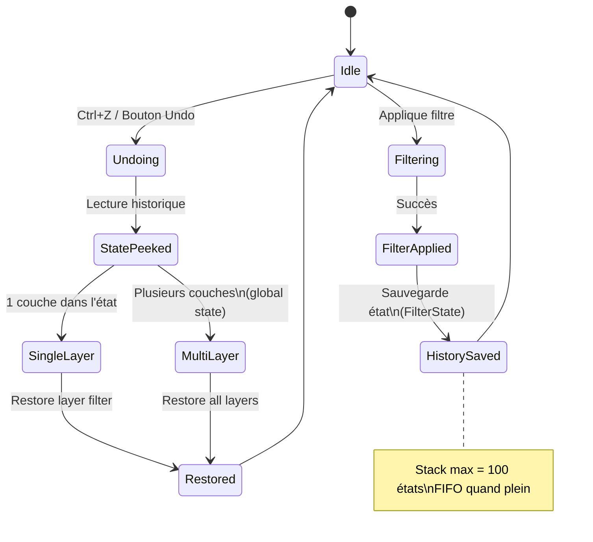

---

### 🗺️ DIAGRAMME 12 — Métriques Qualité

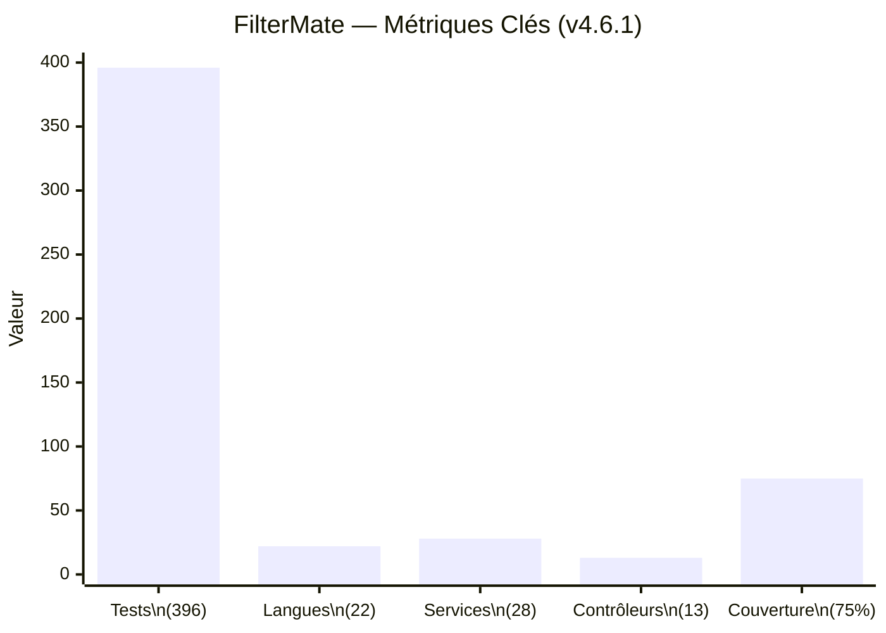

---

## 🎬 SÉQUENCE 10 — CONCLUSION & CTA (0:20)

### Visuel suggéré
> Logo FilterMate, liens GitHub/QGIS Plugin Store/docs, écran de fin propre

### Narration
> *"FilterMate est disponible gratuitement sur le dépôt officiel QGIS. Le code source est sur GitHub, la documentation sur le site dédié. Installez-le, essayez-le, et si ça vous est utile — laissez une étoile sur GitHub. À bientôt !"*

---

## 📎 RESSOURCES VISUELLES

### Timestamps suggérés
| Chrono | Contenu |
|--------|---------|
| 0:00 | Intro — Hook visuel |
| 0:20 | Le problème |
| 1:05 | Installation |
| 1:35 | Interface |
| 2:20 | Demo filtrage (live) |
| 4:20 | Exploration données |
| 5:20 | Export GeoPackage |
| 6:20 | Multi-backend |
| 7:05 | Architecture |
| 7:50 | Fonctionnalités avancées |
| 8:35 | Conclusion + CTA |

### Liens à afficher à l'écran
- **GitHub** : `https://github.com/imagodata/filter_mate`
- **QGIS Plugins** : `https://plugins.qgis.org/plugins/filter_mate`
- **Documentation** : `https://imagodata.github.io/filter_mate`

### Musique suggérée
- Intro : Beat dynamique, tech (pas de copyright)
- Demo : Ambiance neutre, fond léger
- Outro : Montée légère

---

## 🎯 POINTS CLÉS À METTRE EN AVANT

1. **Simplicité** : Interface claire, 3 onglets, aucune ligne de SQL
2. **Performance** : < 2 secondes pour 1 million d'entités PostgreSQL
3. **Intelligence** : Selection automatique du backend optimal
4. **Completeness** : Filtrage + Exploration + Export dans un seul outil
5. **Qualité** : 396 tests, 75% coverage, architecture hexagonale

---

*Script créé le 13 Mars 2026 — FilterMate v4.6.1*
